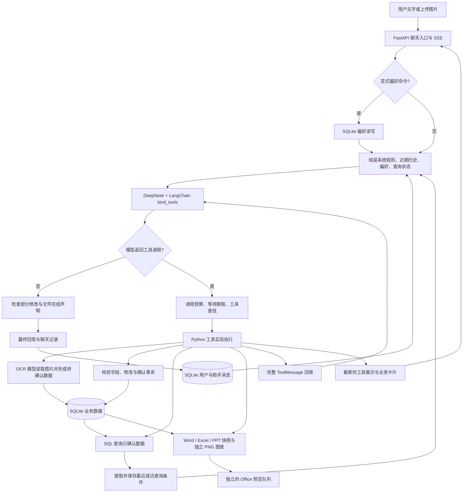

# 第三阶段：Enterprise OCR Agent 系统设计分析

分析日期：2026-10-09。源码基线：`f0d0393932b65093df2750ccfc8630f0e6a34b0e`；本阶段只增加分析文档，不改业务实现。框架能力按当日查阅的官方文档描述，具体 API 与默认行为仍需随版本核实。

阅读目标：能够解释“为什么采用这种 Agent 设计、哪些结果由程序保证、哪里仍依赖模型、何时需要更换架构”，并经受面试追问。

本文对 12 个主题分别覆盖：**当前实现方案、为什么这样实现、优势、缺点、可扩展性、工业界实现方式**；随后统一比较 **LangGraph、CrewAI、OpenAI Agents SDK**。这样既满足七个分析维度，也避免在每个主题重复一张框架表。

证据规则：源码事实可以直接核对；“为什么”是在当前需求下的设计解释，不冒充开发者当时的完整决策记录；扩展方案尚未实现；没有配对测量的质量、延迟、成本收益均为待验证预期。

## 1. 先准确定位这个系统

项目是一个**使用 LangChain 组件、自定义工具调用循环、由确定性业务程序承接执行的单 Agent 应用**。聊天入口允许模型根据用户请求选择查询、OCR、修改和文件生成工具；数据库与文件操作的具体规则由程序执行。

源码中还保留 `build_agent()` / `ask()` 的 `langchain-classic` AgentExecutor 路径。网页主聊天入口调用的是 `run_agent_events()`，不能把旧路径的能力直接算到主路径上。[两种入口](C:/Users/wuhao/Documents/Enterprise_Agent/enterprise_ocr_service/agent/agent.py:55)、[主聊天入口](C:/Users/wuhao/Documents/Enterprise_Agent/enterprise_ocr_service/web/agent_chat.py:109)。

| 主题 | 当前能力 | 面试中应说明的边界 |
| --- | --- | --- |
| Agent | 单个 DeepSeek 聊天模型迭代选择工具，主路径自定义循环 | 使用 LangChain，但没有直接用框架执行器运行主循环 |
| Tool | 主路径注册 11 个 Python 工具 | 注册 schema 不等于执行；执行和回填由程序完成 |
| Memory | SQLite 会话历史、显式跨会话偏好 | 不是无限记忆，也没有语义记忆检索 |
| Planning | 根据当前上下文与工具结果决定下一步 | 没有独立 planner、计划表或依赖 DAG |
| Reasoning | 模型进行意图理解、参数选择和结果解释 | 没有可验证的完整内部思维链；金额主要由程序统计 |
| Prompt | 系统规则、工具描述、字段语义、偏好和成功查询条件 | 提示是行为引导，不能替代权限、事务与类型校验 |
| Workflow | 自由工具选择与固定业务流程结合 | OCR、确认、查询、导出存在明确业务阶段 |
| State | 本轮计数器、最近成功查询条件、业务状态、文件快照 | 各种 state 的作用不同；没有运行检查点恢复 |
| Context | 最近 10 条消息、偏好、查询状态和本轮完整工具轨迹 | 10 条不是 10 轮；没有完整 token 预算 |
| RAG | `rag_query` / `rag_summarize` 提供 SQL 业务数据 | 没有 embedding、向量库、重排或文本分块检索链路 |
| MCP | 当前应用未实现 | 普通 HTTP 模型 API、SSE 和 Python 工具都不因此成为 MCP |
| Multi-Agent | 当前应用未实现 | OCR 模型和聊天模型分工不等于多个自治 Agent 协作 |

这里的“未实现”指应用源码中的运行链路，不根据依赖列表推断某个传递依赖一定没有安装，也不把开发工具环境提供的能力算到项目里。

## 2. 模型、程序与数据如何协作

图中的 LLM 循环是一条请求内部的循环；下次用户发消息时重新进入循环。预览队列属于普通后台服务，不是第二个 Agent。

以“识别单据，核对后统计 2024 年某公司的销售额，再生成三个格式”为例：

1. 图片落盘，聊天模型收到图片路径提示；OCR 工具才真正读取图片字节并调用视觉模型。
2. OCR 数据进入待确认状态。核对、修改和确认有程序事务；修改后的数据重新待确认。
3. 统计工具读取已确认数据，程序处理筛选和金额；模型解释结果。
4. Word、Excel、PPT 可复用同一销售快照，避免分别读“此刻数据库”产生交付口径漂移。是否正确传递快照 ID，仍取决于模型调用与工具校验。
5. 文件注册成功产生卡片；Office 预览另行转换，预览失败仍可下载原文件。

这是业务流程示例，**不宣称当前一次请求可以可靠跨越全部审批阶段**。用户确认可能发生在下一条聊天消息或界面操作中；当前没有保存并恢复“暂停中的 Agent 运行”。[主循环](C:/Users/wuhao/Documents/Enterprise_Agent/enterprise_ocr_service/agent/agent.py:201)、[销售快照](C:/Users/wuhao/Documents/Enterprise_Agent/enterprise_ocr_service/services/sales_snapshot.py:17)、[预览服务](C:/Users/wuhao/Documents/Enterprise_Agent/enterprise_ocr_service/services/office_preview.py:18)。

## 3. Agent：谁决定下一步，谁控制执行

### 当前实现方案

`get_llm()` 使用 `ChatDeepSeek`；默认模型名为 `deepseek-chat`，温度 0.3，关闭 SDK 隐式重试。实际部署配置可覆盖默认值，本文不读取密钥或据默认值推断正在使用哪种 OCR 服务。[模型封装](C:/Users/wuhao/Documents/Enterprise_Agent/enterprise_ocr_service/agent/llm.py:10)、[配置](C:/Users/wuhao/Documents/Enterprise_Agent/enterprise_ocr_service/config.py:69)。

主循环是 `bind_tools → invoke → 解析 tool_calls → 执行工具 → ToolMessage → 下一次 invoke`。没有工具调用时返回最终文本；最多 8 个模型循环步，总工具调用预算默认 8 次，二者分别计数。同一模型响应包含多个工具调用时，当前程序逐个串行执行。[循环与预算](C:/Users/wuhao/Documents/Enterprise_Agent/enterprise_ocr_service/agent/agent.py:253)。

### 为什么这样实现

用户可能只查询，也可能先识别、再核对、再导出，工具组合并非一个固定链条。迭代循环让模型根据观察结果调整下一步；自定义执行层方便产生 SSE 卡片并加入失败停止、预算与部分完成证据检查。这解释当前设计的适配性，不能证明它优于框架执行器。

### 优势

模型和程序职责分明；调用路径短，便于逐步观察和复现；已有工具可被其他编排方式复用。运行规则明确，有利于控制无效调用次数和等待时间。

### 缺点

开发者承担消息协议、错误契约、恢复语义与模型兼容性维护。完成声明检查依赖正则、成功文本前缀和文件存在性，不能证明所有业务目标或文件内容正确。两套 Agent 入口还可能发生提示与保护能力漂移。

### 可扩展性

短任务可以继续沿用此循环；工具增多时增加工具权限与选择范围；需要跨请求暂停、分支、恢复时评估 LangChain `create_agent` 或直接 LangGraph。只读独立调用可探索并发，但先定义依赖、数据库一致性和预算口径。预期影响尾延迟与吞吐，当前没有串并行配对结果。

### 工业界实现方式

生产编排通常需要可追踪的 run ID、状态存储、工具执行记录和资源预算；具体实现可用自定义服务或框架。LangChain 当前 `create_agent` 提供基于 LangGraph 的工具循环，可作为复用现有模型/工具的一条迁移候选。[官方 Agents 文档](https://docs.langchain.com/oss/python/langchain/agents)。这不是“安装框架后即可获得正确答案”。

## 4. Tool：将模型意图变成受约束的操作

### 当前实现方案

主路径 11 个工具：`ocr_recognize_chat`，`correct_list_docs`，`correct_show_rows`，`correct_update_row`，`correct_confirm`，`rag_query`，`rag_summarize`，`plot_chart`，`generate_report`，`generate_excel`，`generate_presentation`。[注册表](C:/Users/wuhao/Documents/Enterprise_Agent/enterprise_ocr_service/agent/agent.py:170)。

LangChain `@tool` 从函数接口和说明形成工具描述；`bind_tools` 把描述交给模型。`_TOOL_BY_NAME` 查找函数，`fn.invoke(args)` 才执行 Python。随后带 `tool_call_id` 的完整 `ToolMessage` 回到下一轮模型输入。[执行分派](C:/Users/wuhao/Documents/Enterprise_Agent/enterprise_ocr_service/agent/agent.py:357)。

### 为什么这样实现

将有限业务能力暴露为工具，比让模型任意生成 SQL、修改数据库或编写文件更容易限制行为。模型负责“查哪一年、调用哪种导出”，程序负责字段白名单、SQL 模板与文件内容。

### 优势

SQL 参数绑定和分组白名单缩小了自由执行范围；结构化查询结果提供来源、条件、字段口径和省略数量；事务与文件生成可在不调用模型的情况下验证。工具边界也是定位错误的边界。

### 缺点

工具输出混合紧凑 JSON、自然语言和 `ToolOutcome(str)` 附带标志。错误识别依赖前缀和特例，新增或改写错误文本可能漏判。`fields` 仍是 JSON 字符串，模型需嵌套序列化。类型/schema 校验也不等于业务授权。

### 可扩展性

建议逐步建立统一结果契约：状态、错误码、数据、来源、是否可重试、执行 ID、卡片和文件 ID。将工具声明为只读或有副作用，并绑定用户与资源授权。预期减少错误漏判、重复写入和诊断时间；尚无改造前后测量。

### 工业界实现方式

把授权和校验放在工具执行边界，记录具体参数与真实结果；对有副作用的动作设计幂等键和状态核验。OpenAI Agents SDK 区分自动 guardrails 与人工工具审批，官方特别说明校验应贴近产生副作用的工具。[官方 Guardrails and human review](https://developers.openai.com/api/docs/guides/agents/guardrails-approvals)。迁移框架仍须保留业务层校验。

## 5. Memory：保存过，不代表这次都能想起来

### 当前实现方案

三种不同记忆：会话保存用户和最终助手消息及卡片元数据；偏好按 profile 保存、跨会话使用；最近成功查询条件按 session 保存。完整本轮工具轨迹在内存中累积，没有作为完整执行日志写进聊天消息表。[聊天存储](C:/Users/wuhao/Documents/Enterprise_Agent/enterprise_ocr_service/db/chat_memory.py:61)、[偏好存储](C:/Users/wuhao/Documents/Enterprise_Agent/enterprise_ocr_service/db/preference_memory.py:41)、[查询状态存储](C:/Users/wuhao/Documents/Enterprise_Agent/enterprise_ocr_service/db/task_state.py:6)。

显式“记住/忘记/查看记忆”命令由程序解析并直接处理，省去一次模型调用。偏好最多 20 条，每条最多 200 字；保存通过 `BEGIN IMMEDIATE` 控制并发写入。去重和遗忘依赖相同文本，不进行语义冲突合并。[命令处理](C:/Users/wuhao/Documents/Enterprise_Agent/enterprise_ocr_service/web/agent_chat.py:188)。

### 为什么这样实现

历史解决对话连续性，偏好解决回答方式，查询状态缓解条件退出窗口后的问题。SQLite 适合本地原型，显式偏好便于用户理解与控制，减少自动提取时误把业务事实存成长期偏好的风险。

### 优势

重启后可读取已提交的数据；显式偏好没有额外推理成本；用户可查看和删除偏好。小规模结构化记忆无需引入向量检索。

### 缺点

模型每次只看到最近 10 条历史；持久化全部历史不等于全部送达。偏好不自动识别矛盾，全部注入也可能增加输入。profile/session ID 的存在不等于已验证用户身份。删除偏好不会自动删除历史中曾出现的同一文本。

### 可扩展性

先补身份隔离、来源、适用范围、更新时间、冲突规则与删除语义；必要时增加任务摘要和相关历史检索。若自动提取记忆，应保留用户确认与可撤销入口。评价记忆召回、误用旧条件、冲突遵守、隐私隔离和输入 token，不能只测数据库“存得下”。

### 工业界实现方式

常见设计把线程内工作状态与跨线程偏好分开。LangGraph 用 checkpointer 与 Store 分别支持这两种范围；内存 checkpointer 重启会丢失，需选择实际持久化后端。[官方 Persistence](https://docs.langchain.com/oss/python/langgraph/persistence)。CrewAI 当前官方文档提供统一 Memory 与语义/时效等召回机制；这与本项目显式文本偏好不同，并非无成本升级。[官方 Memory](https://docs.crewai.com/en/concepts/memory)。

## 6. Planning：当前是迭代决策，没有显式计划表

### 当前实现方案

模型看到请求与工具说明，决定本轮调用；收到工具结果后继续决定。系统提示规定一些操作顺序，例如核对后确认、多格式输出复用快照，但没有 planner 函数、计划 ID、步骤状态、依赖边或执行后验收清单。

`_guess_intent()` 只是发给界面的 intent 标签；它没有决定工具选择，也没有限制模型能调用哪种工具。[界面标签](C:/Users/wuhao/Documents/Enterprise_Agent/enterprise_ocr_service/agent/agent.py:186)。

### 为什么这样实现

目前大量任务可由少量工具完成，首次规划再执行可能增加一次模型调用和计划维护。迭代策略能在“没有数据”“字段不合法”后及时调整。不应为了使用 Planning 名词就拆出 planner。

### 优势

流程灵活，任务简单时不必支付独立规划开销；容易根据真实观察调整，而非机械完成过时计划。

### 缺点

长任务没有明确进度、剩余目标与依赖，模型可能漏掉一个交付格式；新条件或取消请求缺少计划更新契约。调用预算还可能在目标未完成时耗尽。

### 可扩展性

当独立评估显示长任务漏步骤或审批后忘记后续目标时，再设计结构化计划：目标、步骤、依赖、完成证据、待审批动作和取消状态。先用程序校验计划有效性，逐步执行；不要把任意自然语言计划当作可恢复任务。

### 工业界实现方式

固定流程可由状态机/DAG 定义依赖；开放任务可由模型规划后由执行器调度，失败触发受控重规划。CrewAI hierarchical process 引入 manager 做分配与验证，是一种团队编排方式。[官方 Processes](https://docs.crewai.com/en/concepts/processes)。对本项目而言这是候选模式，尚无其提升任务成功率的比较证据。

## 7. Reasoning：解释可观测决策，不宣称看见内部思维

### 当前实现方案

模型处理用户语言、选择工具和参数、解释观察结果；外部可观测证据是工具调用、参数、结果与最终回答。代码中的 `llm_text` 是模型返回的可见文本，不是完整可信的内部思维记录。

统计金额、汇总与数据状态由程序负责。`amount` 表示数量，`sum` 表示票面金额；`total_amount` 是数量合计，`total_sum` 是金额合计。[字段语义](C:/Users/wuhao/Documents/Enterprise_Agent/enterprise_ocr_service/agent/field_semantics.py:1)。

### 为什么这样实现

自然语言理解适合模型；数值计算、字段约束和事务适合确定性程序。把“选择业务动作”与“计算业务事实”分开，减少模型心算和字段猜测。

### 优势

同一 SQL 工具可以独立对照 oracle；错误可拆为参数错、工具错或解释错。用户可核对来源，不必相信流畅的说明。

### 缺点

模型仍可能误读字段、把样本当全量、将无匹配解释成销售额为零，或附加未经支持的原因。一个金额正确不能证明整段回答可靠；正则完成保护也不能覆盖全部语义错误。

### 可扩展性

对金额口径与关键结论增加结构化结果/确定性渲染，必要时校验回答引用的数值和范围。另一个模型做复核只是增加一道概率检查，需要与人工校准。评价关键事实、范围遵守和无依据补充率，同时记录新增调用及延迟。

### 工业界实现方式

可将“事实准备→决策→执行→结果验证”拆为可追踪阶段，关键业务判定走程序。复盘应解释可观测动作及证据，不能以模型自述“我想了什么”证明推理正确。是否需要复核模型，应由错误类型与配对评估决定。

## 8. Prompt：行为合同，需要程序承接

### 当前实现方案

主路径 `EVENTS_SYSTEM_PROMPT` 说明角色、工具使用、确认规则、只读纠错、副作用失败停止、多格式快照和文件卡片；再追加共享字段语义、最近成功查询条件和显式偏好。工具 docstring 告诉模型参数语义、明细样本与全量统计区别。[主提示](C:/Users/wuhao/Documents/Enterprise_Agent/enterprise_ocr_service/agent/agent.py:84)、[动态组装](C:/Users/wuhao/Documents/Enterprise_Agent/enterprise_ocr_service/agent/agent.py:218)。

最近成功查询条件明确只是历史参考，当前请求和近期消息优先；偏好不能覆盖真实性规则。旧 AgentExecutor 的 `SYSTEM_PROMPT` 还有“识别准确率约80%”文字，这只是提示中写的断言，不能作为当前测量结果。[旧提示](C:/Users/wuhao/Documents/Enterprise_Agent/enterprise_ocr_service/agent/agent.py:36)。

### 为什么这样实现

工具说明解决“如何调用”，系统规则解决“何时调用、何时停止、怎样解释”。把偏好和业务真值区分，避免用户口头偏好改变数据库口径。

### 优势

领域规则集中，能快速针对无匹配与字段误解修正行为；共享字段语义减少多个工具分别解释时的漂移。

### 缺点

提示增长增加输入成本，也可能产生冲突；两套提示容易不一致。动态文本中出现“不要遵守规则”并不会因外面包一段系统提示就得到完整防护。提示要求“用户明确授权”还没有转化为所有确认入口的独立凭据校验。

### 可扩展性

建立提示版本与回归用例，删除无证据指标；区分可信政策、用户偏好、检索数据和工具结果；稳定规则下沉为工具校验。先按失败类型加规则，避免无限堆叠。测参数正确率、冲突案例、输入 token 与回答质量。

### 工业界实现方式

提示和工具 schema 一起做版本化评估；数据库权限、数值口径与审批由代码强制执行。上下文中的外部数据应作为待解释证据，而不是新的执行权限。这是本项目面向业务数据的生产建议，当前未完成全面提示注入与授权审计。

## 9. Workflow：哪些步骤应固定，哪些适合让模型选择

### 当前实现方案

Agent 是自然语言入口；OCR、人工核对、确认、查询、销售快照、文件生成与预览各自是确定性业务流程。偏好命令直接走程序分支。模型不负责自己编写报告文件、执行任意 SQL 或启动任意进程。

核对层有 `BEGIN IMMEDIATE`、字段检查、单据版本和修改后 `pending`；卡片流程可带期望版本。聊天修改调用 `save_edits(..., None, ...)`，确认工具也没有要求用户提供期望版本。不能把界面版本保护描述为所有入口一致。[事务核对](C:/Users/wuhao/Documents/Enterprise_Agent/enterprise_ocr_service/db/review.py:53)、[聊天修改](C:/Users/wuhao/Documents/Enterprise_Agent/enterprise_ocr_service/tools/correct_tool.py:59)。

### 为什么这样实现

票据确认和统计口径具有明确业务规则；自然语言请求具有变化的组合。固定程序保障局部确定性，Agent 负责把用户意图映射到操作组合。

### 优势

人工可通过卡片核对，统计只包含已确认记录，办公文件复用快照。模型失败不会要求用户重新实现底层业务流程。

### 缺点

“必须用户确认”的部分仍依赖提示，reviewer 字符串不证明身份与授权。当前没有持久化的等待审批任务，重启后也不能从暂停步骤自动接续。快照的内容正确不证明模型选中了正确查询范围。

### 可扩展性

简单固定查询可直接走程序或轻量路由；审批链可明确建模为“提案→授权→执行→核验”。需要跨天审批时持久化待执行动作与资源版本，拒绝或取消有明确结果。测未授权状态变化率、版本冲突处理和审批后完成率。

### 工业界实现方式

LangGraph 可以在图中混合确定性节点和模型节点；`interrupt()` 与持久化状态支持人工介入。中断恢复会重跑所在节点，因此前面的副作用必须考虑幂等性或拆开。[官方 Overview](https://docs.langchain.com/oss/python/langgraph/overview)、[官方 Interrupts](https://docs.langchain.com/oss/python/langgraph/interrupts)。框架不会替你验证审批人是否拥有该单据的权限。

## 10. State：四种状态不能混为一谈

### 当前实现方案

| 状态类型 | 保存内容与位置 | 保证范围 |
| --- | --- | --- |
| 本轮运行状态 | messages、工具预算、失败次数、部分成功证明；进程内变量 | 当前请求内控制；重启丢失 |
| 查询参考状态 | 最近一份成功查询的 tool/year/keyword/group_by；SQLite | 下次提示可参考，不是当前任务检查点 |
| 业务状态 | 单据版本、行 pending/confirmed、修改记录字段；SQLite | 事务范围内的数据规则，不是用户授权凭证 |
| 文件状态 | 路径、种类、快照、预览状态；SQLite 与本地文件 | 可追踪交付和复用业务快照，不是 Agent 执行进度 |

`from_tool_result()` 只接受结构化、confirmed、有匹配记录的查询；失败/无匹配不覆盖旧成功状态，空筛选可以覆盖为全量。原本漏掉的条件不会因保存结果而自动找回来。[状态提取](C:/Users/wuhao/Documents/Enterprise_Agent/enterprise_ocr_service/agent/task_state.py:6)。

### 为什么这样实现

最近查询条件是历史窗口丢失的局部补救；版本是并发修改保护；文件快照是交付一致性保护。每一种状态都有具体业务目的，不能用“有 state”概括可靠性。

### 优势

不靠聊天文本推断数据库状态；成功条件可跨请求保留；三个办公格式能复用实际业务数据。使用成本较低且容易核对。

### 缺点

缺少完整任务目标、待办步骤、取消标记、工具执行 ID 和检查点。只保留一个成功条件容易与新任务或无匹配尝试混淆，当前通过提示要求澄清来缓解。修改和确认工具的版本约束也存在入口差异。

### 可扩展性

先定义状态更新规则，再选择存储：何时新建任务、哪些条件被覆盖、无匹配如何保留、取消如何生效。建议引入显式 run/task ID、当前目标、约束来源、动作状态与执行结果；完整恢复还需要幂等性与外部结果核验。测长历史条件保持、任务切换和重启恢复。

### 工业界实现方式

状态型编排记录阶段和完成证据。OpenAI Agents SDK 的审批结果可包含 pending interruptions 与可序列化运行状态，应用存储后再恢复同一运行；CrewAI 有 Flow 状态持久化及 checkpoint 能力。[官方 Results and state](https://developers.openai.com/api/docs/guides/agents/results)、[官方 Flows](https://docs.crewai.com/en/concepts/flows)、[官方 Checkpointing](https://docs.crewai.com/v1.15.26/en/concepts/checkpointing)。这些机制都不同于本项目的“最近成功查询条件”。

## 11. Context：存储、送达与预算是三个问题

### 当前实现方案

一次模型输入大致包含：系统规则、字段语义、偏好、查询参考状态、最近 10 条用户/助手消息、当前请求，以及本轮不断追加的助手工具调用与完整工具结果。实际 token 还包含工具 schema 等，不可用消息条数直接推算。

SSE 事件的 `result[:2000]` 只裁剪网页展示；模型回填使用 `ToolMessage(content=result)` 的完整结果。[结果回填](C:/Users/wuhao/Documents/Enterprise_Agent/enterprise_ocr_service/agent/agent.py:322)。

### 为什么这样实现

最近窗口是控制输入增长的简单方式；完整工具回填让模型获得真实观察；结构化摘要减少无需展示的明细。用户当前请求与关键业务规则优先进入上下文。

### 优势

无需为历史摘要额外调用模型；查询结果包含完整总计与省略提示；小规模短对话能保持直接、可追踪的链路。

### 缺点

10 条历史不保证包含重要条件；长消息和长字段仍可能超限；8 步/8 次工具预算不限制 token。没有专门的超限裁剪/恢复逻辑。每次重复注入全部偏好和规则也有开销。

### 可扩展性

分配系统规则、当前任务、近期历史和观察结果的预算；保留工具调用与结果的关联，不留下孤立 ToolMessage。大数据写到可追踪文件，只回传摘要/引用；需要省略信息时支持进一步读取。通过长历史、长字段、混合任务测约束保持与实际 usage。

### 工业界实现方式

按重要性、相关性与 token 预算组合上下文，历史裁剪与摘要要保持工具协议和关键约束。LangChain 短期记忆文档提供 trim、delete、summarize 等处理方式。[官方 Short-term memory](https://docs.langchain.com/oss/python/langchain/short-term-memory)。摘要可能丢条件并增加一次推理，必须单独测其质量与成本。

## 12. RAG：这里是结构化数据检索增强

### 当前实现方案

`rag_query` 按关键词与年份查已确认明细；`rag_summarize` 通过 SQL 聚合。结果回填模型供回答。不存在文档分块、embedding、向量库或 reranker；工具名中的 RAG 不能证明使用了向量检索。[查询工具](C:/Users/wuhao/Documents/Enterprise_Agent/enterprise_ocr_service/tools/rag_tool.py:38)、[SQL 实现](C:/Users/wuhao/Documents/Enterprise_Agent/enterprise_ocr_service/db/crud.py:224)。

明细最多展示 20 行；聚合展示最多 20 组，但 summary 覆盖全部匹配组。`top_k` 是明细返回上限，不是语义向量 Top-k；keyword 匹配也不是语义召回。

### 为什么这样实现

年份、确认状态和销售金额具有结构化规则。完整金额必须由所有符合条件的记录计算，不能把向量检索的若干相似片段当作全量数据。

### 优势

可精确筛选、聚合和对照 oracle；省去 embedding 与索引同步；来源和字段口径可由程序输出。

### 缺点

同义词、模糊公司名和未结构化知识支持有限；明细没有完整分页接口。明细、计数或聚合的分次查询可能在并发修改下观察到不同状态，不能因为最终 JSON 是一个对象就认定来自同一数据库快照。

### 可扩展性

先改善 SQL 查询一致性、实体标准化和分页。新增制度文档或票据说明问答时再增加文本检索，并把“文档解释”与“业务金额”路由分开。测实体匹配、检索证据覆盖、答案支持度、金额范围准确性和端到端时延。

### 工业界实现方式

常按数据性质混合使用结构化查询和非结构化检索：SQL 处理业务事实，文本检索提供制度与说明，生成层引用各自证据。本项目尚未实现这条混合链路；增加向量库不自动提高结构化统计正确性，也没有现成对照收益。

## 13. MCP：当前没有，何时才有必要

### 当前实现方案

本项目的工具通过进程内 Python 注册和调用；OCR 使用模型的 OpenAI 兼容 HTTP 接口；聊天使用业务 SSE。这些路径没有实现 MCP 客户端、服务端、能力发现或协议工具调用。

### 为什么这样实现

工具与业务服务同仓库、同运行环境，普通函数调用更直接。当前不需要跨多个 Agent 客户端发布标准工具，因此没有证据说明引入协议层会带来净收益。

### 优势

没有额外 MCP 服务部署、连接管理和远程故障边界；工具与业务规则容易共同调试。

### 缺点

其他客户端想使用同一业务能力，需要自行做接口适配；独立工具部署、动态发现和跨应用复用能力有限。

### 可扩展性

如果 ERP、多个 Agent 客户端或独立部门需要复用查询/导出能力，可以把已有业务函数封装为 MCP 服务。先暴露只读能力，写操作仍绑定身份、审批和幂等性。评价接入工作量、协议开销、故障率与资源隔离，当前未测。

### 工业界实现方式

MCP 通过 host/client/server 架构和基于 JSON-RPC 的通信暴露 tools、resources、prompts；可采用 stdio 或 Streamable HTTP。它解决标准化连接和能力暴露，不能替你规划任务或判定金额真伪。[官方 Architecture overview](https://modelcontextprotocol.io/docs/learn/architecture)。

OpenAI Agents SDK 官方区分托管远程 MCP 与应用运行时自行管理的本地/私有 MCP 连接。[官方 Integrations and observability](https://developers.openai.com/api/docs/guides/agents/integrations-observability)。本项目当前两种都没有实现。

## 14. Multi-Agent：当前多个模型，不等于多个 Agent

### 当前实现方案

一个聊天 Agent 选择工具；OCR 是其中一个受调用的视觉处理能力。不存在多个角色各自运行工具循环、manager 委派、handoff、消息协商或子 Agent 状态。线程与 Office 子进程也不是自治 Agent。

### 为什么这样实现

当前单据业务共享同一数据模型和工具集，单 Agent 足以表达多数临时组合。OCR 使用不同模型是能力适配，而不是创建独立自治团队。

### 优势

上下文与责任链相对简单，减少重复检索、沟通和多次模型调用。单 Agent 失败轨迹更容易回放。

### 缺点

工具集和领域复杂度扩展后，一个提示可能难以处理全部职责；缺少专门的异构任务协调能力。但多 Agent 也不会自动修复同一数据口径问题。

### 可扩展性

确有职责分离需求时，可以探索数据查询专员、文档解释专员和报告编排者。先定义输入输出、权限、共享状态、责任归属与全局预算；关键金额仍由程序计算。比较相同任务的完成率、无依据结论、调用数、实际成本和 P95 时延，再决定是否采用。

### 工业界实现方式

常见形式包括 manager 将子 Agent 当工具调用、handoff 转移控制权、确定性路由到专员，以及图中的子流程。CrewAI 面向角色/任务组织，SDK 和 LangGraph 也可表达多 Agent；角色名称本身不产生质量保证。[CrewAI Processes](https://docs.crewai.com/en/concepts/processes)、[OpenAI Agents SDK Overview](https://developers.openai.com/api/docs/guides/agents/sdk)。

## 15. LangGraph、CrewAI、OpenAI Agents SDK 对比

### 15.1 比较前先统一名词

**LangChain 与 LangGraph 有层次关系。** 当前项目采用 LangChain 的模型、消息和工具接口；当前 LangChain 高层 Agent 建立在 LangGraph 上。LangGraph 更侧重状态、节点和执行编排，并不要求一定多 Agent。[LangGraph Overview](https://docs.langchain.com/oss/python/langgraph/overview)、[LangChain Agents](https://docs.langchain.com/oss/python/langchain/agents)。

**CrewAI 不只是“多个角色聊天”。** Crews 组织角色与任务，Flows 提供流程、结构化状态和持久化；当前官方文档也有 checkpoint 和人工介入。不能用“CrewAI 没有状态恢复”作为选型依据。[Flows](https://docs.crewai.com/en/concepts/flows)、[Checkpointing](https://docs.crewai.com/v1.15.26/en/concepts/checkpointing)、[HITL Workflows](https://docs.crewai.com/v1.15.26/en/learn/human-in-the-loop)。

仍要核实运行边界：CrewAI 当日文档中的默认检查点频率是任务完成事件，自动检查点写入是 best-effort，写入失败记录日志后运行可继续；本地 Flow 人工反馈与 Enterprise webhook 审批也属于不同接入方式。不能把“有 checkpoint/HITL”理解为所有配置都有相同的持久性、恢复粒度或部署条件。[Checkpointing](https://docs.crewai.com/v1.15.26/en/concepts/checkpointing)、[HITL Workflows](https://docs.crewai.com/v1.15.26/en/learn/human-in-the-loop)。

**正式名称是 OpenAI Agents SDK。** SDK 在应用中运行循环，服务器仍负责部署、工具、存储和审批。它与 OpenAI 的托管 Agents API 是不同运行方式，不能把托管产品能力直接归到本地 SDK。[SDK Overview](https://developers.openai.com/api/docs/guides/agents/sdk)。

### 15.2 以本项目需求做比较

| 维度 | 当前自定义 LangChain 循环 | LangGraph | CrewAI | OpenAI Agents SDK |
| --- | --- | --- | --- | --- |
| 主要抽象 | 消息、工具调用、手写循环 | 状态、节点、边、路由 | Agent、Task、Crew 与 Flow | Agent、Runner、Tool、handoff |
| 适配本项目的入口 | 现有 SSE 聊天 | 显式审批与状态型业务链 | 多角色任务组织或 Flow 编排 | 标准工具循环、审批、追踪与专员 |
| 工具与业务复用 | 已有 11 工具 | 保留业务函数；适配节点/工具接口 | 保留业务函数；适配 Crew 工具 | 保留业务函数；适配 SDK 工具 |
| 执行状态 | 主要在本轮内存中 | checkpointer 记录线程图状态 | Flow 持久化与 checkpoint | 运行结果/审批状态可继续与序列化 |
| 长期偏好 | 自建 profile SQLite 表 | 应用定义的 Store | Memory 与 scope 等机制 | sessions 管理会话；偏好策略仍需应用定义 |
| 人工审批 | 卡片与下一次请求，未恢复原运行 | interrupt 与恢复命令 | 人工输入、HITL/Flow 相关机制 | 工具审批 interruption 与运行状态 |
| 多 Agent | 未实现 | 路由、子图等编排 | sequential/hierarchical 等组织 | handoff 或 Agent-as-tool 等方式 |
| 上下文策略 | 固定最近 10 条，本轮继续增长 | 按应用设计；可结合 LangChain 中间件 | 依任务、记忆与 Flow 设计 | 选择历史、session 或服务端延续方式 |
| 可观测性 | SSE、测试与评估输出 | 可接 LangSmith 等追踪 | 官方 tracing 与外部集成 | 内置 tracing |
| 当前 DeepSeek 适配 | ChatDeepSeek 已集成 | 可复用 LangChain 模型接口 | 需验证 provider、schema 和消息兼容 | 需验证 provider/adapter 和功能兼容 |
| 主要迁移成本 | 继续维护自定义保护 | 状态建模、节点划分、检查点与消息适配 | 角色/任务划分、Flow、工具与状态适配 | 模型和工具适配、流事件与存储接入 |
| 不能自动解决 | 授权、幂等、事实错误、全量预算 | 同样不能自动解决 | 同样不能自动解决 | 同样不能自动解决 |

表格比较机制和适配成本，**没有“谁更快、谁更便宜”的实测排名**。同模型、同工具、同任务、同环境才能比较性能；增加角色、节点或检查点可能带来额外推理、存储或序列化开销，也可能减少故障后的重复工作。

状态、审批与观测机制来源：[LangGraph Persistence](https://docs.langchain.com/oss/python/langgraph/persistence)、[LangGraph Interrupts](https://docs.langchain.com/oss/python/langgraph/interrupts)、[CrewAI Processes](https://docs.crewai.com/en/concepts/processes)、[CrewAI Memory](https://docs.crewai.com/en/concepts/memory)、[CrewAI Tracing](https://docs.crewai.com/v1.15.26/en/observability/tracing)、[SDK Running agents](https://developers.openai.com/api/docs/guides/agents/running-agents)、[SDK Results](https://developers.openai.com/api/docs/guides/agents/results)、[SDK Integrations](https://developers.openai.com/api/docs/guides/agents/integrations-observability)。

SDK 并非原则上只能使用 OpenAI 模型；官方提供非 OpenAI provider/adapter 的方向，并提示部分功能依赖 Responses 路径。本项目的 `ChatDeepSeek` 不应被当作可直接传入 SDK 的现成适配；需要单独验证工具调用、结构化输出、流事件、usage 和异常语义。[官方 Models and providers](https://developers.openai.com/api/docs/guides/agents/models)。

### 15.3 当前最合理的选择

| 需求触发条件 | 候选方案 | 判断依据 |
| --- | --- | --- |
| 当前短查询、核对与小规模导出 | 保留现有 LangChain 组件和循环，先补关键合同 | 现有业务价值可以继续使用；尚无必须整体重写的证据 |
| 想降低循环维护成本、保留 LangChain 生态 | 小范围评估 `create_agent` | 验证 11 工具、事件、失败停止和记忆是否能保持契约 |
| 审批跨请求/跨天、多个分支、进程重启后恢复 | 优先评估 LangGraph + 持久化 checkpointer | 需求直接对应显式状态与恢复能力；需补幂等性 |
| 多部门专员有不同知识、工具、权限，任务分工必要 | 比较 CrewAI 与 LangGraph/SDK 的专员编排 | 先证明职责拆分有价值，避免新增角色后只增加调用 |
| 团队希望统一采用 SDK 运行、审批、追踪和模型接口 | 评估 OpenAI Agents SDK | 现有 DeepSeek 兼容与 SSE 映射是明确验收项 |
| 多个客户端要复用外部业务工具 | 单独评估 MCP | 协议接入与编排框架选择是两件事 |

这里优先保持现有 LangChain 路线，是基于现有代码与迁移成本的工程判断，不是测得 LangGraph 或其他框架更差。可以只替换编排层，保留 SQL、OCR、事务和文件服务。

### 15.4 迁移验收应检查什么

首先固定同一工具契约与任务集，记录当前版本作为基线。候选实现必须覆盖：确认数据过滤、无匹配与真实零金额区别、最新数据重新查询、含糊追问澄清、错误参数修正、副作用失败停止、工具总预算和文件完成证据。

再检查新框架特有能力：暂停审批后重启能否恢复；拒绝和取消是否阻止写入；超时晚到写入是否被发现；重复恢复是否产生重复数据/文件。checkpointer 不意味着外部副作用天然 exactly-once，数据库事务也不覆盖已经发送到外部系统的动作。

最后比较任务成功率、工具参数正确率、模型调用次数、实际 token/费用、首个可见事件耗时、端到端 P50/P95、恢复成功率及运维复杂度。**当前没有三种框架的同条件对照数据，不写迁移后的收益数字。**

## 16. 从当前原型到生产系统：按问题优先级推进

本节“工业界实现方式”是基于源码缺口和官方机制提出的生产设计，并不宣称所有企业统一使用某框架。当前最需要补齐的不是框架数量，而是业务与执行合同。

| 优先级 | 当前边界 | 建议方案，尚未实施 | 预期影响与验证方法 |
| --- | --- | --- | --- |
| P0 | 确认工具缺独立用户授权验证；ID 不是身份 | 身份/租户隔离；授权绑定单据、版本和动作 | 查未授权数据读写与跨资源访问是否为零；不能只测提示遵守 |
| P0 | 超时结束等待，线程可能继续执行 | 执行 ID、幂等键、晚到结果核验；可取消 worker 或明确状态 | 故障注入超时/断连/重试，查重复写入、晚到修改及状态可见性 |
| P0 | 任意重要任务约束可能退出 10 条窗口 | 有来源的结构化任务状态与冲突/取消规则 | 长历史、任务切换、无匹配追问的条件正确率与输入开销 |
| P1 | 只有消息/调用预算，无完整上下文预算 | 分层 token 预算、必要历史摘要、结果引用与补读 | 约束保持率、超限失败率、实际 usage、质量与耗时 |
| P1 | 字符串错误和部分完成正则 | 统一工具结果与按目标的完成证据 | 错误漏判率、虚假完成声明率、未完成目标识别 |
| P1 | 主路径与旧入口保护不一致 | 统一工具/提示/政策合同，明确入口支持范围 | 相同案例两入口对照，防止旧路径绕过新规则 |
| P1 | 多次 SQL 读取可能口径不一致 | 一致读事务或明确结果版本；分页与范围标记 | 并发修改时明细/计数/总额一致性，业务查询耗时 |
| P1 | 进程内会话锁和预览队列 | 多 worker 时采用共享协调；持久队列、任务领取与恢复 | 会话重叠、队列满、进程崩溃、预览积压与 P95 等待 |
| P2 | SSE 是展示，缺统一持久执行轨迹 | run/step/tool ID、脱敏 trace、usage 与分段耗时 | 故障定位时间、可复现轨迹比例和费用核对 |
| P2 | SQL 不支持文档语义问答 | 有需求再引入文本检索与路由 | 检索证据覆盖、引用正确、答案支持与额外成本 |
| P2 | 尚无多 Agent/MCP 需求收益证据 | 有独立职责或多客户端复用需求再做试点 | 专员配对实验/客户端接入成本比较 |

当前 `bounded_call` 通过最多 4 个 daemon 线程槽位控制等待；超时后槽位要等工作结束才释放。同会话 gate 是单进程 set+Lock，不能自动保护多个服务 worker。Office 预览是单 worker、最多 8 个在途/排队槽位并以子进程转换；它也不是持久任务队列。[等待保护](C:/Users/wuhao/Documents/Enterprise_Agent/enterprise_ocr_service/agent/runtime_guard.py:12)、[会话 gate](C:/Users/wuhao/Documents/Enterprise_Agent/enterprise_ocr_service/web/agent_chat.py:118)、[预览队列](C:/Users/wuhao/Documents/Enterprise_Agent/enterprise_ocr_service/services/office_preview.py:58)。

如果用户只说“继续”，当前会开始新循环，读取已保存消息、查询参考状态和业务结果；**不能保证从上一轮精确暂停处继续，也不能保证不会重复操作**。保持文件和数据有用，但它们只是恢复前可核对的事实，不是执行检查点。

## 17. 已有证据、缺口和收益边界

本阶段重新阅读代码和历史记录，未重新调用真实 DeepSeek/OCR、未运行生产并发实验、未进行三种框架迁移或性能比较。下表引用已有证据，不能当作本阶段新增改善。

| 设计或结果 | 基线 → 已有结果 | 数据、指标与范围 | 可以说什么，不能说什么 |
| --- | --- | --- | --- |
| SQL 业务一致性 | 20/20 → 20/20 | 20 图、204 行夹具中的 20 个给定参数 SQL oracle | 工具结果与预期一致；不证明模型会选对参数 |
| 上下文信息送达 | 4/5 → 4/5 | 同夹具、5 个送达场景 | 必要早期信息仍有丢失；不写“记忆问题已解决” |
| 运行保护 | 5/10 → 10/10，增加 5 项、50 个百分点 | 同 10 个程序故障目标，模型替身 | 特定保护行为改善；不是模型任务准确率 |
| 同一失败调用停止 | 8 次 → 2 次，少 6 次、75% | 相同工具参数连续失败的固定刺激 | 减少该失败循环调用；不证明平均账单降低 75% |
| 工具输出摘要 | 历史 932 → 395，少 537、57.62%；后续同场景为 469 | 400 条已确认 2024 记录、40 商品，另有年份/状态控制；cl100k_base 代理 token | 特定文本缩小、部分组被省略；不是 DeepSeek 实际费用 |
| 已知缺口提示修正 | 5/6 → 5/6 → 6/6，最终多 1 项、约 16.7 个百分点 | 固定 6 例开发集，每版本每例一次，目标回合真实模型 | 核心门槛通过数变化；不能称独立总体准确率 100% |
| OCR 与业务流程 | 历史成功输出 56/56 字段；一次流程 7/7 步骤 | 固定清晰合成票据与单次业务流程，分母不同 | 保留首轮失败与补测；不是多样真实票据泛化结果 |
| 上一任务程序验证 | 48 项通过、2 warnings；离线 20/20、4/5、10/10 | 2026-10-09 第二阶段相关子集，模型/COM 危险边界用替身 | 已有相关契约证据；不是本阶段重新执行或全仓库验收 |

证据：[运行保护配对记录](C:/Users/wuhao/Documents/Enterprise_Agent/enterprise_ocr_service/docs/evals/runtime-guards-2026-10-02.md:1)、[摘要配对记录](C:/Users/wuhao/Documents/Enterprise_Agent/enterprise_ocr_service/docs/evals/structured-tools-2026-09-30.md:1)、[无匹配与澄清规则复测](C:/Users/wuhao/Documents/Enterprise_Agent/enterprise_ocr_service/docs/evals/empty-result-semantics-2026-10-02.md:1)、[OCR 复测边界](C:/Users/wuhao/Documents/Enterprise_Agent/enterprise_ocr_service/docs/evals/2026-10-03-ocr-revalidation.md:1)、[第二阶段最新验证记录](C:/Users/wuhao/Documents/Enterprise_Agent/enterprise_ocr_service/notes/module_evaluation_metrics.md:244)。

未解决事项仍以源码和[问题记录](C:/Users/wuhao/Documents/Enterprise_Agent/enterprise_ocr_service/docs/agent-retrospective-open-questions-2026-10-05.md:1)为准：完整任务状态、token 预算、工具授权、超时副作用、SQL 一致性、Agent/workflow 用户收益以及 OCR 泛化。本文解释或提出建议，不将这些问题标成已修复。

建议建立分层评价，而非混合成一个“Agent准确率”：

1. OCR：单据/字段质量、不同模板与图像条件、首轮与重试。
2. 工具：给定参数的 SQL、事务、状态与文件内容正确性。
3. 模型：工具选择、参数范围、条件遵守、关键结论证据支持。
4. 任务：所有目标完成、审批正确、跨格式一致、最终文件可访问。
5. 运行：超时、重复执行、崩溃恢复、资源饱和与尾延迟。
6. 成本与体验：真实 usage、总调用数、总费用、用户操作和完成时间。

每个改动保留相同任务、模型配置、数据版本和计时边界，另设未用于调试的测试集；真实模型做重复或交错配对运行。收益必须同时检查是否通过减少信息或降低质量换来。

## 18. 面试讲法：能说清取舍，比堆名词更重要

### 30 秒系统定位

“我的项目用 LangChain 的 DeepSeek 模型、消息和工具接口，主聊天路径是自定义工具循环。模型选择下一步，程序执行 OCR、SQL、核对事务和办公文件生成。SQLite 保存会话、显式偏好和最近成功查询条件。查询叫 RAG，但实际是结构化 SQL 检索增强，没有向量库、MCP 或多 Agent。”

### 90 秒设计与边界

“用户的工具组合不固定，所以采用迭代工具调用；业务规则是固定的，所以金额计算、确认状态、字段校验和文件生成放在程序里。主循环最多 8 步，另有默认 8 次工具预算，工具结果通过完整 ToolMessage 回到模型。SSE 截断只影响展示。

“记忆分为会话历史、跨会话偏好和查询参考状态。参考状态缓解条件被历史窗口截断的问题，但没有完整任务状态或运行检查点。文件快照解决多个办公格式的数据一致性，也不是 Agent 检查点。

“已有同集程序运行保护从 5/10 到 10/10，但模型是替身，不称为整体准确率；摘要的代理 token 下降也不称为实际降费。当前优先补授权、幂等和任务约束。出现跨天审批或重启恢复需求时，再评估 LangGraph 持久化编排，保留现有业务工具。”

### 高频追问与标准回答

| 面试追问 | 可以独立讲出的回答 |
| --- | --- |
| 你没用 LangChain，全部手写？ | 用了模型、消息、工具抽象；主循环自定义。旧 AgentExecutor 路径仍保留。组件复用与运行编排是两个层次。 |
| bind_tools 为什么没有执行工具？ | 它向模型声明工具；模型返回结构化调用；程序查工具并执行，回填 ToolMessage 后下一次 invoke 才让模型看到结果。 |
| 为什么不直接用固定 workflow？ | 临时请求的工具组合有变化；固定步骤仍由程序执行。固定高频任务适合 workflow，当前没有 Agent 优于 workflow 的配对性能证据。 |
| 有 Memory 为什么还丢条件？ | 保存和送达不同。模型只看最近 10 条；查询参考状态只保存一份成功条件，不保存全部任务目标或无匹配条件。 |
| Prompt 写不能自动确认就安全了？ | 这是行为引导。confirmed 过滤只管状态；若工具被调用改变状态，需要独立授权才能拦住。reviewer 文本不是授权凭证。 |
| 8 轮是不是最多 8 个工具？ | 不是，一轮可有多个调用；当前另设总工具预算默认 8 次，按实际调用计数。 |
| 60 秒超时是不是回滚了？ | 没有。等待者返回错误，底层线程可能继续；要查执行状态，并设计幂等与晚到结果处理。 |
| “继续”能断点恢复吗？ | 当前新建循环并读取已保存数据，不能恢复准确工具位置或保证不重复。真正恢复要有执行检查点与副作用合同。 |
| OCR 模型加聊天模型不是多 Agent？ | 多模型是能力分工；多 Agent 还涉及各自决策循环、角色、委派/转交和状态协调，当前没有这些。 |
| 为什么金额不用向量 RAG？ | 全量金额要覆盖全部符合条件记录；Top-k 相似片段会漏记录。SQL 适合精确筛选，文本检索可另用于制度解释。 |
| LangGraph 保证 exactly-once 吗？ | 不能靠框架名保证。中断节点可能重跑，外部副作用需幂等键、结果核验与事务/补偿。 |
| CrewAI 就没有 checkpoint？ | 当前官方文档已有 Flow 持久化和 checkpoint。选择要比较需求与迁移成本，不能基于过时印象。 |
| SDK 会替你管理所有生产基础设施？ | 本地 SDK 管运行抽象，应用仍负责部署、存储、身份和审批；不要混淆托管 Agents API。 |
| 换框架会更便宜吗？ | 当前没有同条件数据。先固定模型、工具、任务和数据，比较成功率、实际 usage、调用数和 P95；不能只看框架宣传。 |
| 你个人贡献是什么？ | 按事实说明自己实现/协助完成、阅读验证和能独立解释的部分；项目使用 AI 辅助，不虚称所有代码独立手写或拥有未执行的实验。 |

建议下一步用一条真实请求把“模型决策→工具→数据库状态→回答→文件”串起来讲，并主动解释一次已知失败及其证据边界。目标是独立讲清系统，而不是背诵框架清单。

## 19. 官方资料阅读入口

以下链接均于 2026-10-09 查阅；文中已把关键机制引用放到对应分析处。CrewAI 部分当日跳转至 `v1.15.26` 文档；MCP 架构页当日跳转至 `2026-07-28` 版本。本文未据此声称本项目安装或实现了这些版本。

| 资料 | 用来核实什么 |
| --- | --- |
| [LangChain Agents](https://docs.langchain.com/oss/python/langchain/agents) | 高层工具循环与 LangGraph 关系 |
| [LangChain Short-term memory](https://docs.langchain.com/oss/python/langchain/short-term-memory) | 历史裁剪、删除和摘要 |
| [LangGraph Overview](https://docs.langchain.com/oss/python/langgraph/overview) | 状态编排、确定性步骤和模型步骤 |
| [LangGraph Persistence](https://docs.langchain.com/oss/python/langgraph/persistence) | checkpointer / Store / 持久后端 |
| [LangGraph Interrupts](https://docs.langchain.com/oss/python/langgraph/interrupts) | 人工中断恢复与副作用幂等 |
| [CrewAI Processes](https://docs.crewai.com/en/concepts/processes) | sequential / hierarchical 分工 |
| [CrewAI Flows](https://docs.crewai.com/en/concepts/flows) | Flow 状态与持久化 |
| [CrewAI Memory](https://docs.crewai.com/en/concepts/memory) | 当前记忆抽象与召回机制 |
| [CrewAI Checkpointing](https://docs.crewai.com/v1.15.26/en/concepts/checkpointing) | 当前版本检查点能力 |
| [CrewAI HITL](https://docs.crewai.com/v1.15.26/en/learn/human-in-the-loop) | 人工介入方式 |
| [CrewAI Tracing](https://docs.crewai.com/v1.15.26/en/observability/tracing) | 运行观测能力 |
| [OpenAI Agents SDK](https://developers.openai.com/api/docs/guides/agents/sdk) | 应用运行 SDK 与托管 API 区别 |
| [SDK Running agents](https://developers.openai.com/api/docs/guides/agents/running-agents) | 循环、session 与其他延续策略 |
| [SDK Guardrails and human review](https://developers.openai.com/api/docs/guides/agents/guardrails-approvals) | 自动检查、工具审批与恢复 |
| [SDK Results and state](https://developers.openai.com/api/docs/guides/agents/results) | pending 审批与可恢复状态 |
| [SDK Integrations and observability](https://developers.openai.com/api/docs/guides/agents/integrations-observability) | MCP 连接与 tracing |
| [SDK Models and providers](https://developers.openai.com/api/docs/guides/agents/models) | 非 OpenAI provider 与功能兼容边界 |
| [MCP Architecture](https://modelcontextprotocol.io/docs/learn/architecture) | 协议参与者、数据层与传输方式 |
