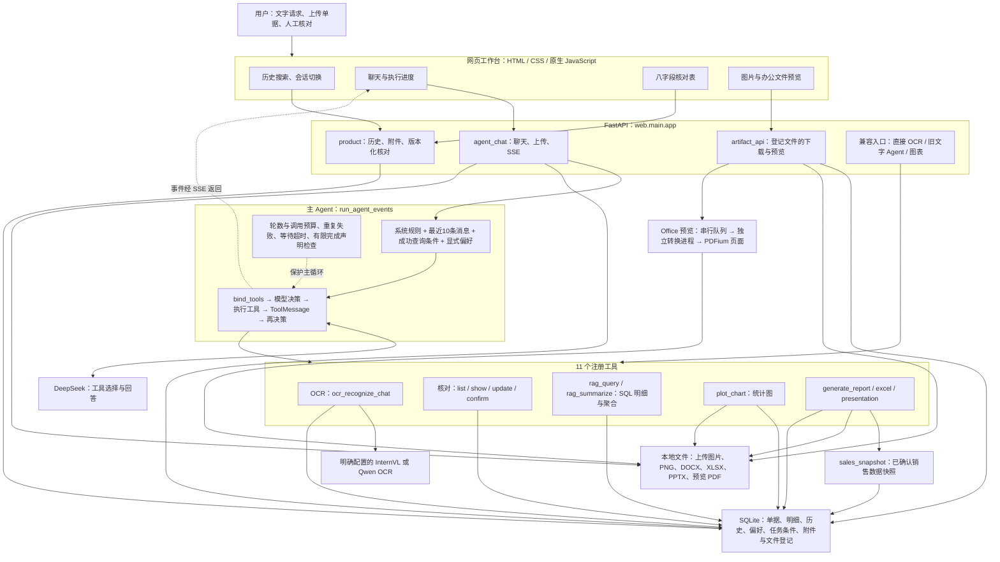
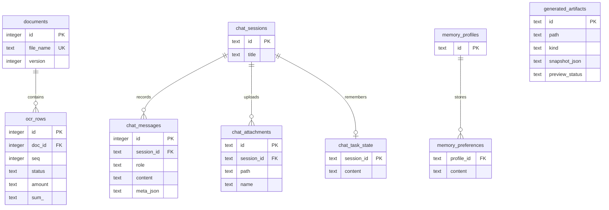
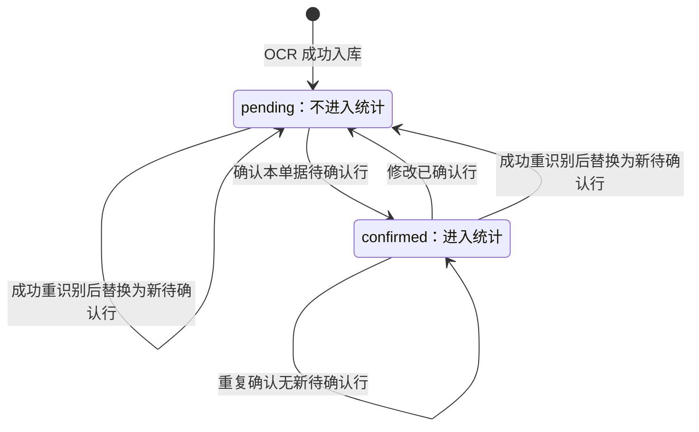
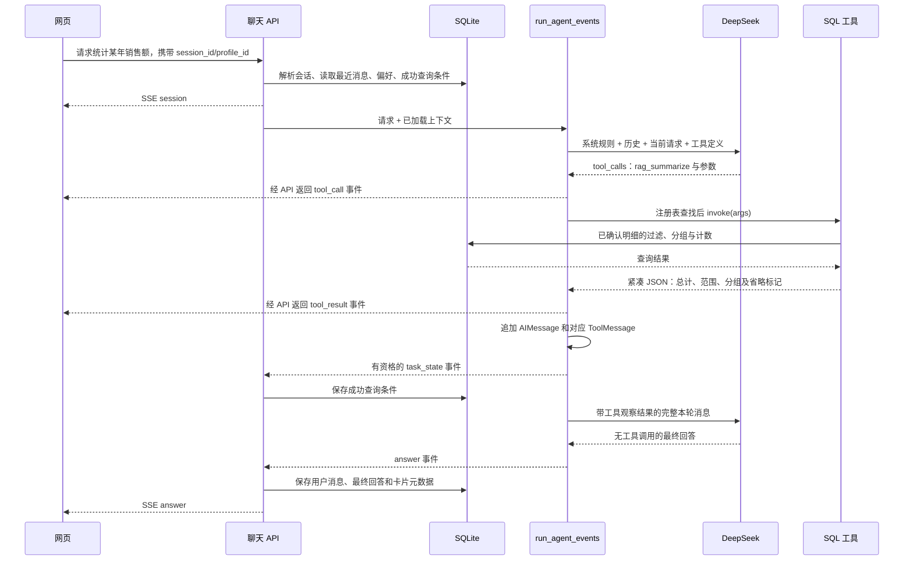

# Enterprise Agent 项目全景分析与面试讲解

分析日期：2026-10-07。阶段：第一阶段，源码全景分析。

主项目：`C:/Users/wuhao/Documents/Enterprise_Agent/enterprise_ocr_service`。分析基于应用提交 `3095cf52376a99f2a53bbcbe2c09f3f04fe174fa`，不修改业务代码。

**一句话定位：这是一个面向本机单用户的销售单据处理 Agent，用自然语言串联图片识别、人工核对、确认、结构化查询、图表和办公文件交付。模型负责选择工具与解释结果，程序负责执行操作和计算，SQLite 保存业务数据与会话状态。**

它的核心价值是把多个可核对的业务操作接入统一任务入口。不能只用“基于 LangChain 的聊天机器人”概括，也不能把现有实现说成通用企业平台、完整长期记忆系统或任意文档生成系统。

## 阅读范围与证据约定

本次枚举主仓库全部 175 个受版本管理文件，解析全部 82 个 Python 文件的定义和导入关系，逐模块阅读生产主链路，并检查网页、测试覆盖和主要评估记录。82 个 Python 文件包括 39 个生产及辅助文件、25 个评估文件、18 个测试及手动检查文件；39 个生产及辅助文件共 3,337 行，包含空行、注释和文档转换脚本，不用于衡量项目质量。

没有把 `.env` 密钥、运行数据库、上传图片、模型权重、缓存、生成文件作为公开分析内容；它们也不是受版本管理的源码。工作区的 `_ppt_rework`、`_report_assets` 是汇报辅助资料。

同级目录 `C:/Users/wuhao/Documents/Enterprise_Agent/DocMind-WebApp` 是独立应用：自己的 FastAPI 网关、前端、路由器和数据存储。本次检查了其目录、入口和核心调度路径以确认边界，主项目没有把它作为模块导入。旧应用的手册检索实际使用字符 n-gram TF-IDF 和 NumPy，不能仅凭其依赖清单中的 Chroma 等名字，给本项目增加向量 RAG 能力。

本文区分三种证据：

- **源码事实**：当前代码中能定位的实现，可信度高；不自动等于真实环境每次都成功。
- **历史测量**：仓库保留的固定数据、指定版本和评估方式下的结果，本次没有重新调用云端模型、OCR，也没有重新运行全套业务测试。
- **设计推断或待验证目标**：解释选择的理由与可能影响的指标；没有可比测量时明确说明，并给出验证方法。

## 1. 项目整体架构图



### 1.1 这张图应该怎么讲

从三个层次理解，而不是背技术名字：

1. **任务入口层**：聊天表达临时任务，表格完成精确核对，文件卡片交付结果。表格保存和确认直接调用后端，不必让模型再次解释用户已经填写好的字段。
2. **决策与执行层**：DeepSeek 输出工具调用；Python 查找注册工具并执行。模型本身没有直接访问数据库、写文件或调用 Office 的权限机制，实际操作来自应用代码。
3. **事实与交付层**：SQLite 明细是业务事实来源；统计由程序计算；办公文件从销售快照生成，最终通过登记 ID 展示和下载。

这是以单进程 FastAPI 为主的分层单体。Office 转换使用独立子进程，是故障隔离手段；没有微服务集群、消息代理或分布式调度实现。

入口依据：[run_web.py](C:/Users/wuhao/Documents/Enterprise_Agent/enterprise_ocr_service/run_web.py:15)、[web/main.py](C:/Users/wuhao/Documents/Enterprise_Agent/enterprise_ocr_service/web/main.py:31)、[主 Agent](C:/Users/wuhao/Documents/Enterprise_Agent/enterprise_ocr_service/agent/agent.py:201)。

### 1.2 主链路与兼容链路必须分开

| 入口 | 执行方式 | 能力边界 |
| --- | --- | --- |
| 网页主聊天 `/api/agent/chat`、`/api/agent/chat/upload` | `run_agent_events` 自定义工具调用循环，11 个工具 | 服务端会话、偏好与任务条件；SSE；本轮调用保护和卡片 |
| 兼容文字入口 `/api/agent` | `ask → build_agent → AgentExecutor`，8 个工具 | 客户端传历史；没有主循环新增的总调用计数、任务条件注入和完整文件工具集合 |
| 直接业务入口 `/api/ocr`、核对表 API、`/api/chart` | 后端直接执行业务操作 | 无需模型决定是否调用；不同入口的版本校验和阻塞方式仍有差异 |

`build_agent` 仍存在并被兼容入口使用。不能因为文件导入了 `AgentExecutor`，就说网页主链路也由它负责；也不能把主链路保护推广到全部入口。

## 2. 目录结构分析

以下为主仓库源码目录；运行目录另列，不包含密钥和原始业务资料。

```text
enterprise_ocr_service/
├── PROJECT_ARCHITECTURE.md        本阶段架构与面试分析
├── README.md                      项目定位、启动、能力与验证边界
├── config.py                      环境配置读取，不覆盖已有环境变量
├── run_web.py / start_web.py       主启动入口与解释器选择
├── requirements.txt               较完整的运行依赖清单
├── pyproject.toml                 包元数据、部分依赖、测试及 lint 配置
├── .env.example / .gitignore       配置模板、忽略本地密钥和运行产物
├── agent/
│   ├── agent.py                   主循环、兼容执行器、聊天 OCR 包装
│   ├── llm.py                     ChatDeepSeek 初始化
│   ├── runtime_guard.py           等待期限、执行槽位、ToolOutcome
│   ├── task_state.py              从成功查询结果提取可验证条件
│   ├── memory_commands.py         显式偏好命令解析
│   └── field_semantics.py         数量、金额、行数等共享业务语义
├── tools/
│   ├── ocr_client.py              OCR 请求与 CSV / JSON 八字段解析
│   ├── ocr_tool.py                兼容 OCR 工具
│   ├── correct_tool.py            查看、修改、确认单据
│   ├── rag_tool.py                SQL 查询、聚合、结构化工具结果
│   ├── plot_tool.py               Matplotlib 统计图
│   ├── report_tool.py             Word 固定销售报告
│   └── office_tool.py             Excel 明细、PPT 销售汇报
├── db/
│   ├── schema.py / database.py    表结构、连接、WAL、增量迁移
│   ├── crud.py                    明细 CRUD、原子重识别、SQL 取数
│   ├── review.py                  字段校验、事务修改、确认、版本检查
│   ├── chat_memory.py             会话、消息、分页、搜索、标题
│   ├── preference_memory.py       显式跨会话偏好
│   ├── task_state.py              每会话最近成功查询条件
│   └── artifacts.py               文件 ID、销售快照、预览状态
├── services/
│   ├── sales_snapshot.py          全量匹配明细及三种分组快照
│   ├── office_preview.py          有界串行预览队列
│   ├── office_worker.py           独立 Word / PowerPoint COM 转换
│   ├── office_process.py          Office 进程身份登记与清理
│   └── pdf_runtime.py             PDFium 进程内共享锁
├── web/
│   ├── main.py                    FastAPI 入口、路由装配、兼容 API
│   ├── agent_chat.py              SSE、上传、上下文加载、会话占用控制
│   ├── product.py                 历史、附件、版本化核对 API
│   ├── artifact_api.py            文件信息、下载、PDF 页面、Excel 分页
│   ├── agentchat.html             三栏工作台
│   └── static/
│       ├── app.js                 聊天、历史、核对卡片、事件读取
│       ├── preview.js             图片、Excel、Word / PPT 预览
│       └── app.css                布局与视觉样式
├── tests/                         17 个 test 文件 + 1 个手动工具检查
├── evals/                         25 个离线、真实模型或本机评估脚本
├── docs/
│   ├── evals/                     历史报告和原始测量 JSON
│   ├── plans/                     历史实施计划，不等于当前功能证据
│   ├── sales-office-rules.md       固定销售办公生成规范
│   ├── agent-project-retrospective-2026-10-05.md
│   ├── agent-retrospective-open-questions-2026-10-05.md
│   └── technical-doc.* / images/  早期技术说明与工作台截图
└── md2html.py                      早期技术文档转换辅助脚本
```

`__init__.py` 用于包组织，没有独立业务流程。`agent/task_state.py` 负责“哪些结果有资格形成状态”，`db/task_state.py` 负责“怎么持久化”，同名但职责不同。

运行产物包括 `data/agent.db`、`data/chatuploads/`、`data/uploads/`、`data/previews/`、`charts/`、`reports/`。`AGENT_DATA_DIR` 可以改变数据库和部分预览位置，但上传与生成目录有的仍由项目根路径确定，因此它不是全部文件的统一重定位开关。

这种目录划分使模型决策、业务工具、数据事务和网页接口可以分别验证。它没有自动证明模块完全解耦：工具仍引用 `agent.runtime_guard.ToolOutcome`，快照服务引用 `db.crud` 的内部过滤函数，部分 API 也调用数据层内部字段映射。

## 3. 核心模块职责分析

### 3.1 Agent 中控：决定下一步，保留执行轨迹

[agent/agent.py](C:/Users/wuhao/Documents/Enterprise_Agent/enterprise_ocr_service/agent/agent.py:201) 的 `run_agent_events` 做五件事：组装上下文、绑定工具、调用模型、执行模型请求的工具、把观察结果回填并生成网页事件。

模型决定调用哪个工具以及参数。程序负责工具查找、执行、错误转换和终止判断。`_guess_intent` 只生成界面意图事件，没有按关键词强制路由模型工具；前端当前主要展示的是实际 `tool_call` 事件。

主注册列表共 11 个工具：

| 工具 | 职责 | 是否可能产生持久化或外部副作用 |
| --- | --- | --- |
| `ocr_recognize_chat` | 图片识别、替换该单据行，生成核对卡片 | 是：OCR 请求、数据库写入 |
| `correct_list_docs` | 单据列表与确认进度 | 否，读取 |
| `correct_show_rows` | 获取单据明细和行 ID | 否，读取 |
| `correct_update_row` | 修改指定行，重新待确认，回读实际结果 | 是，数据库写入 |
| `correct_confirm` | 将单据待确认行改为已确认 | 是，统计资格变化 |
| `rag_query` | 关键词和年份筛选，最多展示 20 行 | 否，读取 |
| `rag_summarize` | 全量匹配统计，最多展示 20 个分组 | 否，读取 |
| `plot_chart` | 已确认数据生成 PNG | 是，文件生成与登记 |
| `generate_report` | 生成 Word 销售报告 | 是，文件生成与登记 |
| `generate_excel` | 生成完整销售明细及汇总工作簿 | 是，文件生成与登记 |
| `generate_presentation` | 生成固定销售汇报 PPT | 是，文件生成与登记 |

`@tool` 根据函数签名和描述建立工具参数契约；`bind_tools` 把工具定义交给模型。`fn.invoke(args)` 才是执行行为，工具描述本身不会操作数据库。传输工具契约不等于工具有完整业务授权检查。

### 3.2 OCR：把不同服务统一成同一业务契约

[tools/ocr_client.py](C:/Users/wuhao/Documents/Enterprise_Agent/enterprise_ocr_service/tools/ocr_client.py:43) 的 `recognize` 依据 `OCR_PROVIDER` 明确选择服务，不自动切换线路，不混用两套密钥。

- InternVL 使用中英语义提示与 CSV 契约，解析偏宽松，短行会补空字段；不能把这一解析方式描述为严格八字段内容校验。
- Qwen OCR 请求 JSON `rows`，要求每行恰好八个键，值为字符串或 null，拒绝空行与非法结构。
- 网络错误、非 200 响应、响应结构异常和输出被截断均拒绝进入正常入库流程。
- 结构合法只证明能解析，不能证明图片字段识别正确。行对齐、表头误入、日期格式、模糊字段仍影响业务质量。

八字段含义为：`desc=顾客公司`、`date=发注日`、`from=源公司`、`item=商品/项目`、`amount=数量`、`price=单价`、`tax=税率`、`sum=票面金额`。

DeepSeek 主聊天收到图片的本地路径标记，由 OCR 工具读取图片并发送至所选视觉服务；不是把整张图片直接交给 DeepSeek 做视觉识别。主循环中 `ocr_recognize_chat` 与兼容 `ocr_recognize` 是两种包装，底层共享客户端和原子入库。

**面试提醒：旧提示和注释含“识别准确率约80%”，当前仓库没有与该数字配套的代表性评估依据，不能把提示词里的文字当作已验证指标。**

### 3.3 核对与确认：建立统计资格

[db/review.py](C:/Users/wuhao/Documents/Enterprise_Agent/enterprise_ocr_service/db/review.py:53) 将批量修改放在 `BEGIN IMMEDIATE` 事务中，先检查文档、版本和行归属，再修改；失败则整批回滚。数值字段用 `Decimal` 检查可解析与有限值，但业务存储仍为文本。

修改实际有变化的行时设置 `pending`，文档版本增加。用户必须重新确认修改后的行，它们才能再次进入统计；同一单据其他未修改的已确认行继续保留资格。确认只更新待确认行，重复确认没有新的待确认行时不继续增加版本。

网页核对接口强制传文档版本，过期返回 409。聊天修改使用 `save_edits(doc_id, None, ...)`，聊天确认经 `crud.confirm_doc` 也没有传预期版本。它们共享事务和字段校验，**但不能声称所有写入口都具有相同的乐观版本保护**。

### 3.4 SQL 查询：返回事实和范围，不让模型自行算总账

[tools/rag_tool.py](C:/Users/wuhao/Documents/Enterprise_Agent/enterprise_ocr_service/tools/rag_tool.py:31) 调用 [db/crud.py](C:/Users/wuhao/Documents/Enterprise_Agent/enterprise_ocr_service/db/crud.py:224)：

- `WHERE status='confirmed'` 控制统计资格；关键词覆盖商品、顾客公司、源公司和源文件名。
- 年份按日期文本前四位过滤；不是语义日期检索，也没有日期范围通用解析器。
- 分组列来自固定映射，查询值使用参数绑定；没有让模型任意生成 SQL 执行。
- 明细输出包含行 ID、文档 ID、源文件、过滤条件、匹配数与省略数。
- 聚合输出先保留全部分组计算出的总计，再截取展示分组。全量统计不等于前 20 组之和。

SQL 结果正确仍取决于输入数据。当前聚合将清洗后的文本 `CAST AS REAL`，存在浮点、格式异常转换等边界；不是严格财务记账引擎。年份非正常输入也不是在所有查询入口都严格拒绝，不能声称参数绑定解决了业务参数的一切错误。

### 3.5 会话、条件和偏好：三种状态分别保存

| 状态 | 保存位置与读取方式 | 能记住什么 | 不能据此宣称什么 |
| --- | --- | --- | --- |
| 历史消息 | `chat_sessions / chat_messages`；网页分页，模型读最近 10 条 | 已持久化的用户和最终回答、卡片元数据 | 完整历史都进入模型、工具轨迹完整可恢复 |
| 成功查询条件 | `chat_task_state`，按会话保存一份 JSON | 最近有匹配的 SQL 查询的工具、年份、关键词、分组 | 任意任务状态、失败条件、所有早期约束、多任务记忆 |
| 显式偏好 | `memory_profiles / memory_preferences` | 用户通过固定命令要求记住的回答方式与默认偏好 | 自动抽取用户画像、向量长期记忆、身份鉴权 |

[agent/task_state.py](C:/Users/wuhao/Documents/Enterprise_Agent/enterprise_ocr_service/agent/task_state.py:6) 从完整的成功工具 JSON 提取条件，要求来源为 confirmed、匹配行数大于 0；不从模型文字推断。失败和无匹配不会覆盖最近成功条件；有匹配的全量查询会以空筛选覆盖旧条件。它保存的是**条件，不是查询结果数据**。

[显式偏好命令](C:/Users/wuhao/Documents/Enterprise_Agent/enterprise_ocr_service/agent/memory_commands.py:6) 支持 `记住：`、`忘记：`、`查看记忆`，由程序确定性处理，不调用模型。每个 profile 最多 20 条，每条在接口限制为 200 字；保存数量检查在写事务中执行。

`session_id` 区分对话，`profile_id` 支持跨会话偏好。前端将两者存入 localStorage；服务端 ID 不是账号或访问控制凭证。业务销售明细是整个本机工作区共享的，不按会话或 profile 建立租户隔离。

### 3.6 文件生成与预览：生成成功、预览成功分别记录

[services/sales_snapshot.py](C:/Users/wuhao/Documents/Enterprise_Agent/enterprise_ocr_service/services/sales_snapshot.py:17) 在一个读事务中取得匹配的已确认明细，随后基于同一批行生成三类分组和总计。它用 `Decimal` 累加后转浮点用于 JSON 和文件，不能说所有后续呈现始终保持 Decimal 精度。

[db/artifacts.py](C:/Users/wuhao/Documents/Enterprise_Agent/enterprise_ocr_service/db/artifacts.py:8) 登记生成文件路径、类型、销售快照和预览状态。文件工具返回的 `snapshot_id` 实际为登记文件的 artifact ID；下一格式通过它读取保存的快照，不是另有一个独立的快照表。

复用是否发生由模型是否正确传该 ID 决定。每个文件内部使用同一快照，不等于系统已强制让同一次用户任务的三个文件永远复用快照；明示年份或关键词冲突会拒绝复用，分组可基于同一快照重新选取。

[Office 预览服务](C:/Users/wuhao/Documents/Enterprise_Agent/enterprise_ocr_service/services/office_preview.py:58) 使用单工作线程、最多 8 个活跃/等待槽位，转换在独立进程中执行，60 秒期限。Word/PPT 通过本机 Office COM 转 PDF，再由 PDFium 提供逐页 PNG。Excel 用 openpyxl 只读分页展示数据，不复刻 Excel 页面排版与图表。

文件下载使用登记 ID 查找路径，前端不提交任意本地下载路径；这降低接口误用范围，仍不是多用户权限校验。预览失败可以下载原件、单独重试转换，不需要再次生成业务文件。

## 4. 数据流分析

### 4.1 从图片到可信统计的两条数据通道

**业务事实通道**：图片字节 → 视觉服务 → 八字段文本 → 待确认行 → 人工核对/修改 → 已确认行 → SQL 或销售快照 → 统计、图表、办公文件。

**模型观察通道**：用户文本和路径标记 → 工具调用参数 → 工具结果文本 → `ToolMessage` → 自然语言回答。模型可以观察摘要，但不会因此获得全部数据库内容。

区分这两条通道有助于理解错误来源：OCR 错是提取问题；年份参数错是决策问题；SQL 总额错是程序或口径问题；模型把数量说成金额是回答语义问题；生成文件与统计不一致可能是快照问题。它们需要不同指标，不能用一个“准确率”替代。

### 4.2 数据实体关系



关系图省略时间和部分业务字段。`generated_artifacts` 是独立登记表，当前没有 session 外键；消息中的卡片 JSON 保存 artifact ID，属于应用层关联。会话与 profile 也没有表结构上的账号绑定关系。

字段和迁移依据：[schema.py](C:/Users/wuhao/Documents/Enterprise_Agent/enterprise_ocr_service/db/schema.py)、[database.py](C:/Users/wuhao/Documents/Enterprise_Agent/enterprise_ocr_service/db/database.py:26)。`documents.version`、`chat_sessions.title`、`chat_messages.meta_json` 通过幂等增量迁移加入，不能仅阅读初始建表 SQL 就认为它们不存在。

### 4.3 单据状态变化



这是行级统计资格的示意。确认按单据更新其全部待确认行；单据可能同时包含 pending 与 confirmed 行。不能把 `documents.status` 当作实际统计状态，当前关键过滤来自 `ocr_rows.status`。

### 4.4 重识别为什么需要原子替换

[replace_recognized_rows](C:/Users/wuhao/Documents/Enterprise_Agent/enterprise_ocr_service/db/crud.py:95) 将查找/创建单据、删除旧行、插入新行和增加版本放进同一事务。新 OCR 零行直接拒绝；识别错误发生时不开始替换；插入中途失败回滚保留旧行。

它保障的是数据库替换的数据完整性，不是跨文件与数据库的全局事务，也不是重复上传自动去重：文档按文件名识别，聊天上传用 UUID 名称，虽有 `sha256` 列，主聊天没有实现基于图片 hash 的内容去重。

### 4.5 工具摘要的范围与统计口径

| 输出 | 送给模型的内容 | 被省略的内容 |
| --- | --- | --- |
| `rag_query` | 最多 20 条明细、来源、筛选条件和匹配/省略数量 | 其他匹配明细；当前工具没有分页 |
| `rag_summarize` | 全量匹配的数量和金额总计、最多 20 个分组 | 其余分组的具体数值 |
| 核对、OCR 工具 | 文本结果，可能列出全部单据或多行字段 | 没有统一 token 上限 |
| 文件工具 | 生成状态、范围或总额、登记 ID；卡片另作为事件 | 文件的全部明细不必塞进模型上下文 |

主循环给网页的 `tool_result` 截到 2,000 字符，给模型的 `ToolMessage` 使用完整工具结果。这是两个不同输出对象，网页日志截短不等于模型输入被裁剪。

无匹配表示“这次查询没有匹配的已确认记录”，不能推导实际销售额为零。工具失败也不能视为无匹配。只有存在匹配记录、工具统计明确返回零金额，才能报告该范围已确认金额合计为零。

## 5. Agent 执行流程分析

### 5.1 一次查询的实际消息循环



这是一条示例路径。模型可能直接回答、调用多个工具或继续多轮；每轮返回的多个工具在 Python 中依次执行，没有并行工具执行器。

### 5.2 六个关键步骤

1. **构造工具模型**：`get_llm → llm.bind_tools(_TOOLS)`。工具函数名、描述和参数 schema 帮助模型选择；选择不是由 SQL 函数自动发生。
2. **组装消息**：系统业务规则、条件和偏好放入 `SystemMessage`；最近历史转换为 `HumanMessage / AIMessage`；当前请求另加一条用户消息。上传图片则补路径标记。
3. **请求模型决策**：`bounded_call` 包装 `llm_tools.invoke(messages)`。当前是同步 invoke，等待完整一次响应后才发事件。
4. **执行动作**：模型返回 `tool_calls`，程序通过 `_TOOL_BY_NAME` 查找，执行 `fn.invoke(args)`。不存在工具或参数异常转为失败结果。
5. **补回观察**：先追加包含 tool_calls 的 assistant 消息，再按调用 ID 添加 `ToolMessage`，使模型知道哪个调用获得哪个结果。
6. **决定结束**：模型没有工具调用时产生最终回答；工具失败、超时、预算耗尽等路径提前终止。部分修改/文件完成声明先检查本轮成功证据。

面试可以称其为 **ReAct 风格的迭代工具调用循环**：选择动作、执行、观察、继续。但代码没有要求模型显式输出完整思维链；SSE 中的中间文字不是可验证的内部推理过程。

### 5.3 上下文组成与优先级

模型上下文可理解为：

```text
系统规则 + 工具定义 + 显式偏好 + 最近成功查询条件
+ 最近10条用户/助手消息 + 当前请求 + 本轮工具调用与结果
```

这只是组成关系，不是严格 token 计费公式。工具定义由模型绑定机制提供；历史工具轨迹没有完整持久化，下一轮主要读取用户和最终回答。

当前请求和近期消息优先于历史查询条件；新话题不能套旧筛选。偏好不能覆盖数据真实性与工具规则，遇到当前要求冲突时以当前要求为准。这些优先级主要依靠提示词，没有在调用前用统一状态机强制修正所有工具参数。

**最近 10 条消息不是 10 轮对话**，常见完整问答约相当于 5 轮，但保存失败、界面核对活动等会改变组成。数据库保存更多历史、网页能加载更早消息，不等于模型会读取它们。

### 5.4 运行保护的具体范围

| 机制 | 当前代码行为 | 为什么这样设计／应影响什么 |
| --- | --- | --- |
| 循环上限 | 最多 8 次循环内模型调用 | 限制无限决策；影响调用次数与失败任务耗时，但不是 token 预算 |
| 总工具预算 | 默认 8 次，可配置；每轮多个调用逐个计数 | 防止单轮多工具绕过轮数限制；影响操作次数与成本风险 |
| 重复失败 | 同工具同参数连续失败 2 次停止 | 避免相同错误反复执行；不能保证模型能恢复业务任务 |
| 连续失败 | 连续失败 4 次停止，成功重置 | 避免交替失败无限循环 |
| 有副作用的失败 | OCR、修改、确认、文件生成等失败标记后停止 | 避免盲目重复写入；不等于端到端幂等 |
| 模型/普通工具等待 | 默认各 60 秒；OCR 使用 `OCR_TIMEOUT_SECONDS + 5` | 限制调用者等待；OCR 外层使用通用 OCR 配置，不按 Qwen 内层期限单独选择 |
| 底层执行槽位 | 最多 4 个尚在执行的包装调用，超时后仍占槽直至结束 | 控制滞留线程资源；不是限制整个系统只有 4 个 HTTP 请求 |
| 完成声明检查 | 特定中文修改/文件生成声明需要本轮成功工具或实际文件证据 | 降低已发现的虚假完成风险；不是通用答案真实性验证器 |

默认配置是初版策略，没有以大规模耗时分布证明最优。`CallTimeout` 结束等待，不杀死底层线程；任务超时后数据库写入或文件生成可能继续完成。普通工具 60 秒和 8 次预算也不构成整次请求严格 60 秒期限。

`ToolOutcome` 是附带 `failed` 和 `cards` 属性的字符串。异常和已知错误前缀辅助判错，正常无匹配不算失败。错误契约仍依赖部分文本形式，新工具或新错误措辞需要补充匹配规则；不能当作统一、强类型的第三方错误协议。

依据：[runtime_guard.py](C:/Users/wuhao/Documents/Enterprise_Agent/enterprise_ocr_service/agent/runtime_guard.py:12)、[循环保护代码](C:/Users/wuhao/Documents/Enterprise_Agent/enterprise_ocr_service/agent/agent.py:257)、[配置默认值](C:/Users/wuhao/Documents/Enterprise_Agent/enterprise_ocr_service/config.py:63)。

## 6. 用户请求生命周期分析

### 6.1 文字请求：从输入到保存

| 阶段 | 实际路径 | 用户可见行为与边界 |
| --- | --- | --- |
| 输入 | `app.js.send` | 当前会话 busy 时阻止重复提交；文字或单张图片；文字最长 4,000 字符 |
| 发请求 | `fetch` POST JSON 或 FormData | 携带会话和偏好 profile，前端不必回传全部历史 |
| 请求校验 | `ChatIn`、上传接口 | 类型/长度、文件扩展名、空文件检查；当前未见统一上传体积上限与完整文件内容类型校验 |
| 解析状态 | `_event_response` | 已存在会话用服务端最近 10 条；新会话可接收客户端历史回退 |
| 会话占用 | `_ACTIVE_SESSIONS` 加锁 | 同一进程内同会话重叠请求返回 `session_busy` 事件；不是分布式锁 |
| 执行 | 同步生成器在工作线程迭代 | 模型、工具和 SQLite 等待不直接阻塞主聊天 ASGI 事件循环 |
| 事件更新 | SSE data 帧 | session、intent、llm_text、tool_call、tool_result、task_state、ocr_review、artifact、answer、error |
| 持久化 | `save_turn` | 保存用户与最终回答；附件引用、核对/文件卡片存到元数据 |
| 清理 | 生成器 finally、`_ClosingStreamResponse` | 完成/断连后释放会话占用；不保证取消已经运行的底层操作 |

前端用 `fetch` 的响应 reader、UTF-8 decoder 和帧缓冲解析 SSE，不是原生 `EventSource`，因为入口是 POST。`llm_text` 是一次模型 invoke 完成后的中间文字；目前页面主要消费工具事件与最终 answer，没有逐 token 输出最终答案的实现。

因此“流式”主要指**执行事件流**。它能更早显示执行步骤，但本次没有与非事件界面配对测量首次反馈时间或用户等待感改善。

### 6.2 上传请求：图片与识别分开保存

图片先以 UUID 文件名落盘；会话开始执行后登记附件，并把可恢复的图片引用存进用户消息元数据。OCR 工具使用保存路径文件名建立文档，因此网页显示的原图片名与内部文档文件名可能不同。

视觉服务成功后先校验结果，再原子替换明细；产生 `ocr_review` 事件。核对卡片按 doc_id 重新读取数据库当前行，而不是直接相信模型文字中的表格。

没有成功 answer 时，若已有附件或卡片，finally 会保存中断/失败说明及已完成卡片，使页面刷新后可以继续查看。纯文字、无卡片的失败回合不会一律保存；也没有逐步持久化全部执行日志的机制。

### 6.3 人工核对：绕过不必要的模型推理

网页读取文档版本与行，提交改动字段和预期版本 → 后端校验 → 批量事务 → 回读实际结果 → 保存核对活动到会话。点击确认时再次提交版本并更新待确认行。

这个路径确定性高，避免把表格修改再转换成自然语言让模型重新提取。它预期降低字段误解及 LLM 请求数；历史有一次数据层保存测量，但没有完整人工核对任务前后对比，不能量化总体省时。

### 6.4 文件交付：业务生成与展示解耦

模型选择生成工具 → 工具 capture 或复用快照 → 生成文件 → 登记 artifact → SSE 卡片 → 用户下载或请求预览 → 预览排队/运行/就绪/失败 → 页面轮询状态并展示。

旧文件保存生成时的快照，之后修改数据不会自动更新旧文件。需要最新数据应重新查询、生成；“同一文件重试预览”只重新转换，不刷新销售事实。

### 6.5 会话切换、并发与部署边界

`app.js` 的 epoch 检查防止旧请求结果覆盖新打开的会话；busy 按会话管理。`preview.js` 用 epoch 和 sheetEpoch 防止旧预览或工作表请求覆盖新的页面。

服务端会话锁、执行槽位、Office 队列和 PDFium 锁均为进程内状态。默认启动为 `127.0.0.1:8100`、无 reload 的单服务进程；直接增加多个 worker 会改变这些保护的范围，需要重新设计或验证共享协调。

SQLite WAL 有利于读取与写入并行，写事务仍有竞争；`check_same_thread=False` 允许跨线程使用连接，不代表无限并发或无需事务。兼容 `/api/agent` 和直接 OCR 的 async handler 内仍有同步阻塞调用，不能将主聊天工作线程的特点推广到它们。

## 7. 技术栈分析

| 技术 | 当前使用位置与作用 | 选择理由与权衡 | 应衡量的指标 |
| --- | --- | --- | --- |
| Python 3.11+ | 后端、工具、评估、文件生成 | 便于整合模型与数据处理库；线程包装不能强制终止调用 | 单次任务耗时、资源占用、可维护性 |
| FastAPI + Uvicorn | API、静态页面、SSE | 单应用集成清晰，输入 schema 易检查；阻塞和多进程保护需单独处理 | API 正确性、重叠请求行为、错误率 |
| Pydantic | 聊天及核对请求模型 | 控制类型和长度；不能代替业务授权与语义正确性 | 非法请求拒绝率、业务参数错误率 |
| LangChain Core | 消息、`@tool`、工具调用 | 统一消息与工具契约，便于替身评估；主循环自行维护策略 | 工具选择率、参数正确率、任务成功率 |
| langchain-deepseek | `ChatDeepSeek` | 决策模型与业务工具解耦；结果仍有随机性与服务依赖 | 实际调用次数/token、耗时、回答正确率 |
| langchain-classic | 兼容 AgentExecutor 入口 | 保留旧功能；与主路径形成两套执行行为 | 入口能力一致性、兼容维护成本 |
| InternVL / Qwen OCR | 视觉结构化提取服务 | 两种输出适配同一业务字段；明确选择避免隐式切换 | 字段识别、行对齐、连接成功率、OCR 耗时 |
| SQLite + 标准库 sqlite3 | 业务、历史、状态、文件登记 | 本机部署简单；全量结构化统计适合 SQL，写扩展有限 | 数据完整性、查询耗时、锁冲突、统计一致性 |
| HTML / CSS / 原生 JavaScript | 三栏工作台 | 无前端框架及构建链，直接交付；复杂 UI 会增加手写状态管理负担 | 交互正确性、首次反馈、核对完成时间 |
| Matplotlib | PNG 图表、Word 图表 | 程序取事实生成图；多组、长标签需布局验证 | 范围正确性、可读性、生成耗时 |
| python-docx / XlsxWriter / python-pptx | 固定销售办公文件 | 可编辑原件由程序构建；并非模型自由排版所有主题 | 文件可打开率、事实一致性、格式可读性 |
| pywin32 + Microsoft Office | Word/PPT 转 PDF | 使用本机 Office 实际排版；系统依赖强、需要隔离 COM 故障 | 转换成功率、首次可见预览、超时清理正确性 |
| PDFium / openpyxl | PDF 页面图片 / Excel 数据预览 | 页面展示与原文件生成分离；Excel 仅数据查看 | 页数边界、显示正确性、预览耗时 |

这些理由是对当前代码与场景的工程解释，不是已证明每种技术都比替代方案更快或更便宜。没有 Agent 与 workflow、SQLite 与其他数据库、原生页面与前端框架的同条件对比。

### 7.1 为什么销售统计用 SQL

“某年某公司的销售额”需要对全部符合条件的已确认行精确计算。向量检索召回的是相似的少量文本，遗漏行就可能遗漏金额，不能用 top-k 明细代替总账。

因此这里由模型把自然语言转换成有限工具参数，再由固定 SQL 执行。模型不需要阅读全部单据才知道总额，错误分析也能分别检查参数和 SQL 结果。

它与员工手册语义问答属于不同问题。工具叫 `rag_query` 不代表用了 embedding、Chroma、FAISS、Milvus 或语义检索；主项目没有这些向量路径。

### 7.2 为什么保留简单工具循环

用户请求可能从查询继续到画图或生成文件，工具组合有变化，循环给模型一个根据观察继续选择的机会。固定核对操作则交给确定性接口。

当前没有独立 Planner、计划任务图、LangGraph checkpoint、工作流断点恢复或多 Agent 协作实现。现有任务是否需要这些能力，应由长任务失败类型和同条件评估决定，不能把更复杂的框架名称当作架构升级效果。

## 8. 第三方依赖分析

依赖范围来自 [requirements.txt](C:/Users/wuhao/Documents/Enterprise_Agent/enterprise_ocr_service/requirements.txt) 和 [pyproject.toml](C:/Users/wuhao/Documents/Enterprise_Agent/enterprise_ocr_service/pyproject.toml)，下列是**声明下界与源码用途**，不是本机实装版本或最新版本。

| 依赖声明 | 用途与代码关系 |
| --- | --- |
| `fastapi>=0.115`、`uvicorn[standard]>=0.30` | API 与服务启动 |
| `python-multipart>=0.0.9` | multipart 上传文件 |
| `pydantic>=2.7` | 请求校验；源码直接使用 |
| `httpx>=0.27` | OCR 同步 HTTP 客户端 |
| `langchain>=1.0`、`langchain-core>=1.6` | LangChain 依赖体系；直接消息/工具导入主要来自 core |
| `langchain-classic>=1.0` | 旧执行器；在主 Agent 模块顶部导入，因此主模块加载仍受其影响 |
| `langchain-deepseek>=1.1` | DeepSeek 模型适配 |
| `matplotlib>=3.8` | 图表生成 |
| `python-docx>=1.2`、`XlsxWriter>=3.2`、`python-pptx>=1.0` | DOCX、XLSX、PPTX 生成 |
| `openpyxl>=3.1` | 已生成 Excel 数据查看 |
| `pywin32>=306; sys_platform == 'win32'` | Windows COM，部分源码懒加载 |
| `pypdfium2>=4.30`、`psutil>=5.9` | PDF 页面渲染、Office 进程身份检查 |
| `tiktoken>=0.8` | 离线代理 token 评估；不在生产主循环中动态裁剪上下文 |
| `pydantic-settings>=2.3` | requirements 声明存在，生产源码扫描未见导入；配置实际由 `config.py` 手工加载 |
| `anyio` | 聊天断连清理直接导入，目前依赖其他包传递安装，没有在这两份运行清单直接列出 |
| 开发项 `pytest`、`pytest-asyncio`、`respx`、`ruff` | 测试、异步测试/HTTP模拟、静态检查；列在 pyproject 的 dev 项 |

### 8.1 安装与打包存在的真实边界

`requirements.txt` 覆盖办公生成、预览和经典 Agent 等依赖；`pyproject.toml` 的项目依赖只列部分运行包，两者不一致。因此不能保证只安装 pyproject 项目就获得 README 声称的全部功能。

wheel 包配置列 `agent/db/tools/web`，没有列 `services`；包根 `config.py`、网页静态资源能否完整包含也需要构建安装验证。这是源码检查发现的可复现性风险，本次没有构建 wheel 并确认安装失败，不把它写成已复现缺陷。

声明大多是 `>=`，没有受版本管理的锁文件；不能由声明推导当前实装组合完全一致。干净环境应按启动、工具导入、生成与预览分别验证。Office 不是 pip 包提供的功能，仍要求本机安装 Microsoft Office。

### 8.2 外部服务与本机环境是两类依赖

- DeepSeek 影响决策与最终回答；没有 key 会在创建模型前报错。
- OCR 服务影响图片提取，不直接决定 SQL 已确认记录的统计。
- 本机 Office 影响 Word/PPT 页面转换，生成与下载原文件可独立完成。
- 字体影响中文图表和页面观感，需要渲染检查，不能仅通过文件存在判断。

判断依赖是否可用，应分别检查配置、服务调用和业务输出。`/api/product/status` 只是配置判断，不是 OCR 健康探针。历史记录的服务离线不能直接当作今天仍离线的结论；本次没有发送可用性请求。

## 9. 系统设计亮点

### 9.1 七个能从代码证明的设计点

| 设计点 | 解决的问题与实现 | 质量、延迟或成本影响 | 已知边界 |
| --- | --- | --- | --- |
| 待确认与已确认分离 | OCR 不可靠时，SQL 只统计 confirmed；修改后重新待确认 | 降低未核对数据污染统计的风险；人工核对有操作成本 | 统计过滤不是独立用户授权，模型错误确认仍需单独防护 |
| 原子重识别与批量编辑 | 删除/重插、整批修改均用事务 | 失败时保留旧数据，避免半完成状态 | 不覆盖文件与外部服务的跨系统原子性 |
| 程序生成工具摘要 | 全量总计 + 有界明细/分组 + 省略说明 | 降低输出体积，保留统计口径 | 是有信息损失的范围控制；真实费用/耗时改善未配对测量 |
| 共享字段语义 | amount 和 sum 含义写入工具输出与系统规则 | 降低数量误标为金额的已知错误 | 提示词不能证明所有回答都正确 |
| 条件与偏好分开 | 成功工具提取条件，显式命令写长期偏好 | 减少部分追问补条件和隐式偏好污染 | 条件恢复仍依赖模型，仅保存一份成功查询 |
| 快照驱动办公交付 | 同一批已确认行可供多格式生成 | 增强跨文件可核对性，减少数据刷新造成的口径差异 | 跨格式复用 ID 仍由模型传递；普通 SQL 读数没有统一快照 |
| 运行保护与交付证据 | 限制调用、失败/超时明确停止、登记文件与有限完成声明检查 | 降低无限失败与虚假完成风险 | 不是强取消、通用真实性检查或完整任务恢复 |

### 9.2 哪些“提升”具有可引用数字

以下均为仓库历史评估，本次源码分析没有新测量。面试引用时必须同时讲数据、版本和指标。

| 改动/验证 | 固定数据与测量方式 | 基线 → 新结果 | 变化及解释 |
| --- | --- | --- | --- |
| 分组工具输出摘要 | 400 条已确认合成记录、40 个商品组，cl100k_base，仅工具输出 | 932 → 395 代理 token | 减少 537，57.62%；主要来自减少展示分组，不是实际费用下降 |
| 增加字段语义 | 同一合成数据的统计工具输出 | 395 → 469 代理 token | 增加 74，18.73%；用更多语义信息换取更清晰字段解释；469 也只是对应历史版本记录 |
| 字段标签修正 | 3 个合成数据问题，每例真实 DeepSeek 一次 | 无数量误标回答 1/3 → 3/3 | 多 2 条，样本比例 +66.67 个百分点；销售额/年份原本就是 3/3，不能改写为金额计算准确率提升 |
| 运行保护 | 同套 10 类脚本模型/故障刺激 | 5/10 → 10/10 | 多满足 5 项目标，+50 个百分点；程序保护正确，不等于真实 Agent 任务成功率 |
| 相同失败调用 | 同一固定故障，工具名和参数相同 | 8 → 2 次 | 少 6 次，75%；测的是失败操作次数，不是所有请求耗时下降 75% |
| 成功条件持久化 | 3 条合成数据，原条件退出最近 10 条；单次配对 | 无状态时澄清 → 有状态时查询并答出 100 | 表明该例可减少重述条件；没有代表性成功率/时延改善数据 |
| OCR 全流程 | 固定合成图片、真实 Qwen 与 DeepSeek、隔离 SQLite | 修复后一次 7/7 步骤通过 | 是七步流程检查，不是“业务准确率100%”；失败记录也保留 |
| OCR 字段验证 | 三个成功获得输出的清晰合成样本，7 行 | 56/56 字段匹配 | 小样本条件；连接失败与补测分开报告，不能扩大到真实票据泛化 |
| 自动回归覆盖 | 产品升级历史测试批次 | 84 → 110 项通过 | 增加 26 项；测试数不代表质量提升的百分点，本次未重跑 |

摘要与字段证据：[结构化摘要评估](C:/Users/wuhao/Documents/Enterprise_Agent/enterprise_ocr_service/docs/evals/structured-tools-2026-09-30.md)、[字段语义评估](C:/Users/wuhao/Documents/Enterprise_Agent/enterprise_ocr_service/docs/evals/field-semantics-2026-10-02.md)。

保护与条件证据：[运行保护评估](C:/Users/wuhao/Documents/Enterprise_Agent/enterprise_ocr_service/docs/evals/runtime-guards-2026-10-02.md)、[任务状态配对诊断](C:/Users/wuhao/Documents/Enterprise_Agent/enterprise_ocr_service/docs/evals/task-state-2026-10-02.md)。

OCR 与产品证据：[OCR 补充验证](C:/Users/wuhao/Documents/Enterprise_Agent/enterprise_ocr_service/docs/evals/2026-10-03-ocr-revalidation.md)、[产品升级验证](C:/Users/wuhao/Documents/Enterprise_Agent/enterprise_ocr_service/docs/evals/product-upgrade-2026-10-03.md)。

### 9.3 测试与评估为什么要分层

[evals/task_benchmark.py](C:/Users/wuhao/Documents/Enterprise_Agent/enterprise_ocr_service/evals/task_benchmark.py:48) 的 `ScriptedModel` 预设模型动作，用于给真实循环施加可重复刺激。它可以验证消息是否送达、程序是否停止、数据库是否保留旧数据；不能证明真实模型自主选工具或理解用户条件的能力。

| 层次 | 已有材料 | 能证明什么 | 不能证明什么 |
| --- | --- | --- | --- |
| 数据准备与 SQL oracle | 500 张用户提供图片 / 4,872 行候选；其中按文件名选择 20 张、204 行查询子集 | 对提供参数的工具结果与标签预期核对，历史 SQL 20/20 | 500 张全部跑了 OCR、真实 Agent 20/20、生产分布泛化 |
| 上下文传递 | 5 个固定场景、捕获模型输入，历史 4/5 | 消息或规则是否进入模型输入 | 模型是否理解、是否遵守全部历史需求 |
| 故障与事务 | 脚本调用、网络故障注入、触发器使插入失败 | 确切故障下程序保护和回滚行为 | 真实服务稳定性、全部错误覆盖 |
| 真实模型任务 | 合成查询、条件切换、失败恢复等 live probe | 对指定实例保留调用参数、观察结果与回答 | 大样本准确率、稳定 P95 和价格收益 |
| 文件与页面 | 真实工具产物、Office/PDFium 渲染、网页操作 | 指定样例的事实一致性和可见布局 | 任意长文本、主题或环境都兼容 |

候选数据不是评估程序合成的，但原始制作来源及训练清单没有全面独立核对；不能自动称为真实生产独立测试集。当前也没有严格的调参集与最终测试集划分。依据：[Benchmark 构成说明](C:/Users/wuhao/Documents/Enterprise_Agent/enterprise_ocr_service/docs/evals/benchmark-composition-context-validation-2026-10-02.md)。

测试文件覆盖可按职责阅读：

- 数据与工具：`test_agent_v2`、`test_benchmark_dataset`、`test_field_semantics`。
- 会话与记忆：`test_agent_chat_api`、`test_task_state`、`test_session_titles`、`test_preference_concurrency`。
- 执行与评分：`test_runtime_guards`、`test_task_benchmark`、`test_context_probe`、`test_known_gap_benchmark`。
- OCR：`test_ocr_providers`、`test_ocr_failure_preservation`。
- 核对与交付：`test_product_review`、`test_business_artifacts`、`test_office_exports`、`test_artifact_center`。

这些是 `C:/Users/wuhao/Documents/Enterprise_Agent/enterprise_ocr_service/tests/` 下的文件名分类；参数化用例数量不等于函数数量，也不等于独立业务任务数量。

### 9.4 从 Staff Engineer 视角看尚未建立的保证

1. **任意需求记忆**：最近 10 条会丢掉早期约束；最近成功查询只覆盖部分筛选字段，没有完整任务生命周期或取消/切换规则。
2. **token 预算**：本轮轨迹持续积累；没有按 token 动态裁剪、预留输出或上下文超限恢复。
3. **确认授权**：系统提示要求明确确认，但工具入口没有独立绑定本次用户授权的凭据；reviewer 字符串也不是授权证明。尚未端到端复现诱导确认，不当作已复现漏洞。
4. **写入口一致性**：聊天与旧 API 不强制预期版本；网页有版本检查并不解决全部竞态。
5. **查询一致读**：`rag_summarize` 的聚合和计数、`rag_query` 的明细和计数分别调用不同连接；并发更新时一致性没有统一保证，不能用办公快照覆盖这一问题。
6. **幂等与恢复**：等待超时可留下仍在执行的操作，没有贯穿请求、外部调用、写入和文件生成的幂等键或持久化执行检查点。
7. **规模与隔离**：本机共享业务库，无用户鉴权或租户隔离；锁与队列为进程内，未建立多 worker/多机器协调。
8. **可观测性**：网页能看当前执行事件，但不是持久化全部工具轨迹、模型用量和分布式 tracing；完整请求成本与失败归因需要更系统记录。
9. **数值与数据质量**：文本数值、SQL REAL 转换与日期前缀过滤适合当前演示，精确财务、混合币种和异常格式需规范化与验证。
10. **环境复现**：两份依赖清单和打包范围需要对齐验证；Office 转换不适合作为已验证跨平台服务能力。

这些是风险或能力边界，不等于本次要实施修复。历史开放问题见 [未解决与未验证记录](C:/Users/wuhao/Documents/Enterprise_Agent/enterprise_ocr_service/docs/agent-retrospective-open-questions-2026-10-05.md)。

### 9.5 没有测量的收益应该如何验证

| 待验证主张 | 公平比较方式 | 分别报告的指标 |
| --- | --- | --- |
| Agent 比固定 workflow 更有效 | 同模型、数据、任务、环境；固定查询、修改、多步骤交付分组比较 | 工具选择/参数正确率、任务成功率、调用次数、实际 token、端到端耗时 |
| Agent 比表单界面省操作 | 同一组用户完成相同任务，保留纠错与核对步骤 | 完成率、人工时间、操作与纠错次数 |
| 工具摘要更便宜且不损害回答 | 同问题比较完整结果与摘要，覆盖被省略分组与明细追问 | 实际输入/输出用量、费用、回答正确性、耗时、信息损失 |
| 任务条件能解决长期追问 | 关键条件后插入超过窗口的对话，覆盖改条件、新任务、取消与无匹配 | 参数正确率、约束遵守、澄清频次、任务成功率 |
| OCR 可泛化 | 按单据/模板分组划分数据；模糊、倾斜、多语言、大表格分层 | 字段/行正确率、结构解析率、服务成功率、人工修改量、耗时分布 |
| 并发保护可靠 | 相同会话、不同会话、不同入口及多进程分别施加重叠请求 | 重复写入、版本冲突、锁等待、资源滞留、恢复时间 |

费用必须来自实际模型用量与对应计价或账单；代理 token 只能评估文本体积。耗时至少报告重复运行的中位数和尾部值，不能将一次更快当成稳定提升。

## 10. 面试官最可能关注的部分

以下是根据源码复杂度、AI Agent 岗位常见能力要求推断的追问方向，不是某家公司的真实题库，也没有对出现概率做统计。优先级表示准备价值。

| 优先级 | 可能追问 | 你需要讲清的机制 | 证据定位与继续追问 |
| --- | --- | --- | --- |
| P0 | 为什么是 Agent？跟 workflow 有什么不同？ | 模型选择工具和参数，循环观察结果；固定操作也能直接 API | `run_agent_events`；继续追问 Agent 是否真省钱时，应说明尚无配对评估 |
| P0 | LangChain 到底帮你做了什么？ | 工具 schema、消息类型、模型适配；主网页循环是手写 Python | `_TOOLS / bind_tools / _TOOL_BY_NAME / ToolMessage`；不要只说“用了 ReAct” |
| P0 | 用户发一句话后发生了什么？ | 前端 POST、上下文读取、模型决策、工具执行、SSE、保存结果 | `app.js.send → _event_response → run_agent_events → save_turn` |
| P0 | Memory 是怎么做的？ | 历史、最近成功查询条件、显式偏好，三者分别解释 | `chat_memory / task_state / preference_memory`；追问窗口外约束时承认范围 |
| P0 | 为什么不用向量数据库？这算 RAG 吗？ | 结构化统计需覆盖全量条件匹配；当前是 SQL 查询增强 | `rag_tool → crud`；不要继承同级旧应用依赖来补能力 |
| P0 | 怎么保证 OCR 错误不影响统计？ | pending/confirmed、修改重置、统计过滤、人工核对 | `review.save_edits / confirm / _where_params`；独立确认授权仍需补证据 |
| P0 | 932→395、7/7、20/20 分别是什么？ | 文本代理 token、单次流程步骤、指定参数 SQL oracle | 引用 9.2/9.3 的数据和版本；不能回答“整体准确率100%” |
| P1 | 如何避免模型假装修改、假装生成文件？ | 本轮工具结果与文件存在证据，有限模式检查再纠正/停止 | `artifact_proofs / updated_row_proof`；追问所有措辞时承认覆盖有限 |
| P1 | 模型或工具卡住怎么办？重试安全吗？ | 等待超时、4 槽位、失败预算；有副作用的失败停止核对 | `bounded_call`；超时仍可能写入，不能宣称强取消与全链路幂等 |
| P1 | 同时修改或重识别会不会丢数据？ | 事务原子性、版本检查、旧行保留；入口保护范围不同 | `replace_recognized_rows / save_edits`；聊天没有预期版本 |
| P1 | Word、Excel、PPT 的金额如何保持一致？ | 同一行集生成快照，登记文件保存，后续传 snapshot_id 复用 | `capture / artifacts.get`；模型没传 ID 时重新抓取，系统未强制绑定 |
| P1 | 为什么流式界面还要等最终答案？ | SSE 传步骤事件，模型 invoke 并非逐 token 流 | `agent_chat.py / app.js`；首次反馈与总时延要分别测 |
| P1 | 测试是模型真的跑，还是写死答案？ | 替身验证程序控制；live probe 验证真实决策；两层都需要 | `ScriptedModel / live probes`；不把故障注入成功率当模型恢复能力 |
| P1 | 企业部署需要补什么？ | 鉴权、租户数据归属、共享并发协调、数值规范、转换环境、可观测性 | 当前是本机单用户；提出目标和测量方法，不假装已实现 |
| P2 | 如何控制成本与上下文长度？ | SQL 先算、有界工具结果、调用预算；尚缺完整 token 预算 | 字段语义会增加 token，纠正虚假声明可增加一次模型请求，需权衡 |
| P2 | 模型选择和参数错了如何归因？ | 对比用户条件、tool_calls、SQL 结果、最终答案，分层评分 | 当前记录能支持小样本诊断，缺系统化持久 tracing 与用量统计 |

### 10.1 可以直接用于面试的项目开场

> 我做的是一个销售单据处理 Agent，目标是把图片识别、人工核对、销售查询和办公交付串到同一个工作台。后端使用 FastAPI，决策模型通过 LangChain 的工具和消息接口接入 DeepSeek，主聊天由一个迭代工具调用循环执行。图片交给明确配置的 OCR 服务，结果以待确认状态写入 SQLite；用户核对并确认后，SQL 才会把它纳入统计。金额由程序计算，模型负责选条件和解释结果。Word、Excel、PPT 可以复用同一数据快照，文件通过登记卡片预览和下载。我重点做了事务回滚、运行调用限制、结构化工具输出和部分完成声明检查，并把工具正确性、模型行为、OCR 质量和流程结果分开评估。当前实现面向本机单用户，完整 token 预算和跨任务记忆仍是后续需要验证的部分。

这是项目功能与技术概括，不证明每个模块都是你独立手写。代码大量借助 AI 完成时，面试应如实说明辅助方式，再用自己能够解释的设计决策、失败复现和验证过程证明理解。

### 10.2 避免这八种表述

| 不宜说 | 更准确的说法 |
| --- | --- |
| “我做了向量 RAG 销售分析系统” | “对结构化已确认销售数据做 SQL 查询和聚合，模型通过工具使用结果” |
| “完整记住用户所有历史” | “SQLite 保存历史，模型取最近10条，加最近成功查询条件和显式偏好” |
| “节省57.62%的 API 成本” | “指定合成场景下工具输出代理 token 减少57.62%，实际费用未配对测量” |
| “OCR准确率100%，整体任务7/7” | “清晰合成样本字段核对和一次七步流程分别通过，真实票据泛化仍待评估” |
| “超时会取消任务，所以可以立即重试” | “调用者等待结束，但底层操作可能继续，需要先核对状态” |
| “人工确认由后端授权机制保证” | “统计过滤已确认行，提示要求明确确认；工具侧独立授权检查尚不完整” |
| “三份办公文件绝对使用同一最新数据” | “支持复用登记文件中的快照，需要正确传递 ID；历史文件保留当时事实” |
| “使用多 Agent / LangGraph / MCP 做调度” | “当前主项目是单个模型的工具调用循环，没有上述生产执行路径” |

### 10.3 第二阶段的优先学习顺序

先沿 `web.agent_chat._event_response → agent.agent.run_agent_events → _run_tool_call → rag_summarize → db.crud` 逐行复盘一次查询。你需要能够自行说明：消息如何构造、谁选择工具、谁计算金额、结果如何与调用 ID 关联、何时停止、何时保存。

随后复盘人工核对与事务，再理解查询条件和偏好，最后学习快照交付与评估分层。这个顺序从一条可追踪路径逐步扩展，不需要同时背下全部模块或进入连续模拟问答。

## 附录：源码阅读入口

| 想回答的问题 | 最先读的实际文件/函数 |
| --- | --- |
| 从哪里启动，哪个页面？ | [run_web.py](C:/Users/wuhao/Documents/Enterprise_Agent/enterprise_ocr_service/run_web.py)、[web/main.py](C:/Users/wuhao/Documents/Enterprise_Agent/enterprise_ocr_service/web/main.py:50) |
| 网页如何发送请求和恢复卡片？ | [app.js](C:/Users/wuhao/Documents/Enterprise_Agent/enterprise_ocr_service/web/static/app.js) |
| SSE 如何读取上下文、保存和释放会话？ | [agent_chat.py](C:/Users/wuhao/Documents/Enterprise_Agent/enterprise_ocr_service/web/agent_chat.py:95) |
| 模型如何接入？ | [get_llm](C:/Users/wuhao/Documents/Enterprise_Agent/enterprise_ocr_service/agent/llm.py:10) |
| 工具如何选择和执行？ | [run_agent_events](C:/Users/wuhao/Documents/Enterprise_Agent/enterprise_ocr_service/agent/agent.py:201)、[_run_tool_call](C:/Users/wuhao/Documents/Enterprise_Agent/enterprise_ocr_service/agent/agent.py:357) |
| OCR 为什么不直接相信返回值？ | [recognize 与解析](C:/Users/wuhao/Documents/Enterprise_Agent/enterprise_ocr_service/tools/ocr_client.py:43) |
| 替换识别结果为何不会留下半批数据？ | [replace_recognized_rows](C:/Users/wuhao/Documents/Enterprise_Agent/enterprise_ocr_service/db/crud.py:95) |
| 修改和确认为何不同？ | [review.py](C:/Users/wuhao/Documents/Enterprise_Agent/enterprise_ocr_service/db/review.py:53)、[核对 API](C:/Users/wuhao/Documents/Enterprise_Agent/enterprise_ocr_service/web/product.py:104) |
| 全量金额如何保留，展示为什么截短？ | [rag_tool.py](C:/Users/wuhao/Documents/Enterprise_Agent/enterprise_ocr_service/tools/rag_tool.py:67)、[summarize_confirmed](C:/Users/wuhao/Documents/Enterprise_Agent/enterprise_ocr_service/db/crud.py:261) |
| 查询条件、偏好和历史分别怎样保存？ | [agent/task_state.py](C:/Users/wuhao/Documents/Enterprise_Agent/enterprise_ocr_service/agent/task_state.py)、[db/task_state.py](C:/Users/wuhao/Documents/Enterprise_Agent/enterprise_ocr_service/db/task_state.py)、[preference_memory.py](C:/Users/wuhao/Documents/Enterprise_Agent/enterprise_ocr_service/db/preference_memory.py)、[chat_memory.py](C:/Users/wuhao/Documents/Enterprise_Agent/enterprise_ocr_service/db/chat_memory.py) |
| 办公文件的数据从哪里来？ | [sales_snapshot.py](C:/Users/wuhao/Documents/Enterprise_Agent/enterprise_ocr_service/services/sales_snapshot.py)、[report_tool.py](C:/Users/wuhao/Documents/Enterprise_Agent/enterprise_ocr_service/tools/report_tool.py)、[office_tool.py](C:/Users/wuhao/Documents/Enterprise_Agent/enterprise_ocr_service/tools/office_tool.py) |
| 如何知道文件确实生成，如何预览？ | [artifacts.py](C:/Users/wuhao/Documents/Enterprise_Agent/enterprise_ocr_service/db/artifacts.py)、[artifact_api.py](C:/Users/wuhao/Documents/Enterprise_Agent/enterprise_ocr_service/web/artifact_api.py)、[preview.js](C:/Users/wuhao/Documents/Enterprise_Agent/enterprise_ocr_service/web/static/preview.js) |
| Office 卡住时为何不能乱杀进程？ | [office_worker.py](C:/Users/wuhao/Documents/Enterprise_Agent/enterprise_ocr_service/services/office_worker.py)、[office_process.py](C:/Users/wuhao/Documents/Enterprise_Agent/enterprise_ocr_service/services/office_process.py:23) |
| 测试替身究竟证明了什么？ | [task_benchmark.py](C:/Users/wuhao/Documents/Enterprise_Agent/enterprise_ocr_service/evals/task_benchmark.py:48)、[test_runtime_guards.py](C:/Users/wuhao/Documents/Enterprise_Agent/enterprise_ocr_service/tests/test_runtime_guards.py) |

本文完成第一阶段源码全景分析。后续讲解或改进应继续以当前源码、独立测量和保留失败记录为依据；本次文档中的验证建议不是已经实施的功能。
