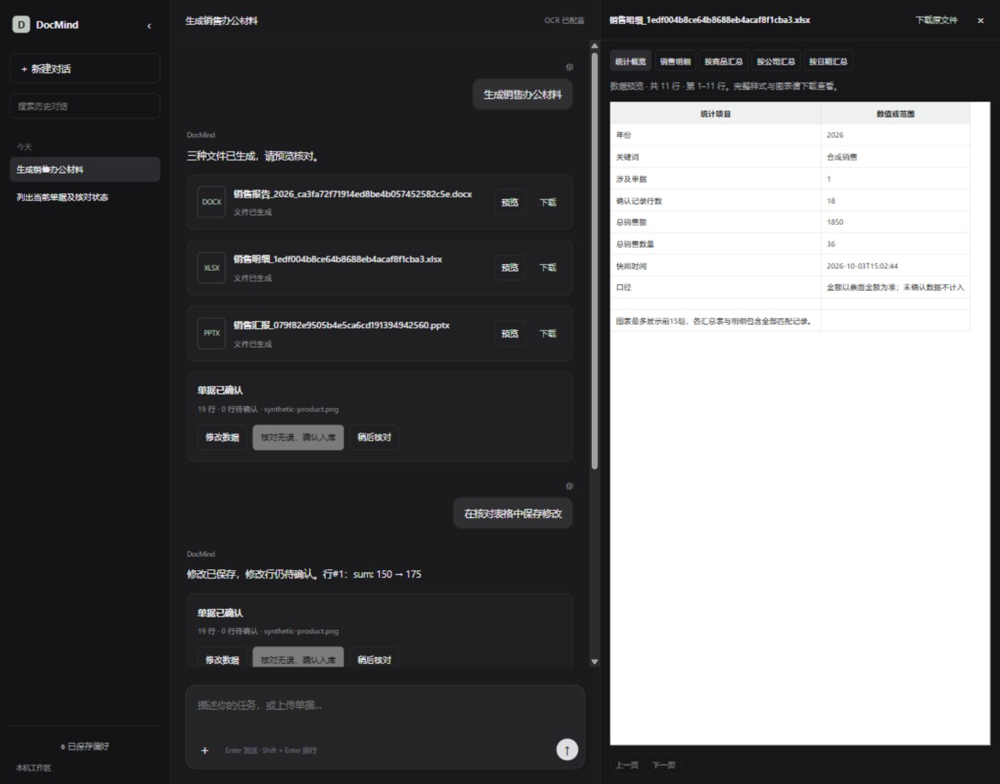

# DocMind Agent · 企业文档处理智能体

基于 LangChain Agent（DeepSeek LLM）的企业文档处理智能体，使用 ReAct 迭代工具调用，支持销售单据核对和办公文件交付。
销售单据识别（InternVL 或 Qwen OCR）→ 聊天内核对修改 → 明确确认 → SQL 统计 → Word / Excel / PPT。

> 正式版本：`main`（默认分支）。开发分支 `feat/agent-v2` 和旧版 `master` 保留供追溯。

## 工作台与主要能力



*截图使用合成销售数据，不包含真实业务单据。*

| 能力 | 当前实现 |
|---|---|
| OCR 与人工核对 | InternVL / Qwen OCR；聊天内表格和自然语言修改；明确确认后才进入统计 |
| 会话与记忆 | 历史搜索、按初始提问命名、继续对话；SQLite 保存会话、任务状态和用户明确要求保存的偏好 |
| 任务执行与可靠性 | LangChain ReAct 工具调用；结构化上下文、重复失败检测、调用预算和超时保护 |
| 销售办公交付 | 同一数据快照生成 Word、Excel、PPT；原图、工作表和文档页面预览及下载 |

当前覆盖本机单用户的销售单据、统计分析与汇报流程。Word/PPT 页面预览需要 Windows 本机 Microsoft Office；Excel 预览用于查看工作表数据。

最近验证的应用版本通过 **110 项自动测试**，较升级前的 84 项增加 26 项用例；这是回归覆盖数量，不代表业务准确率。合成单据的真实 OCR/模型单次完整流程 **7/7 通过**。数据、测量范围和限制见 [升级验证记录](docs/evals/product-upgrade-2026-10-03.md)。

## 架构

```
用户(深色 Web 聊天界面, 上传图/文字)
   │
   ▼
LangChain Agent (DeepSeek function-calling, 自主决定调哪个 Tool)
   │
   ├─ Tool1 OCR       ocr_recognize          InternVL / Qwen OCR → SQLite(待确认)
   ├─ Tool2 Correct   correct_list/show/update/confirm   人工核对/修改，修改后重新待确认
   ├─ Tool3 检索      rag_query              已确认数据明细(SQL WHERE, 关键词/年份)
   ├─ Tool4 统计      rag_summarize          聚合(GROUP BY + SUM, 数量/金额)
   ├─ Tool5 画图      plot_chart             统计图(matplotlib → charts/*.png)
   ├─ Word           generate_report        销售统计报告
   └─ Excel / PPT    generate_excel / generate_presentation   完整明细和销售汇报
   │
   ▼
SQLite (data/agent.db): documents(图) + ocr_rows(识别行, status=pending/confirmed)
```

**工具职责**：
1. DeepSeek 接收文字和工具结果 → OCR Tool（InternVL / Qwen OCR 识别图片）
2. OCR 需要人工核对 → Correct Tool（修改与确认分离，确认后才进统计）
3. 多图全喂 DeepSeek 费 token → **检索/统计直接 SQL 直查**（不再全表读入内存），只把聚合结果喂 LLM
4. 统计要直观 → Plot Tool（画柱状/饼图）
5. 统计要交付 → Word、Excel、PPT 使用可追溯的同一销售快照

## 快速开始

```powershell
# 1. 依赖(清华源; requirements.txt 已含全部)
pip install -i https://pypi.tuna.tsinghua.edu.cn/simple -r requirements.txt

# 2. 从 .env.example 创建本机 .env；配置 DeepSeek 和 OCR 服务
#    Qwen OCR 选择 OCR_PROVIDER=qwen；API key 不提交 Git

# 3. 启动本机工作台（Word/PPT 预览需要本机 Microsoft Office）:
python run_web.py        # http://127.0.0.1:8100
```

浏览器打开后可直接对话，例如：
- 上传一张销售单据图片 → Agent 自动识别入库（待确认）
- 说"确认" → 人工确认（进入统计口径）
- 问"2022年销售额如何" → Agent 调 `rag_summarize(year=2022)` 精确返回
- 说"画个柱状图" → Agent 调 `plot_chart`
- 说"生成一份2022年统计报告" → Agent 生成 Word 报告并展示文件卡片
- 说"按同一查询范围生成 Excel 明细和 PPT 汇报" → 生成办公文件，在右侧预览并下载

## 目录

```
config.py              .env 配置(InternVL / Qwen OCR / DeepSeek)
db/                    SQLite 数据层
  schema.py            documents(图) + ocr_rows(识别行) 两级表
  crud.py              CRUD + SQL 直查(search_confirmed / summarize_confirmed)
  chat_memory.py       会话历史与标题
  preference_memory.py 用户明确要求保存的长期偏好
  task_state.py        结构化查询状态
  review.py / artifacts.py  核对事务与文件登记
tools/                 可插拔工具(每个独立)
  ocr_client.py        InternVL / Qwen OCR 客户端与八字段规范
  ocr_tool.py          Tool1 识别
  correct_tool.py      Tool2 人工核对(4 子工具)
  rag_tool.py          Tool3/4 检索统计(真 SQL)
  plot_tool.py         Tool5 画图
  report_tool.py       Tool6 Word 报表
  office_tool.py       Excel 明细与 PPT 汇报
services/              共用销售快照与独立 Office 预览转换
agent/
  llm.py               ChatDeepSeek
  agent.py             ReAct 工具调用循环、上下文与异常保护、流式事件
web/
  agent_chat.py        SSE 流式端点 /api/agent/chat(支持图片)
  agentchat.html       深色三栏工作台
  static/              聊天、历史、核对和预览的 JavaScript / CSS
  main.py              入口 + 其它 /api/*(correct/docs/chart)
run_web.py / start_web.py  启动
requirements.txt       依赖清单
tests/                 db+tools 单元测试
reports/               报表输出(gitignore)
charts/                图表输出(gitignore)
```

## 检索为何用 SQL 直查

销售数据是**结构化表格**（非文档语义），无需向量检索。直接 `SELECT ... WHERE item LIKE ? / substr(date,1,4)=? GROUP BY ... SUM(...)`，
聚合由 SQL 计算，准确性仍取决于 OCR、人工确认和字段规范。只把受限的聚合结果送入 LLM，减少上下文输入；测量结果见下方评估记录。（早期版本曾全表读入内存再 Python 过滤，已废弃。）

## 测试

```powershell
pytest tests -q
ruff check db agent tools web config.py
```

上下文窗口与压缩前基线：`python evals/context_window_baseline.py`。合成场景和测量边界见 [基线记录](docs/evals/context-window-baseline-2026-09-28.md)；该脚本不调用 DeepSeek 或 OCR。

SQL 工具结果已使用程序生成结构化摘要，明细和分组最多展示 20 行，统计总额包含全部匹配记录。配对结果与限制见 [结构化摘要评估](docs/evals/structured-tools-2026-09-30.md)。

任务与异常保护的第一轮基线见 [任务评估记录](docs/evals/task-benchmark-baseline-2026-09-30.md)。离线程序保护与真实模型任务表现分别报告。

主聊天链路已增加重复失败检测、总调用预算和等待超时，配置及复测边界见 [运行保护记录](docs/evals/runtime-guards-2026-10-02.md)。等待超时不代表底层操作已取消。

数量/金额字段已补充明确语义，见 [字段修正评估](docs/evals/field-semantics-2026-10-02.md)。最近一次成功查询的年份、关键词和分组按会话持久化，见 [任务状态评估](docs/evals/task-state-2026-10-02.md)。

已补充无匹配金额、历史截断追问及最新结果查询的6个固定用例，见 [已知缺口基线](docs/evals/known-gap-benchmark-2026-10-02.md)。补充无匹配金额与成功状态澄清规则后，单次核心指标由5/6到6/6；中间失败记录与限制见 [无匹配口径修正](docs/evals/empty-result-semantics-2026-10-02.md)。此结果不代表总体准确率或稳定性保证。

重复与措辞验证的24个真实模型目标回合核心指标均通过；同一数据库下10会话交替执行60个离线任务的状态/偏好隔离检查通过，见 [稳定性验证](docs/evals/stability-validation-2026-10-02.md)。尚未进行并发压测或长期运行测试。

## 环境依赖

- **OCR**：可选 InternVL（原服务离线时需恢复）或 Qwen OCR；配置见 `.env.example`。
- **DeepSeek API**：Agent 决策与回答（`.env` 配 key）
- Python 3.11+；依赖见 `requirements.txt`（安装用清华源 `-i https://pypi.tuna.tsinghua.edu.cn/simple`）

## 交互与销售办公升级

深色工作台提供左侧历史搜索/重命名、中央聊天与八字段核对表、右侧原图及文件预览。保存修改不等于确认；已确认行修改后会重新待确认。表格直连后端，版本冲突需刷新，整批保存失败不会部分写入。

历史消息分页浏览，图片、核对卡片和新生成的文件卡片可恢复；模型仍只读取受限的最近上下文与结构化任务状态。长期偏好仅在明确要求时保存。应用为本机单用户工作区，不包含多用户鉴权。

Word、Excel、PPT 覆盖销售明细、统计与汇报，同一请求可复用数据快照。Excel 完整导出，Word/PPT 明确标记图表展示范围。文件通过登记 ID 预览、下载；旧版只包含路径文本的消息没有文件卡片。

Word/PPT 转 PDF 后由 PDFium 渲染页面，支持翻页和缩放；Excel 提供工作表与分页数据查看。Office 转换独立进程、串行执行、60 秒超时，失败后原文件仍可下载并重试。PPT 预览前需关闭已有 PowerPoint，避免连接或退出用户实例。超时只清理已记录且 PID、名称、创建时间匹配的任务 Office 进程；COM 在记录进程之前卡住的情况不做猜测性清理。

升级验证与已知限制见 [交互与办公验证](docs/evals/product-upgrade-2026-10-03.md)。销售生成规范见 [项目业务规范](docs/sales-office-rules.md)。
