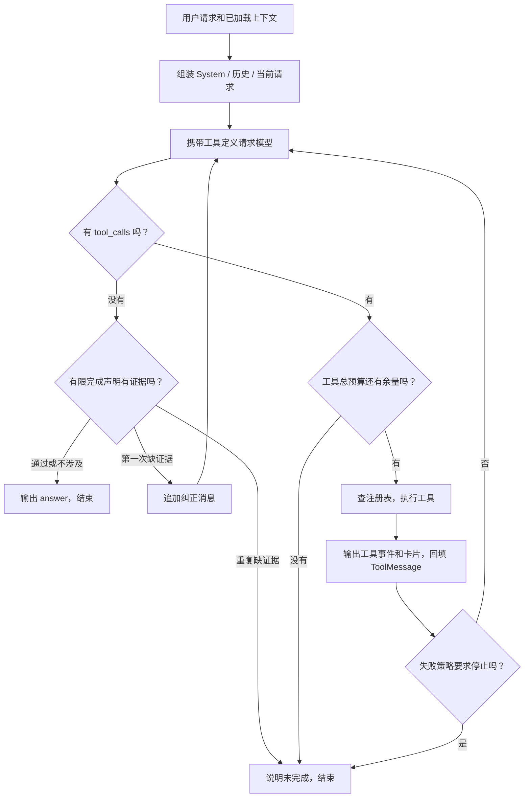

# 模块 01：Agent 执行中控——从模型决策到可核对的工具执行

阶段：第二阶段，源码深度拆解。日期：2026-10-07。

应用源码基准：`3095cf52376a99f2a53bbcbe2c09f3f04fe174fa`；第一阶段文档提交：`50ddc59`。本次只分析一个模块：`agent.agent` 的主聊天执行中控，以 `run_agent_events` 和 `_run_tool_call` 为核心。不展开 OCR、SQL、数据库或网页的内部实现，不改业务代码。

核心源码：[agent/agent.py](C:/Users/wuhao/Documents/Enterprise_Agent/enterprise_ocr_service/agent/agent.py:201)。支持依赖只用来说明中控边界：[agent/llm.py](C:/Users/wuhao/Documents/Enterprise_Agent/enterprise_ocr_service/agent/llm.py:10)、[agent/runtime_guard.py](C:/Users/wuhao/Documents/Enterprise_Agent/enterprise_ocr_service/agent/runtime_guard.py:12)。

本模块的学习目标：你能独立解释“工具定义怎么交给模型、工具是谁执行、结果如何回传、为什么需要再调用模型、何时结束、哪些保证尚未建立”。优先理解决策和边界，不要求背装饰器或正则语法。

## 模块作用

### 为什么存在

用户输入的是业务目标，比如“统计2024年甲公司的销售额”。应用需要将它转成可执行操作：选统计工具，确定年份和关键词，取得实际数据，再解释结果。用户后续还可能要求画图、改条件或生成报告，所需步骤不是每次完全相同。

这个模块提供一次请求内的执行循环：**组装上下文 → 模型提出动作 → 程序执行动作 → 回填观察结果 → 模型继续决策或回答。**

它把三个职责接在一起：

| 角色 | 负责的事情 | 不应混淆的边界 |
| --- | --- | --- |
| 模型 | 解释意图、选择工具和参数、根据结果回答 | 输出工具调用不代表实际操作已完成；模型也可能选错参数 |
| 执行中控 | 查找并调用工具、关联消息、计数、检查失败与完成证据 | 不计算销售总额，不承担全部业务授权、事务或数据质量保证 |
| 业务工具 | 真正调用 OCR、查询/修改数据库、生成文件 | 工具执行成功也不自动证明模型最终表述正确 |

模型是“下一步动作的提议者”，中控是“动作的执行与控制者”。这比“把用户问题发给大模型”更能说明 Agent 项目中的工程工作。

### 解决什么问题

1. 把自然语言接到有限、已注册的业务能力上，避免模型任意生成并执行程序或 SQL。
2. 在一次请求内保留工具观察，使后续决策建立在实际执行结果上。
3. 控制失败重复、调用数量和等待期限，避免任务无限运行。
4. 输出执行事件和业务卡片，让界面显示处理进度与可操作结果。
5. 对已发现的“没有修改却声称修改”“没有文件却声称生成”增加有限检查。

工程目标分别影响工具选择及参数正确率、执行可信度、失败操作次数、等待时间和资源占用。当前没有证明所有任务质量、延迟和成本都整体提升。

### 输入、输出与持久化边界

`run_agent_events` 接收用户文本、历史消息、可选图片路径、显式偏好和历史成功查询条件；返回一个事件生成器，事件包括 intent、tool_call、tool_result、卡片、task_state 和 answer。

中控在本次调用的内存 `messages` 中保存工具轨迹。会话读取、消息保存和 task_state 落库由外层完成，见 [调用位置](C:/Users/wuhao/Documents/Enterprise_Agent/enterprise_ocr_service/web/agent_chat.py:141)。工具本身可能写数据库或文件；不能因此说整个中控执行轨迹都有持久化检查点。

本文件还有 `build_agent / ask`，服务兼容文字入口，使用经典 AgentExecutor。主网页走的是本笔记分析的自定义循环，两条路径不能混讲。文件顶部“4 个 Tool”是旧注释，当前主注册列表是 11 个工具。

## 核心代码流程

以下按实际执行顺序拆关键行；行号来自本次读取的源码。省略空行与重复的正则表达式，每一段都说明它改变了什么运行行为。代码示例除特别标明“示意”外均摘自当前源码。

### 1. 工具装配：模型可见契约与程序执行索引

源码位置：[注册列表](C:/Users/wuhao/Documents/Enterprise_Agent/enterprise_ocr_service/agent/agent.py:171)。

```python
_TOOLS = [
    ocr_recognize_chat,
    correct_list_docs,
    correct_show_rows,
    correct_update_row,
    correct_confirm,
    rag_query,
    rag_summarize,
    plot_chart,
    generate_report,
    generate_excel,
    generate_presentation,
]
_TOOL_BY_NAME = {t.name: t for t in _TOOLS}
```

逐行看这段的行为：

- `_TOOLS` 每一项是一个 LangChain 工具对象，包含名字、描述、参数契约和可调用实现。列表定义当前 Agent 的能力集合，不是规定固定执行顺序。
- OCR、核对、查询、绘图、办公生成是能力分类；在这里理解“哪些动作能被提议”即可，其他模块的内部逻辑后续单独拆。
- `_TOOL_BY_NAME` 建立名字到工具的查找映射，供执行模型返回的 `name`。列表和映射来自同一集合，降低两套工具清单漂移的可能。

**设计重点：同一个工具有两个视角。模型看到描述与参数，程序持有可执行实现。工具绑定只提供契约，执行查找才产生实际动作。**

注册表限制可调用函数集合，但不是完整授权系统。比如模型能否确认某张单据、能否读取某个图片路径，仍需业务层校验；“工具存在”不等于“这次操作已获用户授权”。

### 2. 创建模型并绑定工具：211—212 行

源码位置：[模型绑定](C:/Users/wuhao/Documents/Enterprise_Agent/enterprise_ocr_service/agent/agent.py:211)。

```python
llm = get_llm()
llm_tools = llm.bind_tools(_TOOLS)
```

| 行 | 运行含义 | 为什么存在 |
| --- | --- | --- |
| 211 | 获取 ChatDeepSeek 模型对象 | 将供应商、模型配置与循环分开，中控不直接拼 HTTP 请求 |
| 212 | 建立携带工具定义的模型调用接口 | 让模型有机会输出结构化的工具名、参数和调用 ID |

`get_llm` 当前设置 temperature=0.3、模型等待配置和 max_retries=0。低温度不等于确定性；关闭 SDK 隐式重试使重复调用策略更容易追踪，但不能由此保证服务只发生一次内部处理或所有失败都可恢复。

执行工具仍发生在后面的 `_run_tool_call`，不是在 `bind_tools` 这一行。

### 3. 准备当前输入与系统规则：214—233 行

源码位置：[上下文准备](C:/Users/wuhao/Documents/Enterprise_Agent/enterprise_ocr_service/agent/agent.py:214)。

```python
content = user_input
if image_path:
    content = f"{content}\n[已上传图片, 路径: {image_path}]（这是销售单据，请识别并入库）"
system_prompt = EVENTS_SYSTEM_PROMPT
```

- 214 行保留本次用户文本。
- 215—216 行把图片路径作为文字标记加入请求，提示模型调用 OCR；没有在此把图片字节直接交给 DeepSeek 做视觉推理。
- 217 行选择主聊天的业务系统规则。规则包含工具使用、数据确认、年份筛选、无匹配口径和文件完成声明要求。
- 218—226 行如果有历史成功查询条件，将 JSON 及使用规则加入系统提示：只在继续旧查询且近期缺条件时参考，当前请求和近期消息优先，新话题不能自动套旧筛选。
- 227—233 行如果有显式偏好，注入回答方式与默认选项，同时说明不能覆盖数据真实性规则，当前明确要求优先。

**为什么同时给事实和使用规则？** 单独把旧条件塞给模型，可能导致新任务被旧筛选污染。因此这里不仅提供状态，还告诉模型何时应使用、何时应忽略。

这是提示词优先级，不是程序在调用前强制补全和验证全部参数；遵守效果仍需真实模型任务评估。用户可控偏好也不是完全可信的系统策略，不能把“放在 SystemMessage 里”当作已经完成提示注入防御。

### 4. 构造消息历史：234—243 行

源码位置：[消息列表](C:/Users/wuhao/Documents/Enterprise_Agent/enterprise_ocr_service/agent/agent.py:234)。

```python
messages: list[Any] = [SystemMessage(content=system_prompt)]
if history:
    for m in history[-10:]:
        role = m.get("role")
        c = m.get("content", "")
        if role == "user":
            messages.append(HumanMessage(content=c))
        elif role == "assistant":
            messages.append(AIMessage(content=c))
messages.append(HumanMessage(content=content))
```

| 行 | 关键行为 | 面试应该解释的理由 |
| --- | --- | --- |
| 234 | 第一条放业务系统上下文 | 给本次决策提供角色和约束 |
| 235 | 无历史时直接进入新请求 | 函数也能处理第一轮问题 |
| 236 | 只遍历最近 10 条 | 使用固定消息数量控制历史范围；不是严格 token 控制 |
| 237—238 | 读取角色与内容 | 使用外层已经加载的消息，不在此查询会话数据库 |
| 239—240 | 用户消息转 HumanMessage | 保留说话者身份，帮助识别用户需求 |
| 241—242 | 助手消息转 AIMessage | 保留此前回答；这里没有重建旧 tool_calls |
| 243 | 当前请求放在最后 | 给模型明确的当前决策目标，避免把旧问题当新任务 |

最近 10 条不是 10 轮问答，常见完整问答约 5 轮；长消息仍能占很大上下文。本轮后续工具轨迹继续追加，不再按 token 裁剪。历史内容持久化和历史全部进入模型是两个不同能力。

### 5. 发意图事件并初始化本轮控制状态：245—254 行

源码位置：[本轮状态](C:/Users/wuhao/Documents/Enterprise_Agent/enterprise_ocr_service/agent/agent.py:245)。

```python
yield {"type": "intent", "intent": _guess_intent(user_input)}

total_calls = 0
failure_streak = 0
repeated_failures = 0
last_failure = None
artifact_proofs: set[str] = set()
corrected_file_claim = False
updated_row_proof = False
corrected_update_claim = False
```

| 行 | 状态含义 |
| --- | --- |
| 245 | 通过规则猜一个意图标签给外层；不决定模型最终调用哪个工具 |
| 247 | 统计本请求实际工具调用次数 |
| 248 | 统计连续失败次数，不要求工具和参数相同 |
| 249 | 统计连续相同调用签名的失败次数 |
| 250 | 保存上一次失败签名，用于判重复 |
| 251 | 保存本轮成功生成过文件的工具类型，初始为空 |
| 252 | 记录本轮是否已经纠正过一次无证据文件声明 |
| 253 | 记录本轮是否有一次成功修改结果 |
| 254 | 记录本轮是否已经纠正过一次无证据修改声明 |

这些变量区分“尝试了什么”“哪些操作失败”“哪些完成声明已有证据”。如果只维护一个循环步数，就无法同时表达这些情况。

它们都是本次函数调用中的局部状态。进程中断或用户重新请求时，不会从某个已持久化的运行检查点自动恢复这些计数与证据。

### 6. 请求模型：255—264 行

源码位置：[决策循环](C:/Users/wuhao/Documents/Enterprise_Agent/enterprise_ocr_service/agent/agent.py:255)。

```python
for _step in range(8):
    try:
        resp = bounded_call(lambda: llm_tools.invoke(messages),
                            config.AGENT_MODEL_TIMEOUT_SECONDS)
    except Exception as exc:
        reason = "模型等待超时" if isinstance(exc, (TimeoutError, CallTimeout)) else "模型调用失败"
        yield {"type": "answer", "answer": f"{reason}，本次任务已停止。{exc}"}
        return
    content = getattr(resp, "content", "") or ""
    tool_calls = getattr(resp, "tool_calls", None) or []
```

| 行 | 实际作用 |
| --- | --- |
| 255 | 一次请求最多进入循环 8 次，包括纠正无证据声明后的再次决策 |
| 256—258 | 同步 invoke 当前消息，包装等待期限；一次返回后才继续处理 |
| 259—262 | 超时或模型调用异常时生成说明并停止，不做上下文超限专项恢复 |
| 263 | 提取模型文本，它可能是中间说明也可能是最终回答 |
| 264 | 提取结构化 tool_calls，后面的分支由它是否为空决定 |

模型一次回复可以有多个工具调用，因此“最多 8 轮”不能代替“最多 8 次工具操作”。也不能把轮数乘默认期限说成已经实现的整次请求严格超时：它限制的是各次等待，OCR 还有独立较长预算。

第 8 次模型回复若仍要求工具，工具执行后可能直接落到循环末尾的停止回答，没有第 9 次机会专门总结。当前代码没有为最后总结额外预留一轮。

### 7. 无工具调用时，先检查有限完成声明：265—295 行

源码位置：[完成声明检查](C:/Users/wuhao/Documents/Enterprise_Agent/enterprise_ocr_service/agent/agent.py:265)。

这段不是“模型不调用工具就无条件返回”。它先做两个检查。

**修改声明：**

- 267—269 行用有限正则找“已修改/已更新”等中文表达。
- 270 行同时要求本次用户文本包含修改类词、回复声称已完成、且没有成功修改证据，才进入纠正。
- 271—273 行若之前已经纠正过，停止并说明未能验证修改。
- 274—276 行第一次出现时追加纠正 SystemMessage，再次进入模型循环。

**文件声明：**

- 278 行建立本次回复声称完成的文件类型集合。
- 279—286 行根据有限词句识别 Word、图表、Excel、PPT 生成声明，映射到相应工具名。
- 287 行计算 `claimed_artifacts - artifact_proofs`，判断哪些类型缺成功证据。
- 288—290 行第二次出现无证据声明时停止。
- 291—293 行第一次出现时追加纠正消息并再次调用模型。
- 294—295 行通过检查后才发最终 answer 并结束。

**设计理由：语言完成与实际完成是两类事实。** 让模型再说一遍“我已经修改”不能建立数据库修改证据，因此检查需要来自工具执行。

但当前只覆盖有限中文模式，不是所有语言和措辞的通用验证器；否定语句、复杂改写也需检验。`updated_row_proof` 是布尔值，没有绑定具体 row_id、字段与目标值；`artifact_proofs` 只记工具类型，没有绑定用户要求的全部文件、筛选范围或数据内容。因此一次成功不能证明整项复杂任务全部完成。

纠正通常可能增加一次模型调用，也可能触发执行工具；质量、延迟和费用有权衡。当前没有这一机制单独的平均收益或成本配对测量。

### 8. 有工具调用时，保存模型动作：296—307 行

源码位置：[assistant 工具动作消息](C:/Users/wuhao/Documents/Enterprise_Agent/enterprise_ocr_service/agent/agent.py:296)。

```python
if content:
    yield {"type": "llm_text", "text": content}
to_msg = getattr(resp, "to_message", None)
assistant = to_msg() if callable(to_msg) else None
if assistant is None:
    assistant = AIMessage(
        content=content or "",
        tool_calls=[{"name": tc.get("name", ""), "args": tc.get("args", {}),
                     "id": tc.get("id", "")} for tc in tool_calls],
    )
messages.append(assistant)
```

- 296—297 行把带工具调用回复中的中间文本作为事件发出。这是 invoke 完成后的文本，不是模型逐 token 思维流。
- 299—300 行尝试获得兼容的 assistant 消息。
- 301—306 行否则构造 AIMessage，保留工具名称、参数和调用 ID。
- 307 行先把“模型提议的动作”加入 messages，再去执行动作。

**为什么不能只回填结果？** 模型需要看到自己提出了哪个动作及参数；后续 ToolMessage 还要与这个调用 ID 配对。动作和观察组成一条可解释的轨迹。

### 9. 工具预算、执行和等待异常：308—322 行

源码位置：[工具执行](C:/Users/wuhao/Documents/Enterprise_Agent/enterprise_ocr_service/agent/agent.py:308)。

```python
for tc in tool_calls:
    if total_calls >= config.AGENT_MAX_TOOL_CALLS:
        yield {"type": "answer", "answer": "已达到本次任务的工具调用总预算，请缩小问题范围。"}
        return
    total_calls += 1
    yield {"type": "tool_call", "name": tc.get("name", ""), "args": tc.get("args", {})}
    timeout = (config.OCR_TIMEOUT_SECONDS + 5 if tc.get("name") in
               {"ocr_recognize_chat", "ocr_recognize"} else config.AGENT_TOOL_TIMEOUT_SECONDS)
    try:
        result = bounded_call(lambda tc=tc: _run_tool_call(tc), timeout)
    except Exception as exc:
        reason = "工具等待超时" if isinstance(exc, TimeoutError) else "工具调用失败"
        yield {"type": "tool_result", "name": tc.get("name", ""), "result": f"{reason}: {exc}"}
        yield {"type": "answer", "answer": f"{reason}，本次任务已停止。底层操作可能仍在执行；修改或入库前请先核对状态，避免重复执行。"}
        return
```

| 行 | 运行行为与理由 |
| --- | --- |
| 308 | 顺序执行这次模型返回的各个工具，没有并行工具执行器 |
| 309—311 | 执行前检查总预算，默认 8 次；拒绝多做一次 |
| 312 | 每个调用逐个计数，包括失败与未知工具尝试 |
| 313 | 执行前先发 tool_call，外层可显示正在做什么 |
| 314—315 | OCR 使用通用 OCR 期限加 5 秒；其他工具使用普通期限 |
| 316—317 | 调用注册表执行入口，等待结果 |
| 318—322 | 等待或包装异常停止；提醒底层操作可能仍在执行 |

这里的超时是**调用者等待结束**。支持依赖用后台线程和有界槽位包装调用，最多 4 个尚未结束的包装调用；超时线程仍占槽，直到真正结束才释放。不能推导超时后事务回滚、外部请求取消或文件绝不会生成。

当前 OCR 外层等待使用 `OCR_TIMEOUT_SECONDS + 5`，默认 305 秒；Qwen 客户端内层有自己的 60 秒默认值。它们不是一个统一 deadline，本模块也不会依据 provider 自动选择匹配的外层预算。

### 10. 把观察交给网页和模型：323—326 行

源码位置：[工具观察回填](C:/Users/wuhao/Documents/Enterprise_Agent/enterprise_ocr_service/agent/agent.py:323)。

```python
yield {"type": "tool_result", "name": tc.get("name", ""), "result": result[:2000]}
for card in getattr(result, 'cards', []):
    yield card
messages.append(ToolMessage(content=result, tool_call_id=tc.get("id", "")))
```

| 行 | 关键行为 | 不要误解成 |
| --- | --- | --- |
| 323 | 网页执行日志最多收到该结果前 2,000 字符 | 模型结果也被压到 2,000 字符 |
| 324—325 | 单据核对和文件等卡片作为独立事件输出 | 模型文字里随便写个文件名就有卡片 |
| 326 | 模型消息接收完整结果，并通过 tool_call_id 绑定对应动作 | 每次工具结果都新增一条用户消息 |

#### 为什么 tool_call_id 必不可少

下面只是消息关系示意，不是本次真实模型运行：

```text
AIMessage:
  tool_calls = [
    {id: "call_a", name: "rag_summarize", args: {year: "2024"}},
    {id: "call_b", name: "plot_chart", args: {year: "2024"}}
  ]
ToolMessage(tool_call_id="call_a", content=统计结果)
ToolMessage(tool_call_id="call_b", content=图表生成结果)
```

工具名回答“做什么”，调用 ID 回答“对应哪一次动作”。即使两次调用同一个工具，它们也可能年份不同、结果不同，不能只用名字关联。

下一次执行 `llm_tools.invoke(messages)` 时，模型看到了上述动作与观察。它可以根据统计回答，也可以继续调用报告工具。这就是从“单次 function calling”走向“多步 Agent 执行循环”的关键。

### 11. 更新证据和发查询条件事件：327—337 行

源码位置：[工具执行证据](C:/Users/wuhao/Documents/Enterprise_Agent/enterprise_ocr_service/agent/agent.py:327)。

- 327—328 行：修改工具返回已知成功前缀、且未标失败时，将 `updated_row_proof` 设为真。中控依赖工具成功契约，不独立再检查数据库每个字段。
- 329—330 行：为各文件工具选择预期成功前缀。
- 331—334 行：成功文本解析出路径，确认该路径是文件后，把工具名加入 `artifact_proofs`。文件存在不自动证明内容、筛选范围或数量都正确。
- 335 行：将完整工具结果交给条件提取器，只有符合其成功查询契约才得到 state。
- 336—337 行：发 task_state 事件，外层保存；中控不在这里调用数据库持久化。

成功查询条件可在整项请求尚未结束前保存。例如查询成功、后续生成失败，查询条件仍可能已保存；它不是“整个任务已完成”的状态。

### 12. 按失败风险决定停止或继续：338—354 行

源码位置：[失败策略](C:/Users/wuhao/Documents/Enterprise_Agent/enterprise_ocr_service/agent/agent.py:338)。

```python
if getattr(result, 'failed', False):
    if tc.get('name') in {'ocr_recognize_chat', 'ocr_recognize',
                          'correct_update_row', 'correct_confirm',
                          'plot_chart', 'generate_report', 'generate_excel', 'generate_presentation'}:
        yield {"type": "answer", "answer": f"操作未能确认成功：{result}。本次任务已停止，请先核对状态，避免重复写入。"}
        return
    signature = (tc.get('name'), json.dumps(tc.get('args', {}), sort_keys=True, ensure_ascii=False))
    failure_streak += 1
    repeated_failures = repeated_failures + 1 if signature == last_failure else 1
    last_failure = signature
    if repeated_failures >= 2 or failure_streak >= 4:
        yield {"type": "answer", "answer": f"工具调用持续失败，本次任务已停止。最后错误：{result}。请核对参数或服务状态。"}
        return
else:
    failure_streak = repeated_failures = 0
    last_failure = None
```

| 行 | 实际策略 |
| --- | --- |
| 338 | 看内部 failed 标记；正常无匹配不是失败 |
| 339—343 | 有副作用工具失败后直接停，不让模型盲目重复 |
| 344 | 工具名与排序后的参数形成签名，参数键顺序变化不会轻易绕过同签名判定 |
| 345 | 累加所有连续失败 |
| 346—347 | 相同签名连续出现则加一，不同签名重新从一开始 |
| 348—350 | 相同失败两次或连续失败四次停止 |
| 351—353 | 成功后重置失败计数，因此不是跨整个请求累积所有失败 |
| 354 | 8 轮耗尽时输出停止说明 |

只读查询参数错仍有修正机会，明确临时故障在提示中允许原条件重试一次；程序没有独立根据 HTTP 状态码/错误码自动选择所有重试策略。只有被识别为失败的结果才进入上述计数，判错契约是保护能否生效的前提。

“相同参数连续失败两次”是词面签名比较，不是语义判等；换一种同义参数表达可能改变签名。成功的错误方向查询也能重置失败计数，保护次数不等于保证业务进展。

### 13. 执行入口怎样把模型动作落到工具：357—372 行

源码位置：[_run_tool_call](C:/Users/wuhao/Documents/Enterprise_Agent/enterprise_ocr_service/agent/agent.py:357)。

```python
def _run_tool_call(tc: dict[str, Any]) -> str:
    name = tc.get("name", "")
    args = tc.get("args") or {}
    fn = _TOOL_BY_NAME.get(name)
    if fn is None:
        return ToolOutcome(f"未知工具: {name}", failed=True)
    try:
        outcome = fn.invoke(args if isinstance(args, dict) else {"arg": args})
        text = str(outcome)
        failed = text.startswith(("错误:", "识别失败:", "识别到 0 行", "group_by 仅支持:",
                                  "top_k 必须", "fields 不是合法", "fields 须为", "不支持的字段:"))
        if name == 'correct_update_row' and '更新失败(行可能不存在)' in text:
            failed = True
        return ToolOutcome(text, failed=failed or getattr(outcome, 'failed', False), cards=getattr(outcome, 'cards', []))
    except Exception as e:
        return ToolOutcome(f"工具执行出错: {e}", failed=True)
```

末尾 except 的原注释在摘录中省略，不改变逻辑。

| 行 | 关键逻辑与边界 |
| --- | --- |
| 358—359 | 从动作对象取得名字和参数；没有在这里理解用户需求 |
| 360—362 | 从固定注册表取工具；未知工具返回失败，不执行模型生成的任意函数名 |
| 363—364 | 执行真实工具，LangChain 处理其参数契约；非字典参数进入兼容包裹，不是完整语义验证 |
| 365 | 转成文本，供模型、事件和前缀判定使用 |
| 366—367 | 已知错误前缀标为失败 |
| 368—369 | 对已知的不存在行失败作额外判断 |
| 370 | 合并工具自身 failed 属性，保留 cards，不只留下 str 丢掉内部状态 |
| 371—372 | 未被工具内部吞掉的异常转成可见失败结果 |

`ToolOutcome` 是字符串子类，附带 failed 和 cards。它兼容既有文本工具结果，但让状态契约依赖文字，容易产生边界不一致。

**本次源码发现的具体边界：** [correct_update_row](C:/Users/wuhao/Documents/Enterprise_Agent/enterprise_ocr_service/tools/correct_tool.py:92) 捕获某些校验异常后返回 `行 #... 更新失败: ...`，这与 368 行只识别的 `更新失败(行可能不存在)` 不同，也不匹配 366—367 的开头列表。因此不能声称“所有修改失败都会可靠带 failed 标记”。这是源码路径观察，本次未新增测试或端到端复现，不夸大为全部失败都会被漏判。

### 14. 用一条请求串起全部代码

请求示意：“统计2024年甲公司的销售额”。假设模型决定调用 `rag_summarize`；这里不假定实际模型每次都选择相同参数。



图中省略等待异常和 8 轮限制，具体以源码为准。第一次请求一般包含系统、历史和当前用户；如果模型调用查询，追加 AIMessage(tool_calls) 与 ToolMessage(result)；再次请求模型时才有实际数据可供回答。

因此一次用户请求常常涉及至少一次决策请求和一次带工具结果的回答请求，但不是所有请求都恰好两次。直接概念解释可能一次完成，多步任务与纠正可能更多。

## 设计思想

### 1. 将不确定的模型决策接到确定的执行接口

模型适合解释自然语言与选择有限工具，程序适合事务、数值计算和文件生成。中控用工具契约连接它们，避免将模型自述当作事实来源。

工具参数类型通过不等于业务含义正确。年份是字符串、公司是字符串仍可能选错，因此质量需要分层评估：工具选择、参数正确、工具结果、最终答案分别检查。

替代方案是让模型直接生成 SQL，或者直接生成可执行脚本。它们更灵活，但执行范围、参数合法性和业务授权更难约束；当前项目用有限业务工具，更适合已有销售操作边界。尚未做这些替代方案的配对实验，不声称绝对更优。

### 2. 把观察结果纳入下一次决策

一次 function calling 只表明模型请求动作；Agent 循环还需要执行、观察、继续与终止。`AIMessage + ToolMessage` 的轨迹使后续决策有事实依据。

替代方案是一次把所有步骤计划好后顺序运行。固定流程可能更稳定、更少模型调用；但遇到中途没有数据、参数错误或用户临时组合任务时，需要显式分支。是否更适合应看任务分布，当前没有 Agent/workflow 的任务成功率、耗时和成本配对结论。

### 3. 用“继续的条件”设计循环，而非只想正常成功路径

每轮循环都要回答：还能等多久？还能执行几次？这个失败是否安全重试？这个完成声明有没有证据？观察是否证明业务进展？

当前实现已有部分答案：总调用预算、相同/交替失败限制、副作用失败停止与有限证据检查。它还没有统一错误码、所有目标的细粒度证据或贯穿请求的 deadline。

### 4. 区分指令、观察和证明

系统提示中的“不要自动确认”是规则意图，ToolMessage 是工具报告，文件存在或数据库回读是部分执行证据。它们处在不同可信度层级。

不能因为写了提示就说后端已经授权；也不能因为数据库确实修改一行就说所有修改需求都满足。成熟设计应把授权与验收条件下沉到可执行检查，而不是只增加更多提示文字。

### 5. 把模型消息和界面事件分开

模型需要协议完整的动作与结果，页面需要进度、卡片和最终答案，所以一份工具结果有不同使用方式：网页截短，模型保留完整，卡片带可操作 ID。

这种边界便于更换展示方式，但事件流不是持久化任务日志。当前同步 invoke 后发事件，属于步骤级反馈，不等于逐 token 文本流，也不自动降低模型服务响应时间。

### 6. 为什么目前不直接上复杂 Planner 或多 Agent

当前任务主要是有限工具的查询、核对与文件生成，简单循环比较容易定位失败原因。新框架如果只是替换循环，没有解决缺失约束、授权、错误契约和幂等问题，就不能算业务可靠性提升。

替代路线包括固定 workflow、框架内置 Agent、带持久化检查点的图式编排、长任务规划执行。选择应基于同条件任务评估；当前没有实施这些迁移。本次只讲设计权衡，不预设重写。

### 7. 现有运行保护的测量到底说明什么

以下来自 [2026-10-02 运行保护评估](C:/Users/wuhao/Documents/Enterprise_Agent/enterprise_ocr_service/docs/evals/runtime-guards-2026-10-02.md)，本次没有重跑。

| 指标 | 数据及方式 | 基线 → 新结果 | 可讲的变化 |
| --- | --- | --- | --- |
| 程序运行保护目标 | 同套 10 类脚本模型动作与故障刺激 | 5/10 → 10/10 | 多满足 5 个目标，+50 个百分点；不是自主模型准确率 |
| 同工具同参数连续失败 | 固定失败刺激 | 8 → 2 次 | 少 6 次，75%；反复失败操作减少 |
| 交替失败 | 固定交替刺激 | 8 → 4 次 | 少 4 次，50%；没有证明真实任务恢复成功 |
| SQL 结果核对 | 原 20 张单据、204 行标签子集，直接指定工具参数 | 20/20 → 20/20 | 没有变化，保护改动不等于统计正确性提升 |
| 历史上下文送达 | 5 个固定输入场景 | 4/5 → 4/5 | 早期必要条件丢失没有因此修复 |

阻塞探针使用 0.5 秒配置、2 秒观察门槛；目标是 Agent 自身返回超时说明。它不证明底层线程被取消，也不用于证明生产默认 60 秒最优。

没有可比的真实平均延迟、实际 token 与费用数据。预期减少无效调用不等于已测费用下降；完成声明纠正反而可能增加模型调用，应与错误完成率一起评估。

## 如果重构

以下全部是建议，未实施。先保留现有循环的任务语义与证据，再按风险拆解；不为了“用更高级框架”重写。

### 1. 优先统一工具结果契约

当前状态来自字符串子类、前缀、路径解析和有限成功措辞。建议将结果统一为结构化对象：状态、错误码、是否可重试、数据、卡片、业务证据与操作 ID。模型可获得其文本/JSON 表示，程序直接读类型字段。

示意契约，不是当前实现：

```json
{
  "status": "success",
  "error_code": null,
  "retryable": false,
  "data": {},
  "evidence": {"operation_id": "...", "row_id": 1, "saved_fields": {}},
  "cards": []
}
```

收益预期：减少错误漏判、文字改动影响控制策略以及成功证据丢失。测量时固定正常无匹配、参数错误、网络错误、写入不确定和不同措辞，比较失败识别正确率与错误重试次数；当前没有前后量化结果。

### 2. 将工具风险策略写成注册元数据

当前副作用列表、成功前缀表、错误前缀表分散在循环和执行包装中。可为工具声明只读/写入/文件生成、期限、是否具备幂等能力、授权检查方式及重试分类。

这样新增工具时可以一次提供契约，减少忘记加入停止策略的风险。不要把 `retryable=true` 当作单独保障，写操作还需幂等和可查询的执行状态。

衡量策略覆盖率、未知错误被错误重试次数、相同操作重复落库次数；维护变简单是工程推断，没有可比耗时测量。

### 3. 把执行证据绑定到具体任务目标

用 row_id、字段、目标值、artifact_id、过滤范围和快照标识替代单一布尔值或工具类型集合。把“本轮成功改过一行”提升为“该目标字段确实保存为授权值”，把“生成过一个报告”提升为“所需文件和范围均完成”。

工具侧独立授权应校验用户本次允许的操作，不能让中控的正则匹配充当确认授权。具体授权格式需要结合产品流程设计，本次不推定已经实现。

评估覆盖多行/部分成功、不同年份文件、多个同类型文件、遗漏要求、否定表达和不同语言，报告错误完成声明率、正确完成被拒绝率与纠正调用成本。

### 4. 建立严格预算并保留关键上下文

按模型上下文容量预留输出空间，对系统、工具定义、偏好、任务条件、历史和本轮轨迹分别计量；保持 assistant tool_calls 与 ToolMessage 成对，不能只删观察或只删动作。

结合结构化当前任务条件处理历史窗口外的重要约束，定义改条件、新任务、取消和无匹配状态如何更新。直接从用户语句抽取的条件与工具验证的条件应保留来源区分。

增加整次请求 deadline，把剩余时间传入后续模型/工具等待；但 deadline 到达只决定中控停止等待，底层取消能力仍需单独设计。

用固定长对话、长字段和多工具任务比较参数正确率、约束遵守、上下文超限率、实际用量与耗时分布。现在没有这些改动的提升数字。

### 5. 持久化运行状态与幂等，不把重问当恢复

如果业务需要断点恢复，保存 run_id、每次动作参数、状态、结果与证据；重新连接时查询已完成动作，恢复前区分未执行、成功、失败和执行状态未知。

对写入或外部调用使用适合业务的幂等标识，并能查执行结果。超时后继续查运行状态与立刻重复写入是不同策略。会话历史和文件卡片恢复只说明交付可继续查看，不构成步骤级 checkpoint。

这会增加存储、协调与状态迁移成本，因此在真实长任务和中断样本证明需要后实施。测量重复副作用、中断恢复成功率、恢复耗时和错误复用次数。

### 6. 最后再拆循环结构或迁移框架

当状态与契约清楚后，可将上下文构造、模型动作解析、工具执行、策略判断和事件发布拆成可单独验证的函数；保持外层事件接口稳定，逐步迁移旧入口。

若长任务需要 durable checkpoint，再评估图式编排或框架内置持久化。拆代码能提升可维护性，但没有同任务前后测量时，不能声称任务正确率自动提高。

### 7. 重构优先级与验收指标

| 优先级 | 改什么 | 首要验收指标 | 可能的代价 |
| --- | --- | --- | --- |
| P0 | 结构化结果与独立授权/目标证据 | 错误漏判、未授权操作、虚假完成与误拒绝 | 契约迁移、更多状态校验 |
| P1 | 上下文与整次请求预算 | 约束丢失、超限、实际用量、尾部等待 | 摘要信息损失、澄清增加 |
| P1 | 幂等与持久运行状态 | 重复副作用、步骤恢复、状态未知处理 | 数据模型与协调复杂度 |
| P2 | 分解函数、对齐旧入口、评估框架 | 行为一致性、可定位失败、改动回归 | 兼容迁移成本 |

不要将所有建议打包成一个未经验证的大重写。固定比较任务与原始失败记录，每个改动单独核对行为，再进行更大的配对任务评估。

## 面试考点

| 可能被问什么 | 面试官想判断什么 | 合格回答需要哪些事实 |
| --- | --- | --- |
| 你这个 Agent 的核心循环是什么？ | 是否理解决策、执行、观察与终止 | bind_tools、tool_calls、注册执行、ToolMessage、再次 invoke、停止条件 |
| function calling 和 Agent 是什么关系？ | 能否区分一次调用契约与多步系统 | function calling 是动作输出接口；本项目自行组织执行循环和策略 |
| LangChain 具体用在哪？ | 是否只背框架名称 | 工具对象、消息契约、ChatDeepSeek 适配；网页主循环自己实现 |
| `_guess_intent` 是不是路由器？ | 是否沿实际路径读过代码 | 它只生成事件；真正工具选择来自模型 tool_calls |
| 为什么还要把 AIMessage 放进历史？ | 是否理解工具调用协议 | 动作与观察成对，tool_call_id 关联具体调用 |
| 一次用户请求要几次模型调用？ | 是否能解释延迟与成本构成 | 直接答可一次；用工具通常决策后还需带观察回答；多步和纠正更多 |
| 怎么限制无限循环？ | 是否区分多维预算 | 8 轮、默认 8 次工具、连续失败、各次等待期限；没有完整 token/deadline |
| 工具失败是否自动重试？ | 是否考虑副作用与不确定状态 | 只读可修正或有限重试；副作用失败停止；错误识别仍有契约边界 |
| 为什么不能信模型说“已修改”？ | 是否建立事实与语言边界 | 需要实际工具和回读证据，现有完成检查只是部分覆盖 |
| 你说流式到底流什么？ | 是否正确解释用户反馈与模型延迟 | 当前是步骤事件，invoke 同步等待完整响应，不是逐 token 最终回答 |
| 怎么验证这段逻辑？ | 是否分清替身与真实模型 | 固定脚本动作验证程序；真实模型任务检查自主决策；分别报告指标 |
| 为什么自己写循环而不是直接用框架？ | 是否能讲维护权衡 | 可精确接入事件、卡片、失败和证据策略；代价是自行维护协议和状态 |

源码理解可信度高；哪些考点会出现是基于模块内容的准备建议，不是实际面试题库或统计概率。

## 高频追问

以下按“第一问 → 继续深挖 → 应答关键”组织，不要求你立即回答，也不进入连续模拟面试。

### 1. 谁真正选择工具？

**第一问：** 你用了规则路由还是模型路由？

**深挖：** 既然 `_guess_intent` 已经猜了意图，为什么还要模型？

**应答关键：** 当前主链路的猜意图函数只发事件，没有控制 `_TOOL_BY_NAME` 选择；实际动作来自绑定工具后的模型响应。能在源码找到猜意图之后仍直接调用模型，以及后面执行 `resp.tool_calls`。

**进一步深挖：** 如果高频固定任务模型总是多调用怎么办？

解释可以比较确定性接口或 workflow，同任务测任务成功率、调用次数、费用与耗时；当前没有配对结果，不能说 Agent 一定更好。

### 2. 为什么 ToolMessage 不能换成普通文本历史？

**第一问：** 把工具结果拼在 prompt 后面不也能回答吗？

**深挖：** 一次两个工具，或同一工具两次不同参数，如何关联？

**应答关键：** 明确记录 assistant 的动作和 tool_call_id，使结果属于特定调用；普通文本混入用户消息会丢掉协议角色或依赖手工约定。消息关联提高可解释性，不保证结果内容自身没有错误。

### 3. 8 轮和 8 次工具调用有什么区别？

**第一问：** 为什么有两个计数？

**深挖：** 每轮返回三个工具，8 轮不是24个操作吗？

**应答关键：** 模型决策次数与业务执行次数不同；每个 tc 执行前单独查总预算，即使同轮多个工具也受限。第八轮可能没有额外总结机会；纠正文本也占模型轮数。

**进一步深挖：** 这样就控制成本了吗？

只能限制次数。每次消息长短不同，没有完整 token 预算和真实费用配对测量，不能只看调用数断言费用降低。

### 4. 工具超时后能不能重试？

**第一问：** 你设置60秒超时，底层操作被取消了吗？

**深挖：** 用户看到失败后重新发一句，旧线程刚好写成功，会怎样？

**应答关键：** 当前只结束等待，旧操作可能仍成功，因此先核对状态；有界执行槽控制资源，不保证幂等。完整处理需要操作 ID、可查状态和适合写操作的幂等标识，尚未实现。

### 5. 无匹配算不算失败？

**第一问：** 没查到数据为什么不自动再试？

**深挖：** 回答“没有记录”和“销售额零”有什么区别？

**应答关键：** 查询成功但集合为空是有效观察，不是系统故障；没有匹配的已确认记录无法证明真实业务金额为零。网络或参数故障不可以伪装成空结果。中控必须正确接收失败标记，模型还要正确解释业务语义。

### 6. 一次工具成功足够证明模型的全部声明吗？

**第一问：** 你检查过成功返回，为什么还说保护有限？

**深挖：** 用户让改三行，实际改一行后声称全部完成呢？

**应答关键：** 当前修改证据是布尔值，粒度不足；文件证据只记工具类型。需要把证据绑定具体目标，分别验证任务要求。正则还会有漏判和误判，不能声称幻觉被完全消除。

### 7. 字符串错误前缀有什么问题？

**第一问：** 工具返回“失败”不就可以停止吗？

**深挖：** 改一句错误文案会不会影响控制流？

**应答关键：** 当前 failed 标记有部分前缀推导，源码已有更新失败格式不完全匹配的边界。应以结构化状态和错误码驱动策略，文本只负责展示；源码观察与端到端复现分别报告。

### 8. 这个循环能从中断继续执行吗？

**第一问：** 保存了会话，所以能断点续跑吗？

**深挖：** 查询做完、PPT做一半进程重启，能从哪一步恢复？

**应答关键：** 会话和部分卡片能重新加载，但局部 messages、计数、动作证据不作为完整运行检查点保存。再次请求是新的执行，不保证恰好继续下一步。需要持久化 run/step 状态和写操作恢复语义。

### 9. 要不要并行执行工具降低延迟？

**第一问：** 模型一次返回多个工具为什么顺序执行？

**深挖：** 查询、修改、确认互相依赖，能一起跑吗？

**应答关键：** 当前顺序执行简单；独立只读任务可能并行，依赖或副作用操作必须尊重顺序。是否并行应先建立依赖与风险元数据，再比较端到端耗时、数据一致性及错误率；不能直接承诺更快多少。

### 10. 脚本替身不是把答案写死了吗？

**第一问：** 10/10保护是不是假测试？

**深挖：** 能不能证明真实模型在故障后会修正参数？

**应答关键：** 替身固定动作，是为了重复触发边界并验证真实控制代码，不测自主决策；模型恢复能力要真实调用、保留参数与回答、单独评分。固定刺激与真实决策分别证明不同层次，不能合并为整体准确率。

支持测试定位：[test_runtime_guards.py](C:/Users/wuhao/Documents/Enterprise_Agent/enterprise_ocr_service/tests/test_runtime_guards.py)、[ScriptedModel](C:/Users/wuhao/Documents/Enterprise_Agent/enterprise_ocr_service/evals/task_benchmark.py:48)。本次阅读这些测试，没有重新运行并声称全部通过。

## 标准回答

以下是可练习的面试回答，不代表未经核实的独立编码经历。若涉及 AI 辅助，应如实说明，再用你能独立解释和复现的部分证明理解。

### 1. 主问：请讲讲你的 Agent 是怎么运行的

> 我的主聊天链路用 LangChain 的工具和消息接口接入 DeepSeek，执行循环由 Python 实现。先把业务规则、最近10条消息、历史成功查询条件和显式偏好组装成上下文，再通过 bind_tools 给模型提供工具契约。模型返回工具名和参数后，中控查固定注册表并执行，把动作保存为 AIMessage，再用 tool_call_id 将工具结果回填为 ToolMessage。下一次模型调用会看到实际观察，可以继续执行或回答。我还限制了模型轮数、总工具调用次数和连续失败，对有副作用的失败停止并要求先核对状态。部分修改和文件完成声明会检查本轮工具证据。当前保护仍有边界：等待超时不等于取消操作，错误契约和完成声明覆盖不完整，也没有步骤级持久化恢复。

### 2. 追问：为什么不用固定 workflow

> 用户可能临时改变筛选条件，或者把查询、图表和文件组合成不同任务，工具循环让模型根据当前需求与观察选择下一步。不过固定流程也有价值，比如表格核对直接走确定性 API，减少不必要的模型解释。当前没有同模型、同任务和同数据的 Agent/workflow 配对测量，所以我把灵活性视为设计理由，不把它当作更高成功率或更低成本的证据。

### 3. 追问：LangChain 帮你做了什么，哪些是你自己维护的

> 我使用了工具对象和参数契约、HumanMessage/AIMessage/ToolMessage 等消息类型，以及 ChatDeepSeek 适配。主网页的上下文组装、循环、实际工具查找、失败策略、事件与卡片输出、完成声明检查由项目代码组织。文件里也保留经典 AgentExecutor 的兼容入口，但主聊天不走它。因此我需要自行维护调用 ID 配对、预算和执行状态，这也是手写循环的维护成本。

### 4. 追问：怎么证明保护有效

> 我会分程序保护和真实模型任务两层。历史评估用同一套10类脚本动作和故障刺激，程序保护满足的目标从5/10变成10/10；相同失败调用从8次限制到2次，减少6次。它证明那些刺激下停止与等待策略生效，不证明真实模型任务成功率100%。模型自主选择、参数修正和回答需要真实任务单独评估，当前没有这些保护单独带来平均延迟、实际 token 或费用改善的配对证据。

### 5. 追问：为什么还会出现错误完成声明

> 现有检查只识别部分中文措辞，修改证据是本轮是否成功修改过的布尔值，文件证据按工具类型记录，粒度比较粗。它能拦截已经发现的一类“没执行却说完成”，但不能验证复杂任务的所有要求。下一步我会先统一工具结果，再把证据绑定到具体行、字段、文件和查询范围，同时评估漏判、误拒绝以及新增纠正调用的成本。

### 6. 追问：超时后为什么不能立即重试

> 当前超时终止的是调用者等待，后台线程可能继续，外部调用或数据库写入也可能已经成功。立即重复有副作用的工具可能造成重复或覆盖，所以界面应先核对结果。完整方案需要可查询的操作状态和业务幂等标识，必要时再设计可取消的执行环境；有界线程槽只控制资源，不提供这些保证。

### 7. 追问：如果只允许你做一个重构，你选什么

> 我会优先统一工具结果契约，让成功、失败、错误码、可重试性和执行证据成为明确字段。当前中控依赖字符串前缀推断状态，文案变化可能影响停止策略，完成证据也难绑定到目标。结构化契约先解决判定依据，再逐步补授权、幂等和运行状态。验收会用固定正常与故障任务比较失败识别、错误重试和虚假完成，不先承诺准确率或耗时提升。

### 8. 本模块的最短独立复述

> 工具定义交给模型，工具动作由模型提出，实际操作由程序执行；动作和结果用调用ID配对后再交回模型。程序还要决定何时停止，并把完成声明对应到实际执行证据。当前做到了有限循环保护，完整授权、幂等、上下文预算和步骤恢复仍需要进一步设计与验证。

下一步应单独讲上下文与任务条件模块，解释“哪些条件进入模型、历史窗口外还剩什么、当前请求怎样覆盖旧条件”。本次不继续展开第二个模块。
