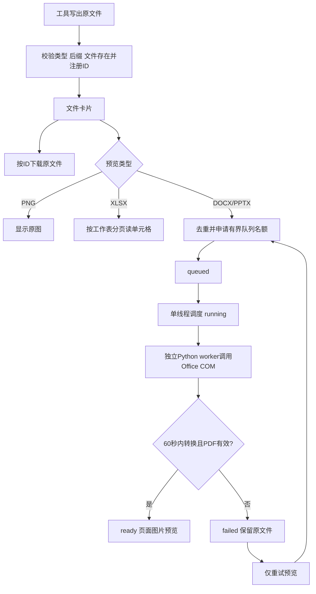

# 模块 09：文件注册、预览与进程隔离——生成成功之后，怎样可靠交付

阶段：第二阶段，源码深度拆解。日期：2026-10-09。

核心源码：[db/artifacts.py](C:/Users/wuhao/Documents/Enterprise_Agent/enterprise_ocr_service/db/artifacts.py:8)、[文件接口](C:/Users/wuhao/Documents/Enterprise_Agent/enterprise_ocr_service/web/artifact_api.py:10)、[预览调度](C:/Users/wuhao/Documents/Enterprise_Agent/enterprise_ocr_service/services/office_preview.py:18)、[转换worker](C:/Users/wuhao/Documents/Enterprise_Agent/enterprise_ocr_service/services/office_worker.py:14)、[进程身份](C:/Users/wuhao/Documents/Enterprise_Agent/enterprise_ocr_service/services/office_process.py:11)。

应用源码基准：`3095cf52376a99f2a53bbcbe2c09f3f04fe174fa`；本批开始文档提交：`38424b5`。本批只增加文档，未启动真实Word或PowerPoint，未终止任何用户Office进程。共享48项测试中，本模块对应7项，COM与进程操作使用替身，PDFium页面测试使用真实生成的单页PDF。

核心观点：**文件生成、注册、下载、预览是不同阶段。预览失败时保留原文件，重试预览不重新生成业务文件。**

## 模块作用

### 为什么存在

模型回答“文件在C盘某路径”不能让浏览器可靠下载，也不能证明文件真的存在。另一方面，DOCX/PPTX不能直接当PDF显示，Office转换可能慢、失败或卡住，还不能误用用户正在编辑的进程。

本模块登记实际文件，以不透明ID提供下载和预览接口；把慢转换放入有界后台队列，再用独立worker调用Office，尽量限制故障影响。

### 四个状态边界

| 阶段 | 当前证据 | 不能据此推导 |
| --- | --- | --- |
| 生成 | 文件已写到磁盘 | 已注册、数据库内容一致或页面已显示 |
| 注册 | generated_artifacts有记录并返回ID | 文件内容完整、已有访问权限控制 |
| 下载 | ID解析到仍存在的原文件 | 预览可用或Office可打开全部内容 |
| 预览 | 转换输出可被PDFium打开且非零页 | 排版、中文、图表语义全部正确 |



队列和去重集合在当前应用进程内，图中并不代表持久分布式任务系统。

## 核心代码流程

### 1. 注册的是可信工具产生的实际文件

[register](C:/Users/wuhao/Documents/Enterprise_Agent/enterprise_ocr_service/db/artifacts.py:8)：

```python
path = Path(path).resolve()
if kind not in ('docx','xlsx','pptx','png') or path.suffix.lstrip('.').lower()!=kind or not path.is_file():
    raise ValueError('生成文件不存在或类型不匹配')
ident = uuid4().hex
conn = get_connection()
try:
    with conn:
        conn.execute('INSERT INTO generated_artifacts(id,path,kind,snapshot_json,preview_status) VALUES(?,?,?,?,?)',
                     (ident,str(path),kind,json.dumps(snapshot or {},ensure_ascii=False),
                      'ready' if kind in ('xlsx','png') else 'pending'))
finally:
    conn.close()
return ident
```

逐行解释：

1. 把路径解析成绝对路径，减少后续工作目录差异。
2. 限制四种kind，要求后缀与kind相符、文件存在。
3. 生成UUID作为外部引用，不让浏览器直接传任意磁盘路径下载。
4. 保存路径、类型、销售快照JSON和初始预览状态。
5. PNG和XLSX可以直接读图或读数据，所以初始ready；DOCX/PPTX需要转换，初始pending。

这里没有解析DOCX/PPTX包来验证内容，也没有目录白名单或用户归属；它依赖内部可信工具提供路径。ID接口限制了客户端路径入口，不等于拥有完整文件安全或多租户权限体系。

### 2. ID读取与原文件丢失

[get](C:/Users/wuhao/Documents/Enterprise_Agent/enterprise_ocr_service/db/artifacts.py:24)参数化查ID，不存在抛LookupError；登记的path已不存在则抛FileNotFoundError。返回文件名并解析snapshot_json。

[find](C:/Users/wuhao/Documents/Enterprise_Agent/enterprise_ocr_service/web/artifact_api.py:10)把这两类问题映射成HTTP 404。info只返回id、kind、name、预览状态、错误及创建时间，download内部使用登记路径发送原文件。

因此不能通过把“../../.env”当ID直接下载任意路径；但有合法文件ID仍不代表调用者有权限。文件字节没有哈希绑定，登记后被替换也不会由当前get自动发现；预览缓存可能与被替换原文件不同。

### 3. 预览状态与接口语义

[preview接口](C:/Users/wuhao/Documents/Enterprise_Agent/enterprise_ocr_service/web/artifact_api.py:30)校验ID并调用enqueue；RuntimeError映射HTTP 429。成功返回ok表示请求被接纳或已无需处理，不代表转换已完成。

| 状态 | 含义 | 典型来源 |
| --- | --- | --- |
| pending | 等待用户请求Office预览 | DOCX/PPTX注册 |
| queued | 已在当前进程队列登记 | enqueue |
| running | 转换逻辑开始 | convert_artifact |
| ready | 对应类型可读；Office则PDF已验证 | 原生PNG/XLSX或转换成功 |
| failed | 转换失败、超时等 | 错误处理 |

XLSX的ready不是PDF ready，/preview.pdf仍要求存在preview_path。没有预览PDF时返回409，原文件下载仍可以成功。

状态存库，但转换任务本身没有持久队列。进程退出后，queued/running记录不会凭这些状态自动续跑；新进程也没有共享旧_active集合。

### 4. 单线程与8个名额分别限制什么

[enqueue](C:/Users/wuhao/Documents/Enterprise_Agent/enterprise_ocr_service/services/office_preview.py:58)关键段：

```python
with _lock:
    if ident in _active:
        return
    if not _slots.acquire(blocking=False):
        raise RuntimeError('预览队列已满，请稍后重试')
    _active.add(ident)
    artifacts.preview_state(ident,'queued')
```

- _active对同一个artifact去重，避免在当前进程重复排队。
- BoundedSemaphore(8)限制已接纳且未结束的任务数量，包含正在运行的任务，不是“8个排队加1个运行”。
- ThreadPoolExecutor(max_workers=1)一次执行一个转换，降低本机Office资源竞争。
- 名额申请是nonblocking，满了立即拒绝，不让请求一直等。
- 已ready且预览文件存在时直接返回；XLSX/PNG不进入Office队列。

任务run的finally删除_active并释放名额；submit失败也有释放分支。这个保护不覆盖所有位置：登记_active后写queued状态发生在提交保护之外，若该数据库写入抛异常，存在未清理占用的代码路径，需要补故障注入验证。本次没有实施修复或宣称已实机复现。

串行转换提高可控性，可能增加排队等待。容量8和60秒是当前配置，不是通过系统性吞吐/尾延迟选型得到的最优值。

### 5. 转换worker有独立超时边界

[convert_artifact](C:/Users/wuhao/Documents/Enterprise_Agent/enterprise_ocr_service/services/office_preview.py:18)将状态改为running，确定PDF与进程身份marker路径，删除本次目标上的旧文件，避免把旧PDF误当新结果。

```python
subprocess.run([sys.executable,'-m','services.office_worker',item['path'],str(target.resolve()),str(marker.resolve())],
    cwd=str(Path(__file__).resolve().parents[1]), timeout=PREVIEW_TIMEOUT_SECONDS, check=True,
    stdout=subprocess.DEVNULL, stderr=subprocess.DEVNULL,
    creationflags=subprocess.CREATE_NO_WINDOW if os.name=='nt' else 0)
```

- 参数列表启动当前Python的独立worker，没有拼接shell命令。
- cwd保证模块定位；Windows不打开可见命令窗口。
- 60秒限制这次子进程等待，check=True把非零退出视为错误。
- 超时会进入TimeoutExpired分支，并尝试根据marker清理本次登记的Office进程。

与Agent的daemon线程等待超时不同，这里有可被子进程超时机制终止的Python worker。但Office COM服务是另一个进程，不能因为worker结束就断言Office也已退出；所以还需要身份marker与清理逻辑。

### 6. worker如何避免借用现有PowerPoint

[office_worker.convert](C:/Users/wuhao/Documents/Enterprise_Agent/enterprise_ocr_service/services/office_worker.py:14)：

```python
prior=existing_office(name)
# PowerPoint is a MultiUse COM server; never borrow or quit a user's instance.
if name=='powerpnt.exe' and prior:
    raise RuntimeError('Close existing PowerPoint before requesting a local preview')
pythoncom.CoInitialize()
app = document = None
owned=False
```

先记录已有Office PID。PowerPoint存在时直接拒绝，不进入DispatchEx；这是当前明确的使用限制。不能说它能无干扰地借用任意已打开的PowerPoint。

Word使用DispatchEx('Word.Application')创建实例，再claim_process登记新增进程，设owned=True后才打开文件；只读打开，不加入最近文件，导出PDF。PowerPoint同样先claim再打开，SaveAs输出PDF。

finally尝试关闭文档、在owned时Quit应用，并结束COM线程初始化。这里是尽力清理，不是所有异常均有绝对保证；例如前面的Close抛异常时，后续清理语句并没有各自独立的保护层。

### 7. 进程清理为什么不只看PID

[register_owned](C:/Users/wuhao/Documents/Enterprise_Agent/enterprise_ocr_service/services/office_process.py:11)只接受不在prior中的PID，并核对名称，记录pid/name/create_time。先写临时marker再replace，减少读取半写JSON的机会。

[cleanup_owned](C:/Users/wuhao/Documents/Enterprise_Agent/enterprise_ocr_service/services/office_process.py:23)：

```python
identity=json.loads(Path(marker).read_text(encoding='utf-8'))
if identity['name'] not in ('winword.exe','powerpnt.exe'):
    return False
process=psutil.Process(identity['pid'])
if process.name().lower()!=identity['name'] or process.create_time()!=identity['created']:
    return False
process.kill()
process.wait(timeout=5)
return True
```

PID会被操作系统复用，所以仅按旧PID清理有可能命中后来不同的进程；加名称和创建时间核验，降低这种风险。没有marker、身份不符或读取失败就拒绝清理，而不是批量结束所有Office。

边界：claim_process用“当前PID集合减prior”且只新增一个来判断归属，没有直接绑定COM实例窗口到PID；同时启动Office的其他程序可能让归属判断失败。COM创建在登记前卡住时没有可信marker，不猜测清理。不能将这一策略描述为已经证明所有竞态下都绝不影响用户程序。

### 8. 有PDF文件还要再验证

worker返回成功后，父进程在PDF_LOCK内用PDFium打开目标PDF，要求至少一页，才写ready和preview_path。损坏、空文件或零页输出会转failed。

这验证基本可读性，不检查统计数字、中文溢出、表格截断或图表标签。那需要结构化内容核对和实际渲染查看。

转换失败时保存面向用户的错误，保留原文件，finally清理marker。失败PDF可能仍在预览目录，下次转换开始会删除；没有实现完整的失效文件清扫和保留策略。

### 9. 为什么用PDF页面图片显示

[open_pdf](C:/Users/wuhao/Documents/Enterprise_Agent/enterprise_ocr_service/web/artifact_api.py:49)检查ready和PDF存在，在进程内PDF_LOCK下打开并关闭文档。pages返回页数，page_image校验页码，再渲染为PNG。

```python
page=document[page_number]
try:
    bitmap=page.render(scale=scale)
    try:
        buffer=io.BytesIO()
        bitmap.to_pil().save(buffer,format='PNG')
        return Response(buffer.getvalue(),media_type='image/png',headers={'Cache-Control':'private, max-age=3600'})
    finally:
        bitmap.close()
finally:
    page.close()
```

文档、页面、bitmap各有关闭路径，控制原生资源生命周期。scale限定0.5到2，避免请求任意放大；这不是针对任意巨大PDF的完整内存预算。PDF_LOCK串行保护本进程PDFium操作，不是多进程分布式锁。

历史记录说明内嵌PDF空白后改为页面图片预览。页面图片更方便当前浏览器显示，但会失去原生PDF文本选择等能力；没有同环境前后延迟测量证明图片方案更快。

### 10. Excel是数据预览，前端缩放不是重新高清渲染

[sheets接口](C:/Users/wuhao/Documents/Enterprise_Agent/enterprise_ocr_service/web/artifact_api.py:89)用openpyxl的read_only、data_only读取工作表，按offset/limit返回单元格，默认100条、最大200条，finally关闭工作簿。data_only读取现有缓存值，不负责重新计算任意公式。

这是数据查看，不复刻Excel格式、图表或在线编辑。当前生成器主要写明确数值，不应据此推导复杂公式工作簿已全面支持。

[preview.js](C:/Users/wuhao/Documents/Enterprise_Agent/enterprise_ocr_service/web/static/preview.js:6)按类型选择PNG、表格或Office转换；Office请求后最多轮询130次，每轮间隔1秒，耗时还包括请求本身。关闭或切换使用epoch丢弃旧显示，不取消后台转换。

PDF页面缩放当前改img.style.width，未将缩放选择传给后端scale参数。因此它是显示尺寸变化，不代表每次都提高服务端渲染分辨率。sheetEpoch防止较慢的旧工作表请求覆盖当前选择。

## 设计思想

### 1. 原文件与衍生预览分开

先交付可下载原文件，预览按需生成；失败时可以重试转换而不再次执行销售查询和文件生成。它减少重复业务副作用的机会，但当前没有完整请求级幂等保证。

### 2. ID替代客户端路径

由服务器登记并解析路径，避免客户端直接指定下载文件。代价是要管理记录与磁盘的一致性。随机ID不是用户身份，还需归属鉴权、哈希或版本绑定。

### 3. 子进程承担可能卡住的桌面自动化

独立worker让慢COM与应用请求线程分离，并提供等待终止边界；已登记Office可进一步按身份核验清理。替代方案是远端转换服务或其他转换器，需要重新评估兼容性、隔离、排版、部署成本与耗时。

### 4. 有界背压比无上限排队更可控

一次一个转换、总名额8个、满额拒绝，限制本机负载和积压。它不一定最大化吞吐，也不保证在8×60秒内让每个请求可见，因为还有排队、启动、清理与网络开销。

### 5. 各阶段的失败语义单独呈现

原文件存在但预览失败，提示保留下载；文件已丢失则404；PDF未就绪则409；队列满则429。监控也应分别统计生成率、下载可用性、转换成功率与首次可见耗时。

## 如果重构

以下未实现，无可比新旧收益。

| 优先项 | 原因 | 应测指标与方法 |
| --- | --- | --- |
| 持久队列、任务租约和重启恢复 | 内存队列无法跨进程续接 | 排队/运行中重启，测丢任务率和恢复时间 |
| 入队全过程异常清理 | queued写库失败可能留下占用 | 在每个登记/提交点注入失败，检查名额恢复与重复接纳 |
| 文件归属、内容哈希与版本 | ID不是授权，缓存未绑定字节版本 | 不同用户交换ID、替换原文件，测拒绝率与预览一致性 |
| 转换器接口与资源预算 | 本机Office依赖且原生渲染占资源 | 多样长文档集测转换率、视觉缺陷、P50/P95和峰值内存 |
| 全路径清理与诊断日志 | Close异常、无marker或晚到进程有边界 | 按创建/登记/打开/导出/关闭注入故障，核对进程与文件残留 |
| 缓存与前端实际高清缩放 | 每页重新打开PDF，CSS放大不增加像素 | 测首次可见/翻页P95、渲染次数、缓存命中与清晰度 |

### 现有证据与本次验证

[本模块测试](C:/Users/wuhao/Documents/Enterprise_Agent/enterprise_ocr_service/tests/test_artifact_center.py:1)7项本次通过：注册ID与文件丢失、预览超时保留原件并可再次尝试、创建时间不同则不清理、已有PowerPoint拒绝、Word打开前登记且打开失败尝试Quit、下载/元数据/PDF状态接口、PDF页边界与scale限制。

COM应用、psutil进程及超时操作是替身；没有杀真实Office。PDF测试实际构造1页PDF并检查PNG输出，但不是DOCX/PPTX转换。本次未验证队列耗尽、重启恢复或长时间多进程运行。以上7项属于共享48项，不额外相加。

历史[产品验证](C:/Users/wuhao/Documents/Enterprise_Agent/enterprise_ocr_service/docs/evals/product-upgrade-2026-10-03.md:1)有单次本机Word转换18.738秒、2页，PPT转换30.245秒、5页及实际显示记录。它们不含浏览器首次绘制，没有可比旧版耗时，不能说预览速度提升，也不是任意文档兼容率。

本次没有重跑Office，也没有进行新的视觉排版验收；本批执行与评估边界见[模块10](C:/Users/wuhao/Documents/Enterprise_Agent/enterprise_ocr_service/notes/module_evaluation_metrics.md:1)。

## 面试考点

| 问题 | 必须说清 |
| --- | --- |
| 为什么不用模型返回路径直接下载？ | 需要真实文件与服务器登记ID，客户端不直接指定路径 |
| 队列8是什么意思？ | 已接纳未结束总数，执行线程只有1个 |
| 预览失败是否重新生成文件？ | 重试转换，原件保留，不自动重做业务生成 |
| 线程超时与子进程超时有什么区别？ | 前者通常只结束等待；后者有worker终止边界，Office仍要另处理 |
| 为什么PID不足以清理？ | 可能复用，还检查名称和创建时间 |
| ready是否证明内容正确？ | 只对应类型可读或PDF基本验证，内容/排版独立验收 |
| ID是否代表权限？ | 不代表，当前缺完整用户归属 |

## 高频追问

### 追问1：为什么不在请求里直接调用Word？

COM可能慢或卡住，会让请求长期等待。后台有界排队加子进程提供隔离与等待边界，同时让原文件先可下载。不能据此说整个系统没有阻塞或已经支持分布式扩展。

### 追问2：超时后kill所有WINWORD不就行了？

会影响用户正在编辑的文件。当前只尝试清理登记过且PID、名称、创建时间匹配的进程，无法确认归属就不猜测。代价是登记前卡住时可能无法自动清干净。

### 追问3：PowerPoint已打开为什么拒绝？

当前代码防止借用或退出用户实例，主动要求先关闭已有PowerPoint。这是本机桌面方案的约束，未来可用独立转换环境避免与用户工作竞争。

### 追问4：任务状态入库了，为什么不能重启恢复？

状态字段不是队列。还需持久任务、占用所有权、超时回收与重新调度，且重启后要判断旧worker和Office是否仍在执行。当前没有完整实现。

### 追问5：你怎么证明下载的是原来的文件？

当前记录路径并检查存在，没有内容哈希或不可变对象存储绑定。如果路径下文件被替换，接口可能发送新内容；需要版本与哈希契约才能强化这一保证。

### 追问6：预览可打开，为什么还要人工看？

可打开与至少一页不能发现表格截断、中文溢出、错误金额或空白内容。结构化内容核对和视觉验收衡量不同问题，不能只用转换退出码替代。

## 标准回答

### 30秒

“我把文件生成与预览分开。工具先写原文件并注册不透明ID，页面按ID下载；PNG直接显示，Excel按工作表读数据，Word和PPT按需进入有界预览队列。转换由独立worker调用本机Office，失败不删原文件，用户可以只重试预览。”

### 90秒，包含取舍

“预览调度一次执行一个转换，最多接纳8个未结束任务，同文件在本进程去重。转换worker有60秒等待期限，Office进程另用PID、名称和创建时间登记核验，避免按名称批量结束用户应用。已有PowerPoint时主动拒绝，不能确认所有权时不猜测清理。

“转换后不仅看退出码，还用PDFium验证可打开且非零页，页面再通过图片接口显示，相关原生对象有关闭路径。但ready不证明内容与排版正确；Excel也是数据预览，不是完整Office页面。

“当前仍是本机单进程方案：队列不持久、ID未绑定用户权限、Office和进程清理有异常边界。后续先做持久任务与全过程故障注入，再根据转换率、首次可见P95、资源残留和视觉质量选择转换器。”

最后衔接[模块10：评估测试与指标](C:/Users/wuhao/Documents/Enterprise_Agent/enterprise_ocr_service/notes/module_evaluation_metrics.md:1)，把本模块的“可下载、可转换、可显示、内容正确”分别评估。
