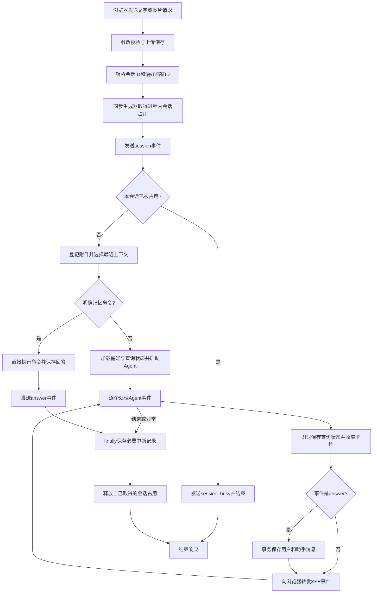

# 模块 06：聊天请求生命周期与会话历史——从一次请求到可继续的对话

阶段：第二阶段，源码深度拆解。日期：2026-10-08。

核心源码：[web/agent_chat.py](C:/Users/wuhao/Documents/Enterprise_Agent/enterprise_ocr_service/web/agent_chat.py:95)、[db/chat_memory.py](C:/Users/wuhao/Documents/Enterprise_Agent/enterprise_ocr_service/db/chat_memory.py:33)。上下游：[历史接口](C:/Users/wuhao/Documents/Enterprise_Agent/enterprise_ocr_service/web/product.py:13)、[网页交互](C:/Users/wuhao/Documents/Enterprise_Agent/enterprise_ocr_service/web/static/app.js:29)、[Agent入口](C:/Users/wuhao/Documents/Enterprise_Agent/enterprise_ocr_service/agent/agent.py:201)。本课只拆解请求与历史这一逻辑模块，偏好存储、文件中心留给后续课程。

应用源码基准：`3095cf52376a99f2a53bbcbe2c09f3f04fe174fa`；本次开始时文档提交：`df2359d`。没有修改业务代码，也没有真实调用DeepSeek或OCR服务。本次运行22项已有测试和7项临时数据库直接探针断言，具体证据与限制见下文。

面试核心：**对话持久化解决刷新后还能接着聊；执行恢复需要知道中断在哪一步、哪些副作用已经完成。这是两个不同的问题，当前主要实现前者。**

## 模块作用

### 为什么存在，解决什么问题

Agent循环负责“下一步调用什么工具”。聊天入口负责围绕循环管理一次用户请求：识别会话、取回上下文、控制同会话重入、传递进度、保存最终回答与卡片，并在结束时清理会话占用。

例如用户先问“统计2024年甲公司销售额”，刷新后再说“按月展示”。如果历史只在浏览器内存，刷新可能丢失年份和公司。当前做法把消息存入SQLite，浏览器保存session_id，再请求时由服务器取回近期历史。

这保证历史有机会到达Agent入口，不保证模型一定理解“按月展示”、正确选工具或生成正确图表。上下文送达、工具参数正确、答案正确要分别评估。

### 四种信息各自负责什么

| 信息 | 当前存储或传递方式 | 解决的问题 | 限制 |
| --- | --- | --- | --- |
| 近期消息 | chat_messages → 最近10条role/content | 当前会话的文字衔接 | 重要条件可能退出窗口；不按token预算 |
| 用户可见历史 | chat_messages含meta_json → 分页接口 | 查看旧消息、附件与结果卡片 | 不等于完整工具执行轨迹 |
| 查询状态 | chat_task_state → Agent系统提示 | 参考最近成功查询的部分条件 | 不是完整任务状态或checkpoint |
| 跨会话偏好 | profile_id → 明确保存的偏好 | 不同会话复用回答习惯 | 不是用户身份认证；本课只讲注入位置 |

数据库没有因为“短期记忆”这个名称就自动清理历史。短期指模型选取的上下文窗口，不是消息保存期限。

### 用户请求生命周期



图中“即时保存状态”“保存回答”“工具修改业务数据”不是一个大事务。执行中断时，它们可能已经完成到不同位置。

## 核心代码流程

### 1. 两种HTTP入口统一到一个请求处理函数

[ChatIn与文字入口](C:/Users/wuhao/Documents/Enterprise_Agent/enterprise_ocr_service/web/agent_chat.py:48)：

```python
class ChatIn(BaseModel):
    message: str = Field(default="", max_length=4000)
    history: list[dict] = Field(default_factory=list)
    session_id: str | None = None
    profile_id: str | None = None
```

- message最多4000字符；这只是当前输入的字符上限，不是完整上下文token上限。
- history是字典列表，没有在这里严格限定每条消息的role、content及长度。主Agent后续只转换user和assistant角色，但兼容入口仍值得收紧。
- session_id选择对话；profile_id选择跨会话偏好。二者用途不同。
- 文字入口把这些字段转交_event_response；上传入口先解析history字符串并复用ChatIn校验，再检查扩展名和非空文件、保存图片，最后进入同一函数。

上传路径见[agent_chat_upload](C:/Users/wuhao/Documents/Enterprise_Agent/enterprise_ocr_service/web/agent_chat.py:69)。图片按UUID文件名保存，真实文件名用于显示。这里没有完成图像内容校验、文件大小限制或内容去重；而且文件保存发生在会话忙碌判断之前。被拒绝的上传请求仍可能留下文件，不能用会话门禁推导上传资源完全受控。

### 2. 找到旧会话，或者由服务端创建新会话

[resolve_session](C:/Users/wuhao/Documents/Enterprise_Agent/enterprise_ocr_service/db/chat_memory.py:33)的关键分支：

```python
if requested_id:
    row = conn.execute(
        "SELECT id FROM chat_sessions WHERE id = ?", (requested_id,)
    ).fetchone()
    if row:
        return row["id"], True
session_id = uuid.uuid4().hex
with conn:
    conn.execute("INSERT INTO chat_sessions (id) VALUES (?)", (session_id,))
return session_id, False
```

逐行理解：

1. 客户端传了ID，先参数化查库，不直接认定它有效。
2. 查到才复用，并返回existed=True；后面以数据库历史为准。
3. 没传或查不到，都生成一个新UUID。不是把客户端任意指定的未知ID写入表。
4. with conn提交会话创建，最后返回existed=False。

这一步在生成器开始工作之前完成。因此可能产生没有消息的空会话；会话列表用EXISTS消息过滤，通常不会显示它。随机ID降低猜中的可能性，但不能替代登录及会话归属校验。当前不能宣传为生产级多租户隔离。

### 3. 同会话并发采用拒绝重入，而非排队

[gen内的会话门禁](C:/Users/wuhao/Documents/Enterprise_Agent/enterprise_ocr_service/web/agent_chat.py:105)：

```python
with _SESSION_LOCK:
    acquired = session_id not in _ACTIVE_SESSIONS
    if acquired:
        _ACTIVE_SESSIONS.add(session_id)
saved = False
started = False
cards = []
user_meta = {}
incomplete_answer = '处理已中断；已完成的单据和文件保留，可继续本对话。'
```

- Lock保护“查询是否占用”和“加入集合”这一组操作，防止两个线程都认为自己取得资格。
- 锁只短暂保护集合操作，没有把全体会话的整个Agent执行都锁住。不同会话可以进入各自执行路径，但实际吞吐仍受线程、模型和数据库限制。
- acquired记录这次请求是否拥有占用，防止被拒绝者在finally误释放另一个请求的占用。
- saved表示是否成功保存本轮消息；started在忙碌分支之后设为True，表示已允许进入处理路径，不表示工具已执行。
- cards收集ocr_review和artifact；user_meta记录本轮上传附件信息。

接着先发送session事件，再检查acquired。没取得占用的请求发送code=session_busy的error事件并返回，不调用Agent，不把竞争请求写成一轮聊天。

这是SSE应用层错误，通常HTTP状态已经是200，不能说聊天接口返回了HTTP 409。核对操作中的HTTP 409属于另一条接口路径。

门禁是模块全局set和线程锁，只覆盖同一个服务进程。多个worker各有集合，不能据此保证跨进程互斥；进程重启也不会保留这份占用状态。

### 4. 选择模型上下文：已有会话信服务端，新会话兼容客户端

[上下文选择](C:/Users/wuhao/Documents/Enterprise_Agent/enterprise_ocr_service/web/agent_chat.py:132)：

```python
context = chat_memory.load_messages(session_id, limit=10) if existed else history[-10:]
command = parse_memory_command(message) if image_path is None else None
```

第一行是重要的信任边界：已有会话读取服务端最近10条，忽略客户端提交的history；新会话允许用最后10条客户端历史启动，这是旧客户端兼容逻辑。当前网页主要发送session_id，没有每次回传整段聊天。

10条指10条消息。在常规一问一答且成对写入时，相当于约5轮历史；不是10轮，也不是固定token数。当前请求在Agent中单独追加，不能把它误算成已保存历史中的最后一条。

第二行：只有纯文字请求尝试识别明确记忆命令；带图请求进入正常Agent路径。命令分支直接处理、保存问答、返回answer，不需要模型决定是否记住。偏好模块下课展开。

[load_messages](C:/Users/wuhao/Documents/Enterprise_Agent/enterprise_ocr_service/db/chat_memory.py:61)：

```python
rows = conn.execute(
    "SELECT role, content FROM ("
    "SELECT id, role, content FROM chat_messages WHERE session_id = ? "
    "ORDER BY id DESC LIMIT ?) ORDER BY id",
    (session_id, limit),
).fetchall()
return [{"role": row["role"], "content": row["content"]} for row in rows]
```

内层按id倒序取最新N条，外层重新正序排列，避免把对话时间反着交给模型。只选择role和content，所以附件、卡片元数据不会直接随历史进入模型。默认limit为20，但主请求入口明确传10；不同调用点不能混为一谈。

上传轮次在历史里保存“[已上传图片: 文件名]”文字，附件另有登记；下一轮不会仅凭历史就把旧图片像素重新传给模型。

[run_agent_events](C:/Users/wuhao/Documents/Enterprise_Agent/enterprise_ocr_service/agent/agent.py:201)随后把偏好和查询状态加入系统提示，把history中的user/assistant转成模型消息，再单独追加当前问题，创建本次新的循环。不是取回旧循环对象继续执行。

### 5. 处理事件：状态及时落库、卡片收集、回答先存后发

[事件转发与保存](C:/Users/wuhao/Documents/Enterprise_Agent/enterprise_ocr_service/web/agent_chat.py:140)：

```python
preferences = preference_memory.list_preferences(profile_id)
for ev in run_agent_events(message, context, image_path,
                           preferences=preferences, task_state=task_state.load(session_id)):
    if ev.get('type') == 'task_state':
        task_state.save(session_id, ev['state'])
    if ev.get('type') in ('ocr_review', 'artifact'):
        cards.append(ev)
    if ev.get("type") == "answer":
        chat_memory.save_turn(session_id, user_content, ev["answer"], user_meta, {'cards':cards})
        saved = True
    yield f"data: {json.dumps(ev, ensure_ascii=False)}\n\n"
```

逐行解释：

1. 在本次请求开始执行时读取偏好；同一次循环内并没有持续监听偏好变化。
2. 将原始message、选好的历史、当前图片路径、偏好、查询状态传给Agent。
3. task_state事件即时保存，并不等待最后回答。这是局部状态持久化。
4. 卡片先放进本轮cards；完整卡片数据后续存入助手消息的meta_json。
5. 收到answer时调用save_turn，成功返回后才设saved=True。
6. 最后yield SSE。因此数据库保存先于浏览器收到最终answer。

实际后果：如果保存后网络断开，数据库已有回答，浏览器却可能没有显示它。恢复页面可以查询历史，但当前没有request_id去重或事件重放机制，直接重发同一请求可能再次执行工具。

tool_call和tool_result会转发给界面，当前聊天表没有逐个保存这些事件。模型本轮收到的ToolMessage，与数据库长期保存的user/assistant问答，是两套不同记录。

主路径把同步生成器交给StreamingResponse，生成器迭代由工作线程执行；模型和SQLite等待因此不直接占据ASGI事件循环。它们仍会占用工作资源，不能据此声称无限并发或端到端无阻塞。上传入口的文件写入等也不能笼统归为异步。

### 6. 一轮问答在数据库里如何保存

[save_turn](C:/Users/wuhao/Documents/Enterprise_Agent/enterprise_ocr_service/db/chat_memory.py:75)核心：

```python
with conn:
    conn.executemany(
        "INSERT INTO chat_messages (session_id, role, content, meta_json) VALUES (?, ?, ?, ?)",
        [(session_id, "user", user_content, json.dumps(user_meta or {}, ensure_ascii=False)),
         (session_id, "assistant", assistant_content, json.dumps(assistant_meta or {}, ensure_ascii=False))],
    )
    conn.execute(
        "UPDATE chat_sessions SET updated_at = datetime('now','localtime') WHERE id = ?",
        (session_id,),
    )
    backfill_titles(conn, session_id)
```

同一事务写入user/assistant两条消息、更新会话时间、补齐缺失标题。失败会回滚本次数据库事务，避免正常save_turn只写下一半问答。

这个原子性不覆盖工具之前对ocr_rows的修改、文件生成、附件登记或task_state更新，更不覆盖浏览器接收数据。不能说“一轮Agent任务全部成功或全部回滚”。

标题来自最早非空问题的空白规范化结果，最多36字符；图片专用轮次变成“识别单据 · 文件名”。backfill_titles只补空标题，保留手动命名；rename_session只改标题，不把重命名当成新聊天更新最近时间。这里不用模型生成标题，因此这条路径没有额外LLM调用；具体延迟收益未做配对测量。

### 7. 异常和关闭：哪些情况会保存历史

[异常与finally](C:/Users/wuhao/Documents/Enterprise_Agent/enterprise_ocr_service/web/agent_chat.py:151)：

```python
if acquired:
    try:
        if started and not saved and (cards or user_meta):
            chat_memory.save_turn(session_id, user_content, incomplete_answer, user_meta, {'cards':cards})
    finally:
        with _SESSION_LOCK:
            _ACTIVE_SESSIONS.discard(session_id)
```

先判断是否自己取得占用；只有允许处理、尚未保存且有卡片或附件元数据，才补写中断轮次。内层finally保证即使补写失败，也尝试释放自己拥有的会话占用。

| 情况 | 历史保存行为 | 面试应说明的边界 |
| --- | --- | --- |
| 正常answer | 保存完整问答及已收集卡片 | 先保存，再发送answer |
| 纯文本抛异常，没卡片或附件 | 不保存本轮问答 | 不是所有请求或错误都有审计记录 |
| 已有卡片或附件，再抛异常 | 保存问答、错误说明及相关元数据 | 卡片存在不等于对应业务结果经过正确性验证 |
| 生成器在有卡片后正常关闭 | finally可保存默认中断说明 | 依赖清理代码有机会运行 |
| 同会话竞争者被拒绝 | 不执行、不保存、不释放占用者资格 | 会话和profile解析已先发生 |
| 模型异常由Agent转成answer | 按answer保存 | “本次任务已停止”的文字不等于成功完成业务 |
| 进程被强制结束 | 不能保证运行finally | 已提交的数据可能保留，未完成部分不自动恢复 |

[响应关闭包装器](C:/Users/wuhao/Documents/Enterprise_Agent/enterprise_ocr_service/web/agent_chat.py:33)：

```python
async def __call__(self, scope, receive, send):
    try:
        await super().__call__(scope, receive, send)
    finally:
        with anyio.CancelScope(shield=True):
            await anyio.to_thread.run_sync(self._source_iterator.close)
```

- 正常结束或响应调用被取消时，finally尝试关闭源同步生成器，让它有机会执行自己的清理。
- shield保护这段异步清理不被外层取消立即打断；close放到工作线程执行。
- close不是向远端模型服务或正在运行的工具发取消命令。工具线程可能仍继续，清理也不能保证立即完成。
- 这不是服务重启checkpoint，不保证断连后精确从某一步续跑，也不证明副作用只发生一次。

### 8. 前端为什么用fetch读取SSE

[send函数](C:/Users/wuhao/Documents/Enterprise_Agent/enterprise_ocr_service/web/static/app.js:29)用fetch发送POST JSON或FormData，再取response.body.getReader()，逐块用TextDecoder解码，按空行分隔SSE帧，解析data字段的JSON。

一次网络read可能只有半个事件，也可能包含多个事件，不能把每个字节块当成一个完整JSON。buffer留下尚未完成的尾部；TextDecoder的stream模式处理跨块UTF-8字符。

这里不是原生EventSource客户端：请求需要POST正文，图片还需要multipart。当前主要传递工具进度、卡片和最终回答，不应仅凭text/event-stream就宣称每个模型token都实时显示。网页没有把llm_text作为逐token正文处理。

state.epoch解决“请求尚未结束，用户切换到另一会话”的显示竞态：旧请求继续读取，但过期epoch的事件不再更新当前消息区。它不是服务器任务取消；旧请求可能继续执行并写回原会话。busy集合约束本页面操作，服务端_ACTIVE_SESSIONS提供另一个进程内保护，两者都不能替代身份权限或工具幂等。

### 9. 恢复完整显示，不把完整历史全部送给模型

[message_page](C:/Users/wuhao/Documents/Enterprise_Agent/enterprise_ocr_service/db/chat_memory.py:121)核心：

```python
rows = conn.execute('SELECT * FROM chat_messages WHERE session_id=? AND (? IS NULL OR id<?) '
    'ORDER BY id DESC LIMIT ?', (session_id, before_id, before_id, limit+1)).fetchall()
more = len(rows)>limit
messages = [{**dict(row), 'meta': json.loads(row['meta_json'])} for row in reversed(rows[:limit])]
```

before_id是已显示最早消息的id，继续取比它更旧的消息；多查一条判断has_more，再把当前页恢复成时间正序。这种游标翻页避免新消息插入导致普通offset分页的位置漂移，但不是历史快照或跨请求一致性保证。

分页接口默认50条、最大100条，返回meta恢复附件和卡片。旧版GET会话接口调用load_messages默认20条；主模型入口明确取10条。这三个数字分别属于不同用途。

[renderStored与openSession](C:/Users/wuhao/Documents/Enterprise_Agent/enterprise_ocr_service/web/static/app.js:17)使用消息正文和meta重建展示；核对卡片还会按doc_id请求当前单据状态。卡片是资源入口，不是历史时刻的数据快照。会话搜索使用SQLite LIKE，不是向量记忆检索。

## 设计思想

### 1. 把对话交付与Agent决策分开

Agent用事件表达“我调用了什么、产生了什么、最终回答是什么”，HTTP层负责会话、持久化、SSE格式和清理。这样可以用替身Agent测试聊天生命周期，也能独立修改模型循环。

代价是层间事件协议目前主要靠字典约定，缺少统一类型与持久化事件序号；新增事件时要同步考虑显示、保存、恢复，而不只是加一个yield。

### 2. 服务端历史作为已有会话的依据

客户端主要保存ID，服务端管理历史，避免刷新丢失和每次重复上传完整对话。已有会话覆盖客户端history，也减少随意重写历史的入口。

但新会话仍允许兼容history，且ID不是身份。这个设计解决会话连续性，没有完成用户归属、跨设备登录和多租户数据权限。

### 3. 展示窗口与模型窗口分开

用户可能想翻几百条旧消息，模型却未必需要每条都读。分页恢复界面，最近10条参与推理，避免“看得越多，模型输入必然越长”的直接耦合。

设计目标是控制输入长度和历史加载量，但没有测得当前实现相对其他方案的真实token、成本、P50/P95延迟收益。固定条数仍会丢早期约束，少量长消息仍可能超限。

### 4. 短锁保护资格，不在长调用期间持有全局锁

检查占用和登记在一个短临界区完成，模型执行在外部。目的在于避免同会话历史交错，同时让不同会话有进入执行路径的机会。

替代方案是每会话队列：第二条请求等上一条结束再执行。当前采用拒绝，逻辑更直接，但用户需要重试。跨进程则需要持久租约或分布式协调，不能把内存锁直接升级描述为分布式锁。

### 5. 先保存结果，再交付客户端

优先让最终问答可恢复，减轻“显示成功但刷新后记录消失”的问题。网络交付和数据库提交仍存在间隙；无论先发还是先存，都不能仅靠调整顺序实现恰好一次执行。

另一种方案是保存request_id、运行状态和事件日志，让客户端重连读取已保存结果，同一请求重复提交只关联既有运行。代价是需要明确幂等、事件保留和资源生命周期。

### 6. 三种“恢复”必须区分

| 层次 | 当前能力 | 需要补充什么 |
| --- | --- | --- |
| 刷新恢复展示 | 查数据库问答、附件和卡片 | 可进一步完善错误记录与资源清理 |
| 继续表达新请求 | 读取近期历史、偏好及部分查询状态，创建新循环 | 关键任务约束选择、过期状态规则 |
| 中断执行恢复 | 没有完整步骤级恢复协议 | run/step状态、工具结果、副作用核验、幂等与快照绑定 |

“继续本对话”是当前用户提示，不是已经实现的步骤级恢复契约。

## 如果重构

以下均为建议，没有在本次实现，没有可比的新旧性能测量。

| 优先项 | 为什么做 | 应影响的质量、延迟或成本指标 | 如何验证 |
| --- | --- | --- | --- |
| 引入request_id/run_id和持久运行状态 | 区分超时、已完成但未交付、仍在执行 | 重复副作用率、结果恢复率、状态查询耗时 | 同一请求重复提交；在提交前后、发包前后注入故障 |
| 保存有序关键事件并支持查询或重放 | 客户端断线后定位结果，而非盲目再跑 | 事件缺失率、重复显示率、重连恢复耗时 | 断在不同事件位置，重连后检查顺序和去重 |
| token预算与结构化当前任务状态 | 保护早期目标与约束，控制完整输入 | 工具参数正确率、约束遵守率、实际token与P95 | 固定任务插入长对话，覆盖改条件、新任务和取消 |
| 持久会话租约与用户归属 | 多worker下同会话互斥和权限约束 | 重入率、越权读写拒绝率、租约恢复耗时 | 至少两个进程竞争同会话；不同用户交换ID |
| 明确取消策略及工具幂等 | 超时或断连后避免不清楚的晚到副作用 | 取消后新增副作用数、重复文件/写入率 | 慢工具在超时后完成，再查询状态和重试 |
| 更严格上传和history契约 | 限制异常载荷并管理未被使用的文件 | 非法请求拒绝率、峰值内存、孤儿文件数 | 超大文件、伪扩展名、超长history、忙碌上传 |
| 把失败运行记录与模型历史分开 | 既保留诊断，又不把每次失败塞进上下文 | 错误可追踪率、上下文污染率、定位时间 | 对照纯文本失败、附件失败、保存失败与进程退出 |

不是先把所有历史变向量就能解决恢复。向量检索负责按语义选内容，不负责证明哪次数据库修改已完成；也不自动提供步骤checkpoint、事务或幂等。

### 现有证据与本次验证

历史配对测量见[SQLite会话Memory第一版](C:/Users/wuhao/Documents/Enterprise_Agent/enterprise_ocr_service/docs/evals/sqlite-session-memory-2026-09-28.md:1)：3个固定离线场景中，必要上下文到达Agent边界从2/3到3/3，增加1个场景、33.3个百分点。新增通过的是刷新后只携带会话ID继续提问。Agent/OCR由替身代替，不能把它改写成真实回答正确率提升33.3个百分点，也不是当前版本重新测得的延迟或成本收益。

该历史文档描述当时显示最近20条、跨会话偏好尚未实现。当前界面已增加分页与显式偏好，应以本课阅读的当前代码为准，不能复制旧版本能力描述。

本次在临时SQLite和替身Agent边界运行：

```text
python -m pytest -q tests/test_agent_chat_api.py tests/test_session_titles.py tests/test_product_review.py::test_history_pagination_restores_cards_without_expanding_model_context
22 passed, 2 warnings in 18.28s
```

主要覆盖：历史刷新与会话分离、服务端覆盖客户端历史、同会话真实线程重叠时拒绝竞争请求、附件与卡片元数据恢复、错误保存分支、查询状态与显式偏好传递、标题回填及分页。运行有pytest配置和依赖弃用提示；另有requests依赖版本提示，未把环境提示视为业务测试失败。

测试源码：[聊天HTTP契约](C:/Users/wuhao/Documents/Enterprise_Agent/enterprise_ocr_service/tests/test_agent_chat_api.py:1)、[标题](C:/Users/wuhao/Documents/Enterprise_Agent/enterprise_ocr_service/tests/test_session_titles.py:1)、[分页](C:/Users/wuhao/Documents/Enterprise_Agent/enterprise_ocr_service/tests/test_product_review.py:105)。卡片测试使用合成doc_id与图片字节，不验证真实OCR识别或单据内容。

另在独立临时数据库直接迭代_event_response的源生成器，执行7项断言，7/7通过：有卡片后close保留中断轮次、close释放自身占用、answer帧返回前消息已提交、answer后close不重复写入、无卡片/附件时close不写轮次、竞争者close不释放占用者、首个session事件后close释放占用。该探针未新增仓库测试文件。

这些是生成器行为验证，没有模拟真实浏览器断网、ASGI取消竞争、强杀服务、多worker、真实模型长调用或远端取消；不能从7/7推导所有断连都可靠恢复。没有进行本次改动前后性能配对，因为本次只增加学习文档。

## 面试考点

| 问题 | 考察什么 | 回答必须落到的代码事实 |
| --- | --- | --- |
| 一条请求经过哪些阶段？ | 能否完整串起系统 | 校验→解析会话→门禁→上下文→循环→保存与SSE→清理 |
| 会话为什么能刷新后继续？ | 持久化与客户端职责 | localStorage存ID，SQLite存消息，服务端取历史 |
| 最近10条是10轮吗？ | 上下文边界 | 10条消息、常规约5轮；不等于token预算 |
| 同一会话连发两条会怎样？ | 并发和历史顺序 | 进程内占用集合拒绝第二条；SSE busy错误 |
| 为什么有SSE还需要保存消息？ | 交付与持久性 | SSE是当前连接的事件传输，不是数据库或重放日志 |
| 用户没收到回答，任务是否没完成？ | 故障时序 | 先存后发；工具还可能已提交副作用 |
| 断开能取消工具吗？ | 取消边界 | close清理生成器；底层调用不一定被取消 |
| 刷新恢复等于checkpoint吗？ | Agent系统理解 | 当前新建循环，缺少完整步骤与幂等恢复状态 |
| 会话ID是否等于用户权限？ | 数据隔离 | 随机ID不是身份；当前没有完整归属鉴权 |
| 有哪些量化证据？ | 指标真实性 | 历史2/3→3/3是上下文送达；本次22测试与7断言 |

## 高频追问

### 追问1：既然服务端存了所有聊天，为什么模型还会忘？

存储层有，不代表推理输入有。主路径只取最近10条role/content，早期信息可能退出；卡片和附件也不直接变成模型历史。查询状态仅保留部分成功查询条件，不能代替全部目标和约束。重构应评估关键事实送达、参数正确、答案正确及实际token。

### 追问2：为什么不直接加载全部历史？

历史无限增长会增加输入长度、延迟和费用，也可能超限。全部加载不保证更准确，旧条件还可能干扰新任务。应保留当前任务状态、选择相关历史，并用token预算约束整个输入；收益必须用相同任务集做配对验证。

### 追问3：HTTP 200却收到error，监控会不会误判？

会。流开始后错误通过事件表达，单看HTTP状态不足以衡量业务成功。需要统计运行终态、错误码与任务完成证据；尤其Agent可能把模型失败写成answer，answer事件也不能直接作为业务成功标志。

### 追问4：先保存后发送，为什么还会重复执行？

数据库提交不等于客户端收到；客户端超时后可能再次POST。当前没有幂等请求ID，新的请求会启动新循环。需要按request_id返回已有运行结果，并在有副作用的工具层做幂等或状态核验，只在HTTP层去重仍不足以保护所有入口。

### 追问5：事务不是已经保证安全了吗？

save_turn事务只保证这一次问答写入及会话更新的原子性。工具修改、文件输出、状态更新与网络发送是不同边界。工具可能成功，消息保存失败；恢复时要核查业务状态，而非假设所有东西一起回滚。

### 追问6：内存锁够不够？

对当前单进程内的同会话重入有保护，也有控制线程重叠的测试；多个worker不共享集合。进一步需要持久租约、过期与所有权规则，还要防止旧执行者租约过期后继续写入。不能只增加一个锁而忽略工具的副作用与幂等。

### 追问7：关闭页面后任务一定立即停吗？

不一定。前端切会话只是用epoch停止更新当前界面；响应关闭会尝试清理生成器，但正在执行的底层线程或远端请求可能继续。当前没有端到端取消契约，不能承诺立即停止所有工具。

### 追问8：已有历史不接受客户端修改，是否就安全了？

它避免已有会话的客户端history覆盖真实历史，但新会话仍有兼容history入口。更重要的是当前会话ID没有绑定认证用户，业务资源也需要独立授权，不能把历史优先级规则说成完整安全设计。

### 追问9：你怎么证明测试覆盖真实业务？

本次22项测试验证真实HTTP处理、SQLite保存和替身Agent输出之间的契约；7项探针验证直接close的保存与释放时序。它们不验证模型理解、OCR质量或真实网络断连。下一步应按断点位置设计真实连接中断、服务重启、双worker竞争与慢副作用测试。

## 标准回答

### 30秒：这个模块做什么

“我把聊天请求管理和Agent决策循环分开。聊天层负责识别会话、从SQLite读取最近10条消息、加载偏好与查询状态，再启动Agent并用SSE返回进度。收到最终回答时，先事务保存用户和助手消息，再发给浏览器。界面完整历史走分页，和模型窗口分开。当前能支持刷新后继续对话，但还不是步骤级中断恢复。”

### 90秒：设计理由与边界

“这个模块处理的是长任务与网页请求之间的衔接。浏览器只需要保存会话ID，已有会话以服务端历史为准，避免刷新丢失上下文；新会话保留客户端history兼容入口。模型读取最近10条消息，用户翻历史则走带元数据的分页接口，卡片和附件可以恢复显示。

“同会话执行使用进程内占用集合，短锁保护检查和登记，第二条请求被拒绝，避免历史和状态交错；它不能保护多个worker。SSE传递本次执行过程，回答先保存再发送。异常时，如果已经有卡片或附件，会保留中断记录，纯文本失败没有这些结果则不保存本轮。

“这些能力解决了对话连续性，但没有实现完整checkpoint。再次说继续会创建新的循环，旧工具可能已经完成或在超时后晚到。我会优先补充运行ID、持久终态、关键步骤记录和副作用幂等，再验证断网、重启和多进程场景，而不把历史恢复说成任务自动续跑。”

### 被问到测量结果

“历史上3个固定离线场景的必要上下文送达从2/3到3/3，增加1个场景，即33.3个百分点，新增的是刷新后携带ID继续提问。这是替身Agent边界结果，不是真实回答准确率。本次重新运行22项相关测试通过，并在临时库验证7项生成器时序断言，没有调用真实模型，没有测出新的延迟、token或成本改善。”

### 被问到个人贡献

按实际经历区分自己定义的需求、主导的设计与排错、AI协助实现的部分以及亲自验证的证据。能够讲清当前代码不自动证明每行由本人独立编写；对未执行的断网与重启验证，直接说明尚未完成。

下一模块：显式跨会话偏好——为什么“记住”采用确定性命令，如何按profile保存与注入，以及它与事实记忆、任务状态和权限的区别。本模块完成后还有4个逻辑模块。
