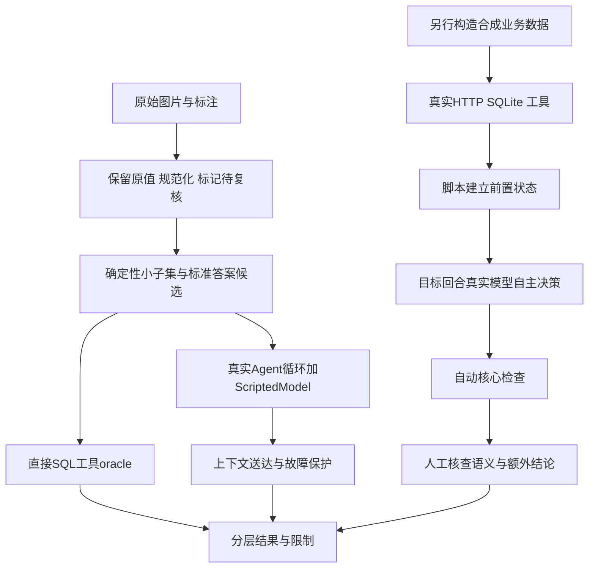

# 模块 10：评估、测试与指标——证明系统做对了什么，而不是只证明跑完了

阶段：第二阶段，源码深度拆解。日期：2026-10-09。

核心源码：[数据准备](C:/Users/wuhao/Documents/Enterprise_Agent/enterprise_ocr_service/evals/prepare_benchmark.py:27)、[离线基线](C:/Users/wuhao/Documents/Enterprise_Agent/enterprise_ocr_service/evals/task_benchmark.py:17)、[HTTP诊断评分](C:/Users/wuhao/Documents/Enterprise_Agent/enterprise_ocr_service/evals/context_preference_probe.py:14)、[可靠性缺口评分](C:/Users/wuhao/Documents/Enterprise_Agent/enterprise_ocr_service/evals/known_gap_benchmark.py:37)、[字段误标检查](C:/Users/wuhao/Documents/Enterprise_Agent/enterprise_ocr_service/evals/answer_checks.py:5)。

应用源码基准：`3095cf52376a99f2a53bbcbe2c09f3f04fe174fa`；本批开始文档提交：`38424b5`。本次只增加文档，没有改评分器、模型提示或业务逻辑。实际重跑48项相关测试、35场景离线基线及固定合成工具输出探针；结果见下文。没有调用真实DeepSeek、OCR或Office转换，也没有重新审定原始票据标注。

核心观点：**每个数字都要回答：测了谁、用什么数据、怎样判定、与谁比较、还有哪些未覆盖。**

## 模块作用

### 为什么存在

Agent能返回answer，不代表工具参数正确；金额正确，不代表字段标签正确；文件存在，不代表内容或排版正确；模型暂时没报错，不代表取消和故障恢复可靠。

本模块用数据准备、程序oracle、替身模型、故障注入、真实小样本诊断和人工复核，分别定位错误来自哪一层。它是测试与评估脚本集合，不是线上Agent的推理模块。

### 先分层，再报告指标

| 层次 | 适合的指标 | 当前证据例子 | 不能替代 |
| --- | --- | --- | --- |
| 数据与标注 | 缺失、无效字段、复核覆盖、样本分布 | 500图/4872行候选数据检查 | OCR识别正确率 |
| SQL工具 | 参数给定后，金额/行数与oracle一致 | 20/20 | 模型选工具或参数能力 |
| 上下文 | 所需信息实际到达模型边界 | 4/5 | 模型理解与遵循 |
| 程序保护 | 预算、停止、错误与超时行为 | 10/10 | 真实模型恢复策略或底层取消 |
| 模型任务 | 自主工具、参数、工具结果及最终回答 | known-gap固定诊断 | 总体未知分布正确率 |
| 文件交付 | 格式、数据一致、下载、渲染和视觉检查 | 同快照文件、预览测试 | 任意文档兼容与全内容正确 |
| 性能与成本 | 明确计时边界、分位数、实际usage与费用 | 若干单次耗时、代理token | 稳定P95、账单降本 |

项目的rag_query/rag_summarize是SQL工具，没有向量候选召回链路。不能为它套用未经实现和测量的Recall@k、embedding命中率等RAG指标。



右侧真实模型诊断是已有历史路径，本次没有执行。脚本前置动作不能计入目标模型成功率。

## 核心代码流程

### 1. 准备数据：规范化不等于替用户改标签

[normalize_row](C:/Users/wuhao/Documents/Enterprise_Agent/enterprise_ocr_service/evals/prepare_benchmark.py:27)保留raw和Excel行号，另构造values。数字统一格式、明确日期转ISO日期，空值保留None，非法值保留原文供核查。

```python
if value is None or value == '':
    values[field] = None
elif field in NUMERIC:
    try:
        values[field] = format(number(value).normalize(), 'f')
    except InvalidOperation:
        values[field] = str(value)
```

逐行理解：空不是零；合法数字只规范表达；不合法的数字不悄悄改成可用金额。这里的评估规范化与模块08导出number的容错策略不同，不能认为所有层都已统一缺失值语义。

[inspect_rows](C:/Users/wuhao/Documents/Enterprise_Agent/enterprise_ocr_service/evals/prepare_benchmark.py:54)标记空字段、非法数字/日期、数量乘单价与票面金额差异、重复行。差异只提示回看原图，不重算覆盖；重复行保留次数，不自动去重。

prepare同时以data_only=False和True读取Excel，分别保留公式与缓存值。公式缓存不独立等于金标准，也没有在这里重算公式。图片哈希相同可提示文件重复，但哈希不同不证明模板或视觉内容无相似性。

历史[数据检查报告](C:/Users/wuhao/Documents/Enterprise_Agent/enterprise_ocr_service/docs/evals/benchmark-data-validation-2026-09-30.md:1)：500张图、4872行；106条空税率、100条空金额；3149个公式金额；453行乘法不一致；962条同图重复行。提示可能重叠，不能相加当错误数。不是500张真实OCR评测，也不是标注已经逐图审核通过。

### 2. 小夹具怎样选出来

[prepare](C:/Users/wuhao/Documents/Enterprise_Agent/enterprise_ocr_service/evals/prepare_benchmark.py:93)先按图片名排序，再排除包含空/非法数字日期、公式或额外列等阻塞提示的整张单据，选前20张。历史及本次本地夹具是20图、204行。

这不是随机或分层抽样，代表性有限。隔离评估库把它们设成confirmed是前置条件，不是在生产库替用户确认，也不证明标签独立正确。

查询任务根据desc/item关键词构造，预期金额用Decimal从夹具标签计算并保留source_excel_rows。历史有独立内存SQL核对预期行数与金额；但两种计算都依赖同一标注，标注错误仍可能一致通过。

### 3. SQL oracle究竟验证什么

[matches_expected](C:/Users/wuhao/Documents/Enterprise_Agent/enterprise_ocr_service/evals/task_benchmark.py:17)：

```python
def matches_expected(result, expected):
    if expected['matched_rows'] == 0:
        return isinstance(result, str) and result in (
            '（没有符合条件的已确认数据）', '（未检索到匹配的已确认数据）')
    if not isinstance(result, dict):
        return False
    summary = result.get('summary', {})
    return (summary.get('total_rows') == expected['matched_rows']
            and Decimal(str(summary.get('total_sum', 'NaN'))) == Decimal(expected['total_sum']))
```

- 无匹配只接受明确空结果，不能把“工具执行出错”当正确无数据。
- 有数据要求真实结构化summary，同时比较行数和金额，防止只取部分明细但碰巧总额一致。
- Decimal比较数值，不要求显示文本完全一样。
- 当前缺少/错误类型等边界仍可继续完善，不能称为通用答案裁判。

基线脚本直接把expected中的keyword传给rag_summarize，再调用此oracle。模型没有选择参数，因此20/20是工具计算一致性，不是20次自主Agent问答全对。

### 4. 替身模型怎样隔离程序问题

[ScriptedModel](C:/Users/wuhao/Documents/Enterprise_Agent/enterprise_ocr_service/evals/task_benchmark.py:48)关键方法：

```python
def invoke(self, messages):
    from langchain_core.messages import AIMessage
    self.messages.append(list(messages))
    self.steps += 1
    calls = self.calls[self.steps - 1] if self.steps <= len(self.calls) else []
    return AIMessage(content='' if calls else '替身回答', tool_calls=calls)
```

保存真正传入的messages供检查，再按预设动作返回tool_calls或固定回答。实际run_agent_events、SQL和错误处理仍运行；假的是模型行为。

因此它适合回答“早期年份有没有进入输入”“反复失败能否停止”“总调用预算是否生效”，不适合回答“模型会不会选对工具”“偏好遵循率多高”。load_streaming_agent只绕过未使用的旧AgentExecutor导入，避免无关环境依赖，并没有把主循环换成假实现。

### 5. 35场景为什么必须分三个表

[离线main](C:/Users/wuhao/Documents/Enterprise_Agent/enterprise_ocr_service/evals/task_benchmark.py:144)构造并分类记录：20个SQL oracle、5个上下文送达、10个运行保护。最后按category分别统计pass/fail/not_run。

当前最近10条仍会截掉14条历史中最早的required-old-year=2024，因此context-old失败。查询状态提供另一份部分条件，并没有让原始历史重新进入窗口；不能偷偷把旧用例改成“有任意状态就算通过”。

运行保护故障包括重复失败、交替失败、总预算、模型/工具阻塞。阻塞探针在独立进程启动真实循环，用0.5秒调用配置和2秒观察门槛；需收到明确超时结果才通过。初始化失败另记not_run，不伪装为模型保护失败或成功。

参数故障与等待预算是程序刺激，真实模型遇错后的修正或备用策略还要另测。相同失败被2次停止，也不能单独证明“成功调用总预算8次”；本批相关单测另用不同参数的持续成功调用验证预算。

### 6. 真实诊断怎样避免把脚本动作当模型能力

[known_gap_benchmark.main](C:/Users/wuhao/Documents/Enterprise_Agent/enterprise_ocr_service/evals/known_gap_benchmark.py:68)在临时库建立合成数据；先用ScriptedModel和真实SQL/HTTP构造成功查询、无匹配、历史截断、零金额或新增记录等前置状态，再只让被评分的目标回合使用真实DeepSeek。

保存history_before、state_before、setup_events、目标完整events、checks和elapsed_ms，使他人能区分前置刺激与自主决策。每例重新建立条件，避免前一例状态污染后一例。

脚本支持repeats与措辞变体，不代表历史每份结果都启用了它们；已查的known-gap-final记录仍是6例、repeats=1、include_variants=false。测试脚本有参数，不等于完成了对应实验。

### 7. 为什么不能只检查回答里出现正确数字

[assess](C:/Users/wuhao/Documents/Enterprise_Agent/enterprise_ocr_service/evals/context_preference_probe.py:14)检查：非空answer且无error、实际查询工具、参数符合预期、调用集合、金额数字边界、固定前缀和不调用工具等。

[known-gap score](C:/Users/wuhao/Documents/Enterprise_Agent/enterprise_ocr_service/evals/known_gap_benchmark.py:37)在查询案例追加工具输出总额：

```python
totals = []
for event in events:
    if event['type'] == 'tool_result' and event.get('name') == 'rag_summarize':
        try:
            totals.append(Decimal(str(json.loads(event['result'])['summary']['total_sum'])))
        except (ValueError, KeyError, TypeError):
            pass
checks['tool_total'] = bool(totals) and all(v == Decimal(goal['total']) for v in totals)
```

必须确有工具结果且总额正确，不能凭缓存或猜中的150就通过“最新查询”。同时检查参数，防止查询2024但回答碰巧包含2025任务的900。

金额匹配排除11200误命中1200，并兼容千分位与小数；但数字可能出现在否定句、例子或错误字段中，仍需人工复核语义。

completed也只是核心检查：Agent可能把模型失败转成非空answer且没有error事件，这并不保证业务完成。交付验收还需工具与数据库/文件证据，不能拿completed当总体成功标签。

### 8. 无匹配与真实零金额要有正反对照

known-gap包含无匹配、已确认零金额、截断后含糊/明确请求、最新同条件/全量查询。

- 无匹配要求说明缺数据，不能断言实际销售额为零。
- 真正存在已确认零金额行时，允许报告0并要求新工具证据。
- 丢失年份时应澄清，不用旧成功条件猜测执行。
- 要求最新时必须重新查询，反映新增50后的150或350。

这些断言验证核心门槛，不覆盖所有额外解释。例如“总额0，可能因为折扣”里的原因并非工具事实。核心数字通过仍可能有无依据附加内容。

### 9. 评分器本身也需要测试

[评分器测试](C:/Users/wuhao/Documents/Enterprise_Agent/enterprise_ocr_service/tests/test_known_gap_benchmark.py:1)检查无匹配不能补零、否定零断言可通过、截断时询问条件、不接受无新工具或旧总额的“最新”回答。

[HTTP判定测试](C:/Users/wuhao/Documents/Enterprise_Agent/enterprise_ocr_service/tests/test_context_probe.py:1)验证错误年份、数字子串、错误前缀、多余工具和error事件。

[field_label_errors](C:/Users/wuhao/Documents/Enterprise_Agent/enterprise_ocr_service/evals/answer_checks.py:5)识别短句或表格单元中的amount/total_amount误标金额。它是已知错误检测器，不是完整语义判定；没有英文字段名的误标或复杂跨句解释可能漏检，未命中不等于答案全对。

### 10. 评分口径错误与产品修复要分开

[组合诊断记录](C:/Users/wuhao/Documents/Enterprise_Agent/enterprise_ocr_service/docs/evals/benchmark-composition-context-validation-2026-10-02.md:1)原自动5/6、人工6/6。全量查询未指定分组，模型按商品分组但全量summary正确；原评分强制group_by为空，属于评分过严。修正规则并不代表Agent变强，原始评分和事件应保留。

另一例见[OCR补充验证](C:/Users/wuhao/Documents/Enterprise_Agent/enterprise_ocr_service/docs/evals/2026-10-03-ocr-revalidation.md:1)：最初错误地把无已确认记录要求成金额0，后来改判。与此同时，未调用修改工具却声称修改是实际产品失败，不能用改评分掩盖。

## 设计思想

### 1. 用替身控制刺激，用真实模型衡量决策

替身保证可重复地触发故障，真实模型观察在明确任务中的自主行为。二者并列，而不是用离线通过数替代模型能力。相同真实循环能帮助定位程序层问题，但不能消除模型与数据分布的不确定性。

### 2. oracle尽量检查执行证据

参数、SQL输出、数据库变更、文件内容应与最终回答一起检查。只看回答文本容易把虚假完成、碰巧数字和缓存答案当成成功；只看工具也会漏掉字段标签和无依据解释。

### 3. 核心规则与人工语义复核互补

规则适合已知边界与回归，人工复核补充数字语义和额外结论。未来可用独立模型辅助裁判，但需校准裁判与人工一致性、偏差和成本，不能换个LLM就自动获得金标准。

### 4. 固定评估集用于回归，独立测试集用于泛化

known-gap这6例已经用于定位和修改提示，属于开发/回归集。当前小子集未随机分层，也没有完整独立调参/最终测试划分。应按单据分组并考虑模板相似性，防止同图不同行或近似模板跨集合泄漏。

### 5. 失败、补测与版本不可丢

首轮连接失败后补跑成功，不能合并为“首轮全部通过”；新增测试数量不等于质量提升；评分规则变化也必须保留版本，避免把不同分母或门槛拼成前后提升。

## 如果重构

以下未实施，无新旧收益结论。

| 优先项 | 原因 | 应测指标与方案 |
| --- | --- | --- |
| 统一case/result schema与版本 | 当前不同JSON用passed或status，不能用一个字段盲目合并 | 结果可解析率、漏计率；校验数据/模型/评分版本 |
| 独立划分及重复运行 | 固定调试集和单次诊断不足以代表泛化 | 任务成功率及不确定性、措辞敏感性；按单据/模板分组 |
| 细分任务成功与事实支持 | completed/数字规则覆盖不全 | 参数正确、证据支持、附加错误、文件完整分别评分 |
| 性能与usage统一埋点 | 单次耗时与代理token不是端到端成本证据 | HTTP总耗时、模型/工具/排队/预览分段P50/P95、实际token与费用 |
| 新故障矩阵 | 缺少跨worker、进程退出、晚到副作用等覆盖 | 数据残留、重复写入、恢复耗时；在持久化边界注入故障 |

对于Agent与固定workflow、Agent与普通表格界面的比较，目前没有配对评估。应固定同模型、数据、任务和环境，分别测成功率、人工步骤、用户完成时间、调用次数与费用，不能仅凭“灵活”声称更快、更省钱。

### 面试指标速查：哪些可以说

| 指标 | 基线→结果或本次结果 | 数据、变化与限制 |
| --- | --- | --- |
| SQL计算一致性 | 历史20/20→20/20；本次20/20 | 20图204行小夹具，参数直接给工具；不是自主Agent准确率 |
| 上下文送达 | 历史4/5→4/5；本次4/5 | 5个固定刺激，最早原文仍被截断；不能说Memory问题全部解决 |
| 运行保护 | 历史5/10→10/10；本次10/10 | 同套10个程序故障刺激，+5项、+50个百分点；不是整体任务成功率 |
| 连续同失败调用 | 历史8→2 | 少6次、75%；程序停止规则，不代表模型学会恢复 |
| 交替失败调用 | 历史8→4 | 少4次、50%；同样不是模型选择能力 |
| 工具输出代理token | 历史40组932→395 | 少537、57.62%；400条合成记录，cl100k_base，仅工具文本，省略展示组 |
| 当前同场景工具文本 | 本次40组469；明细970 | 字段说明后历史395→469，+74；不是DeepSeek实际计费或费用降低 |
| 已知缺口核心检查 | 历史5/6→5/6→6/6 | 同6例每版本每例一次；最终相对初始+1、16.7个百分点，不能推导总体提升 |
| 三格式路由 | 历史1个任务满足5个检查 | 同快照、正确范围和总额，12.765秒；无可比基线、无总体成功率 |
| OCR固定清晰合成样本 | 历史成功输出56/56字段；完整流程7/7步骤 | 样本与步骤是不同分母；保留连接失败与补测，不代表真实票据总体质量 |

运行保护证据：[同集复测](C:/Users/wuhao/Documents/Enterprise_Agent/enterprise_ocr_service/docs/evals/runtime-guards-2026-10-02.md:1)。工具文本证据：[原摘要](C:/Users/wuhao/Documents/Enterprise_Agent/enterprise_ocr_service/docs/evals/structured-tools-2026-09-30.md:1)、[字段说明代价](C:/Users/wuhao/Documents/Enterprise_Agent/enterprise_ocr_service/docs/evals/field-semantics-2026-10-02.md:1)。缺口修正证据：[金额与澄清规则](C:/Users/wuhao/Documents/Enterprise_Agent/enterprise_ocr_service/docs/evals/empty-result-semantics-2026-10-02.md:1)。

“932→395”也不是无损压缩：40组只展示20组，保留完整总额但省略分组细节。后续字段语义加入后当前为469；不能拿旧395描述当前输出，更不能把57.62%写成API成本降低。

### 本次实际执行

```text
python -m pytest -q tests/test_business_artifacts.py tests/test_office_exports.py tests/test_artifact_center.py tests/test_benchmark_dataset.py tests/test_task_benchmark.py tests/test_known_gap_benchmark.py tests/test_context_probe.py tests/test_field_semantics.py tests/test_runtime_guards.py
48 passed, 2 warnings in 41.58s
```

其中模块08的文件/快照测试12项，模块09测试7项，其余评估器、数据规范化与运行保护29项。它是相关子集，不是宣称全仓库只有48项或本次全套110项已跑。COM、模型和进程危险边界用替身，PDFium实际读写合成PDF，Office文件内容用对应库读取。

随后在新建临时输出目录执行：

```text
python evals/task_benchmark.py --dataset data/benchmark_v1 --output <临时目录>/tasks
mode=offline；fixture_images=20；fixture_rows=204；specification_cases=35
sql_oracle: pass=20, fail=0, not_run=0
context_delivery: pass=4, fail=1, not_run=0
runtime_guard: pass=10, fail=0, not_run=0

python evals/structured_tool_summary.py --output <临时目录>/summary.json
default_detail: 970 proxy_tokens，critical_fields_verified=true
large_detail: 970 proxy_tokens，critical_fields_verified=true
forty_groups: 469 proxy_tokens，critical_fields_verified=true
```

工具文本探针用400条已确认2024记录、40商品、总额4000，另有2025及待确认控制行；检查展示/省略数量、完整统计及范围排除。明细请求400行仍展示20行并披露省略380行。

离线基线使用现有本地夹具，但业务写入发生在隔离临时库；输出也在临时目录，未覆盖历史报告，未修改生产数据库。输出目录按临时流程清理，本次汇总与执行证据保留在本笔记及本次任务记录中，复现可使用新目录。

35场景中的一个context失败是已知需求缺口，本次没有修复，也不能隐藏。48项测试通过表示预期程序契约通过，不与需求基线存在失败矛盾。运行有pytest配置、Starlette弃用及requests依赖提示，未冒充无警告环境。

没有真实模型/OCR/Office转换、未重跑500图识别、未测账单、未做视觉验收、真实故障恢复或生产并发压测。本次是文档与当前程序证据核对，没有新增可归因的业务质量、延迟或成本改善。

## 面试考点

| 问题 | 必须说清 |
| --- | --- |
| 怎么评估Agent？ | 工具选择/参数、执行、证据支持、回答、交付与运行保护分层 |
| 20/20证明什么？ | 给定参数的SQL一致性，不是模型自主成功率 |
| 为什么单测过、benchmark仍失败？ | 一个检查实现契约，一个暴露尚未实现的需求门槛 |
| 如何避免评分器误判？ | 错误对照、数字边界、工具证据、人工语义复核与版本记录 |
| 代理token能写成本吗？ | 不能；只测特定编码的工具文本，不是API实际用量 |
| 6/6能写100%准确率吗？ | 只能写固定6例核心通过；已用于优化且单次运行 |
| 测试数据如何防泄漏？ | 按单据与模板划分，保留调试/最终集区别与数据版本 |

## 高频追问

### 追问1：你项目到底有多准？

不先报一个混合百分比。先说明任务与数据，再分别报告SQL oracle、模型任务核心检查、OCR字段、最终答案和文件交付。当前小样本没有代表性总体正确率。

### 追问2：为什么不能把20+4+10算34/35？

可以作为异质检查的通过计数，但没有统一任务抽样与权重，把它叫Agent准确率会混淆直接SQL、提示送达和程序故障。报告分层结果更能指导定位和改进。

### 追问3：规则裁判漏判怎么办？

保留全事件与答案，人工复核额外结论；给裁判本身设计正反案例，再报告覆盖范围。增加独立模型裁判也要与人工校准，不能把自动标签当绝对真值。

### 追问4：5/6变6/6不是提升吗？

是同一固定开发集核心通过数增加1项，但每例一次且用于优化，不能推出未知分布准确率或稳定因果收益。应扩大未用于调试的数据与措辞，重复运行，保留中间5/6暴露的新失败。

### 追问5：单次耗时下降为什么不能写更快？

模型服务、网络、缓存、输出长度和调用次数会波动。要固定任务与条件、多次或交错配对运行，明确计时边界，报告中位数与尾延迟；还要看是否通过截断降低了质量或信息覆盖。

### 追问6：为什么不把补测成功合并成全通过？

补测有选择性，不能抹掉首轮失败。分别报告首轮成功、重试次数、最终完成和总耗时，才能衡量用户实际体验及稳定性。

### 追问7：模型超时测试通过，不就证明工具取消了吗？

当前线程保护证明等待者按预算返回，底层可能继续。取消、晚到写入、重复执行和状态核验要专门注入故障，不与“及时返回错误”混为一谈。

### 追问8：500张图都验证过，为什么还不能说OCR准确？

验证的是文件格式、标注规范与候选数据质量，不是模型在500图上的输出。已有56/56字段只来自成功获得输出的清晰合成样本，与500图候选集不同。

### 追问9：你的指标是否受到AI协助影响？

工具可以协助编写代码与用例，但本人应能解释指标定义、复现流程、失败原因和证据限制。不要把预设正确动作说成模型自主决策，也不要把AI生成的解释当成亲自验证的结果。

## 标准回答

### 30秒

“我按层评估Agent。SQL工具直接与标准答案比较；上下文检查信息是否送达；故障用替身模型控制刺激，验证预算与停止；真实模型另用合成任务检查工具参数、结果和回答。文件还要检查快照、内容与预览。不同层的通过数不会合成一个整体准确率。”

### 90秒，包含证据

“当前离线基线有35个异质场景，20张图204行小夹具。给定参数的SQL oracle是20/20，上下文送达4/5，运行保护10/10。本次复跑仍是这个结果，早期原文被最近10条截掉的问题没有被掩盖。

“历史运行保护从5/10到10/10，是同套程序故障刺激的增加5项；模型是替身，所以不称为模型准确率提升。真实模型另有6个已知缺口任务，脚本只建立前置状态，评分回合才自主决策。最终核心6/6，但每例一次且用于优化，不是独立测试集或总体100%。

“我也区分成本证据：旧工具文本932到395是cl100k_base代理token，展示组被省略；加入字段说明后当前为469，没有实际API降费结论。后续优先建立独立单据/模板划分、重复运行、语义人工复核和实际usage/分段耗时记录。”

### 一句话解释项目最大的评估价值

“评估不只是得到一个分数，而是能区分数据问题、工具问题、模型决策问题、交付问题和评分器问题，并让每次改动有可复核的证据。”

第二阶段至此完成10个逻辑模块的源码拆解。可以按一条用户请求把它们串起来：聊天入口与记忆 → Agent循环 → 查询/修改/OCR → 快照与文件 → 预览交付，再用本模块解释每一段怎样验证、还有什么不能保证。
