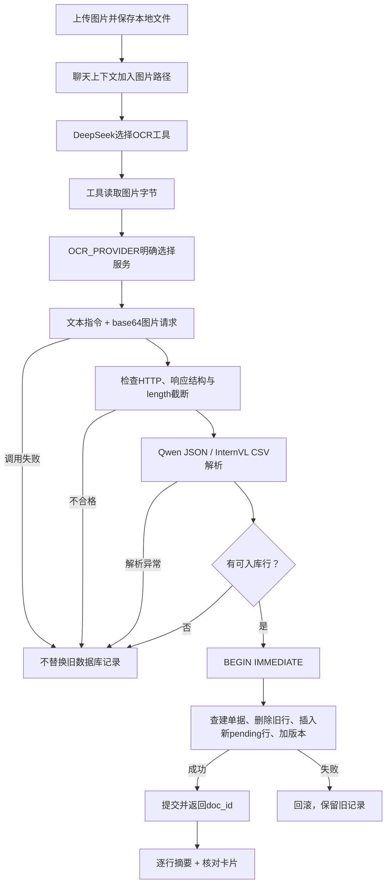

# 模块 05：OCR 接入、解析与原子入库——从图片到待确认明细

阶段：第二阶段，源码深度拆解。日期：2026-10-08。

本次只讲OCR到入库这一个逻辑模块，核心为 [tools/ocr_client.py](C:/Users/wuhao/Documents/Enterprise_Agent/enterprise_ocr_service/tools/ocr_client.py:43)、[聊天OCR工具](C:/Users/wuhao/Documents/Enterprise_Agent/enterprise_ocr_service/agent/agent.py:137) 与 [原子替换函数](C:/Users/wuhao/Documents/Enterprise_Agent/enterprise_ocr_service/db/crud.py:95)。上传与核对只说明上下游，不展开新模块。

应用源码基准：`3095cf52376a99f2a53bbcbe2c09f3f04fe174fa`；本次开始时文档提交：`4011956`。没有修改业务代码，没有真实调用DeepSeek、Qwen或InternVL，没有上传真实单据。重跑20项相关已有测试，并用直接解析器和临时数据库检查边界。

面试核心：**图片识别、格式校验和数据库替换是三个步骤。格式合法不证明识别正确；事务能保护失败时的旧数据，却不能判断新识别内容优于人工修正。**

## 模块作用

### 为什么存在

销售单据是图片，SQL需要结构化明细。OCR模块负责读图片、调用视觉服务、解析返回，再把统一八字段行写入SQLite，状态为pending，等待上一课的人工核对与明确确认。

业务链路是：图片 → OCR原始文本 → 结构化八字段 → 待确认明细 → 人工核对 → 已确认统计。OCR不会自动把数据变成confirmed。

### 统一什么，保留什么差异

当前支持两个由配置明确选择的路线：InternVL输出CSV，Qwen输出JSON。对上层都返回rows、raw、latency_ms，以及provider/model/usage等信息。

| 层次 | 应解决的问题 | 当前不能据此证明 |
| --- | --- | --- |
| 服务适配 | 地址、模型、密钥、请求与错误统一 | 两个服务质量相同或可自动互相替代 |
| 输出解析 | 原始文本转成八字段行 | 内容与原图一致、没有漏行或列错位 |
| 原子替换 | 新结果完整替换或失败保留旧记录 | 新结果一定比旧记录正确、重复上传已去重 |
| 待确认状态 | 草稿不直接参与统计 | 用户实际完成了准确核对 |

八字段是desc（顾客公司）、date（发注日）、from（源公司）、item（商品/项目）、amount（数量）、price（单价）、tax（税率）、sum（票面金额）。不根据数量乘单价重算票面金额，不自行猜测币种。

### 模型职责必须分开

DeepSeek负责聊天决策与工具选择，收到的是上传图片的路径文本；OCR工具读取实际图片字节，传给配置的视觉服务。不能说DeepSeek已经看到图片像素并完成识别。

工具返回逐行文本供DeepSeek解释，同时返回核对卡片供用户查看当前数据库明细。这些结果是识别草稿，不是原图已经核验的业务事实。

## 核心代码流程

### 1. 沿一次上传请求看整个过程



上传见 [web/agent_chat.py](C:/Users/wuhao/Documents/Enterprise_Agent/enterprise_ocr_service/web/agent_chat.py:69)：检查扩展名和非空内容，整份读取后以UUID文件名保存。这里未做完整图片解码、像素/文件大小限制或内容哈希去重，不能把扩展名检查称为真实图片内容验证。

OCR网络调用与解析在写事务之前完成，避免等待视觉服务时占用数据库写事务。收益是缩短锁占用的设计预期，没有前后锁等待测量。

### 2. 明确选择服务，不自动降级

依据：[recognize](C:/Users/wuhao/Documents/Enterprise_Agent/enterprise_ocr_service/tools/ocr_client.py:43)。

```python
provider = config.OCR_PROVIDER
if provider not in ('internvl', 'qwen'):
    raise OcrError('OCR_PROVIDER 仅支持 internvl 或 qwen')
cloud = provider == 'qwen'
key = config.QWEN_OCR_API_KEY if cloud else config.OCR_API_KEY
if cloud and not key:
    raise OcrError('QWEN_OCR_API_KEY 未配置')
base_url = config.QWEN_OCR_BASE_URL if cloud else config.OCR_BASE_URL
model = config.QWEN_OCR_MODEL if cloud else config.OCR_MODEL
url = base_url.rstrip("/") + "/chat/completions"
headers = {"Content-Type": "application/json"}
if key:
    headers["Authorization"] = f"Bearer {key}"
```

| 原行 | 行为 | 设计理由与边界 |
| --- | --- | --- |
| 45—47 | 只接受两个明确provider | 未配置支持的路线就报错，不猜备用服务 |
| 48—49 | 按路线选密钥 | 不把InternVL密钥当云端密钥复用 |
| 50—51 | Qwen缺密钥在网络前失败 | 配置错误不发请求 |
| 52—53 | 分开选base_url与model | 适配同类接口而非统一模型内部能力 |
| 54 | 构造聊天补全端点 | 去掉末尾斜杠，避免地址重复斜杠 |
| 55—57 | 设置JSON与可选Bearer头 | InternVL允许没有密钥的配置，云端则前面已要求密钥 |

没有自动fallback和客户端重试循环。服务失败时不自动换一家，是当前明确行为，不是缺少错误捕获。它便于知道数据发到哪里、用哪个模型，避免隐藏的费用与数据流变化；没有测量其稳定性优劣。

### 3. 图片、指令与生成参数

依据：[_data_url](C:/Users/wuhao/Documents/Enterprise_Agent/enterprise_ocr_service/tools/ocr_client.py:37)。

```python
def _data_url(image_bytes: bytes, ext: str) -> str:
    mime = {"png": "image/png", "jpg": "image/jpeg", "jpeg": "image/jpeg",
            "webp": "image/webp", "bmp": "image/bmp"}.get(ext.lower(), "image/png")
    return f"data:{mime};base64,{base64.b64encode(image_bytes).decode('ascii')}"
```

逐行解释：按扩展名选MIME → 不认识默认png → 编码字节 → 组成data URL。这不是图片压缩，也没有核实字节与MIME一致。

请求包含模型名、系统消息，以及同一个用户消息内的文本指令和image_url。视觉服务接收到图片内容，不需要访问用户电脑上的本地路径。

InternVL指令要求固定顺序CSV，并用中英语义解释desc/date/from等列。Qwen指令要求rows JSON、八键原文字符串、缺失空值、保留负号/折扣，不输出表头/总计，不猜模糊字段。

代码注释提到中英语义提示曾减少列含义歧义，但本次没有相同数据的完整提示配对评估，不能把注释当作准确率提升依据。

请求结构与生成参数原样为：

```python
payload = {
    "model": model,
    "messages": [
        {"role": "system", "content": SYSTEM},
        {
            "role": "user",
            "content": [
                {"type": "text", "text": instruction},
                {"type": "image_url", "image_url": {"url": _data_url(image_bytes, ext)}},
            ],
        },
    ],
    "temperature": 0 if cloud else config.OCR_TEMPERATURE,
    "max_tokens": config.QWEN_OCR_MAX_TOKENS if cloud else config.OCR_MAX_TOKENS,
    "top_p": config.OCR_TOP_P,
}
```

model与messages说明请求交给哪个视觉服务、发送什么内容；末尾三个参数控制生成配置。Qwen配置temperature=0不保证每次完全一致，也不等于正确率100%。max_tokens限制输出预算，不保证覆盖完整大表格；是否足够需测漏行与截断。

### 4. 调用、计时与响应资格

调用依据：[ocr_client.py:84](C:/Users/wuhao/Documents/Enterprise_Agent/enterprise_ocr_service/tools/ocr_client.py:84)。

```python
try:
    import time

    start = time.monotonic()
    resp = httpx.post(url, headers=headers, json=payload,
                      timeout=config.QWEN_OCR_TIMEOUT_SECONDS if cloud else config.OCR_TIMEOUT_SECONDS)
    latency = int((time.monotonic() - start) * 1000)
except httpx.HTTPError as e:
    raise OcrError(f"OCR 调用失败: {type(e).__name__}") from e
```

逐行含义：调用前取单调时间 → 使用对应路线timeout请求 → 返回后取时间差 → 网络异常统一为OcrError。异常只展示类型，不回显服务错误正文或密钥。

latency_ms测客户端HTTP调用区间，不包含前面的图片编码、后面的解析和入库，更不包含DeepSeek决策与网页交互；不能称纯模型推理时间或整个Agent端到端耗时。

响应检查：

```python
if resp.status_code != 200:
    raise OcrError(f"OCR 服务 HTTP {resp.status_code}（{provider}），请检查鉴权、模型权限或服务状态")
try:
    data = resp.json()
    choice = data['choices'][0]
    content = choice['message']['content']
    if not isinstance(content, str):
        raise TypeError('content must be text')
    if choice.get('finish_reason') == 'length':
        raise OcrError('OCR 输出被截断，本次结果不入库；请减少图片内容或增加输出预算')
except (ValueError, KeyError, IndexError, TypeError) as e:
    raise OcrError('OCR 响应结构异常，本次结果不入库') from e
```

| 原行 | 行为 | 为什么需要 |
| --- | --- | --- |
| 94—95 | HTTP非200拒绝 | 错误页面不是识别内容；不回显响应正文 |
| 97—99 | 读取首个choice的文本 | 响应存在不等于结构符合契约 |
| 100—101 | content必须字符串 | 后续解析器输入类型明确 |
| 102—103 | length截断直接拒绝 | 部分表格不应替换完整旧数据 |
| 104—105 | 结构/JSON异常统一错误 | 不进入正常解析与入库路径 |
| 107—109 | 按provider解析，返回元数据 | raw保留供当前调用诊断，usage按服务返回；没有自动累计账单 |

只针对length显式拒绝，不是严格要求所有finish_reason都为stop。也不能检测服务已经静默漏行但正常结束的情况。

### 5. Qwen JSON解析：严格结构，有限语义

依据：[_parse_json_rows](C:/Users/wuhao/Documents/Enterprise_Agent/enterprise_ocr_service/tools/ocr_client.py:112)。

```python
def _parse_json_rows(content: str) -> list[dict[str, str]]:
    keys = {'desc', 'date', 'from', 'item', 'amount', 'price', 'tax', 'sum'}
    text = content.strip()
    if text.startswith('```') and text.endswith('```'):
        text = '\n'.join(text.splitlines()[1:-1])
    try:
        payload = json.loads(text)
        rows = payload['rows']
        if not isinstance(rows, list):
            raise ValueError('rows must be a list')
        parsed = []
        for row in rows:
            if not isinstance(row, dict) or set(row) != keys:
                raise ValueError('exactly eight fields required')
            if any(value is not None and not isinstance(value, str) for value in row.values()):
                raise ValueError('fields must be strings or null')
            normalized = {key: (value or '').strip() for key, value in row.items()}
            if not any(normalized.values()):
                raise ValueError('empty row')
            parsed.append(normalized)
        return parsed
    except (ValueError, KeyError, TypeError) as exc:
        raise OcrError('OCR 八字段JSON校验失败，本次结果不入库') from exc
```

| 原行 | 关键逻辑 | 边界 |
| --- | --- | --- |
| 113 | 固定八个键 | 约束字段集合，不依赖JSON键顺序 |
| 114—116 | 去空白，容忍包裹的多行代码块 | 提示要求纯JSON，但解析器仍兼容部分格式偏差 |
| 118—121 | 解析并要求rows列表 | 根对象可以有其他键，没有要求整个根对象仅一个键 |
| 122—125 | 每行对象键集合必须恰好八键 | 缺键、多键都会拒绝，不猜列位置 |
| 126—127 | 值为字符串或null | 直接数值1也拒绝；字符串"1"接受 |
| 128 | null转空字符串并strip | 不把缺失改成数字0 |
| 129—130 | 全空行拒绝 | 至少有一个非空字段才算一行 |
| 131—132 | 全批校验完成才返回 | 一行不合法，整批报错，不悄悄返回前面的合法行 |
| 133—134 | 解析错误统一OcrError | 工具收到失败后不开始数据库替换 |

`rows=[]`本身可被解析器接受，返回空列表；外层工具拒绝零行入库。必须区分空结果和包含一个全空对象，后者解析器直接拒绝。

本次直接检查：null会变空值；数值类型字段、全空行、一条合法一条缺键的混合批次均拒绝；八键齐全但sum="abc"则接受。**严格八字段不等于金额、日期、行对齐和原图内容都正确。**

OCR入库不经过上一课的review.validate_fields；即使经过该函数，也只能补部分语义检查，仍不证明识别值与原图一致。

### 6. InternVL CSV解析：容错容易变成误接收

依据：[_parse_csv_rows](C:/Users/wuhao/Documents/Enterprise_Agent/enterprise_ocr_service/tools/ocr_client.py:137)。省略说明与注释，关键执行逻辑如下。

```python
rows: list[dict[str, str]] = []
text = (content or "").strip()
if not text:
    return rows
reader = csv.reader(io.StringIO(text))
keys = ["desc", "date", "from", "item", "amount", "price", "tax", "sum"]
for line in reader:
    if not line or not any(c.strip() for c in line):
        continue
    if line[0].lstrip().startswith("#"):
        continue
    cells = [c.strip() for c in line]
    joined = "".join(cells).lower()
    if not joined or any(h in joined for h in _HEADER_HINTS) and len(cells) < 8:
        continue
    row = {keys[i]: (cells[i] if i < len(cells) else "") for i in range(len(keys))}
    if any(row.values()):
        rows.append(row)
return rows
```

逐行逻辑：空文本返回空行集 → 标准CSV读取 → 跳空行与#开头行 → 去字段空白 → 对不足八列且命中提示词的疑似表头跳过 → 按前八列位置映射 → 短行补空 → 非空行加入。

用csv.reader有助于正确处理带引号字段内的逗号，不能用简单split(',')替代。但它解决CSV语法，不解决列语义。

本次直接解析器检查结果：

| 合成输入 | 当前行为 | 为什么值得面试讲 |
| --- | --- | --- |
| 两列“甲,2024-01-01” | 接受，后六字段补空 | 不是严格八列输入校验 |
| 九列，最后一列EXTRA | 接受前八列，忽略第九列 | 多列或列偏移可能静默丢信息 |
| 八列英文表头desc,date,...,sum | 当成一条数据行 | 表头提示只在不足八列时起过滤作用 |
| 普通文本service unavailable | 作为desc，其余补空 | 一段非CSV业务内容可能形成非零行结果 |
| 顾客字段带正确CSV引号内逗号 | 顾客文本完整保留 | 标准CSV语法处理有效 |

这些是当前解析器的确定性边界，不是真实InternVL推理错误率，也没有在生产库写这些样例。短行、表头和说明的宽松处理可能误接收，不能因为函数注释写“容错表头”就声称可靠过滤所有表头。

### 7. 工具何时入库、何时返回失败

主聊天工具依据：[agent/agent.py:137](C:/Users/wuhao/Documents/Enterprise_Agent/enterprise_ocr_service/agent/agent.py:137)。

```python
p = Path(image_path)
if not p.is_file():
    return f"错误: 图片不存在: {image_path}"
ext = p.suffix.lstrip(".").lower() or "png"
data = p.read_bytes()
try:
    result = recognize(data, ext)
except Exception as e:  # noqa: BLE001
    return f"识别失败: {e}"
rows = result["rows"]
if not rows:
    return f"识别到 0 行。原始返回: {result['raw'][:200]}"
file_name = p.name
doc_id = crud.replace_recognized_rows(file_name, rows)
```

逐行解释：检查路径存在 → 推断扩展名 → 读取图片 → 调OCR并捕获该调用异常 → 取rows → 零行停止 → 用保存文件名标识单据 → 执行原子替换。

宽泛except只包围recognize，不包括前面的read_bytes和后面的数据库写入。后者还会由主循环工具执行边界处理，不能说这个函数自己吞掉所有异常。

兼容 [tools/ocr_tool.py](C:/Users/wuhao/Documents/Enterprise_Agent/enterprise_ocr_service/tools/ocr_tool.py:23) 只在recognize调用处捕获OcrError，直接HTTP [web/main.py](C:/Users/wuhao/Documents/Enterprise_Agent/enterprise_ocr_service/web/main.py:99) 也映射OcrError为422。三个入口共用客户端与原子替换，不代表所有错误呈现相同。

成功后聊天工具逐行生成字段摘要，返回ToolOutcome和ocr_review卡片。卡片只携带doc_id，前端再读取当前单据；不是把冻结的原始识别快照嵌进卡片。

### 8. 原子替换：最重要的可靠性代码

依据：[replace_recognized_rows](C:/Users/wuhao/Documents/Enterprise_Agent/enterprise_ocr_service/db/crud.py:95)。

```python
def replace_recognized_rows(file_name: str, rows: list[dict[str, Any]]) -> int:
    """Create/find document and replace its rows atomically; failure retains old rows."""
    if not rows:
        raise ValueError('Cannot replace existing rows with an empty OCR result')
    conn = get_connection()
    try:
        conn.execute('BEGIN IMMEDIATE')
        conn.execute('INSERT OR IGNORE INTO documents(file_name) VALUES(?)', (file_name,))
        doc_id = int(conn.execute('SELECT id FROM documents WHERE file_name=?',
                                  (file_name,)).fetchone()['id'])
        conn.execute('DELETE FROM ocr_rows WHERE doc_id=?', (doc_id,))
        _insert_rows(conn, doc_id, rows)
        conn.execute('UPDATE documents SET version=version+1 WHERE id=?', (doc_id,))
        conn.commit()
        return doc_id
    except Exception:
        conn.rollback()
        raise
    finally:
        conn.close()
```

| 原行 | 行为 | 保护什么 |
| --- | --- | --- |
| 97—98 | 再次拒绝空rows | 即使绕过工具直接调用，也不能用零行替换旧记录 |
| 99—101 | 开连接与写事务 | 后续查建、删除、插入、版本更新同一提交边界 |
| 102 | 按唯一文件名尝试创建单据 | 已有同名则保留doc_id，不建第二份同名文档 |
| 103—104 | 获取对应doc_id | 替换范围明确为这个单据 |
| 105 | 删除旧行，但尚未提交 | 后面失败时删除也能撤回 |
| 106 | 插入全部新行 | _insert_rows固定写pending，不沿用旧确认 |
| 107 | 文档version加1 | 旧核对页面会过期；首次主路径写入也会从默认0增加 |
| 108—109 | 全部完成才commit并返回 | 成功结果不先于提交 |
| 110—112 | 任意该事务异常rollback并向上抛 | 插入第一行后第二行失败，旧行仍能恢复 |
| 113—114 | 关闭连接 | 清理资源，不把错误转换成成功 |

_insert_rows按固定字段顺序与占位符插入，初始seq从1排列；它不再次验证OCR数值语义。成功替换会删除旧行再建新行，不能假设原row_id继续有效。

事务防的是“删完旧行却只插了一部分”。它不保存完整修订历史，成功替换会丢弃原单据的旧明细内容，包含原先人工修正；要恢复旧内容需另有版本快照，而当前version只是计数。

### 9. 区分三类失败与一种成功

| 情况 | 是否执行替换事务 | 数据库结果 |
| --- | --- | --- |
| HTTP超时、401/429/503、响应结构错误、截断或JSON校验失败 | 不进入 | 旧记录保留 |
| 正常解析但rows为空 | 工具停止，数据层也拒绝空输入 | 旧记录保留 |
| 删除后、插入中途数据库失败 | 进入后rollback | 旧记录恢复，不留部分新行 |
| 非空解析成功且数据库提交成功 | 完整替换 | 全部新行为pending，旧确认不继承 |

当前失败注入测试明确检查旧confirmed行与元数据保留。数据库失败使用触发器令第二条新行插入失败，覆盖真实删除后、部分插入后的回滚，而非仅让识别函数抛异常。

### 10. 文件身份、超时和输出的实际边界

**同名与同内容不同。** 聊天上传保存为UUID名，工具用p.name当数据库file_name；相同图片再次上传通常是新文件名，不能因此识别成同一单据。直接OCR HTTP则优先使用原始上传文件名，同名不同图片也可能定位同一单据。sha256列存在，但这条主路径没有内容去重。

**数据库原子不覆盖上传文件。** 图片先保存，OCR失败后可能仍留在磁盘；外部OCR调用、图片文件与SQLite不是一个全局事务，未实现统一清理或跨服务回滚。

**OCR结果可能覆盖期间的新人工修改。** 写事务只保护开始替换到提交的区间；函数没有expected_version，不能发现网络识别期间用户已经修正了旧单据。这是代码边界推断，本次未做并发复现。

**两层等待期限不完全统一。** 客户端按provider选择对应timeout；主Agent [外层等待](C:/Users/wuhao/Documents/Enterprise_Agent/enterprise_ocr_service/agent/agent.py:314) 对OCR工具使用config.OCR_TIMEOUT_SECONDS+5，没有按Qwen配置重新选择。两者分别影响网络等待和调用者等待，不能混成一个严格端到端预算；外层超时也不取消底层线程。

**OCR摘要没有20行上限。** 工具将每行拼进返回文本，完整文本会进入ToolMessage；网页日志截2000字符不能限制模型实际输入。大表格还需要工具输出与上下文预算。

## 设计思想

### 1. 把服务差异限制在适配层

上层拿统一rows，避免数据库与核对界面分别理解CSV和JSON。但统一输出对象不等于统一质量门槛：两条解析器当前宽严不同，需要分别记录和测试。

这样可独立测试HTTP响应和解析，不必每次真的调用视觉模型。代价是mock只检验契约和控制流，不检验识别内容。

### 2. 保留原文，减少主动改写

票面金额可能有折扣，数量和单价不一致不能自动纠正。字段缺失使用空字符串，不默认补零；负号和原语言保留。它让人工核对有机会看出原始内容与异常，而不是提前把模型猜测写成事实。

提示表达意图，解析器不会自动验证“保留原文”。真实原图一致性仍需标注对照。

### 3. 格式、语义与统计资格分开

格式检查问“能否解析成行”，语义检查问“字段值是否合理且与原图一致”，pending/confirmed问“是否取得统计资格”。三者都重要。

例如sum="abc"可以满足JSON字符串结构，但不满足金额语义；表头被CSV接收也会形成非空行。人工确认机制不能替代自动输入校验，也不能据此证明用户真的核对无误。

### 4. 先取完整结果，再替换旧记录

如果调用OCR前先删旧行，网络失败会破坏已有数据。如果删除与插入各自提交，插入失败仍丢旧行。当前识别/解析在前，删除/插入同事务在后，分别解决两种失败。

它保护数据完整性，不提升视觉模型识别能力。不能把事务修复写成OCR准确率提升。

### 5. 成功重识别不继承人工确认

新结果来自重新推理，哪怕同一张图也可能变化，不能继承对旧内容的确认。全部新行pending，并更新文档版本，使上游旧核对视图失效。

代价是成功重识别覆盖已有修正。更保守的方案是先保存候选版本并对比，再让用户接受；当前未实现。

### 6. 为什么不静默重试或换服务

明确路线便于控制数据流、费用和结果来源。网络失败时自动重试可能增加调用次数；工具超时后底层仍可能入库，自动重试还涉及业务幂等。

这不是说任何重试都不合理。若要实现，应分清只读识别请求、结果持久化阶段和未知执行状态，建立可查询操作ID，再测成功率、时延和用量。

### 7. 历史测量能支持什么

依据：[2026-10-03 OCR补充验证](C:/Users/wuhao/Documents/Enterprise_Agent/enterprise_ocr_service/docs/evals/2026-10-03-ocr-revalidation.md)，本次未重跑真实服务。

| 测量 | 历史结果 | 准确解释 |
| --- | --- | --- |
| 三类清晰合成图片首次识别 | 2/3成功，普通明细连接失败；之后单独补测1/1成功 | 保留首次失败，不能合并声称首轮3/3 |
| 成功获得输出的三个固定样本 | 共7行，56/56字段匹配 | 包含补测，只有清晰合成表格；不是真实单据总体准确率 |
| 单次实际上传、识别、核对、统计、绘图和Word流程 | 修复后7/7步骤通过 | 该流程可跑通，不等于OCR或所有文件交付准确率100% |
| 9种服务失败注入 | 9/9旧记录保留、单次客户端调用、无测试密钥回显 | mock网络故障的控制流，不是真实服务可用率 |
| 重识别中途插入失败 | 修复前旧记录丢失，修复后回滚保留 | 同一类注入检查的数据完整性改善，不是识别质量变化 |
| 字段质量与前批对比 | 成功输出仍56/56 | 没有OCR准确率提升的证据 |

历史成功直接识别样本usage合计输入2415、输出574 tokens，只覆盖那三个样本，不包括完整Agent流程与DeepSeek调用；未测实际账单。客户端单样本2577ms也不能代表稳定延迟或P95。

原候选数据有500张图片、4872行，但准备数据不等于已经跑完独立OCR评测。旧注释中的“约80%准确率”没有在当前讲解中可复核的代表性配套指标，不用于简历或面试定量结论。

## 如果重构

以下是建议，没有实施；没有同条件前后质量、时延或费用结果时不承诺提升。

### 1. 先统一两条解析路径的资格契约

两种输出都转统一schema，再验证字段集合、列数、空行与数值/日期格式；明确是否接受补列和如何报告异常。CSV完整表头、额外列、普通解释文本不能仅靠宽松补空悄悄当业务行。

保留raw与拒绝原因，不自动截掉无法解释的列，也不靠删除任何含表头词的行来冒险过滤正常明细。测误接收率、合法输出拒绝率、列错位与字段缺失；本次只核验少量构造边界，不是完整评估集。

### 2. 让重识别产生候选修订，而非立即覆盖

记录识别开始时doc_id与expected_version，结果返回后检查期间是否有修改；可先保存候选行与字段差异，再由用户选择替换。

保留当前已确认内容直到候选接受，确认绑定候选版本。别在调用视觉服务期间长期持有数据库写事务。测人工修正被意外覆盖率、冲突识别与用户接受成本；当前无配对数据。

### 3. 区分内容去重、重试幂等与文件名

上传文件名只是存储标识。内容哈希可识别完全相同字节，但不能证明视觉等价；相同图片是否重新识别还取决于模型/提示版本和用户意图。

为操作设置ID、状态与结果，区分未开始、识别完成、已提交和失败；超时后先查询状态。测重复文档、重复入库与未知执行后的恢复，不把sha256一列当作已实现幂等。

### 4. 统一超时与重试策略

客户端与主循环从同一provider预算配置构造等待规则，并明确总期限、阶段期限、并发槽位和迟到完成处理。只在确定不会重复产生业务副作用的条件下重试。

按超时、限流、认证错误、截断分别定义行为，不盲目增加max_tokens或自动换服务。固定失败任务测终止时间、额外调用、迟到写入和真实费用，当前没有策略前后比较。

### 5. 建立可追溯识别记录与输出预算

记录图片哈希、provider/model、提示版本、原始输出、解析状态、usage与入库版本；当前recognize返回元数据，但包装工具未把它们完整持久化为识别审计记录。

模型端只返回必要摘要和异常说明，完整明细供核对表读取；保留总行数、来源与不确定信息。测实际模型输入token、关键事实送达和漏处理风险，不能把网页2000字符截断当上下文优化。

### 6. 用代表性数据评估识别，而不是仅统计通过数

固定独立核查的测试集，覆盖语言、倾斜、模糊、表格密度、折扣/零/负金额、空字段和大表格。先定义行匹配，再分别计算字段精确匹配、漏行/多行、金额字段误差与整单完成率。

网络成功率与识别正确率分开；补测保留原失败，不只统计成功响应。保持图片、模型、提示与预算一致，另测调用时延分布和usage；不能将56/56成功样本字段或7/7步骤外推为总体准确率。

## 面试考点

| 可能被问什么 | 面试官关注什么 | 要讲清的事实 |
| --- | --- | --- |
| 谁真正看到图片？ | 决策模型与视觉模型分工 | DeepSeek读路径文本，工具把像素发给OCR服务 |
| 两条OCR路线如何统一？ | 服务适配与契约 | 明确配置、不同格式解析、统一八字段rows |
| 为何不能只检查HTTP200？ | 生成输出可靠性 | 响应结构、截断、字段类型、空结果还需检查 |
| JSON八键是否保证正确？ | 结构与语义区别 | 不查原图一致性，金额abc仍可能通过字符串检查 |
| CSV容错有什么风险？ | 误接收与信息损失 | 短行补空、多列忽略、八列表头可能混入 |
| 为什么拒绝length结果？ | 数据完整性 | 部分结果不应覆盖完整旧记录，但正常stop仍可能漏行 |
| 为什么先识别再开事务？ | 锁占用与故障边界 | 网络失败不触碰旧行，不长期占写事务 |
| 怎样保证重识别失败不丢旧行？ | 真实回滚路径 | 查建、删除、插入、版本同事务，中途异常rollback |
| 成功重识别能保留旧确认吗？ | 确认的内容绑定 | 新行全pending；成功替换会丢旧修正，version非历史备份 |
| 重复上传如何去重？ | 身份与幂等 | UUID文件名，当前没有内容去重或请求幂等 |
| timeout能取消入库吗？ | 未知执行状态 | 外层只限制等待，底层可能继续，应先查状态 |
| 如何证明OCR质量？ | 指标证据 | 字段、行、单据、可用率和流程分别测，避免80%/100%无依据声明 |

## 高频追问

### 1. “DeepSeek不是支持工具吗，为什么还要另一个OCR模型？”

**继续深挖：** 工具参数里的路径是不是图片内容？

**回答：** 工具选择与视觉识别是两件事。当前DeepSeek输入的是路径标记，OCR工具读取字节，通过base64图片请求选定服务。不能将本地路径当模型已经看见图片。

### 2. “JSON严格八字段，能保证金额对吗？”

**继续深挖：** sum='abc'或从另一列抄来怎么办？

**回答：** 当前只验证键和字符串类型，不验证金额语义或原图一致性。需要字段语义校验、原图对照与独立评估；最后仍以人工明确核对作为统计资格步骤。

### 3. “CSV补齐空列不是更鲁棒吗？”

**继续深挖：** 一段服务说明会不会也补成一行？

**回答：** 宽松解析提高接受范围，也可能误接收。当前短行补空，普通文本可能变desc，八列表头可能不被过滤。要用误接收和合法拒绝两个指标权衡，不能只看成功解析率。

### 4. “有几行不合法，只入库合法行不行？”

**继续深挖：** 替换旧单据时这样做会怎样？

**回答：** 可能把完整旧数据替换成部分新数据。当前Qwen任一行格式不合格就整批拒绝，CSV没有同等严格策略。若要部分接受，必须显示不完整状态与缺失范围，不能冒充完整识别。

### 5. “为什么不在识别前清掉旧结果？”

**继续深挖：** 识别成功、第二行插入失败呢？

**回答：** 网络或解析可能失败，先删会破坏旧数据。现在先取非空解析结果，再将删除与全部插入放同一事务，中途失败回滚。触发器测试让第二行真实插入失败，验证旧行恢复。

### 6. “原子替换就不会丢人工修正了吗？”

**继续深挖：** 识别期间用户又改了旧数据？

**回答：** 事务保护失败不留半成品，成功仍整份覆盖，且没有expected_version检测期间修改。可增加候选修订、版本比较和明确接受操作。此并发风险本次只是源码分析，未复现。

### 7. “同图重新识别会自动去重吗？”

**继续深挖：** 同文件名和同图片有何区别？

**回答：** 当前替换按file_name定位，聊天UUID上传可能使同内容成为新单据；直接HTTP用原文件名又可能同名覆盖不同内容。没有内容hash去重或操作幂等，不能只凭sha256列存在宣称实现。

### 8. “超时或429后为何不直接换服务？”

**继续深挖：** 自动切换是否提高稳定性？

**回答：** 当前明确选路线，无自动切换。切换涉及数据去向、不同输出质量、费用与未知执行状态，需授权范围、策略和评估。是否提高总体成功率或延迟没有现成配对证据。

### 9. “latency_ms就是OCR推理时延吗？”

**继续深挖：** 包括DeepSeek和数据库吗？

**回答：** 它是客户端HTTP调用计时，含请求等待，排除编码、解析、入库及决策模型。端到端时延要从用户请求到完成另测，服务纯推理时间还需服务端指标。

### 10. “为何temperature=0还有错？”

**继续深挖：** 输出没截断是否就完整？

**回答：** 生成参数不是视觉正确性保证，模型仍可能漏行、错列或抄错值。length拒绝只能识别明确截断，正常结束也要对照原图评估行完整性。

### 11. “56/56字段、7/7步骤怎么写项目效果？”

**继续深挖：** 是不是识别准确率100%？

**回答：** 56/56来自成功输出的三个清晰合成样本，包含连接失败后的补测；7/7是一次完整流程。分别说明样本与失败记录，不代表真实票据总体准确率。修复前后字段结果同为56/56，不能说OCR质量提高。

### 12. “你最优先优化什么？”

**继续深挖：** 先换更大模型还是先改程序？

**回答：** 先统一解析资格、避免静默误接收，保护人工修正不被成功重识别意外覆盖；再补幂等、预算和识别质量评估。只有错误分类显示视觉能力不足，才控制变量比较模型，不能先承诺换模型收益。

## 标准回答

### 1. 主问：你的OCR链路怎么设计？

> DeepSeek负责决定调用OCR工具，工具读取上传图片并按配置发送给InternVL或Qwen。客户端检查HTTP、响应结构和明确截断标志，再把CSV或JSON转成八字段行。非空解析结果通过一个事务替换对应单据的旧行，所有新行都是pending，用户明确核对后才进入统计。识别或解析失败不触碰旧数据，插入中途失败则回滚。格式合法不代表识别正确，两条解析路径的宽严也不一样。

### 2. 追问：你解决过什么可靠性问题？

> 历史发现重识别删除旧行和插入新行分开提交，第二条新行插入失败会丢旧记录。后来把查建单据、删除、全部插入和版本增量放进同一个BEGIN IMMEDIATE事务，并用SQLite触发器注入中途插入失败验证回滚。这个改进保护失败时的数据完整性，不是OCR识别准确率提升；成功替换仍会用新pending行覆盖旧人工修正。

### 3. 追问：严格JSON为什么仍需要人工核对？

> JSON校验检查八键、字符串/null、非全空及整批结构，但不比较图片，也不验证全部数值和日期语义。错误金额仍可能是合法字符串，漏掉的行也可能根本不出现在JSON里。人工核对与自动语义检查分别补充，确认状态只说明业务资格，不能当模型正确性证明。

### 4. 追问：怎样评价两条OCR路线？

> 先在同一独立标注集固定图片和评估口径，分别测网络成功、行完整性、字段匹配与金额错误，再测时延和实际usage。当前只是明确配置适配，Qwen用较严格JSON，InternVL用宽松CSV，没有同条件代表性质量对比，也没有自动故障切换。不能根据解析通过率或一次流程判断哪条路线整体更好。

### 5. 追问：已有结果如何讲？

> 历史三个清晰合成样本成功输出共7行，56/56字段匹配，其中一个样本首次连接失败后补测成功；另一次真实模型与OCR完整流程修复后7/7步骤通过。这支持小样本路线跑通，不能称真实票据准确率100%。失败注入与事务回滚单独报告，本次20项相关测试通过，没有重跑云端质量评估。

### 6. 追问：下一步如何优化？

> 优先统一解析契约并报告拒绝原因，避免短CSV或表头静默变明细；重识别改成候选版本并检测期间人工修改，再建立操作ID和超时状态查询。之后用代表性测试集定位漏行、错列与金额错误，按相同任务比较模型、提示、输出预算和成本，不预先承诺质量提升。

### 7. 最短复述

> 先识别并解析，再事务替换，失败保留旧行，成功新行待确认。结构合法不等于识别正确，原子替换不等于内容去重，也不等于保留成功覆盖前的人工修正。

### 本次验证记录

2026-10-08，执行：

```powershell
.\.venv\Scripts\python.exe -m pytest tests/test_ocr_providers.py tests/test_ocr_failure_preservation.py -q
```

结果：**20 passed**。测试使用网络响应替身与临时数据库，覆盖独立服务配置、原票面值保留、非法/截断输出、HTTP错误、缺密钥、本地CSV契约、失败保留旧记录、成功替换为pending，以及中途插入失败回滚。

来源：[服务契约测试](C:/Users/wuhao/Documents/Enterprise_Agent/enterprise_ocr_service/tests/test_ocr_providers.py)、[失败保留测试](C:/Users/wuhao/Documents/Enterprise_Agent/enterprise_ocr_service/tests/test_ocr_failure_preservation.py)。20项通过不是识别准确率或真实云端可用率。

另直接检查本文列出的CSV/JSON构造边界，并在临时数据库调用主聊天ocr_recognize_chat，替换recognize为失败、零行和成功结果，验证旧confirmed记录保留或新pending行/核对卡片生成。加载时跳过未使用的兼容AgentExecutor导入，使用真实聊天OCR函数和数据库；没有真实模型、HTTP上传或浏览器端到端调用。

没有新增业务代码或测试文件，未修改生产数据库，没有复查真实服务在线状态，也没有复测历史识别质量、时延或账单。源码摘录、章节与本地链接另做文档检查。

下一个模块讲聊天请求生命周期与会话历史：用户请求如何进入后端、事件怎样展示、何时保存消息，以及断连后如何释放会话。本次不展开第二个模块。
