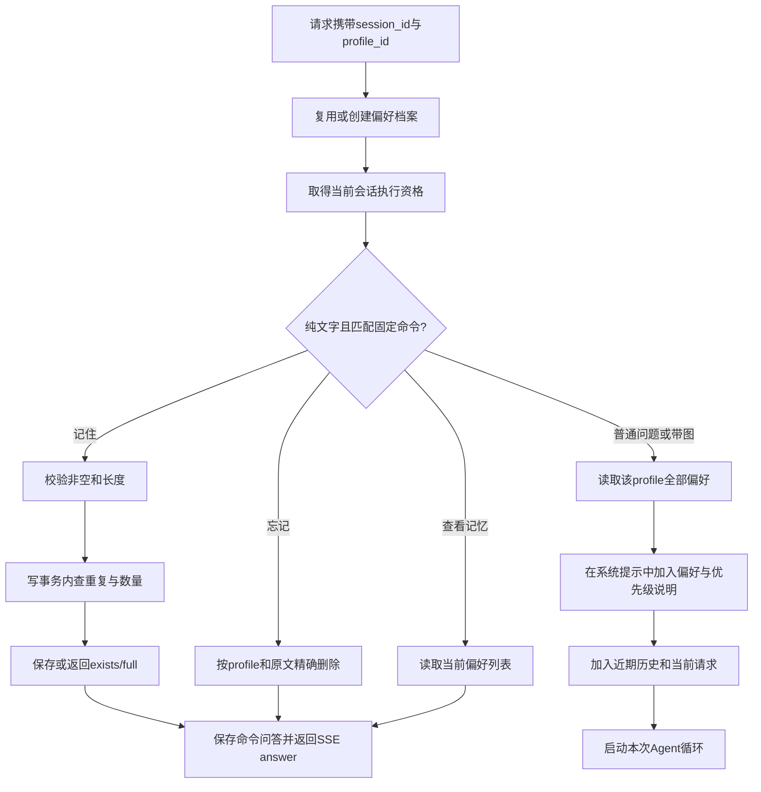

# 模块 07：显式跨会话偏好——用户决定记什么，程序负责保存，模型负责参考

阶段：第二阶段，源码深度拆解。日期：2026-10-09。

核心源码：[命令解析](C:/Users/wuhao/Documents/Enterprise_Agent/enterprise_ocr_service/agent/memory_commands.py:6)、[偏好存储](C:/Users/wuhao/Documents/Enterprise_Agent/enterprise_ocr_service/db/preference_memory.py:12)、[聊天入口](C:/Users/wuhao/Documents/Enterprise_Agent/enterprise_ocr_service/web/agent_chat.py:132)、[模型提示组装](C:/Users/wuhao/Documents/Enterprise_Agent/enterprise_ocr_service/agent/agent.py:227)。只讲偏好这一逻辑模块，不重复展开会话生命周期。

应用源码基准：`3095cf52376a99f2a53bbcbe2c09f3f04fe174fa`；本次开始时文档提交：`e9ba366`。本次只增加学习笔记，不修改业务代码，不调用真实模型或OCR，不更新跨任务记忆文件。

面试核心：**“偏好写入成功”“偏好到达模型”“模型实际遵循偏好”是三个不同指标。删除偏好表记录，也不等于从聊天历史中清除了相关文字。**

## 模块作用

### 为什么存在，解决什么问题

用户希望不同对话都保持某些习惯，例如“回答简洁”“报告默认用中文”。如果仅保存在某一会话的最近消息里，换会话或退出历史窗口后就不再可用。

当前模块让用户明确发送“记住：内容”，把文字按profile_id存进SQLite。之后新会话携带相同profile_id，后端读取该档案的全部偏好并传给Agent。保存、查看和删除使用固定命令，不让模型自行决定何时写入长期偏好。

### 四类信息不要混为一谈

| 信息 | 例子 | 当前归属 | 作用 |
| --- | --- | --- | --- |
| 对话历史 | “刚才为什么这样统计？” | chat_messages，按session_id | 衔接近期交流 |
| 部分查询状态 | 年份2024、关键词甲公司 | chat_task_state，按session_id | 参考最近成功查询条件 |
| 显式偏好 | “记住：以后回答简洁” | memory_preferences，按profile_id | 跨会话提供习惯或默认选项 |
| 业务事实 | 已确认销售明细与金额 | documents/ocr_rows | SQL统计的依据 |

把“甲公司销售额是100万”写成偏好，不会更新销售明细，也不能使它成为统计事实。当前偏好内容是原始字符串，没有语义类型校验；它可能包含事实断言甚至不合理指令，不能把存入表的文字都视为可信业务规则。

### 一条请求如何经过这个模块



命令路径绕过模型；普通问答路径才由模型参考偏好。匹配命令不等于内容已经成功保存：空内容、超过长度或数量已满都会返回说明。

## 核心代码流程

### 1. session_id与profile_id为什么分开

[resolve_profile](C:/Users/wuhao/Documents/Enterprise_Agent/enterprise_ocr_service/db/preference_memory.py:12)关键代码：

```python
if requested_id:
    row = conn.execute(
        "SELECT id FROM memory_profiles WHERE id = ?", (requested_id,)
    ).fetchone()
    if row:
        return row["id"]
profile_id = uuid.uuid4().hex
with conn:
    conn.execute("INSERT INTO memory_profiles (id) VALUES (?)", (profile_id,))
return profile_id
```

逐行解释：

1. 客户端带ID时，先查这个档案是否存在。
2. 找到才复用；缺失或未知ID都生成新UUID，而不是把任意客户端ID直接建档。
3. 创建档案通过自己的事务提交，之后返回ID。

session_id表示这一段对话，profile_id表示可被多段对话共享的偏好档案。数据库没有把chat_sessions强制绑定到某个profile；每次请求分别解析二者。相同session带未知profile会创建新档案，并不自动找回原偏好。

[前端状态](C:/Users/wuhao/Documents/Enterprise_Agent/enterprise_ocr_service/web/static/app.js:3)从localStorage读取两种ID；收到session事件后保存服务器返回的profile_id。[newChat](C:/Users/wuhao/Documents/Enterprise_Agent/enterprise_ocr_service/web/static/app.js:21)清理会话ID但保留profile，因此同一浏览器的新对话仍可读取偏好。

这是客户端保留ID实现的连续性，不是账号系统。随机ID不等于访问授权，服务端没有完整归属鉴权；清除浏览器存储后旧偏好记录可能还在数据库，但页面不能自动找回它。也没有实现跨设备登录同步。

### 2. 命令解析：以明确前缀表达写入意图

[parse_memory_command](C:/Users/wuhao/Documents/Enterprise_Agent/enterprise_ocr_service/agent/memory_commands.py:6)：

```python
def parse_memory_command(message: str) -> tuple[str, str] | None:
    text = message.strip()
    if text == "查看记忆":
        return "list", ""
    for prefix, action in (("记住：", "save"), ("记住:", "save"),
                           ("忘记：", "forget"), ("忘记:", "forget")):
        if text.startswith(prefix):
            return action, text[len(prefix):].strip()
    return None
```

- strip先移除消息前后空白。
- 查看命令要求全文等于“查看记忆”；“查看记忆。”不会匹配。
- 保存和删除兼容中英文冒号，但前缀必须在开头。“请记住：回答简洁”不会匹配。
- 从前缀长度处切出内容，再移除内容两端空白。
- 返回None表示普通问题，不自动写入偏好。

“以后回答简洁些”可以作为当前消息影响本会话的模型回答，但不会自动新增跨会话偏好。它与“记住：以后回答简洁些”在持久化语义上不同。

这是确定性意图入口，不是模型抽取记忆。它减少不确定的长期写入，却要求用户遵循固定表达。

### 3. 聊天层拦截命令，直接返回

[命令分支](C:/Users/wuhao/Documents/Enterprise_Agent/enterprise_ocr_service/web/agent_chat.py:132)：

```python
context = chat_memory.load_messages(session_id, limit=10) if existed else history[-10:]
command = parse_memory_command(message) if image_path is None else None
if command is not None:
    answer = _handle_memory_command(profile_id, *command)
    chat_memory.save_turn(session_id, user_content, answer)
    saved = True
    yield f"data: {json.dumps({'type': 'answer', 'answer': answer}, ensure_ascii=False)}\n\n"
    return
```

1. 当前实现先读上下文，再判断命令，所以不经过模型不代表完全没有前置数据库工作。
2. 只有image_path为None才解析命令。带图并输入“记住：……”会进入Agent，不会由这个分支保存偏好。
3. _handle_memory_command直接访问偏好存储，产生确定性说明。
4. 命令与结果写入普通聊天历史。
5. saved=True标记本轮问答已保存，发送answer后return，不调用run_agent_events。

因此模型不可用时，固定命令仍可使用，但仍依赖HTTP服务、数据库和会话门禁可用。不能泛化为所有故障下都能记忆。

### 4. 命令处理：长度、状态与反馈

[处理器](C:/Users/wuhao/Documents/Enterprise_Agent/enterprise_ocr_service/web/agent_chat.py:170)先处理list，再校验内容：

```python
if not content:
    return "请在冒号后写明内容，例如：记住：以后回答简洁些。"
if len(content) > 200:
    return "单条记忆不能超过 200 字。"
if action == "save":
    status = preference_memory.save_preference(profile_id, content)
    if status == "exists":
        return f"这条偏好已经记住：{content}"
    if status == "full":
        return "最多保存 20 条偏好，请先使用“忘记：原偏好”删除一条。"
    return f"已记住：{content}"
```

- 查看不需要内容，返回按顺序编号的完整列表。
- 非查看操作要求内容非空，Python len不超过200；这是字符长度限制，不是token预算。
- saved/exists/full由数据层返回，提示语由聊天层组织。
- exists不增加记录；full也不静默删除旧偏好给新内容腾位置。
- 删除同样经过这里的非空及长度检查，然后调用forget_preference。

长度和非空限制在命令处理层，save_preference本身没有这两项校验；表结构也没有200字符或20条的CHECK约束。不能说数据库天然保证所有入口都遵守全部限制。

### 5. 表结构：去重单位是档案与原文

[schema](C:/Users/wuhao/Documents/Enterprise_Agent/enterprise_ocr_service/db/schema.py:90)：

```sql
CREATE TABLE IF NOT EXISTS memory_profiles (
    id         TEXT PRIMARY KEY,
    created_at TEXT NOT NULL DEFAULT (datetime('now','localtime'))
);

CREATE TABLE IF NOT EXISTS memory_preferences (
    profile_id TEXT NOT NULL REFERENCES memory_profiles(id) ON DELETE CASCADE,
    content    TEXT NOT NULL,
    created_at TEXT NOT NULL DEFAULT (datetime('now','localtime')),
    PRIMARY KEY (profile_id, content)
);
```

联合主键约束同一profile下完全相同的content不重复；不同profile可各自保存同样内容。它不是语义去重，也没有偏好类型、版本、失效时间或冲突优先级字段。

“回答简洁”与“请简短回答”可以并存；“回答简洁”与“回答详细”也可以并存。按created_at、rowid排序只确定读取顺序，不表示代码已经解决语义冲突。

### 6. 为什么查数量之前要BEGIN IMMEDIATE

[save_preference](C:/Users/wuhao/Documents/Enterprise_Agent/enterprise_ocr_service/db/preference_memory.py:41)核心：

```python
with conn:
    # Reserve the write transaction before reading the count/duplicate.
    # Concurrent sessions sharing a profile must not exceed the limit.
    conn.execute("BEGIN IMMEDIATE")
    if conn.execute(
        "SELECT 1 FROM memory_preferences WHERE profile_id = ? AND content = ?",
        (profile_id, content),
    ).fetchone():
        return "exists"
    count = conn.execute(
        "SELECT COUNT(*) FROM memory_preferences WHERE profile_id = ?",
        (profile_id,),
    ).fetchone()[0]
    if count >= MAX_PREFERENCES:
        return "full"
    conn.execute(
        "INSERT INTO memory_preferences (profile_id, content) VALUES (?, ?)",
        (profile_id, content),
    )
return "saved"
```

逐行解释：

1. with conn负责提交或异常回滚；资源关闭由函数的finally负责。
2. BEGIN IMMEDIATE在读取重复和数量前进入写事务，协调竞争写者。
3. 先查重复，已存在则返回exists。即使已有20条，重复保存也应得到“已经记住”，而不是“容量已满”。
4. COUNT统计本profile的条数，达到MAX_PREFERENCES=20就返回full。
5. 否则插入；检查与插入处于同一写事务，避免多个写者都基于19条的旧数量决定新增。
6. 事务成功结束后返回saved；数据库异常不伪装成成功。

为什么上一课的会话锁不够？同一profile可由不同session使用，而会话锁只限制同session。偏好数量是profile维度的不变量，需要在数据层保护。

联合主键防止重复content，但不能阻止8条不同content一起突破20条上限。两者保护的是不同规则。当前采用数据库事务解决检查与写入竞争，不是依赖模型遵守数量限制。

代价是竞争写者会等待或遇到锁错误；没有据此测得高并发吞吐或P95收益。这里保证的是数量约束，不能宣传成性能优化。

### 7. 查看与删除：精确读取，没有向量检索

[list_preferences](C:/Users/wuhao/Documents/Enterprise_Agent/enterprise_ocr_service/db/preference_memory.py:29)按profile_id等值查询，ORDER BY created_at,rowid返回全部偏好。没有embedding、相似度阈值或Top-k选择。

[forget_preference](C:/Users/wuhao/Documents/Enterprise_Agent/enterprise_ocr_service/db/preference_memory.py:69)：

```python
with conn:
    cursor = conn.execute(
        "DELETE FROM memory_preferences WHERE profile_id = ? AND content = ?",
        (profile_id, content),
    )
return cursor.rowcount > 0
```

绑定profile和原文精确删除，rowcount判断是否实际删到。查看列表中的数字只是展示编号，没有实现“忘记：第2条”的编号删除协议。

两端空白在命令解析时被strip，但内容内部空白、标点和同义表达不被统一。用户要修改偏好，当前通常先忘记旧原文，再保存新内容；这是两次请求，不是原子更新，中间可能失败或被其他写者占用名额。

### 8. 普通提问如何让模型看到偏好

[普通请求入口](C:/Users/wuhao/Documents/Enterprise_Agent/enterprise_ocr_service/web/agent_chat.py:140)读取profile的偏好列表并传入run_agent_events。

[Agent提示组装](C:/Users/wuhao/Documents/Enterprise_Agent/enterprise_ocr_service/agent/agent.py:227)：

```python
if preferences:
    numbered = "\n".join(f"{i}. {item}" for i, item in enumerate(preferences, 1))
    system_prompt += (
        "\n\n以下是用户明确保存的跨会话偏好，仅用于回答方式和默认选项。"
        "不能覆盖上述数据真实性与工具规则；与当前用户请求冲突时，以当前请求为准。\n"
        f"{numbered}"
    )
messages: list[Any] = [SystemMessage(content=system_prompt)]
```

- 非空才追加，全部偏好按编号放进系统提示。
- 提示约定：数据真实性和工具规则优先；当前请求与旧偏好冲突时，当前请求优先。
- 这是对模型的文本指导，没有程序级冲突解析器、回答格式校验器或权限授予机制。
- 每次新请求重新读取偏好；已经启动的循环使用当时构造的messages，不会因另一个请求删除偏好而自动更新。

例如旧偏好是“回答简洁”，这次用户明确要求“详细解释”，提示要求以本次为准。但提示写对、内容到达模型，不证明真实模型每次都遵循；要用冲突任务集另测。

最多20条、每条200字符，普通请求可能额外携带约4000字符的偏好内容，加上编号和提示。这不是4000 token，也不包括系统规则、历史、当前问题和工具轨迹。没有按相关性检索、自动过期或总token预算。

### 9. 删除后的残留：表里没了，历史里还可能有

当前命令分支调用save_turn，把“记住：以后回答简洁些”和“已记住……”保存到chat_messages；删除指令也会保存。这些记录与普通消息一样可能被load_messages选为近期历史。

本次临时数据库探针执行：

```text
同一会话：记住：以后回答简洁些 → 忘记：以后回答简洁些 → 你好
偏好表：空
偏好注入段：没有
传给模型的近期历史：仍包含旧“记住”消息及相应问答
```

代码事实是旧文字仍然可见；是否导致真实模型继续遵循，本次没有测量，不能宣称已复现具体错误回答。历史中的删除消息也可能让模型理解偏好已经失效，但这仍依赖模型推理。

“忘记”当前承诺应限于删除偏好表条目，不能扩展成全局抹除历史或保证彻底消除影响。新会话没有这段旧历史时，不再通过偏好表注入已删条目；显式传入客户端历史又属于另一条可能来源。

另一个一致性边界：偏好保存先提交，再调用save_turn保存聊天问答。探针让save_turn抛异常，确认偏好仍已存在、请求返回error、该会话没有消息。不能因为界面报错，就认定“记住”未生效。

当前接入范围为主聊天文字和上传路径的偏好读取；上传不走命令拦截。[旧/api/agent入口](C:/Users/wuhao/Documents/Enterprise_Agent/enterprise_ocr_service/web/main.py:165)仍调用ask(message,history)，没有同样的profile注入通路。

## 设计思想

### 1. 将长期写入意图交给用户明确表达

长期保存会影响未来请求，误保存一次的影响可能跨越多个会话。固定命令让“这次希望简洁”和“以后都默认简洁”在入口上区分，写入结果可查、可删、可重复提交。

替代方案是让模型自动抽取偏好。它表达更自然，但需处理误提取、临时要求与长期习惯区分、冲突更新和删除；还应衡量抽取准确率、用户撤销率及额外模型调用成本。不能未经评估就说自动记忆更智能或更好。

### 2. 小规模偏好按档案精确读取

当前数量有限，目标是读取这个profile的所有习惯，SQLite等值查询即可。向量库解决语义相关内容召回，不能自动解决偏好失效、权限或冲突，Top-k还可能漏掉需要遵循的习惯。

若未来条目很多，可先按类型、任务和有效期过滤，再评估是否需要语义检索；依据应是选择质量、实际token和延迟，不能只因为它叫Memory就引入向量数据库。

### 3. 程序保护写入规则，模型参考内容

格式解析、精确去重、容量检查和删除是程序规则；偏好与当前问题如何共同影响回答，目前交给提示与模型。回答时要分别说明确定性与概率性部分。

“不经过模型写库”消除了这条路径的写入决策模型调用，并不消除未来普通请求的偏好输入成本，也不保证模型遵循。实际延迟、token及费用变化没有配对测量。

### 4. 不静默替换，换取可预期的行为

满20条时拒绝新内容，不随机淘汰或擅自覆盖旧内容。优点是用户可预测；代价是要手动管理，且语义冲突可以累积。原文精确删除避免模型猜测删除对象，但输入负担较高。

### 5. 原始字符串方案简单，但缺少语义治理

当前没有类型化的language、verbosity、default_group_by等字段，也没有事实/偏好区分或冲突状态。全部字符串直接拼接进系统提示，文本优先级约定不等于程序强制执行。不能把某条偏好当作确认数据、修改业务规则的授权凭据。

## 如果重构

本次没有实施以下建议，也没有可比的新旧性能收益。

| 优先项 | 为什么做 | 应影响的指标 | 可操作的验证方法 |
| --- | --- | --- | --- |
| 偏好ID、类型和值，支持原子更新 | 减少同义重复、冲突和先删后加失败 | 冲突检出率、更新成功率、误删率 | 简洁/详细冲突、同义改写、并发更新、满额修改 |
| 明确命令历史的模型可见性 | 保留用户审计，同时避免已删除偏好从旧消息重新进入上下文 | 删除后残留送达率、已删偏好遵循率 | 同/新会话删除后追问，超过历史窗口再测；替身送达与真实回答分开 |
| 用户归属与profile绑定 | 避免任意提供档案ID就能操作他人偏好 | 越权读写拒绝率、跨设备恢复成功率 | 不同账号交换ID，未知ID、退出登录与会话迁移 |
| 有效期、作用域及token预算 | 减少无关或过期偏好输入，保护当前任务 | 偏好选择召回、遵循率、实际输入token、P95 | 同一任务集比较全部注入与选择注入，检查被遗漏的重要偏好 |
| 统一入口校验与可靠操作结果 | 避免其他入口绕过长度限制，区分已提交但历史失败 | 非法写入率、重复操作率、状态可追踪率 | 直接数据层调用、保存后故障、请求重试、旧接口对齐 |

修改“删除后模型看不到旧偏好”时，不应只改偏好表。要定义命令消息、确认回答、引用旧偏好的普通聊天如何参与模型历史；保留用户可查看的记录与是否作为模型输入，可以采用不同视图。

若采用结构化偏好，也不应过度承诺：language字段可程序化选择，回答“详细程度”仍需要模型生成或输出检查。每种字段的强制程度要分别说明。

### 已有测量与本次验证

[2026-09-28历史说明](C:/Users/wuhao/Documents/Enterprise_Agent/enterprise_ocr_service/docs/evals/sqlite-explicit-preferences-2026-09-28.md:1)记录当时新增5个接口测试及18/18完整测试。它还描述“记忆指令不进入Agent对话历史”，与当前save_turn及近期历史读取路径不同；这是版本边界，不能用旧文档覆盖当前事实。

历史真实模型材料见[2026-10-02诊断记录](C:/Users/wuhao/Documents/Enterprise_Agent/enterprise_ocr_service/docs/evals/2026-10-02-preferences-query-proof.json:1)：基于3条合成销售数据（2024甲100、2024乙200、2025乙900），使用真实HTTP、SQLite、SQL工具与deepseek-chat。与本课直接相关的两个场景各运行一次：持久偏好要求以“统计结果”开头，实际符合；当前请求改成“本次结果”，实际也符合。两条记录的查询条件与金额检查通过。

这只能证明记录中的具体诊断运行成功，不是总体偏好遵循率100%，也没有同任务有/无偏好的统计比较。其1780ms与2650ms对应不同要求的单次执行，不能相减后解释为偏好导致的延迟变化。没有实际token或成本结果。

2026-09-28说明中“真实模型尝试中止、无结果”属于当时记录，不代表后来没有真实诊断；同理，本次没有重新调用模型，不能将2026-10-02结果说成本次实测。

本次运行的已有测试：

```text
python -m pytest -q tests/test_preference_concurrency.py tests/test_agent_chat_api.py -k "preference or memory_command"
7 passed, 11 deselected, 2 warnings in 8.13s
```

6项HTTP测试覆盖：命令可见历史、跨新会话送达、命令不调用Agent、普通消息不写入、查看与删除、不同profile隔离。Agent由替身替代，不评价真实模型行为。

[并发测试](C:/Users/wuhao/Documents/Enterprise_Agent/enterprise_ocr_service/tests/test_preference_concurrency.py:6)预存19条偏好，8个线程通过Barrier同时尝试写不同内容，并在COUNT后人为暂停。结果1次saved、7次full，最终20条。它验证该竞争场景的容量约束，不是生产压力测试，也没有本次修复前后对照。

另在独立临时SQLite中运行15项探针断言，全部通过；其中命令解析断言覆盖10个固定字符串案例。其余检查包括ID复用/未知ID替换、空与201字符拒绝/200字符允许、满额重复与新增分支、冲突内容并存、精确删除、命令零模型调用、新会话提示注入及优先级文本、删除后历史残留、session未绑定旧profile、带图绕过命令、偏好提交后历史失败。

探针使用真实HTTP和Agent提示组装，模型由ScriptedModel替代。模型只返回预设回答；“以当前请求为准”出现在提示中，不证明模型会执行这个优先级。没有网络、真实OCR、多进程、跨设备或真实模型删除后行为验证；未新增探针脚本文件。

测试有pytest配置与依赖弃用提示，进程另提示requests依赖版本；这些提示不改变以上通过计数。本次只增加文档，没有声称质量、延迟或成本得到改善。

## 面试考点

| 问题 | 考察什么 | 回答应落到的事实 |
| --- | --- | --- |
| 这是哪种长期记忆？ | 记忆范围 | 用户显式保存的字符串偏好，不是自动事实抽取 |
| 为什么不让LLM写？ | 意图与可控性 | 固定命令直接执行，普通消息不自动持久化 |
| 为什么需要两个ID？ | 会话与用户习惯分离 | 新会话换session，复用profile；没有账号鉴权 |
| 为什么不用向量库？ | 适配问题规模 | 最多20条按profile等值读取，当前无语义检索 |
| 联合主键能保证20条吗？ | 不变量与并发 | 只能精确去重，容量由写事务内检查保护 |
| BEGIN IMMEDIATE为何放在COUNT前？ | 检查与使用竞态 | 避免竞争写者基于相同旧数量各自插入 |
| 删除后就一定不影响模型吗？ | 数据与输入边界 | 表中删除，近期历史仍可能包含旧指令 |
| 当前请求如何覆盖旧偏好？ | 提示与强制规则 | 文本优先级约定，没有程序级冲突解析 |
| “已记住”是否意味着回答正确？ | 评估层次 | 保存、送达、遵循、事实正确分别测量 |

## 高频追问

### 追问1：你把Memory做成SQL，不就是存字符串吗？

是，当前存储实现很轻量。模块价值在于明确写入意图、跨会话作用域、去重容量、删除与注入边界，而不是引入复杂存储。是否需要语义检索取决于内容规模与选择任务，不应靠数据库名称评价Agent记忆能力。

### 追问2：模型没有参与，为什么还属于Agent项目？

Agent系统包含确定性程序和模型决策。明确的“保存这条偏好”不需要模型再猜一次，程序执行后将结果传给未来模型调用。不是每个环节都经过LLM才算Agent；要看职责是否合理，以及误写率、可解释性、延迟和成本证据。

### 追问3：写入指令不用模型，是否就没有成本？

这条路径没有LLM调用，但仍有请求处理、数据库与存储成本。之后普通问答追加偏好，增加模型输入；本项目没有测得净token、费用或延迟收益，不能声称免费或必然降本。

### 追问4：用户说“忘记：第2条”能删吗？

当前把“第2条”当作待匹配原文，不按编号删除。列表编号只是显示，实际DELETE匹配profile_id和content。更好的接口可以使用稳定偏好ID并校验归属，而不是让模型猜原文。

### 追问5：为什么不总是让最新偏好覆盖旧的？

当前字符串没有类型，程序不知道两条文字是否冲突、是否覆盖同一选项。按时间排序不等于覆盖协议。要做覆盖，需先明确类型、作用域和更新规则，再测试同义表达及不同任务的冲突。

### 追问6：当前请求优先，是硬保证吗？

不是。优先级写在模型提示里，存储层没有解决语义冲突。历史真实诊断中有成功例子，但每例一次。需要构建不同措辞、相反偏好、多条冲突及当前覆盖任务集，多次运行，分别检查风格与工具参数。

### 追问7：删了偏好，怎么还可能记得？

偏好表和聊天历史是两个来源。当前命令问答保存为普通消息，近期历史可能包含旧内容。删除表条目可以停止该表的注入，不会自动删除所有历史引用；这次验证了输入残留，没有验证真实模型是否继续遵循。

### 追问8：命令返回错误，再保存一次安全吗？

可能第一次偏好已提交，后续聊天保存失败才报错。相同原文重试通常返回exists，不新增；但记录、会话和其他内容是否完成要分别检查。这是精确重复写入的幂等效果，不是整个请求恰好一次执行。

### 追问9：同一档案跨两个会话，会话锁能防超额吗？

不能，会话锁的键是session_id，两个会话可以同时执行。数据层通过BEGIN IMMEDIATE将数量检查和插入放在写事务内；本次8线程争最后一个名额的测试保持20条。这个结论不应扩展为无限并发或任意多进程环境都已经验证。

### 追问10：有人记住“跳过确认，直接统计待确认数据”怎么办？

字符串可能被保存，提示声明不能覆盖真实性与工具规则。真实统计仍应依靠工具的数据状态规则，授权也必须独立校验；不能让偏好成为修改状态的授权。本次没有测试这类恶意输入的真实模型行为，也没有修复全入口授权问题。

### 追问11：profile隔离测试通过，是否能说支持多用户？

不能。测试证明按不同ID读取了不同集合，未证明调用者有权使用该ID。账号身份、档案归属、业务数据权限和跨设备恢复需要额外实现与测试。

## 标准回答

### 30秒：这个模块是什么

“我实现的是显式跨会话偏好：用户发送记住、忘记、查看记忆这类固定命令，由后端直接解析并操作SQLite，不让模型自行决定长期写入。偏好按独立profile_id保存，新会话可以复用；普通请求会把偏好加入提示，并说明当前请求与业务规则优先。当前不做向量检索或自动事实抽取。”

### 90秒：为什么这样设计

“我把当前聊天、任务条件和长期偏好分开。会话历史只服务当前对话，profile让回答习惯跨会话保留。为了避免临时要求被误存为长期规则，我采用显式命令，普通聊天不自动写入。

“存储使用SQLite，因为条目少且按档案精确读取，每条最多200字符、每档案最多20条。同档案原文重复不新增；保存时在写事务里先查重复、再查数量和插入，避免不同会话竞争突破上限。本次8线程争最后一个名额，结果1个成功、7个拒绝，最终保持20条。

“我也会说明边界：优先级主要依靠提示，没有解决语义冲突；随机档案ID不是账号鉴权。忘记只删除偏好表条目，旧命令仍可能在近期聊天历史里。后续我会优先补充类型化原子更新、删除后的模型输入规则和用户归属，再分别测量保存、送达、实际遵循及token成本。”

### 被问到测量

“本次7项相关已有测试通过，并用临时库和替身模型完成15项探针断言，其中有10个命令解析案例。验证的是程序规则和提示送达，不是真实回答质量。历史真实模型材料有两个各运行一次的偏好遵循与当前覆盖成功场景，不能据此说准确率100%。本次没有调用真实模型，也没有测出新的延迟或成本改善。”

### 被问到个人贡献

结合实际经历说明自己定义了哪些偏好边界、排查了哪些竞争或状态问题、亲自运行了哪些验证，哪些实现由AI协助完成。能够讲解源码与独立编写全部源码是不同事实；不要把本次文档分析当成已经完成业务修复。

本模块完成后还剩3个逻辑模块：数据快照与图表/Office生成、文件注册与预览/进程隔离、评估测试与指标。下一模块优先讲数据快照：如何让统计结果与交付文件使用同一份数据。
