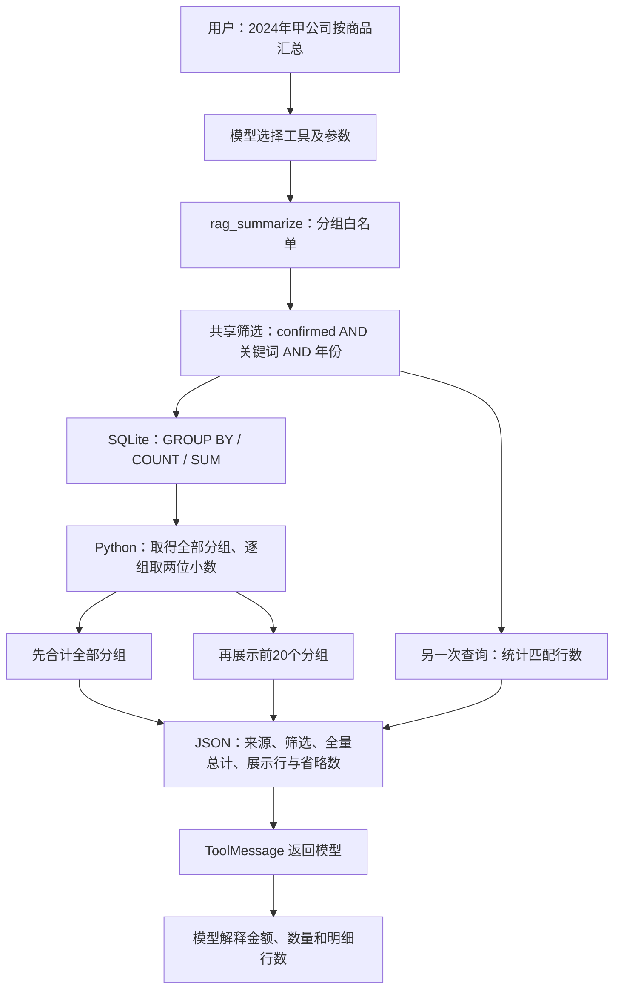

# 模块 03：SQL 查询与聚合工具——如何让 Agent 的统计回答有依据

阶段：第二阶段，源码深度拆解。日期：2026-10-08。

本次只讲查询与聚合这一个逻辑模块，核心是 [tools/rag_tool.py](C:/Users/wuhao/Documents/Enterprise_Agent/enterprise_ocr_service/tools/rag_tool.py:30) 与 [db/crud.py 的 SQL 查询部分](C:/Users/wuhao/Documents/Enterprise_Agent/enterprise_ocr_service/db/crud.py:224)。字段词典、数据库表和 Agent 调用点只解释边界，不展开其模块。

应用源码基准：`3095cf52376a99f2a53bbcbe2c09f3f04fe174fa`；本次开始时文档提交：`873f688`。本次没有修改业务代码，没有调用真实模型或 OCR，没有重跑历史20任务或输出压缩评估。

面试核心：**模型选择查询工具与参数，程序固定数据范围，SQLite 执行筛选和分组计算，Python 整理输出，模型解释结果。** 名称带 rag，实际没有向量召回链路。

## 模块作用

### 为什么存在

用户问“2024年甲公司的销售额，按商品汇总”，包含两个不同工作：理解自然语言、计算符合条件的金额。前者交给模型，后者交给确定的查询代码。

如果把整表交给模型计算，会增加上下文，并让算术、漏行和口径变得难以检查。如果只召回几条语义相似记录再加总，也不能保证覆盖全部符合条件的行。

这里使用 SQLite 中结构化的已确认记录，通过固定的 WHERE、GROUP BY、SUM 查询。模型传结构化参数，没有获得自由编写任意 SQL 的接口。

### 两个工具分别解决什么问题

| 工具 | 适合的问题 | 返回证据 | 不能据此推导什么 |
| --- | --- | --- | --- |
| rag_query | “有哪些明细，来自哪张单据？” | 最多20行、行ID、单据ID、文件名、字段、匹配与省略数量 | 只把展示行相加当全量总额 |
| rag_summarize | “总金额多少，按什么分组？” | 全部匹配行的总计、最多20个分组及省略说明 | 未展示分组的具体数值、独立单据数 |

`rag_query` 的 top_k 是按固定排序返回的行数上限，不是向量相似度 Top-K。`rag_summarize` 不让模型算钱：SQL 先聚合，Python 再合计所有分组并整理结果。

### 数据范围与字段口径

查询对象是 `ocr_rows` 中 status 为 confirmed 的行，并 JOIN documents 取得文件名。原始 OCR 的 pending 行不进入这两个工具的统计。

依据：[表结构](C:/Users/wuhao/Documents/Enterprise_Agent/enterprise_ocr_service/db/schema.py:45)、[共享业务词典](C:/Users/wuhao/Documents/Enterprise_Agent/enterprise_ocr_service/agent/field_semantics.py:2)。

| 字段 | 真实含义 | 典型误读 |
| --- | --- | --- |
| desc | 顾客公司 | 普通文本描述 |
| date | 发注日 | 上传时间 |
| from | 源公司 | 顾客公司 |
| amount / total_amount | 数量 / 数量合计 | 金额 |
| sum / total_sum / 分组 total | 票面金额 / 金额合计 | 数量乘单价重算值 |
| total_rows / 分组 rows | 明细行数 | 单据数 |

票面金额可能包含折扣。当前规则以已确认 sum 为准，不用 amount × price 覆盖，不推断原始记录未明确提供的币种。

confirmed 是当前业务状态，不是数学正确或用户授权的独立证明；本工具不重新识别图片，也不检查上游确认动作是否得到授权。

## 核心代码流程

### 1. 先沿一条请求走完整条链路

示意请求：“统计2024年甲公司的销售额，按商品汇总。”

模型应选择 `rag_summarize(group_by="item", keyword="甲公司", year="2024")`。这里“应选择”是预期，不是本次真实模型运行。



注意图里的计数是另一次数据库读取。共享筛选保证查询条件来自同一逻辑，但当前没有把这些读取放进同一个读事务来保证同一数据快照。

### 2. 共享过滤器逐行解释

依据：[db/crud.py:224](C:/Users/wuhao/Documents/Enterprise_Agent/enterprise_ocr_service/db/crud.py:224)。以下省略函数说明与注释，保留执行逻辑。

```python
def _where_params(keyword: str | None, year: str | None) -> tuple[str, list[Any]]:
    conds = ["r.status='confirmed'"]
    params: list[Any] = []
    if keyword:
        kw = f"%{keyword}%"
        conds.append("(r.item LIKE ? OR r.desc_ LIKE ? OR r.from_ LIKE ? OR d.file_name LIKE ?)")
        params += [kw, kw, kw, kw]
    if year:
        y = str(year).strip().replace("年", "")
        if y.isdigit():
            conds.append("substr(r.date_, 1, 4) = ?")
            params.append(y[:4])
    return " AND ".join(conds), params
```

| 原行 | 关键行为 | 设计理由与实际边界 |
| --- | --- | --- |
| 224 | 返回 SQL 条件片段与参数列表 | 固定查询结构与用户值分开 |
| 226 | confirmed 永远作为基础条件 | 查询默认排除待确认记录 |
| 227 | 初始化参数列表 | 与每个 ? 的顺序对应 |
| 228—229 | 有关键词才增加包含匹配 | 空关键词表示不限制，而非只匹配空字段 |
| 230 | 商品、顾客、源公司、文件名四字段 OR | 命中任一字段即可，不是“顾客精确等于” |
| 231 | 四个占位符绑定相同关键词模式 | 用户值不直接拼入 SQL 语法 |
| 232—234 | 有年份时去两端空白并移除“年” | 支持常见2024/2024年输入，规范化规则比较宽 |
| 235—237 | 全数字才添加日期前四位条件 | 未要求恰好四位；只取前四位；非法输入没有报错 |
| 238 | AND 拼接各条件并返回参数 | 关键词内部 OR 与年份、状态外部 AND 不混淆 |

**包含匹配的业务边界：** keyword=甲公司 不保证匹配字段是顾客公司，文件名或源公司包含它也算。若问题要求“顾客只能是甲公司”，当前工具参数不足以精确表达字段限定；不能将广义关键词命中宣传成精确公司过滤。

**参数绑定的边界：** 它防止关键词变成 SQL 语法，但 `%` 与 `_` 在 LIKE 模式里仍有通配含义。当前没有转义成字面搜索；不能把“防注入”说成“完全限制查询范围”。

**年份校验的边界：** 本次直接检查过滤器，`2024或2025` 不添加年份条件，`20245` 实际添加2024条件，`2024 `被接受。工具 JSON 的 filters 保留原入参，不能保证它就是实际执行的规范化条件。非法年份可能扩大范围；本次只验证条件构造，没有用真实模型复现该行为。

上一个模块的状态提取器要求四位年，可带末尾“年”，且不先 strip。这说明查询执行和状态提取的年份规则目前不完全一致。

### 3. 明细 SQL：排序和限制在哪里发生

依据：[search_confirmed](C:/Users/wuhao/Documents/Enterprise_Agent/enterprise_ocr_service/db/crud.py:241)。

```python
where, params = _where_params(keyword, year)
sql = (
    f"SELECT r.*, d.file_name FROM ocr_rows r "
    f"JOIN documents d ON d.id = r.doc_id WHERE {where} "
    "ORDER BY r.date_ DESC, r.id DESC LIMIT ?"
)
cur = conn.execute(sql, params + [top_k])
return [_user_row(dict(r)) for r in cur.fetchall()]
```

逐行含义：构造范围 → 选择行与来源文件名 → 按单据关联 → 按日期字符串和ID降序 → 在 SQL 层 LIMIT → 参数执行 → 映射为对外字段。

`_user_row` 将 desc_/date_/from_/sum_ 转成 desc/date/from/sum；数据库键名与工具业务键不是完全相同。

LIMIT 发生在数据库，Python 不需要取回全部明细再切片。但 date_ 当前是文本，ORDER BY 是文本排序；只有日期格式统一时，才能可靠对应时间先后。不能说已经做了通用日期解析。

### 4. 明细工具逐行解释

依据：[rag_query](C:/Users/wuhao/Documents/Enterprise_Agent/enterprise_ocr_service/tools/rag_tool.py:31)。`@tool` 提供 LangChain 工具封装，参数与说明供模型调用，不代表程序理解了用户原话。

关键分支：

```python
if top_k < 1:
    return "top_k 必须大于 0。"
rows = crud.search_confirmed(keyword=query or None, year=year or None,
                             top_k=min(top_k, _MAX_DETAILS))
if not rows:
    where = []
    if query:
        where.append(f"关键词 '{query}'")
    if year:
        where.append(f"年份 {year}")
    return f"（未检索到匹配的已确认数据{'[' + '、'.join(where) + ']' if where else ''}）"
matched = crud.confirmed_count(keyword=query or None, year=year or None)
```

| 原行 | 行为 | 设计含义 |
| --- | --- | --- |
| 41—42 | top_k 小于1返回错误说明 | 非法数量不当作正常无数据 |
| 43—44 | 空筛选转 None，top_k 上限20 | 用户要求1000行也只展示20行 |
| 45—51 | 无行时说明没有匹配的已确认数据 | 不是返回销售额为零，也不是返回工具异常 |
| 52 | 另行 count 获取全部匹配行数 | 展示多少和一共多少分别表达 |
| 53—63 | 打包 JSON | 完整返回契约见下文 |

输出逻辑原样如下：

```python
return _serialize({
    "source": _SOURCE,
    "filters": {"keyword": query, "year": year},
    "matched_rows": matched,
    "returned_rows": len(rows),
    "omitted_rows": matched - len(rows),
    "columns": _DETAIL_COLUMNS,
    "field_meanings": FIELD_MEANINGS,
    "rows": [[row.get(column) for column in _DETAIL_COLUMNS] for row in rows],
    "note": "仅展示明细样本；总额用 rag_summarize，更多明细请缩小查询范围。",
})
```

逐字段解释：

- source：当前来源表与确认状态的标签，不是逐图独立审计证明。
- filters：本次工具入参的关键词与年份，未统一成实际 SQL 条件对象。
- matched_rows：所有符合条件的明细行数。
- returned_rows：这份输出里展示的明细行数。
- omitted_rows：未展示的行数；分开读取遇到并发变化时可能失去一致性。
- columns 与 rows：表头只出现一次，每一行按同样列顺序排列；解释时必须对齐表头。
- field_meanings：明确数量、单价、税率、金额等语义。
- note：提醒样本不能用于算全部总额，以及当前需要缩小范围获取更多明细。

例如匹配25行、每行金额10，工具只展示20行。展示行相加是200，完整范围应该是250。这个例子用于解释；当前已有相同规模的隔离测试验证省略标记，而不依赖模型自觉发现少了5行。

当前没有 offset/cursor 分页。缩小条件并不保证所有历史明细都可便利遍历；不能宣称已支持全量分页查询。

### 5. 聚合 SQL：数据库真正计算什么

依据：[summarize_confirmed](C:/Users/wuhao/Documents/Enterprise_Agent/enterprise_ocr_service/db/crud.py:261)。

```python
col = {"item": "r.item", "desc": "r.desc_", "date": "r.date_"}.get(group_by, "r.item")
label = {"item": "item", "desc": "desc", "date": "date"}.get(group_by, "item")
where, params = _where_params(keyword, year)
conn = get_connection()
```

前两行用固定映射选 SQL 列与标签，不把外部 group_by 直接拼成列名。工具层先拒绝非法分组；数据层直接调用时则默认回退 item，这是两层不同的行为。

数据库查询：

```python
sql = (
    f"SELECT {col} AS gkey, "
    "COUNT(*) AS row_cnt, "
    "SUM(CAST(REPLACE(REPLACE(REPLACE(r.amount,',',''),'¥',''),'￥','') AS REAL)) AS qty, "
    "SUM(CAST(REPLACE(REPLACE(REPLACE(r.sum_,',',''),'¥',''),'￥','') AS REAL)) AS total "
    f"FROM ocr_rows r JOIN documents d ON d.id = r.doc_id WHERE {where} "
    f"GROUP BY {col} ORDER BY total DESC"
)
cur = conn.execute(sql, params)
```

| 原行 | SQL行为 | 业务解释与边界 |
| --- | --- | --- |
| 277 | 选分组字段，命名 gkey | 商品、顾客或发注日 |
| 278 | COUNT(*) | 统计明细行，不是 DISTINCT doc_id |
| 279 | 清理数量文本后转 REAL 再 SUM | amount 是数量，不是钱 |
| 280 | 清理票面金额文本后转 REAL 再 SUM | 直接使用 sum_，不重算数量×单价 |
| 281 | 关联文档并应用共享范围 | 文件名可参与关键词过滤，pending 被排除 |
| 282 | 按指定维度分组，按金额降序 | 没有 SQL LIMIT，会取得全部匹配分组 |
| 284 | 参数绑定执行 | 筛选值与 SQL 结构分离 |

代码删除逗号、¥、￥后转 REAL。它不是严格金额解析器，也没有完整覆盖所有币种和数值格式。字段值是 TEXT，`confirmed` 不自动保证每个值可正确解析。

本次在内存 SQLite 中验证同一转换表达式：`¥1,234.50 → 1234.5`、空字符串与 `abc → 0.0`、`12abc → 12.0`。这验证的是 SQLite 转换行为；没有证明生产库存在这些脏值，也没有运行 OCR 数据质量评估。

返回分组时又做一次处理：

```python
out = []
for row in cur.fetchall():
    out.append({
        "group": row["gkey"],
        "label": label,
        "rows": row["row_cnt"],
        "amount": round(row["qty"] or 0, 2),
        "total": round(row["total"] or 0, 2),
    })
return out
```

这里将 SQL 聚合映射为 group/label/rows/amount/total。`or 0` 将空聚合值归零，round 将每组数量和金额取两位；这不等于数据源每行都经过严格数值验证。

**精度边界：** 当前使用 REAL 和 Python 浮点，并且先逐组 round 再求全局总计。极小数、超过两位小数或浮点边界需要专项验证，不能把“使用 SQL”说成“具备财务级精确小数保证”。本次没有进行这类精度误差规模测量。

### 6. 聚合工具：先全量汇总，再展示截断

依据：[rag_summarize](C:/Users/wuhao/Documents/Enterprise_Agent/enterprise_ocr_service/tools/rag_tool.py:67)。

```python
if group_by not in _SELECTABLE:
    return f"group_by 仅支持: {sorted(_SELECTABLE)}（收到 {group_by}）"
groups = crud.summarize_confirmed(
    group_by=group_by, keyword=keyword or None, year=year or None
)
total = crud.confirmed_count(keyword=keyword or None, year=year or None)
if not groups:
    return "（没有符合条件的已确认数据）"
summary = {
    "total_rows": total,
    "total_amount": round(sum(g["amount"] for g in groups), 2),
    "total_sum": round(sum(g["total"] for g in groups), 2),
}
selected = groups[:_MAX_GROUPS]
```

| 原行 | 行为 | 为什么重要 |
| --- | --- | --- |
| 78—79 | 分组白名单 item/desc/date | 只支持明确维度，非法值不默默作为正常统计 |
| 80—82 | 取得所有分组 | SQL 不先裁20组 |
| 83 | 单独统计匹配行数 | total_rows 表达全范围明细行数 |
| 84—85 | 没有分组时返回无数据说明 | 不据此报告实际销售为零 |
| 86—90 | 合计所有分组的数量和金额 | 包含随后不展示的组；金额取 total |
| 91 | 最后才截取前20组 | 限制展示范围，不缩减总计范围 |

之后的输出除 source、filters、group_by、summary 外，还给出 total_groups、returned_groups、omitted_groups，以及 columns、field_meanings、rows 和说明。

例如25个商品各金额10，summary.total_sum 为250；展示20组相加只有200，omitted_groups 为5。这五组计入总额，但各自数值不在输出中。如果用户问某个被省略的商品，模型不能凭全量总额编造它的金额，需要用合适条件重新查询。

“保留全量总额”是当前计算的范围设计，不代表解决了金额清洗、浮点精度、过滤正确性或并发一致性。

### 7. COUNT、序列化和返回模型

依据：[confirmed_count](C:/Users/wuhao/Documents/Enterprise_Agent/enterprise_ocr_service/db/crud.py:299)。

```python
where, params = _where_params(keyword, year)
n = conn.execute(
    f"SELECT COUNT(*) c FROM ocr_rows r JOIN documents d ON d.id=r.doc_id "
    f"WHERE {where}", params
).fetchone()["c"]
return int(n)
```

仍用同一个过滤器，但自己开连接。明细取行与 count、聚合取组与 count 不是同一次事务读取；中间如有确认、修改或重识别，可能得到不一致的行数与金额。WAL 支持读写并存，不自动把分散连接的多次查询变成同一快照。

序列化依据：[tools/rag_tool.py:26](C:/Users/wuhao/Documents/Enterprise_Agent/enterprise_ocr_service/tools/rag_tool.py:26)。

```python
def _serialize(payload: dict) -> str:
    return json.dumps(payload, ensure_ascii=False, separators=(",", ":"))
```

不增加摘要模型调用，删除 JSON 的非必要分隔空白，保留中文。表头共享减少重复键名，但也要求消费者正确对齐列。

结果最终经 [ToolMessage](C:/Users/wuhao/Documents/Enterprise_Agent/enterprise_ocr_service/agent/agent.py:326) 进入下一次模型调用。网页展示截短到2000字符，与模型获得完整工具结果是两条路径；这里的20行/20组上限才直接限制这两种工具的模型输入数据量。

行数上限不是 token 上限：公司名、商品名或文件名很长，20行仍可能很大。全局工具调用预算也不能代替上下文 token 预算。

## 设计思想

### 1. 让自然语言理解与确定性计算各负其责

模型适合理解“换成乙公司、年份不变”，程序适合明确状态过滤、SQL 参数和金额汇总。工具计算正确，只说明给定参数下的结果正确；模型选错年份仍会得到一份算术正确但答非所问的结果。

完整质量至少分三层：工具选择与参数正确性 → 查询与数据口径正确性 → 最终解释正确性。不能用SQL工具20/20替代Agent端到端准确率。

### 2. 参数化工具限制执行范围

当前暴露的是两个有限业务接口，不是 execute_sql(sql)。模型只能表达年份、关键词和有限分组，程序掌握 SQL 结构。

好处是实现与测试范围可控；代价是不支持任意日期区间、字段精确匹配、排除条件、多实体比较或任意 SQL。要支持这些需求，需要新增明确参数和验收口径，而不是让模型把所有限制塞进 keyword。

### 3. 为什么用 SQL，不用向量 Top-K 求总额

该任务的目标是完整符合条件的记录集合及其总计，SQL 有明确过滤与聚合语义。向量召回通常服务于找到相关片段，部分相关记录的和不能证明全量总额。

如果以后增加“解释合同条款、查政策依据”，可以另建文本检索链路；结构化统计仍保留数据库计算，两类证据各自注明来源。当前没有向量检索，也没有 SQL 与向量方案的性能配对结果。

### 4. 明细和统计分开，避免样本冒充总体

看明细需要行级来源，问总计需要全范围聚合。两类工具分开，并写明 matched/returned/omitted，帮助模型理解结果范围。

程序没有强制阻止模型把样本相加或忽略 omitted，因此输出契约与工具说明只是降低误用的手段，还要检验真实回答。

### 5. 字段语义也是正确性的一部分

金额数值正确，但把数量列标成金额，仍是业务错误。共享词典与 field_meanings 将含义放在结果附近，减少模型依赖 amount 的英文直觉。

这是用少量上下文换取语义清晰的设计。最短输出不是唯一目标；信息不足导致误解时，应保留关键解释并测量实际质量。

### 6. 紧凑摘要保留总计，承认展示信息损失

程序直接整理 SQL 结果，不额外调用摘要模型。总计覆盖全部分组，展示最多20组；减少模型输入中的细节，但被省略的组无法仅凭摘要恢复。

这不是无损压缩，也没有证明端到端一定更快或费用按比例下降。数据库仍会计算并把全部分组取到Python，复杂度与分组数增长有关；20组上限只约束最终展示。

### 7. 已有测量与版本边界

| 证据 | 数据与指标 | 已有结果 | 能支持什么／不能支持什么 |
| --- | --- | --- | --- |
| SQL离线基线 | 20张单据、204行；19个关键词统计和1个无匹配任务，另加pending控制行 | 工具与标准答案20/20 | 给定参数下工具结果符合夹具；不是模型自主选参准确率，也非OCR质量 |
| 结构化输出历史配对 | 临时SQLite，400条2024记录、40商品，另加其他年和pending控制行；cl100k_base工具输出代理token | 40组输出932→395，减少537，即57.62% | 当时版本的工具输出减少；不是实际API用量、费用或无损压缩 |
| 加字段说明后的历史测量 | 同合成数据和代理token口径 | 聚合395→469，增加74；默认明细922→970，增加48 | 语义说明有输入代价；395不是后续版本当前实测值 |
| 字段语义真实模型诊断 | 同3条合成记录、3个问题及模型配置；每例各一次 | 无数量误标回答1/3→3/3，增加2条；年份与金额3/3→3/3 | 小样本消除已观察误标；不是代表性总体准确率 |

来源：[SQL基线](C:/Users/wuhao/Documents/Enterprise_Agent/enterprise_ocr_service/docs/evals/task-benchmark-baseline-2026-09-30.md)、[夹具准备](C:/Users/wuhao/Documents/Enterprise_Agent/enterprise_ocr_service/docs/evals/benchmark-data-validation-2026-09-30.md)、[摘要配对](C:/Users/wuhao/Documents/Enterprise_Agent/enterprise_ocr_service/docs/evals/structured-tools-2026-09-30.md)、[字段语义修正](C:/Users/wuhao/Documents/Enterprise_Agent/enterprise_ocr_service/docs/evals/field-semantics-2026-10-02.md)。以上历史评估本次未重跑。

20张单据按文件名顺序选择，未经随机或分层抽样；标注没有独立逐图重标。因此即使工具与标准答案一致，也不能证明整个数据集或真实业务记录全部正确。

## 如果重构

以下均为建议，没有实施；除上述历史记录外，没有可比的前后测量，不承诺质量、时延或费用提升。

### 1. 首先统一年份与实际筛选契约

要求单年严格四位或受支持的明确格式，非法非空年份返回错误，不能忽略限制后执行更宽查询。工具输出区分 requested_filters 与 effective_filters；查询与任务状态提取共享规范化逻辑。

验收用合法年、空年、空白、五位数字、复合年份和无效文本；检查错误是否拒绝、执行范围是否准确、持久化条件是否与执行一致。目标是减少筛选扩大和条件误继承，而非只提高“返回结果”的比例。

### 2. 再明确金额解析和精度策略

保留原始票面文本，另存经过验证的规范金额与解析状态。若币种和小数位规则确定，可采用最小货币单位整数；否则用明确的小数策略，不能先用float再包装成Decimal就声称恢复精度。

定义缺失、无法解析与真实零的不同状态；明确数量精度、逐行/逐组/最终舍入规则，禁止静默把无效文本当零。

用空值、部分数字、符号、折扣、负数、多小数位和大额边界数据对照独立小数基准；测金额误差、解析拒绝率与零值误判率。生产数据是否触发这些问题尚未全面测量。

### 3. 把多次读取放进同一快照

将明细/计数，或分组/计数放在同一连接的明确读事务里；或者使用适合的单查询结果携带计数。总计可以从未舍入的同一范围直接计算，避免把逐组舍入累积当唯一总计。

这不需要复制整个办公文件快照模块。先保证一次工具返回内部一致，再决定是否需要跨工具版本绑定。

验收在两次读取间注入确认、修改或重识别，检查 matched_rows、returned_rows、omitted_rows 和统计是否一致。测量不一致率、事务时长及对写入等待的影响；当前尚无并发前后数据。

### 4. 使用统一结构表达成功、无匹配和错误

成功当前返回JSON，无匹配和参数错误返回文本。建议统一 status、requested/effective_filters、source、data、warnings 等字段，明确 no_match 与 error。

模型应区分“没有匹配的已确认记录”“有记录且金额0”“数值无法可靠计算”；下游按结构判断，减少依赖字符串前缀。验收同时看机器解析与真实模型口径，不能只看JSON能否解析。

### 5. 按需求扩展精确条件与分页

确需“顾客公司精确等于”时提供字段限定和匹配方式；日期范围、排除商品、多实体任务分别建明确语义。LIKE通配符若不需要，应转义或拒绝。

明细增加稳定游标及明确分页范围；分页与并发变化的关系需定义。20条不足时既不伪造全量，也不让模型只能不断猜关键词。

测字段误命中率、漏行/重复行率、分页完整性和工具调用次数；扩展能力会增加接口复杂度和模型选参负担，需要同任务比较。

### 6. 在数据量增长后测查询计划与输出预算

当前已有 doc_id/status/item 索引，不能据此认定多字段 LIKE 或 substr 年份查询已高效使用索引。用代表性数据与查询计划定位，再考虑规范日期/年份列、复合索引或更合适的文本查询方式。

可让数据库直接返回全量总计与受限分组，避免Python取回所有分组；同时设工具输出token预算，保留过滤、总计、来源与省略说明。

测不同数据量和分组数下的P50/P95查询耗时、取回行数、内存、实际输入token及端到端任务成功率。目前没有这些可比基线，不能声称新增索引会快多少。

### 7. 把工具与模型评估分开

| 层次 | 固定什么 | 检查什么 |
| --- | --- | --- |
| SQL工具 | 数据、参数、独立预期值 | 范围、全量金额、行数、来源、边界与错误 |
| 模型选参 | 数据、问题、历史和配置 | 工具选择、年份、字段、分组与继承 |
| 最终回答 | 实际工具结果 | 数量/金额标签、样本/全量、无匹配/零值、币种 |
| 资源表现 | 同任务与环境、多次运行 | 实际token、端到端耗时、调用次数和费用 |

评分器也要验证：当前已有用例防止部分总计或错误金额被算通过，并区分无匹配文本与工具异常。但规则评分不覆盖所有自然语言误解，需要逐例审查与补充案例。

## 面试考点

| 可能被问什么 | 面试官关注什么 | 要讲清的事实 |
| --- | --- | --- |
| 为什么叫RAG？ | 是否准确描述技术栈 | 历史命名，当前是SQLite SQL查询/聚合，无embedding或向量召回 |
| 为什么不让模型求和？ | 计算与语言分工 | 程序确定范围，SQL/Python计算，模型解释 |
| 为什么明细不能算总额？ | 样本与总体 | 最多20行，省略行仍属于统计范围 |
| 如何不漏省略分组的金额？ | 截断的位置 | 合计全部groups，再切selected，不先LIMIT20组 |
| amount是金额吗？ | 业务字段语义 | 数量；金额读sum/total_sum |
| total_rows是单据数吗？ | 聚合粒度 | 明细行数；单据数需不同口径 |
| 怎么防止SQL注入？ | 值与语法分离 | 占位符绑定值、列名固定映射；LIKE通配与非法年仍有语义边界 |
| 为什么只用confirmed？ | 数据资格 | 排除待确认；不等于上游授权和数值质量完备 |
| SQL结果一定正确吗？ | 精度、筛选与一致性 | 非法年份、数值转换、浮点舍入、多次读取都需验证 |
| 20/20意味着什么？ | 证据范围 | 给定参数的20个离线工具任务，不是端到端Agent或OCR准确率 |
| 压缩节省多少？ | 指标与版本 | 历史932→395是代理token；后加语义为469，实际费用未测 |
| 最先重构什么？ | 优先级 | 先严格筛选、金额语义与同快照，再扩功能与性能 |

## 高频追问

### 1. “检索到20行，把这20行加起来不就行了？”

**继续深挖：** top_k设成1000是不是全量？

**回答：** 工具仍上限20行，matched_rows与omitted_rows说明未展示范围。总额用rag_summarize，它统计全部匹配行。当前没有全量分页；不能把放大top_k宣传成获取全部。

### 2. “你只显示20组，怎么证明总金额没丢？”

**继续深挖：** 哪行代码先后顺序最重要？

**回答：** 工具86—90行用完整groups计算summary，第91行才切前20组。已有25组各10的隔离测试，总额250、展示20组、省略5组。本次重跑通过；不能凭它保证任意数值格式和并发下都正确。

### 3. “为什么不用向量数据库检索销售记录？”

**继续深挖：** 向量相关性更强是否统计更准？

**回答：** 精确总额需要完整符合条件的集合，相关性Top-K不保证覆盖。结构化年份、状态和分组适合SQL。非结构化解释可另加检索，两类任务分别取证；当前没有向量路径。

### 4. “参数绑定就没有问题了吗？”

**继续深挖：** 关键词为%或年份为2024或2025会怎样？

**回答：** 参数不会成为SQL语法，但LIKE通配符仍有匹配语义；非数字年当前不添加年份限制。这是查询语义问题，需要转义策略和严格输入验证，不能用防注入证明范围正确。

### 5. “关键词甲公司为什么可能查到别的顾客？”

**继续深挖：** 源公司或文件名命中算不算？

**回答：** 当前四字段OR包含匹配，任一命中都计入。若要顾客精确匹配，需要字段限定接口；不能把当前keyword当顾客唯一标识。

### 6. “金额为什么不用数量乘单价？”

**继续深挖：** 两者不一致是否自动纠错？

**回答：** 业务以已确认票面sum为准，可能有折扣等情况，不自行重算覆盖。没有证据也不能猜不一致的原因；应核查原始单据并明确数据口径。

### 7. “SQL SUM就有财务精度吗？”

**继续深挖：** 空金额、abc、两位以上小数怎么处理？

**回答：** 当前TEXT清符号转REAL，会接受部分非严格数值，且逐组round后再合计。SQL确定性不等于严格金额语义；需独立解析状态和小数策略，并用边界数据对照基准。

### 8. “无匹配不就是销售额0吗？”

**继续深挖：** 用户追问‘所以是零对吗’呢？

**回答：** 无匹配只说明当前查询下没有匹配的已确认记录，可能范围或确认数据不足，无法证明实际销售为零。有匹配记录且统计明确为0时才报告该范围的零值。

### 9. “显示25行命中，但只有20行是什么问题？”

**继续深挖：** omitted_rows能一直保证非负吗？

**回答：** 静态数据下这是明确截断；但取明细与count分开连接，中间数据变化会破坏一致性。当前没有同快照保证，需事务或单查询改造及并发注入测试，不能仅靠相同WHERE保证。

### 10. “压缩后准确率提高了57.62%？”

**继续深挖：** 395是不是当前API输入token？

**回答：** 不是。57.62%是历史40组输出的cl100k_base代理token减少比例，保留总计但省略细节；后加字段说明是469。工具定义、系统规则、历史不在该工具文本指标中，没有真实费用或总体准确率结论。

### 11. “20/20能写Agent准确率100%吗？”

**继续深挖：** 模型会不会把2024选成2025？

**回答：** 该评估直接提供工具参数，检查工具结果对标准答案。模型选错参数可能仍得到正确执行的错误范围；需要单独测真实模型选参和回答。夹具只20单据204行，也不能外推全数据质量。

### 12. “数据变大怎么优化？”

**继续深挖：** 已有item索引就够吗？

**回答：** 先测查询计划、不同关键词和分组数下的耗时。包含LIKE、多字段OR、年份substr都需实际观察。可规范日期、针对查询建索引、让数据库分别返回总计与受限组；任何收益都要相同任务前后测。

## 标准回答

### 1. 主问：你如何保证Agent统计有依据？

> 我让模型选择有限的业务工具和参数，数据库负责筛选与计算。查询统一限制confirmed记录，关键词和年份在SQL层过滤，分组使用固定白名单。明细工具最多展示20行，并给出来源与省略数量；全量统计使用聚合工具，先对全部匹配分组求总计，再展示前20组。工具还明确数量、票面金额与明细行数的含义。这里的保证有范围：参数选错、非法年份、金额解析和并发读取仍需分别验证，不能只因用了SQL就说端到端一定正确。

### 2. 追问：你这个RAG是怎么实现的？

> 代码名叫rag_query和rag_summarize，但当前实现是SQLite的关系查询与聚合，没有embedding或向量召回。它用于结构化销售统计，目标是完整满足条件的数据集合；向量Top-K相关记录不足以证明全量金额。如果后续增加政策或合同文本问答，我会另建检索链路，区分文本依据与数据库统计依据。

### 3. 追问：你做过什么上下文优化？

> 工具用程序把结果整理成columns加rows的紧凑JSON，并限制展示明细与分组，同时保留全量总计、筛选、来源和省略数量，不增加摘要模型调用。历史400条合成记录、40组的配对中，工具输出代理token从932降到395，减少57.62%；后加入字段说明为469。这不是无损压缩，也不是实际API费用或端到端速度提升，真实质量和费用还需同任务测量。

### 4. 追问：为什么字段说明值得增加token？

> amount在项目里是数量，模型曾把它标成金额，所以只给数值不够。我保留原字段兼容性，增加共享词典和工具内语义说明。历史同三个合成问题各运行一次，无数量误标回答从1/3变为3/3，金额与年份保持3/3；这支持修复已观察问题，不代表总体准确率。目标是正确解释业务结果，而非只把文本缩到最短。

### 5. 追问：怎么证明工具正确？

> 先固定数据与工具参数，用独立预期值检查金额、行数、年份、状态和省略范围，再单独测试模型选参及答案解释。历史SQL任务20/20只说明20张单据204行夹具上的给定参数结果，不包括模型自主决策或OCR质量。本次另外重跑了8项相关已有测试，覆盖样本与全量、字段语义、无匹配和评分器边界，没有重跑历史20任务或真实模型。

### 6. 追问：你认为当前最重要的不足是什么？

> 首先，非法年份可能被忽略，输出filters还保留原输入，范围与描述可能不一致；其次，TEXT转REAL不是严格金额校验，逐组舍入也需要精度规则；另外明细或分组与count分开读取，没有同快照保证。我会先修这些正确性边界，再扩分页和精确条件，最后根据查询计划与代表性任务优化性能，不能提前承诺提升幅度。

### 7. 最短复述

> 模型理解问题并选参数，SQL和Python计算，模型解释。明细是样本，聚合总计覆盖全范围；数量不是金额，无匹配不是零。正确性要同时检查参数、数据口径、计算和回答，压缩效果也只能按实际测过的指标讲。

### 本次验证记录

2026-10-08，执行已有测试中的相关子集：

```powershell
.\.venv\Scripts\python.exe -m pytest tests/test_agent_v2.py tests/test_task_benchmark.py tests/test_field_semantics.py -q -k 'rag_query or rag_summarize or query_summary or group_summary or summary_labels or numeric_oracle or no_match or amount_money_label'
```

结果：**8 passed, 4 deselected**。数据库测试使用临时目录；未调用模型/OCR，未更改生产业务数据。证据入口：[工具测试](C:/Users/wuhao/Documents/Enterprise_Agent/enterprise_ocr_service/tests/test_agent_v2.py:98)、[评分器测试](C:/Users/wuhao/Documents/Enterprise_Agent/enterprise_ocr_service/tests/test_task_benchmark.py:4)、[字段标签检查](C:/Users/wuhao/Documents/Enterprise_Agent/enterprise_ocr_service/tests/test_field_semantics.py:4)。

另以不打开业务数据库的方式检查 `_where_params`，并在内存SQLite执行同一CAST表达式，结果已在核心流程说明。这些检查不替代代表性数据、并发、金额精度或真实模型端到端评估。

下一个可单独讲人工核对与确认模块：记录如何从pending变成confirmed，以及修改、确认、版本与事务怎样共同保护业务数据。本次不展开第二个模块。
