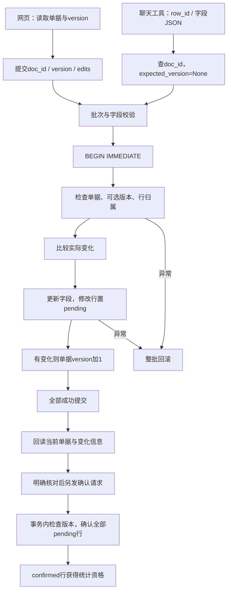

# 模块 04：人工核对、确认与事务——哪些数据有资格进入统计

阶段：第二阶段，源码深度拆解。日期：2026-10-08。

本次只讲核对与确认这一个逻辑模块。核心是 [db/review.py](C:/Users/wuhao/Documents/Enterprise_Agent/enterprise_ocr_service/db/review.py:11)，入口包括 [网页核对接口](C:/Users/wuhao/Documents/Enterprise_Agent/enterprise_ocr_service/web/product.py:103) 和 [聊天修改工具](C:/Users/wuhao/Documents/Enterprise_Agent/enterprise_ocr_service/tools/correct_tool.py:59)。OCR只解释状态来源，SQL只解释统计资格，不展开其他模块。

应用源码基准：`3095cf52376a99f2a53bbcbe2c09f3f04fe174fa`；本次开始时文档提交：`4b3bee3`。没有修改业务代码，没有调用模型或OCR。本次重跑6项相关已有测试，并做临时数据库与接口契约检查；验证范围详见末尾。

面试核心：**事务保护一批修改的完整性，版本号保护用户看到的数据是否过期，行状态控制数据能否进入统计。这三件事不同，也不等于用户授权。**

## 模块作用

### 为什么存在

OCR输出能被解析，不代表识别内容正确。用户需要对照原图修改商品、数量、金额等字段，再明确确认。系统不能把识别结果或模型说“已核对”直接当作可信统计数据。

这里的人工核对是一条确定的业务路径：读取当前单据 → 提交修改 → 校验与原子保存 → 修改行保持待确认 → 确认后进入统计。网页表格可以直接调用后端，不需要再让模型解释用户已经填好的字段。

### 解决什么问题

| 问题 | 当前机制 | 作用范围 |
| --- | --- | --- |
| OCR草稿混进统计 | 新行pending，查询只读confirmed | 控制当前记录的统计资格 |
| 修改后的旧确认仍有效 | 有实际修改的行退回pending | 修改过的数据需要重新核对 |
| 批量修改一半成功一半失败 | 一次数据库事务 | 数据、状态和版本一起提交或回滚 |
| 旧页面覆盖别人新修改 | 网页提交expected_version | 拒绝基于过期单据版本的操作 |
| 修改错单据的行 | 同时检查row_id与doc_id | 本次批量修改不能混入其他单据行 |
| 回答“已修改”却没有证据 | 聊天工具读取保存结果，返回变化和卡片 | 提供实际数据层结果，不靠模型自述 |

这些是实现机制，不是总体质量提升百分比。当前没有代表性人工核对耗时、错误率或模型成本的前后配对测量。

### 三种标识与两种状态

- doc_id：单据身份。
- row_id：某一条明细身份。
- version：整份单据的变更计数，不是行ID或完整历史快照。
- pending：这条明细尚未确认，不进入统计。
- confirmed：这条明细当前具备统计资格。

统计状态来自 `ocr_rows.status`，不能拿 `documents.status` 替代。一份单据可以同时有pending和confirmed行：修改一行不会自动撤销所有其他行的确认。

`modified_by`是调用方传入的字符串，`modified_at`是更新时间；它们不是身份认证，也不是不可篡改的完整审计轨迹。

## 核心代码流程

### 1. 从一份单据理解状态与版本

下面是固定示意场景，不是生产数据或总体测量：读取到两行金额A=100、B=240，均pending，当前单据版本1。版本起点取决于此前操作，不能把数据库默认0等同于每次OCR完成后的版本。

| 操作 | A状态 | B状态 | 文档版本 | 当前已确认金额 |
| --- | --- | --- | --- | --- |
| 读取到草稿 | pending | pending | 1 | 无已确认记录，不能据此说实际销售额为零 |
| 以版本1确认 | confirmed | confirmed | 2 | 340 |
| 以版本2将A改为150 | pending | confirmed | 3 | 240，仅B参与 |
| 以版本3重新确认 | confirmed | confirmed | 4 | 390 |
| 以当前版本4再次确认 | confirmed | confirmed | 4 | 390，changed=0 |
| 用旧版本3确认 | 不修改 | 不修改 | 4 | 返回版本冲突 |

一个批量修改不论改几行，实际有变化时版本只加1。确认实际更新待确认行时也只加1。提交相同字段值不增加版本，也不把已确认行改回pending；但过期版本仍会先被拒绝。



没有变化时跳过写字段和加版本，但依然经过文档检查。图中的确认是独立操作，不是保存修改后程序自动确认。

### 2. 读取：拿到当前单据、明细和版本

依据：[get_review](C:/Users/wuhao/Documents/Enterprise_Agent/enterprise_ocr_service/db/review.py:32)。

```python
def get_review(doc_id):
    conn = get_connection()
    try:
        doc = conn.execute('SELECT * FROM documents WHERE id=?', (doc_id,)).fetchone()
        if not doc:
            raise LookupError('单据不存在')
        rows = conn.execute('SELECT * FROM ocr_rows WHERE doc_id=? ORDER BY seq,id', (doc_id,)).fetchall()
        return {**dict(doc), 'rows': [crud._user_row(dict(row)) for row in rows]}
    finally:
        conn.close()
```

逐行解释：创建连接 → 读取单据 → 不存在报错 → 按seq/id读取其全部行 → 将数据库键转成业务键并组合输出 → 关闭连接。

version通过 [初始化增量迁移](C:/Users/wuhao/Documents/Enterprise_Agent/enterprise_ocr_service/db/database.py:33) 加到documents，默认0。不能只看最初建表语句就判断没有版本字段。

网页 [app.js](C:/Users/wuhao/Documents/Enterprise_Agent/enterprise_ocr_service/web/static/app.js:24) 用返回的 `d.version` 提交修改与确认。卡片重新加载时读取当前单据，不是冻结展示当时OCR结果。

读取当前数据不等于读取原子快照：该函数的两次SELECT没有显式读事务；本文不声称文档与明细在任意并发下始终属于同一版本。

### 3. 字段校验逐行解释

依据：[validate_fields](C:/Users/wuhao/Documents/Enterprise_Agent/enterprise_ocr_service/db/review.py:11)。

```python
def validate_fields(fields):
    if not isinstance(fields, dict) or not fields or set(fields)-set(crud.USER_FIELDS):
        raise ValueError('只允许修改单据的八个业务字段')
    result = {}
    for key, value in fields.items():
        if not isinstance(value, (str, int, float)) or isinstance(value, bool):
            raise ValueError('字段须为文本或数字')
        value = str(value).strip()
        if len(value) > 2000:
            raise ValueError('单个字段不能超过2000字')
        if key in ('amount', 'price', 'tax', 'sum') and value:
            try:
                number = Decimal(value.replace(',', '').replace('¥', '').replace('￥', '').rstrip('%'))
                if not number.is_finite():
                    raise InvalidOperation
            except InvalidOperation as exc:
                raise ValueError(f'{key} 必须是数字，可以为空或负数') from exc
        result[key] = value
    return result
```

| 原行 | 行为 | 设计理由与边界 |
| --- | --- | --- |
| 12—13 | 要求非空字典且键来自八字段白名单 | 不允许直接改status、doc_id、version等系统字段 |
| 14—15 | 逐字段处理 | 支持只提交有变化的部分字段 |
| 16—17 | 值只允许字符串或数值，排除bool | 避免True作为整数进入业务字段；None也不接受 |
| 18 | 转字符串并去两端空白 | 与当前TEXT存储契约统一 |
| 19—20 | 每字段最多2000字 | 限制单字段输入规模，不是全请求token预算 |
| 21 | 四个数值字段非空时校验 | 空值可以保留，不能解释成真实零 |
| 23 | 清理部分符号后交给Decimal | 检查能否解析，不用二进制浮点做此校验 |
| 24—27 | 拒绝NaN、Infinity与解析失败 | 不能让非有限数冒充正常业务值 |
| 28—29 | 返回strip后的原文本 | 校验用Decimal，实际仍保存文本，不保存number |

本次直接检查：空金额、负金额、全角货币符号金额和税率10%被接受；bool、NaN、abc金额、status字段被拒绝。date="not-a-date"仍被接受，因为当前没有日期语义校验。

允许负数是当前契约，不代表已经定义退款流程。百分号检查使用rstrip且对四个数值字段共用，不仅限tax；没有将税率10%标准化成0.1，也没有严格定义每种符号在各字段的合法位置。

**最容易误讲：用了Decimal校验，不等于整个项目金额均按Decimal存储和计算。** 此处number只做检查，返回的仍是文本；上一课SQL聚合还会转REAL。

### 4. 版本检查：拒绝看过旧内容的写操作

依据：[_document](C:/Users/wuhao/Documents/Enterprise_Agent/enterprise_ocr_service/db/review.py:44)。

```python
def _document(conn, doc_id, expected_version):
    doc = conn.execute('SELECT * FROM documents WHERE id=?', (doc_id,)).fetchone()
    if not doc:
        raise LookupError('单据不存在')
    if expected_version is not None and doc['version'] != expected_version:
        raise VersionConflict('单据已被更新，请刷新后重新核对')
    return doc
```

逐行解释：读取目标 → 确认存在 → 传版本时比较当前版本 → 不同就报专门冲突 → 相同或没传版本才继续。

VersionConflict继承ValueError，网页 [错误映射](C:/Users/wuhao/Documents/Enterprise_Agent/enterprise_ocr_service/web/product.py:52) 将它转409，而不是一般参数错误422；不存在转404。

例如两个页面都读到版本5，页面A先保存成为6，页面B再带5提交会被拒绝，提示刷新。它解决旧视图覆盖，不代表修改内容一定正确。

**expected_version=None会跳过比较。** 这是理解网页与聊天差异的关键，不要说数据层所有写操作都强制乐观版本检查。

### 5. save_edits：完整关键代码及逐行解释

依据：[db/review.py:53](C:/Users/wuhao/Documents/Enterprise_Agent/enterprise_ocr_service/db/review.py:53)。

```python
def save_edits(doc_id, expected_version, edits, reviewer='manual'):
    if not edits or len(edits) > 500:
        raise ValueError('请选择1至500行修改')
    normalized = [(edit['id'], validate_fields(edit['fields'])) for edit in edits]
    if len({row_id for row_id, _ in normalized}) != len(normalized):
        raise ValueError('同一行不能重复提交')
    conn = get_connection()
    changes = []
    try:
        with conn:
            conn.execute('BEGIN IMMEDIATE')
            _document(conn, doc_id, expected_version)
            for row_id, fields in normalized:
                row = conn.execute('SELECT * FROM ocr_rows WHERE id=? AND doc_id=?', (row_id, doc_id)).fetchone()
                if not row:
                    raise LookupError('修改行不存在或不属于本单据')
                before = crud._user_row(dict(row))
                changed = {k: v for k, v in fields.items() if str(before.get(k) or '') != v}
                if not changed:
                    continue
                columns = [crud._USER_TO_DB.get(k, k) for k in changed]
                conn.execute('UPDATE ocr_rows SET '+','.join(f'{key}=?' for key in columns)+
                    ",status='pending',modified_by=?,modified_at=datetime('now','localtime') WHERE id=?",
                    (*changed.values(), reviewer, row_id))
                changes.append({'id': row_id, 'before': {k: before.get(k) for k in changed}, 'after': changed})
            if changes:
                conn.execute('UPDATE documents SET version=version+1 WHERE id=?', (doc_id,))
        return {**get_review(doc_id), 'changes': changes}
    finally:
        conn.close()
```

| 原行 | 做什么 | 为什么这样设计 |
| --- | --- | --- |
| 54—55 | 要求1至500个编辑项 | 限制单批规模 |
| 56 | 在开写事务前校验全部字段 | 无效数值提前拒绝，减少持有写事务的时间；没有时延收益实测 |
| 57—58 | 拒绝重复行ID | 避免同批对一行两份修改的含糊先后 |
| 59—60 | 开连接，初始化changes | 收集实际修改，不把整个入参当保存证据 |
| 62—63 | 进入事务并BEGIN IMMEDIATE | 先取得写事务资格，再读版本和修改；失败可能等待或报锁错误 |
| 64 | 在事务中检查文档与可选版本 | 检查后到写入之间不允许另一个写事务插入修改 |
| 65—68 | 逐行读取，要求id与doc_id同时匹配 | 防止批次混入别的单据行；不存在就异常 |
| 69—70 | 映射对外字段，并按字符串比较变化 | 不做数值等价比较，100与100.00可能算变化 |
| 71—72 | 无实际变化跳过 | 不撤销确认、不产生无意义版本增量 |
| 73 | 白名单字段映射到数据库列 | desc变desc_、sum变sum_等，不由用户任意提供列名 |
| 74—76 | 参数化写值，同时置pending和修改标记 | 修改内容与资格失效一起保存，不出现新值沿用旧确认 |
| 77 | 记录本次字段before/after | 支持展示实际变化，但尚未写入专门审计表 |
| 78—79 | 有至少一个变化则文档版本加1 | 整批只加一次，状态与版本同事务 |
| 80 | 提交后重新读单据，返回changes | 返回当前数据，后续调用方可以展示保存结果 |
| 81—82 | 最终关闭连接 | with conn负责提交/异常回滚，finally负责资源释放 |

BEGIN IMMEDIATE取得的是SQLite写事务资格，不是每行独立锁，也不是长期锁住用户正在编辑的页面。版本号仍用于处理用户读取到提交之间的时间差。

字段名出现在拼接SQL中，但来源已经经过八字段白名单与固定映射；值使用占位符。不能概括为“只要用了f-string就必然注入”，也不能跳过字段校验随便拼列名。

### 6. 两类失败为什么都没有部分保存

**校验阶段失败：** 第一行金额150，第二行金额abc。第56行先校验全批，尚未进入写事务就报错，所以第一行从未写入。

**事务中失败：** 第一行合法且已执行UPDATE，第二行不存在或属于另一单据。第68行抛异常，离开with conn触发回滚，第一行金额、pending状态和版本都不应留下部分变化。

二者结果都没有部分保存，但证据不同。只测非法字段提前拒绝，不能证明“写到一半后回滚”有效。当前 [缺失行回滚测试](C:/Users/wuhao/Documents/Enterprise_Agent/enterprise_ocr_service/tests/test_product_review.py:30) 覆盖后一种；本次另用临时库检查跨单据行造成的回滚。

事务只覆盖这次数据库编辑，不能扩展成聊天历史、网络响应和外部文件的全局事务。

### 7. confirm：确认统计资格，不重新识别或重算

依据：[db/review.py:85](C:/Users/wuhao/Documents/Enterprise_Agent/enterprise_ocr_service/db/review.py:85)。

```python
def confirm(doc_id, expected_version=None, reviewer='manual'):
    conn = get_connection()
    try:
        with conn:
            conn.execute('BEGIN IMMEDIATE')
            _document(conn, doc_id, expected_version)
            count = conn.execute("UPDATE ocr_rows SET status='confirmed',modified_by=?,"
                "modified_at=datetime('now','localtime') WHERE doc_id=? AND status='pending'", (reviewer, doc_id)).rowcount
            if count:
                conn.execute('UPDATE documents SET version=version+1 WHERE id=?', (doc_id,))
        return {**get_review(doc_id), 'changed': count}
    finally:
        conn.close()
```

| 原行 | 关键逻辑 | 含义 |
| --- | --- | --- |
| 86—89 | 开连接，进入写事务 | 状态更新与版本增量同批提交 |
| 90 | 检查单据与可选版本 | 不能确认旧页面已经过时的内容 |
| 91—92 | 只更新本单据pending行 | 已确认行不重复更新；确认粒度是整份单据的所有待确认行 |
| 93—94 | 实际更新行数大于0才加版本 | 没有pending时不产生新版本 |
| 95 | 返回当前单据与changed行数 | changed是本次状态变化数量，不是整个单据总行数 |
| 96—97 | 关闭连接 | 异常时事务回滚 |

确认不会校正金额、重验图片或重新检查所有原始OCR字段。业务含义是用户认同当前待确认内容；程序仍需独立保证执行动作与用户授权绑定，当前聊天确认入口没有完整实现这种绑定。

**重复确认的准确说法：** 没有新pending行，使用当前版本再次确认时changed=0、版本不变；使用旧版本重放原请求仍可能409。这是有限的状态幂等，不是带请求ID的任意重放保证。

### 8. 网页入口与聊天入口的差异

网页 [请求结构](C:/Users/wuhao/Documents/Enterprise_Agent/enterprise_ocr_service/web/product.py:73) 要求：

```python
class ReviewAction(BaseModel):
    version: int = Field(ge=0)
    session_id: str | None = None


class BatchEdit(ReviewAction):
    edits: list[Edit] = Field(min_length=1, max_length=500)
```

version必须提供且非负，session_id可选。网页编辑调用 `review.save_edits(doc_id, body.version, ...)`，确认调用 `review.confirm(doc_id, body.version)`。

聊天 [correct_update_row](C:/Users/wuhao/Documents/Enterprise_Agent/enterprise_ocr_service/tools/correct_tool.py:59) 先解析字段JSON、查row_id对应doc_id，随后：

```python
result = review.save_edits(doc_id, None, [{'id': row_id, 'fields': data}])
```

聊天确认经 [correct_confirm](C:/Users/wuhao/Documents/Enterprise_Agent/enterprise_ocr_service/tools/correct_tool.py:102) 调用 `crud.confirm_doc`，再转到review.confirm，未传expected_version。

| 保护 | 网页表格修改/确认 | 聊天修改/确认 |
| --- | --- | --- |
| 八字段校验（修改时） | 是 | 是 |
| 数据库事务与修改后pending | 是 | 是 |
| 文档版本比较 | 请求必须带版本 | 当前传None或省略，不比较 |
| 单据与行归属检查 | 是 | 修改工具先查doc_id，再进入同一数据层 |
| 用户授权独立凭据 | 不能仅靠版本或session证明 | 当前工具签名和reviewer字符串不证明授权 |
| 核对卡片 | 直接API与历史记录 | ToolOutcome携带doc_id卡片 |

共享同一数据层，不等于所有入口具有完全相同的保护。

### 9. 保存结果怎样成为可展示证据

聊天修改工具的后半段如下：

```python
saved = next(r for r in result['rows'] if r['id'] == row_id)
changes = result['changes']
detail = '；'.join(f"{key}: {change['before'][key]} → {saved[key]}"
                  for change in changes for key in change['after']) or '数据没有变化'
status = '待确认' if saved['status'] == 'pending' else '已确认'
return ToolOutcome(f"✅ 行 #{row_id} 已更新: {detail}（已重新读取保存结果，{status}）",
                   cards=[{'type':'ocr_review','doc_id':doc_id}])
```

它从回读rows找行，结合changes输出before和实际读取值，再附核对卡片。这比只复述“模型请求把100改150”更有证据。

边界是回读在提交后、另一个连接中进行：别的操作若在中间又修改，rows可能更新到更晚版本，而changes仍属于本次事务。当前不是与本次提交版本严格绑定的审计快照；本次没有并发复现这一窗口。

网页在数据保存后另调 `_save_activity` 写对话历史。数据库编辑已提交，历史写入或响应失败不会自动撤销业务修改。用户看到错误后应先读取状态，不能仅凭网络错误认定没保存。

### 10. 会话忙检查不是整份单据的并发锁

网页 [_check_session](C:/Users/wuhao/Documents/Enterprise_Agent/enterprise_ocr_service/web/product.py:87) 在提供session_id时检查会话存在、当前是否正在跑Agent任务；忙时409，减少同会话交叉操作。

session_id可省略，这个检查只在当前进程，检查后不持续占用一个核对锁，也没有按doc_id锁定跨会话操作。不能用它证明全入口、跨会话或多进程都不会冲突。

事务保护实际数据库写入，版本比较保护旧视图；会话门禁只是附加交互限制。身份、所有权和授权又是另一层，本机单用户原型不能直接声称具备多租户隔离。

## 设计思想

### 1. 把人机协作落实为后端状态变化

核对不是聊天里说一句“请确认”就完成。pending与confirmed决定哪些行被下游SQL读取，修改后退回pending使旧确认失效，形成可检查的业务闭环。

设计目标是减少未核对或变更后数据参与统计。没有对照实验说明总体错误率下降多少；测量应看未确认行误入统计、修改后资格撤销与授权遵守。

### 2. 确定性表格操作不必再经过模型

用户已经在表格中填了准确值，直接提交后端可以避免增加一次模型理解或工具选参。聊天适合表达临时修改，表格适合多字段精确核对，两者复用相同业务校验与事务。

直接路径不调用模型是源码事实；节省多少端到端时间或费用尚未比较测量。聊天入口仍应补齐相同版本与授权语义。

### 3. 先定义不变量，再选择事务

本模块希望保持：字段合法、行属于单据、修改后待确认、状态与版本同批更新、批次失败不留半成品。一个写事务把它们纳入同一提交边界。

只依次调用每行单独提交，后面失败时前面的变化无法自动撤回；只做预校验，也不能防写入阶段异常。当前同时有预校验与事务，不是二选一。

### 4. 乐观版本与写事务解决不同时间尺度

版本处理用户打开页面到点击保存期间的过期；写事务处理开始数据库修改到提交期间的冲突。用户可能花几分钟核对，不应让数据库事务持续几分钟等待用户。

文档级version简单，但同单据不同行修改也会互相冲突；行级版本可以减少无关冲突，代价是整单确认需要明确所有行版本，接口和理解成本更高。

### 5. 变化才加版本，重复操作要讲清条件

无变化不置pending、不加版本，减少无意义的重新核对。确认只改变pending行，当前版本重复确认没有新状态变化。

这不等于任意失败重试安全：旧版本请求可能冲突，修改与确认之间也可能插入新的编辑。需要请求ID、执行状态和明确版本才能设计更强的重放语义。

### 6. 明确共享校验与入口能力差异

数据层共享避免网页能保存一套格式、聊天保存另一套格式，但expected_version是否提供由入口决定。服务端校验不能依赖前端按钮是否禁用，授权也不能仅依赖提示词。

当前系统提示要求明确确认，工具侧缺少与授权单据/版本绑定的独立凭据。这个判断是代码边界，不是本次真实模型越权复现。依据：[已知待验证问题](C:/Users/wuhao/Documents/Enterprise_Agent/enterprise_ocr_service/docs/agent-retrospective-open-questions-2026-10-05.md:24)。

### 7. 替代方案及权衡

| 方案 | 适用场景 | 需要付出的代价 |
| --- | --- | --- |
| 仅前端校验 | 提前反馈输入问题 | 不能约束聊天或其他调用，不能替代后端校验 |
| 每行独立提交 | 各行确实是独立任务 | 整批失败可能部分保存，需向用户明确 |
| 当前文档版本+批次事务 | 整单核对、小批量编辑 | 同单据不同行也可能产生版本冲突 |
| 行级版本+批次事务 | 多人独立核对不同行 | 整单确认的版本集合与冲突处理复杂 |
| 编辑产生不可变修订，确认修订ID | 强追溯、历史文件需绑定批准版本 | 存储、迁移、界面与查询复杂度增加 |

没有这些方案的同条件性能与质量配对。本机原型可以先补齐现有契约，而不是为了展示技术栈立即引入复杂审批系统。

## 如果重构

以下仅为建议，没有实施，没有可比前后收益测量。

### 1. 优先统一版本与授权契约

网页、聊天和兼容修改/确认入口均明确doc_id、预期版本与用户动作来源。确认应绑定用户实际看过并明确同意的单据版本，不能用reviewer字符串当授权凭据，也不能让模型自填一个布尔值冒充授权。

版本只能证明内容新鲜度，授权证明是否允许操作，二者都需要。先在本机交互中设计可验证的确认动作，再决定跨用户身份体系。

验收覆盖旧页面、聊天持有旧数据、仅要求查询却调用确认、确认错单据和确认后又有修改；指标为过期写入接受率、未授权状态变化与正确拒绝率。当前未做完整真实模型越权评估。

### 2. 返回与本次提交绑定的证据

在事务内收集本次修改后的字段、提交版本与操作ID，返回明确的operation_result；把“当前最新单据”作为另一份可刷新的视图。

避免本次changes与提交后更晚的rows混在一起，也便于网络失败后查执行状态。用并发注入验证结果与操作版本一致性；当前没有这一窗口的复现比例。

### 3. 让业务提交与活动记录的关系可恢复

当前业务提交和聊天历史分开写。若需要二者强一致，可在同一数据库事务写业务变更与活动事件，再由其他层展示；或者以操作ID实现可重建的活动记录。

网络响应仍不可能被数据库回滚，需查询操作状态。验收在提交后、历史写入前和响应前注入故障，检查是否能发现已完成操作，避免误重试。不要承诺仅加事务就解决所有网络不确定性。

### 4. 明确数值与日期的业务规范

保留原始文本和经过验证的规范值，字段分别定义货币符号、数量精度、百分比、负数与空值政策；日期要定义支持格式与非法值处理。不能将可解析Decimal或有限值当完整业务合法性。

比较存储规范、查询解析和办公快照的一致性；测解析拒绝、格式造成的假变化、金额误差和空值误判。本次校验探针只是边界示例，没有总体数据质量结论。

### 5. 扩展可追踪变更记录

当前changes在返回值与可选聊天活动中，行上只保留最后修改者和时间。可增加独立操作记录，保存doc_id、row_id、before/after、旧/新版本、确认对象、来源和结果。

是否要不可变修订或事件溯源应由追溯需求决定。目标是可解释“谁在何版本改了什么”，并测回放与故障恢复完整性，不把一条modified_by字段称为完整审计。

### 6. 根据真实冲突再调整版本粒度

当前以文档版本控制冲突，先统计实际冲突原因、刷新次数与编辑耗时，再考虑行级版本或受限字段合并。禁止自动合并金额冲突后替用户确认。

锁等待、事务时长、版本冲突率与用户完成时间需要代表性多窗口/并发任务；目前没有基线，不能声称换锁或版本粒度会快多少。

## 面试考点

| 可能被问什么 | 面试官想确认什么 | 要讲清的实现 |
| --- | --- | --- |
| Human-in-the-loop怎么落地？ | 是否有真实业务状态 | 修改与确认分开，pending不进统计 |
| 改一行为何整单不重新待确认？ | 是否理解状态粒度 | 行状态单独控制，未改行保留confirmed |
| 批量修改如何原子？ | 是否掌握提交边界 | 预校验全批，事务内更新字段、状态和版本 |
| 为什么BEGIN IMMEDIATE？ | 是否区分事务与用户编辑 | 开始写操作前取得写事务资格，不长期锁页面 |
| version如何防旧覆盖？ | 是否理解乐观检查 | 事务内比较预期版本，有实际变化才加版本 |
| 所有入口都检查version吗？ | 是否有能力边界 | 网页必须传，聊天当前跳过 |
| Decimal是否代表金额精确？ | 是否分清校验、存储、计算 | 此处校验，保存TEXT，SQL仍用REAL |
| 重复确认安全吗？ | 是否理解幂等范围 | 当前版本且无pending不改变，旧版本可能409 |
| 保存失败一定没修改吗？ | 是否理解响应与提交区别 | 业务提交后历史或网络失败仍可能已经保存 |
| reviewer是授权吗？ | 是否理解身份与意图 | 只是字符串，当前没有完整授权绑定 |
| changes能完整审计吗？ | 是否理解证据粒度 | 本次返回变化，非独立不可变历史；回读有时间窗口 |
| 怎样验证？ | 是否有针对性故障思维 | 分预校验失败、事务中失败、过期写与无变化检查 |

## 高频追问

### 1. “都人工确认了，为什么修改后还要确认？”

**继续深挖：** 能否只改金额，保留原confirmed？

**回答：** 原确认对应旧内容，修改使它失效。字段更新与pending在同一事务，防止新金额沿用旧确认；其他未修改行继续confirmed。当前没有按字段风险保留部分确认的规则。

### 2. “有事务还要version做什么？”

**继续深挖：** 两个页面先后提交，事务都成功是不是正确？

**回答：** 事务保证每次内部完整，不能判断第二个页面是否基于旧内容。版本拒绝过期视图；两者分别保护不同时间段。聊天不传版本仍可能基于旧观察修改。

### 3. “先把所有字段校验完，不就不用回滚了？”

**继续深挖：** 第二行不存在、数据库中途失败呢？

**回答：** 预校验只覆盖格式，后续归属检查和数据库写入仍会失败。当前缺失行测试在第一行UPDATE后失败，验证整批回滚；非法数值提前拒绝是另一种证据。

### 4. “为什么列名拼SQL不会让用户改status？”

**继续深挖：** SQL值与列名分别怎么保护？

**回答：** 字段先经过八字段白名单，再固定映射数据库列；值使用占位符。status不在允许字段内，只由业务逻辑设置。前提是所有写调用都经过这条校验路径。

### 5. “100改100.00会重新待确认吗？”

**继续深挖：** 你比较的是文本还是金额等价？

**回答：** 当前按字符串判断实际变化，因此格式差异也可能触发pending与版本增量。完全相同的文本不触发；若要数值等价判断，应定义规范化规则并保留原始票面文本。

### 6. “重复点击确认有幂等键吗？”

**继续深挖：** 原请求版本不变再发一次会怎样？

**回答：** 当前没有请求幂等键。无新pending且带当前版本时changed=0，版本不变；原版本在第一次确认后过期，重放可能409。状态层面的无重复变更不等于任意请求重放返回相同结果。

### 7. “保存报错后是否直接再提交？”

**继续深挖：** 提交成功但写聊天历史失败呢？

**回答：** 业务修改可能已经提交，错误不能证明没执行。先读取当前版本与字段；更完善设计需要操作ID和状态查询，避免将网络失败当事务回滚。

### 8. “确认时后端怎么知道用户真的同意？”

**继续深挖：** 模型传reviewer=manual可以吗？

**回答：** 字符串不证明身份或意图。网页点击有明确交互，但服务端仍需绑定单据版本和授权来源；聊天当前缺少独立授权凭据。本次只指出代码边界，没有真实模型越权复现。

### 9. “会话忙检查能防所有并发吗？”

**继续深挖：** 另一会话修改同一单据呢？

**回答：** 当前检查可选、进程内、按会话，且检查后不持续占用核对锁。数据库事务和版本才保护实际写入及旧视图，不能把会话限制推广到跨会话、多进程或身份隔离。

### 10. “Decimal校验为什么还可能算错？”

**继续深挖：** tax=10%保存成什么？

**回答：** 校验只检查清理符号后的值可解析且有限，保存仍是10%原文本，不是0.1。下游解析与舍入规则需要对齐，不能把局部校验当全链路金额精度保证。

### 11. “回读是不是证明了本次提交的准确结果？”

**继续深挖：** 回读前别人又修改呢？

**回答：** 它比复述请求更可靠，但回读在提交后，可能读到更晚版本；changes属于本次操作。要严格绑定需返回事务内操作结果与提交版本，并区分当前视图。该并发窗口本次未复现。

### 12. “人工核对提高了多少准确率？”

**继续深挖：** 6个测试通过能当业务准确率吗？

**回答：** 测试证明选定状态、事务与版本场景满足预期，不测人是否发现OCR错误。业务收益需要固定单据、独立标注，对比字段正确率、未确认数据误入统计与核对耗时；目前没有可比提升值。

## 标准回答

### 1. 主问：你的人机核对机制怎么设计？

> OCR先写pending，用户通过表格或聊天查看和修正，明确确认后行状态变confirmed，统计只读这些行。修改已确认行时，字段与pending一起保存，使旧确认失效；同单据未修改行继续保留确认。批量保存先校验全批，再在一个事务中检查单据、版本和行归属，更新字段、状态与文档版本。这样既能防部分保存，也能让网页拒绝过期提交。当前聊天入口没有传版本，授权绑定也不完整，这些不能夸大成全入口保证。

### 2. 追问：事务和版本的区别是什么？

> 事务保证这批修改要么全部成功，要么全部回滚，包括字段、状态和版本；版本检查判断用户提交是否仍基于当前单据。两个页面可以各自事务成功，却由旧页面覆盖新内容，因此还需要expected_version。当前检查放在BEGIN IMMEDIATE之后的同一事务里，避免检查与写入之间插入其他写操作；但用户编辑页面期间不会一直持有数据库锁。

### 3. 追问：如何证明回滚有效？

> 要区分提前拒绝与写到一半回滚。非法数值在事务前全批校验就失败，不能单独证明回滚。已有测试先修改合法第一行，再遇到不存在的第二行，随后检查第一行金额和版本恢复。本次重跑相关6项测试，并用临时数据库检查第二行属于另一单据时整批回滚。这支持选定场景，不代表所有并发和外部操作都被覆盖。

### 4. 追问：确认是否幂等？

> 当前确认只更新pending行，没有新pending且使用当前版本重复确认时changed为0，版本不变。但原确认请求携带的旧版本再次提交可能409，系统没有请求ID级幂等重放。修改后还需要重新确认，因为原确认不能自动适用于新内容。

### 5. 追问：用户授权由什么保证？

> pending和confirmed控制统计资格，版本检查内容是否过期，它们都不证明用户同意。当前提示要求用户明确确认，网页提供明确按钮，但聊天工具没有独立的授权单据和版本凭据，reviewer只是字符串。后续应把可验证的确认动作、doc_id和版本绑定，并在工具执行边界检查，不能让模型自报已授权。

### 6. 追问：会优先重构什么？

> 先统一网页与聊天的版本契约，并把确认授权绑定具体单据版本；然后返回与本次提交绑定的操作证据，处理业务已提交但响应失败的状态查询。金额与日期再共享规范化规则。验收看过期和未授权状态变化、回滚完整性及故障后恢复，而不是先承诺准确率或延迟提升。

### 7. 最短复述

> 事务防半批保存，版本防旧视图覆盖，行状态防未确认数据参与统计。修改后重新待确认，明确确认才恢复统计资格；这三层仍不能替代用户授权和数据质量验证。

### 本次验证记录

2026-10-08，重跑已有相关测试：

```powershell
.\.venv\Scripts\python.exe -m pytest tests/test_product_review.py -q -k 'missing_row or chat_edit or edit_confirmed or batch_edit or repeat_confirmation'
```

结果：**6 passed, 3 deselected**。覆盖不存在行不报成功、聊天前后值与卡片、事务中缺失行回滚、修改已确认行退回pending、批量校验与旧版本拒绝、当前版本重复确认不改变。

证据入口：[聊天修改测试](C:/Users/wuhao/Documents/Enterprise_Agent/enterprise_ocr_service/tests/test_product_review.py:20)、[事务回滚测试](C:/Users/wuhao/Documents/Enterprise_Agent/enterprise_ocr_service/tests/test_product_review.py:30)、[状态测试](C:/Users/wuhao/Documents/Enterprise_Agent/enterprise_ocr_service/tests/test_product_review.py:69)、[版本与确认测试](C:/Users/wuhao/Documents/Enterprise_Agent/enterprise_ocr_service/tests/test_product_review.py:78)。

另用临时数据库检查跨单据行整批回滚、无变化保留confirmed与版本、过期确认拒绝、当前版本重复确认；直接检查字段校验、ReviewAction必须带version而session可选，以及异常到409/404/422的映射。没有新写测试文件，没有发送HTTP或执行浏览器并发测试，不能把直接函数/模型结构检查说成真实HTTP端到端验证。

没有调用真实模型或OCR，未更改生产数据库，没有总体准确率、核对耗时或费用前后测量。本次文档中的并发回读窗口和授权限制仍是边界分析，未宣称已端到端复现或修复。

下一个模块讲OCR接入、解析与原子入库：解释这些pending草稿如何生成，以及识别或入库失败时旧数据为什么能保留。本次不展开第二个模块。
