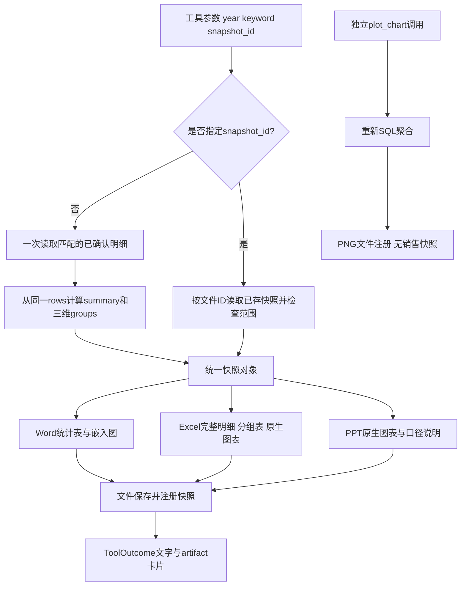

# 模块 08：销售快照与图表、Office生成——让交付文件有一致的数据依据

阶段：第二阶段，源码深度拆解。日期：2026-10-09。

核心源码：[services/sales_snapshot.py](C:/Users/wuhao/Documents/Enterprise_Agent/enterprise_ocr_service/services/sales_snapshot.py:17)、[Word工具](C:/Users/wuhao/Documents/Enterprise_Agent/enterprise_ocr_service/tools/report_tool.py:30)、[Excel/PPT工具](C:/Users/wuhao/Documents/Enterprise_Agent/enterprise_ocr_service/tools/office_tool.py:28)、[PNG图表工具](C:/Users/wuhao/Documents/Enterprise_Agent/enterprise_ocr_service/tools/plot_tool.py:48)。文件注册、预览在模块09展开。

应用源码基准：`3095cf52376a99f2a53bbcbe2c09f3f04fe174fa`；本批开始文档提交：`38424b5`。本次只增加学习文档，不修改业务代码。与模块09、10共同运行48项相关测试，其中本模块对应12项；没有真实LLM、OCR或Office COM转换调用。

核心观点：**快照保证多种文件可以基于同一次取数，不保证数据本身正确，也不保证模型每次主动复用正确快照。**

## 模块作用

### 为什么存在

假设先生成Word时金额是300，期间用户修改并确认了50，再生成Excel时金额变成350。如果每个文件都独立查询最新数据，同一个汇报任务就可能交付不同数字。

当前做法是先获取已确认明细，在内存中形成rows、groups、summary、filters与created_at，再把同一个快照传给不同文件生成器。生成文件后，快照作为JSON存入该文件注册记录；后续工具携带snapshot_id，可以复用之前的数据。

### 负责什么，不负责什么

| 层次 | 当前职责 | 不能据此证明 |
| --- | --- | --- |
| 数据范围 | 复用已确认状态、年份和关键词过滤 | OCR原文准确、人工确认准确或用户有操作权限 |
| 快照 | 固定本次已读到的明细及聚合 | 与之前聊天中另一次SQL结果必然一致 |
| 格式生成 | 程序生成Word、Excel、PPT及图表 | 任意主题文档、复杂财务建模或自由编辑 |
| 文件证据 | 保存实际文件并返回卡片 | 页面已显示、预览成功或内容全面正确 |

这里的“snapshot”是业务数据快照，和模块02的最近成功查询条件状态不同。前者包含实际明细及统计值，后者主要是查询条件；它也不是数据库备份或Agent执行checkpoint。



最后一条是重要例外：独立PNG图表没有snapshot_id参数；Word内部绘图则显式使用报告快照。

## 核心代码流程

### 1. 先处理年份，再决定复用还是重新取数

[capture](C:/Users/wuhao/Documents/Enterprise_Agent/enterprise_ocr_service/services/sales_snapshot.py:17)：

```python
year=str(year).strip().removesuffix('年')
if year and not re.fullmatch(r'\d{4}',year):
    raise ValueError('年份须为四位年份或留空')
if snapshot_id:
    snapshot=artifacts.get(snapshot_id)['snapshot']
    if not snapshot.get('summary'):
        raise ValueError('此文件没有可复用的销售数据快照')
    if (year and year!=snapshot['filters']['year']) or (keyword and keyword!=snapshot['filters']['keyword']):
        raise ValueError('快照与指定过滤条件不一致，请使用新查询或原快照条件')
    return snapshot
```

逐行理解：

1. 接受“2024年”并转成“2024”，非空年份必须是四位数字。
2. 指定snapshot_id时，通过文件注册表读取快照，不重新查询业务表。
3. 没有summary的记录不能作为销售快照复用；独立PNG注册时没有这个快照。
4. 显式非空筛选与旧快照不一致就拒绝，防止挂着旧ID却声称用了新范围。
5. 年份或关键词留空时，不要求旧快照对应值也为空，而是沿用旧范围。

因此，传旧snapshot_id且year留空，并不代表“重新查全部年份”。要求最新或新范围时，应省略旧ID重新捕获。group_by只是展示选择，可以在同一快照的三种聚合之间切换。

当前snapshot_id实际上是带快照的artifact_id，不是独立快照表主键。artifacts.get还检查原文件是否存在；原文件被移动或删除后，即使快照JSON仍在表里，这个读取入口也会失败。这是数据快照与文件生命周期的耦合。

### 2. 从同一份已确认明细计算所有结果

新快照的读取段：

```python
conn=get_connection()
try:
    with conn:
        conn.execute('BEGIN')
        where,params=crud._where_params(keyword or None,year or None)
        rows=[crud._user_row(dict(r)) for r in conn.execute(
            'SELECT r.*,d.file_name FROM ocr_rows r JOIN documents d ON r.doc_id=d.id WHERE '+where+
            ' ORDER BY r.date_,r.doc_id,r.seq,r.id',params).fetchall()]
finally:
    conn.close()
```

- 显式开启事务，复用CRUD层过滤口径，参数值仍绑定到SQL。
- 一次JOIN读取匹配明细及源文件名；这里不是多次分别查询Word、Excel和PPT的数据。
- fetchall后得到本次rows，关闭连接，再在内存聚合。之后数据库变化不会自动改变这个列表。
- BEGIN不意味着跨整个文件生成期间锁住所有业务写入，也不绑定更早的聊天查询。

代价是完整明细进入内存，后面还保存为JSON。不能把它描述为面向任意规模数据的流式导出。

### 3. 数值解析与业务口径

[number](C:/Users/wuhao/Documents/Enterprise_Agent/enterprise_ocr_service/services/sales_snapshot.py:9)：

```python
def number(value):
    try:
        result=Decimal(str(value or '0').replace(',','').replace('¥','').replace('￥',''))
        return result if result.is_finite() else Decimal(0)
    except InvalidOperation:
        return Decimal(0)
```

移除逗号及货币符号，用Decimal累计，保留负金额。字段口径仍是amount=数量，sum=票面金额，不用数量乘单价覆盖票面值。

但当前空值、非法数值、NaN或Infinity被转成0，这是容错约定，不是数据质量证明。缺失金额和真实零金额会在该转换层被混合，应在重构时明确异常与缺失处理。

内部累计用Decimal，输出groups和summary又转成float，Office写入数值也使用float。不能声称从数据库到所有格式全程精确Decimal，更不能当作已验证的财务级精度契约。

### 4. 三种聚合来自同一个rows

```python
for key in ('item','desc','date'):
    grouped={}
    for row in rows:
        name=str(row[key] or '')
        entry=grouped.setdefault(name,{'group':name,'rows':0,'amount':Decimal(0),'total':Decimal(0)})
        entry['rows']+=1
        entry['amount']+=number(row['amount'])
        entry['total']+=number(row['sum'])
    groups[key]=[{**g,'amount':float(g['amount']),'total':float(g['total'])}
                 for g in sorted(grouped.values(),key=lambda g:g['total'],reverse=True)]
```

外层分别按商品、顾客公司、发注日聚合；内层累计行数、数量和金额；最后按金额降序。summary另外从同一rows计算总行数、不同doc_id数量、总数量和总金额。

明细行数不等于单据数；按日期分组也不自动变成按月或按年趋势。created_at是在快照对象构造时记录的时间，不是业务数据版本号。

### 5. Word：固定表格模板，图表失败可以降级

[generate_report](C:/Users/wuhao/Documents/Enterprise_Agent/enterprise_ocr_service/tools/report_tool.py:30)先capture，再生成总览、商品/公司/日期表格与可选图表。

- 总览覆盖完整匹配范围；Word各分组表最多15组，超过时明确说明省略。
- 占比分母使用完整groups金额合计，而不是前15组金额；存在负金额或净额为零时，当前占比表达未建立更严格业务规则。
- 嵌入图调用_collect_data(...,snapshot=snapshot)，不再次SQL取数。
- 嵌入图使用完整标签，不等于Word表格只展示15组；大量长标签可能拥挤。
- 图表异常时保留统计表，报告正文及工具结果都说明“图表未生成”。这属于可见降级，不能当成完整图文交付成功。
- finally关闭图对象并移除临时PNG；Word文件名带UUID，重复生成不会覆盖旧文件。

Word不是LLM自由撰写的经营分析。当前没有足够同期数据时，不应声称自动生成同比、因果结论或预测。

### 6. Excel：完整数据与有限展示分开

[generate_excel](C:/Users/wuhao/Documents/Enterprise_Agent/enterprise_ocr_service/tools/office_tool.py:28)：

```python
with xlsxwriter.Workbook(str(path),{'strings_to_formulas':False,'strings_to_urls':False}) as workbook:
    header=workbook.add_format({'bold':True,'bg_color':'#24443C','font_color':'white','border':1,'text_wrap':True})
```

这一配置避免输入字符串被自动当成公式或URL；明细文本还显式write_string。它不是完整的任意文件安全或宏安全方案。

工作簿包括统计概览、销售明细、按商品/公司/日期汇总，完整导出匹配明细和全部分组。原生柱状图只引用选定维度前15组，概览说明展示限制。完整数据保留在表中，不代表图中已展示全部数据。

数值列写成可编辑数值，图表是工作簿原生图表；不是把PNG贴进Excel，也没有实现复杂财务公式模型。没有匹配数据则不生成文件卡片。

### 7. PPT：原生图表、固定结构与截断说明

[generate_presentation](C:/Users/wuhao/Documents/Enterprise_Agent/enterprise_ocr_service/tools/office_tool.py:87)使用python-pptx创建封面、概览、分析页和口径页。分析维度取group_by、desc、item并去重。

CategoryChartData和add_chart创建原生图表，可编辑数据；每个分析维度最多10组，长标签截短，并显示分组总数、展示数、省略数。展示前10组不等于全量总额，概览仍来自快照完整summary。

模板写“完整数据见Excel”，但PPT工具自己不会自动生成Excel。用户单独要求PPT时，这个提示不证明Excel已经交付；要由任务编排实际生成并检查文件。

### 8. 独立PNG与嵌入图的区别

[plot_chart](C:/Users/wuhao/Documents/Enterprise_Agent/enterprise_ocr_service/tools/plot_tool.py:48)验证分组与bar/pie选项，再通过_collect_data重新SQL聚合。饼图要求金额非负且总额大于0，否则明确拒绝；柱状图可以显示负金额。

独立PNG使用UUID文件名，savefig后finally关闭图对象，再注册文件卡片。_collect_data虽然支持内部snapshot参数，但plot_chart公开工具没有snapshot_id参数，当前调用不会利用旧快照。

因此正确面试表述是“Office三格式支持显式同快照；Word嵌入图使用报告快照”，而不是“所有图表与所有文件永久使用同一数据”。

### 9. 文件证据怎样返回Agent

[Office结果封装](C:/Users/wuhao/Documents/Enterprise_Agent/enterprise_ocr_service/tools/office_tool.py:19)：

```python
ident=artifacts.register(path,kind,snapshot)
label='Excel' if kind=='xlsx' else 'PPT'
return ToolOutcome(f'{label}已生成: {path}\n统计范围：{snapshot["filters"]}；'
    f'票面金额合计 {snapshot["summary"]["total_sum"]:.2f}；snapshot_id={ident}。文件卡片提供预览与下载。',
    cards=[{'type':'artifact','artifact_id':ident}])
```

ToolOutcome继承str：文字进入模型ToolMessage，cards供界面显示。快照ID也出现在文字里，让下一次工具调用有机会显式复用。

Agent对已生成声明有有限模式检查，并检查对应工具返回路径存在。但这主要证明某类生成工具有成功证据，不会逐句核验全部文件内容、范围和快照关系；不能替代内容验收。

文件保存与数据库注册是两个步骤。如果文件写成后注册失败，可能留下未登记文件；如果用户重新请求，也可能生成新UUID文件。唯一文件名避免覆盖，不等于重试幂等。

## 设计思想

### 1. 模型选工具，程序计算并排版

数字和表格由已确认明细计算，避免模型凭记忆重写金额；LLM负责理解意图、选择格式和传参。模型仍可能选错范围或漏生成格式，因此工具正确不等于任务成功。

替代方案是模型生成全文或代码，自由度更高，但需额外验证数据来源、生成代码安全及排版稳定性。当前固定销售模板覆盖的需求有限，不能包装成通用办公Agent。

### 2. 一次取数，多个渲染器

把业务数据与格式生成分开，有利于核对三格式是否使用同一rows和summary。若数据库在文件生成期间变化，显式复用旧快照仍可保持一致。

这个设计优先一致性与可追溯性，不自动追求最新。用户要求最新时必须重新捕获；一致但过时与最新但跨文件不一致，是两种需要分别评估的问题。

### 3. 展示截断不改变全量统计

Word表15组、Excel图15组、PPT图10组，完整总额与Excel明细另行保留。好处是有限版面更可读，代价是部分分组不可见；省略说明是数据契约的一部分。

### 4. 可降级，但不掩盖缺失

Word绘图失败仍保留统计表，减少整份报告失败；同时在文件与工具结果披露缺图。这改善故障可用性目标，但本次没有可比的报告成功率或延迟收益。

## 如果重构

以下建议未实现，未测得新旧收益。

| 优先项 | 原因 | 应测指标与验证 |
| --- | --- | --- |
| 独立snapshot表与统一ID | 避免快照依赖原文件存在、各artifact重复保存完整JSON | 删除原文件后复用成功率、存储量、跨格式快照一致率 |
| PNG工具支持显式快照 | 独立图表与Office当前可能重新取数 | 生成间插入修改，检查图表与文档金额/范围是否一致 |
| 数值质量与精度契约 | 缺失/非法值转0、最终float可能掩盖问题 | 缺失检出率、金额误差、负数和高精度测试 |
| 原子发布与幂等运行ID | 文件存在和注册成功不是同一事务 | 磁盘/注册失败后孤儿文件数、重复生成率 |
| 大数据导出和版面策略 | 当前全量fetchall及全标签绘图 | 峰值内存、文件大小、生成P95、长标签溢出率 |

### 现有证据与本次验证

[跨格式测试](C:/Users/wuhao/Documents/Enterprise_Agent/enterprise_ocr_service/tests/test_office_exports.py:35)先生成Word，再改变实时业务明细，然后用原ID生成Excel、PPT。检查三份注册快照相等、Excel明细总额75、PPT包含75.00。它验证工具级显式复用，不验证模型自主选择正确ID，也没有进行真实Office渲染。

[业务文件测试](C:/Users/wuhao/Documents/Enterprise_Agent/enterprise_ocr_service/tests/test_business_artifacts.py:1)验证年份范围、文件不覆盖、非法选项、零总额饼图拒绝、缺图降级、图对象与中间文件清理。本批这两文件共12项通过，属于共享48项测试的一部分，不是另加12项。

历史[产品验证](C:/Users/wuhao/Documents/Enterprise_Agent/enterprise_ocr_service/docs/evals/product-upgrade-2026-10-03.md:1)记录一次真实模型三格式任务，5个检查通过、12.765秒。脚本检查回答事件、无error、三个格式、正确总额和快照相等；单次任务不是总体成功率。“5个检查”也不是5个独立用户任务，更不是通用语义与排版满分。

本次没有重跑真实模型或Office预览，没有可比的新旧质量、延迟和成本结果。48项完整执行命令与边界见[模块10](C:/Users/wuhao/Documents/Enterprise_Agent/enterprise_ocr_service/notes/module_evaluation_metrics.md:1)。

## 面试考点

| 问题 | 必须说清 |
| --- | --- |
| 快照解决什么？ | 固定数据输入，减少多格式生成期间的数据漂移 |
| snapshot_id是什么？ | 当前是文件记录ID，通过该记录保存的JSON复用 |
| 图表是否也同快照？ | Word嵌入图是；独立PNG工具默认重新查SQL |
| 如何保证金额可信？ | 票面sum、已确认过滤、范围与全量统计；仍需数据质量验证 |
| Excel与PPT能编辑吗？ | 程序生成原生工作表与图表；不是任意文档编辑系统 |
| 文件生成证据是什么？ | 工具结果、实际文件、注册卡片；内容与预览另外验收 |

## 高频追问

### 追问1：同一数据库不就天然一致吗？

不同时间的独立查询可能读到不同已提交数据。数据库相同不等于取数时刻相同；同快照让多个渲染器使用同一份已经读出的明细。

### 追问2：用户问“最新数据”，还能复用旧ID吗？

不应自动复用。旧ID代表旧数据，要明确重新capture；当前空year不会使旧快照自动转成全量范围。历史文件保持旧值是合理的版本留存，不是自动同步文件。

### 追问3：Decimal是否已经解决金额精度？

只在解析与累计阶段使用，之后转float并进入Office数值。还需要定义舍入、币种、缺失和大数边界，再用独立oracle验证，不能仅凭导入Decimal就宣称财务级精度。

### 追问4：SQL正确，报告就正确吗？

还要检查筛选条件、快照ID、字段标签、完整/截断范围、文件内容与渲染。模型选错年份时，程序可能正确生成一份不符合用户要求的报告。

### 追问5：你如何证明没有编造文件？

生成工具先实际写文件再注册，Agent还有有限完成声明证据检查。检查只覆盖已知模式和工具级成功，不能证明最终回答引用的每条路径、每个数字都正确；需要按artifact逐项验收。

### 追问6：图表失败却继续算不算掩盖错误？

当前Word保留统计表，但文件正文与工具结果明确说明缺图。验收应把“可用统计报告”和“完整图文报告”分开，不把降级结果计入全部要求满足。

## 标准回答

### 30秒

“我用统一销售快照组织Office输出。先读取匹配的已确认明细，再从同一rows计算总览与商品、公司、日期分组。Word、Excel、PPT可以显式复用此前文件记录里的快照，避免生成期间数据变化导致三份数字不同。模型负责选工具和参数，数字与固定模板由程序生成。”

### 90秒，包含取舍

“这个模块优先解决数据一致性和可核对交付。快照保存过滤条件、时间、完整明细和聚合，生成工具返回带快照的文件ID，下一格式显式传ID复用。Excel保留全部明细与分组，Word表和PPT图只展示部分分组并披露省略，总额仍按完整快照计算。

“我不会说所有输出天然一致：独立PNG工具仍重新查SQL，聊天中之前的统计也未自动绑定到该快照。旧快照一致但可能过时，用户要最新时重新捕获。当前快照还依赖原文件记录、完整明细占内存、非法数值转0且最后转float，后续需要独立快照存储和数值契约。

“本次12项相关工具测试通过，其中数据库修改后复用旧快照，三格式仍保持75的总额。这不等于真实模型路由或Office排版的总体正确率，二者需要单独测量。”

本模块之后衔接[模块09：文件注册与预览](C:/Users/wuhao/Documents/Enterprise_Agent/enterprise_ocr_service/notes/module_artifact_preview.md:1)。
