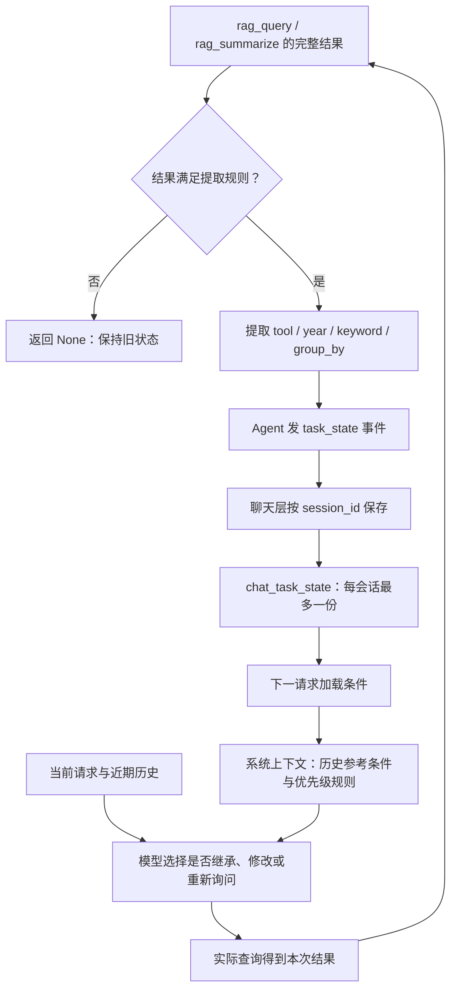

# 模块 02：结构化任务状态——如何在历史截断后延续查询条件

阶段：第二阶段，源码深度拆解。日期：2026-10-07。

本次只讲“最近成功查询条件”的提取、存储、更新与使用，属于一个逻辑模块。核心实现分在 [agent/task_state.py](C:/Users/wuhao/Documents/Enterprise_Agent/enterprise_ocr_service/agent/task_state.py:6) 和 [db/task_state.py](C:/Users/wuhao/Documents/Enterprise_Agent/enterprise_ocr_service/db/task_state.py:6)，调用点只用于解释它的输入与输出，不展开其他模块内部。

应用源码基准：`3095cf52376a99f2a53bbcbe2c09f3f04fe174fa`；当前文档基准提交：`dbed29e`。本次不改业务代码，没有重新调用模型或运行历史业务评估。

面试核心：**这个模块保留最近一次有匹配记录的查询条件，使条件可以跨越近期消息窗口；它不保存完整任务、全部历史或金额结果。**

## 模块作用

### 为什么存在

主聊天读取最近10条消息。用户先说“查询2024年甲公司的销售额”，再插入多轮别的话题，最早条件可能退出模型上下文。之后问“继续刚才的统计”，模型缺少年份与公司，无法可靠确定查询范围。

数据库保存了完整对话，也不等于模型每次会读全部对话。直接扩大历史窗口只能推迟截断，并可能增加输入 token、等待和费用；它不会自动选择重要信息。

这个模块把查询任务里最常复用的少量条件单独持久化。下一次请求即使只读最近10条消息，仍可加载这些条件供模型参考。

### 解决什么问题

解决一个具体的连续交互问题：**当前请求明确延续上一份成功查询，近期历史却不包含完整筛选条件时，减少用户重新说明条件的需要。**

它有两类价值：

- 质量目标：降低缺少上下文时的条件丢失或错误猜测。
- 交互目标：在合适的延续场景中减少重新提问年份、对象和分组方式。

可能增加的输入是状态 JSON 与使用规则；并非没有 token 成本。当前没有这一模块总体准确率、稳定时延或实际费用改善的代表性测量。

### 它保存什么

实际状态形状如下。这里用源码接受的示意值，不是本次运行结果：

```json
{
  "tool": "rag_summarize",
  "year": "2024",
  "keyword": "甲公司",
  "group_by": "desc"
}
```

| 字段 | 表达什么 | 不表达什么 |
| --- | --- | --- |
| tool | 最近符合条件的查询来自明细还是聚合工具 | 整个任务所有已完成步骤 |
| year | 执行查询的年份，空字符串表示没有年份筛选 | 任意日期区间、多个年份的完整比较任务 |
| keyword | 公司、商品等工具关键词原值 | 用户任意排除规则、多实体关系或所有查询限制 |
| group_by | 分组维度或空值 | 报告排版要求、图表类型、文件交付进度 |

状态没有金额、数量、明细、文件 ID 或业务数据快照。它回答“此前成功查过什么范围”，新查询的答案还要由实际工具结果提供。

### 与其他 Memory 的边界

| 信息 | 标识和作用 | 本模块是否负责 |
| --- | --- | --- |
| 会话历史 | session_id 下的用户与助手消息 | 否，只接收其缺失条件背景 |
| 最近成功查询条件 | session_id 下的一份结构化状态 | 是 |
| 显式长期偏好 | profile_id 下的回答习惯等 | 否，当前任务条件不自动变成用户偏好 |
| 销售业务数据快照 | 文件生成时冻结的行、分组和总计 | 否，状态里没有这些数据 |
| 执行检查点 | 已完成步骤、下一步、操作证据 | 否，不能据此断点恢复运行 |

表面上都可以叫 Memory，但设计时要区分保存对象、作用域、更新规则和可信来源。这个模块有持久存储，语义上仍是会话内任务条件，而非跨会话个人长期记忆。

## 核心代码流程

整个路径是：**完整查询工具结果 → 提取合格条件 → 发 task_state 事件 → 按会话 UPSERT → 下次加载 → 加入模型上下文并说明使用规则。**



### 1. 提取器逐行解释：agent/task_state.py

函数完整代码如下，只有33行的文件，关键不是语法，而是**什么查询有资格改变会话条件**。

```python
def from_tool_result(name, result):
    if name not in {'rag_query', 'rag_summarize'}:
        return None
    try:
        data = json.loads(result)
    except (ValueError, TypeError):
        return None
    if not isinstance(data, dict):
        return None
    source, summary, filters = data.get('source', {}), data.get('summary', {}), data.get('filters', {})
    if not all(isinstance(v, dict) for v in (source, summary, filters)) or source.get('status') != 'confirmed':
        return None
    count = data.get('matched_rows') if name == 'rag_query' else summary.get('total_rows')
    if type(count) is not int or count <= 0:
        return None
    keyword, year = filters.get('keyword', ''), filters.get('year', '')
    if not isinstance(keyword, str) or not isinstance(year, str):
        return None
    if len(keyword) > 200:
        return None
    match = re.fullmatch(r'(\d{4})(?:年)?', year)
    if year and not match:
        return None
    group = data.get('group_by', '')
    if group not in ('', 'item', 'desc', 'date'):
        return None
    return {'tool': name, 'year': match[1] if match else '',
            'keyword': keyword, 'group_by': group}
```

前3行分别是文件说明、json和re导入；第6行进入函数。以下行号均为原文件行号。

| 行 | 关键行为 | 为什么这样做／边界 |
| --- | --- | --- |
| 6 | 接收工具名和工具完整返回文本 | 提取对象是实际执行结果，不是模型最终回答 |
| 7—8 | 只接收 rag_query 和 rag_summarize | OCR、图表和文件结果不混成查询条件 |
| 9—10 | 尝试解析 JSON | 当前成功查询输出具有机器可读结构 |
| 11—12 | 非法 JSON 或输入类型错误时返回 None | 不能从错误说明中猜年份或公司 |
| 13—14 | JSON 根必须是对象 | 列表、数值等即使是合法 JSON，也不符合契约 |
| 15 | 取得 source、summary、filters，缺失默认空对象 | 为两种查询输出提供统一入口；这不是严格验证所有必需键 |
| 16—17 | 三者必须是对象，source.status 为 confirmed | 只从已确认数据来源的结果提取；不独立重新查询数据库验证此声明 |
| 18 | 明细用 matched_rows，聚合用 summary.total_rows | 判断是否有匹配记录；不是用返回展示行数或金额判断 |
| 19—20 | count 必须严格是 int，且大于0 | 拒绝缺失、字符串、浮点、布尔和零匹配；Python 中 bool 是 int 的子类，所以这里用 type 精确检查 |
| 21 | 提取 keyword 和 year，缺失默认空字符串 | 统一两个工具的筛选字段，不在此解析用户原话 |
| 22—23 | 年份和关键词必须为字符串 | 避免工具结果形状变化后存入不一致状态 |
| 24—25 | 关键词超过200字符则跳过更新 | 不把长条件截成另一条查询；旧状态继续保留，仍可能过时 |
| 26 | 年份须匹配四位数字，可带末尾“年” | 规范支持的单年格式，没有通用日期范围解析 |
| 27—28 | 非空年份不匹配则拒绝 | 空年份可以表达全量查询；此处没有先 strip 空白 |
| 29 | 读取 group_by，缺失为空 | 明细工具没有分组字段时也能提取 |
| 30—31 | 分组只允许空、item、desc、date | 防止未经支持的维度进入下一轮参考条件 |
| 32—33 | 输出固定四键对象，去掉年份末尾“年” | 将大工具结果缩成少量可重用条件，不保存统计值 |

#### 为什么用匹配行数，而不是金额大于0

有已确认记录但金额为0，是合法业务观察，仍应保留它的查询条件。没有匹配记录，则不满足本模块的更新策略。

因此：`total_rows=1, total_sum=0` 可以形成状态；`total_rows=0` 不形成状态。保存资格与“金额是不是零”无关。当前函数甚至不读取 total_sum。

#### 它验证的是哪一种“可信”

它检查工具名、结果形状、来源状态及条件格式，确保符合当前内部契约；没有核对原用户是否要求同样条件，也没有验证 source.table、完整数据或整项任务成功。

如果模型把用户2025年请求错传成2024年，工具确实查到了2024年记录，这份状态就可能保存2024年。**工具验证过执行结果，不代表验证了用户意图。**

### 2. 提取使用完整结果，不使用网页截短文本

调用依据：[agent/agent.py](C:/Users/wuhao/Documents/Enterprise_Agent/enterprise_ocr_service/agent/agent.py:335)。

```python
state = from_tool_result(tc.get('name'), result)
if state is not None:
    yield {'type': 'task_state', 'state': state}
```

这三行依次进行提取、判断是否允许更新、发出更新事件。前面给网页的日志使用 `result[:2000]`，这里传的是完整 result，避免因为网页截短导致 JSON 无法解析或条件消失。

`None` 表示“没有资格更新”，不是“把旧状态清空”。状态对象里的空筛选表示“这次有效查询没有该筛选”，两者语义不同。

当前提取与发事件发生在本轮工具完成后，不等待整个请求最终成功。例如查询成功而后续生成文件失败，查询条件仍可能已经保存；这不是整个任务完成标记。

### 3. 表结构决定每会话只有一份

依据：[db/schema.py](C:/Users/wuhao/Documents/Enterprise_Agent/enterprise_ocr_service/db/schema.py:84)。

```sql
CREATE TABLE IF NOT EXISTS chat_task_state (
    session_id TEXT PRIMARY KEY REFERENCES chat_sessions(id) ON DELETE CASCADE,
    content TEXT NOT NULL,
    updated_at TEXT NOT NULL DEFAULT (datetime('now','localtime'))
);
```

- session_id 同时是主键和会话外键：一份条件属于一个会话，不是一个全局用户默认。
- 主键约束意味着当前模型是“一会话一个最近成功查询”，无法同时保存多个可命名任务。
- content 使用 JSON 文本，方便保存四键对象；数据库本身不会约束 JSON 里的字段 schema。
- updated_at 记录更新时间，但 load 当前只读取 content，没有 TTL或过期判断。
- ON DELETE CASCADE 定义了会话删除时的关联清理，生效依赖连接开启外键；不表示产品已有删除会话功能。

### 4. 持久化逐行解释：db/task_state.save

依据：[db/task_state.py](C:/Users/wuhao/Documents/Enterprise_Agent/enterprise_ocr_service/db/task_state.py:15)。

```python
def save(session_id, state):
    conn = get_connection()
    try:
        with conn:
            conn.execute("INSERT INTO chat_task_state(session_id, content) VALUES (?, ?) "
                         "ON CONFLICT(session_id) DO UPDATE SET content=excluded.content, "
                         "updated_at=datetime('now','localtime')",
                         (session_id, json.dumps(state, ensure_ascii=False)))
    finally:
        conn.close()
```

| 行 | 行为与设计理由 |
| --- | --- |
| 15 | 会话标识与状态作为明确参数传入，没有自动猜所属用户 |
| 16 | 获取连接，数据库位置由共享数据层配置 |
| 17 | 进入确保资源最终释放的范围 |
| 18 | 写入成功提交、异常回滚；不是所有状态操作的分布式事务 |
| 19 | 首次保存插入，用参数绑定传 ID 和内容 |
| 20 | 主键冲突则替换整个 content，保证最新合格查询覆盖旧条件 |
| 21 | 更新时间随覆盖刷新 |
| 22 | 将四字段序列化为 JSON；ensure_ascii=False 保留中文可读性 |
| 23—24 | 无论写入是否成功都关闭连接 |

**为什么替换整个对象，而不是只补非空字段？** 用户解除年份与公司限制时，新的空值必须覆盖旧条件。如果“新值为空就不更新”，2024年甲公司可能永久残留。

这是最近一次合格状态的整份覆盖，没有历史版本、条件来源事件ID、预期版本或写入顺序校验。单次写入原子，不等于任意并发任务都有正确的业务先后顺序；当前同会话保护另由聊天层的进程内锁提供。

save 本身不再次校验四字段内容，它依赖上游提取契约；不能说任意调用这个函数都必然写入合法任务状态。

### 5. 加载逐行解释：db/task_state.load

```python
def load(session_id):
    conn = get_connection()
    try:
        row = conn.execute('SELECT content FROM chat_task_state WHERE session_id = ?', (session_id,)).fetchone()
        return json.loads(row['content']) if row else {}
    finally:
        conn.close()
```

| 行 | 行为与边界 |
| --- | --- |
| 6 | 明确按会话读取，profile_id 不参与这里的查找 |
| 7 | 获取数据库连接 |
| 8 | 确保连接释放 |
| 9 | 按主键取 content，参数绑定避免把 ID 当 SQL 片段 |
| 10 | 有记录解析 JSON，无记录返回空对象；没有内容版本迁移或损坏 JSON 专项恢复 |
| 11—12 | 关闭连接 |

无记录 `{}` 与“有一份四键状态，其中 year/keyword 为空”不同。后者仍能说明最近合格查询是全量或解除筛选，不能只用“为空”模糊描述两种情况。

### 6. 外层事件保存与下一次注入

保存依据：[web/agent_chat.py](C:/Users/wuhao/Documents/Enterprise_Agent/enterprise_ocr_service/web/agent_chat.py:141)。

```python
for ev in run_agent_events(message, context, image_path,
                           preferences=preferences, task_state=task_state.load(session_id)):
    if ev.get('type') == 'task_state':
        task_state.save(session_id, ev['state'])
```

以上摘录到状态保存分支，后续消息与卡片处理省略。外层先从 SQLite load 再传入 Agent，收到新的 task_state 事件就 save。浏览器不必重新传这四个条件才能恢复该会话的状态。

使用依据：[agent/agent.py](C:/Users/wuhao/Documents/Enterprise_Agent/enterprise_ocr_service/agent/agent.py:218)。

```python
if task_state:
    system_prompt += (
        '\n本会话最近成功查询的历史条件（不是当前请求的强制参数）：'
        + json.dumps(task_state, ensure_ascii=False)
        + '\n仅在用户明确继续此前查询且近期消息缺少条件时参考；当前请求和近期消息优先。'
          '新任务不能自动套用这些条件；不明确时应询问，不猜测。'
          '成功快照不包含无匹配查询的条件。用户明确继续无匹配查询、但近期消息缺少其年份时，'
          '必须先询问该无匹配查询的年份，禁止把成功快照的年份当作它的年份执行工具。'
    )
```

逐行意图是：有状态才注入 → 说明它是历史条件 → 附上实际 JSON → 限定使用时机和优先级 → 单独限制无匹配查询的误继承。

这里没有把 `year` 强制赋给新工具，也没有程序自动判断所有“继续”“换公司”“新任务”。正确继承仍由模型结合请求与近期历史决定。状态持久化能让信息可用，不保证模型必然正确使用。

### 7. 用场景矩阵理解更新语义

假设旧状态为2024年甲公司、按公司分组。以下是设计说明；不把示意例称为本次真实运行。

| 新动作或结果 | 提取/存储行为 | 后续使用要注意什么 |
| --- | --- | --- |
| 2025年乙公司查询，有匹配记录 | 新四键对象覆盖旧状态 | 最近成功条件变成2025年乙公司 |
| 明确查询全部数据，有匹配记录 | 空 year/keyword 覆盖原值 | 清掉旧筛选，仍保留状态对象 |
| 2025年甲公司，无匹配 | 返回 None，保留2024年甲公司 | 不能把旧成功条件当成刚才无匹配条件 |
| 查询网络失败或返回错误文本 | 返回 None，保持旧状态 | 保留可用历史，但不表示最新失败请求没发生 |
| 有匹配记录，票面总额为0 | 可以提取 | 记录是否存在与金额大小分别判断 |
| 有匹配，但关键词超过200字符 | 整次不更新，不截断关键词 | 旧条件可能过时，澄清与来源信息仍重要 |
| 年份为“2024年”，其他条件合格 | 保存规范化“2024” | 仅去受支持的末尾“年” |
| 年份为“2024 ”，其他条件合格 | 当前正则拒绝，不更新 | 提取器没 strip；工具执行与状态校验应对齐 |
| 查询后要求解释 Python 列表 | 没有新的合格查询结果就不更新 | 新话题不应自动继承旧筛选 |
| 新会话继续 | 按新 session_id load，通常无状态 | 会话条件不自动跨会话共享 |
| 同请求两个合格查询按顺序完成 | 各自发更新事件，后者覆盖前者 | 无法靠单槽状态恢复第一个查询 |

### 8. 最容易误解的失败案例

1. 用户查2024年甲公司，工具成功，状态保存2024年甲公司。
2. 用户改查2025年甲公司，没有匹配记录；最近成功状态仍为2024年甲公司。
3. 用户聊超过历史窗口，2025年条件从最近消息退出。
4. 用户说“把刚才查不到的那次改成乙公司，年份不变”。

此时成功状态缺少“无匹配那次是2025年”的证据。正确做法是澄清那次年份，不能拿2024年自动补上。

这说明**最近成功查询与最近查询尝试不是同一个状态**。把两者放进一个对象却不记录结果类型，可能把可用历史与用户当前关注混在一起。当前实现保留前者，并用提示限制误用，没有恢复已截断的无匹配条件。

## 设计思想

### 1. 优先保留可验证的少量结构

从成功工具 JSON 提取条件有明确来源，可以与真实工具参数/结果核对。相比让模型自由总结一整段对话，更容易限制字段、检查类型并定位条件错在哪里。

代价是覆盖窄：报告要求、排除规则和未成功执行的意图不在四字段里。结构化不是自动全面，也不能纠正原始模型选错条件。

### 2. 将“提取资格”与“如何存储”分开

agent/task_state.py 决定哪些结果能形成状态；db/task_state.py 处理按会话保存与加载。提取器可以用固定 JSON 独立检查，存储层可以用临时 SQLite检查。

分开有助于避免改存储时混入模型推理，也让测试分别检验条件语义和持久化。代价是上游与下游契约需一致，save 并未自行完成 schema校验。

### 3. 条件可延续，结果需要重新取证

保存年与公司可帮助重建查询；保存旧总额则要回答数据是否已经变化。当前只存条件，后续要求最新结果应重新执行查询。

这仍不保证模型每次重查：近期历史可能包含旧回答，当前重查行为受请求和提示影响。状态不缓存金额与模型不引用旧金额是两回事。

### 4. 保留成功状态是一种产品取舍

好处是错误响应或空结果不会抹掉之前已验证的可用条件。用户说“继续之前成功那次”时还有参考。

代价是用户最近关注的任务可能已经变成无匹配查询，或正在修改条件。当前单槽状态无法同时表达两者。这不是所有任务最优的更新策略，需要按连续追问类型验证。

### 5. 清空筛选需要显式表达

空字符串可以表达“新查询不限制年份/关键词”，所以整份覆盖很重要。仅合并非空字段容易让旧限制偷偷残留，导致模型看起来在执行“全部数据”，实际只查某年某公司。

当前新全量查询必须有匹配结果才覆盖；如果全量查询本身也无匹配，依然不会更新。不能概括为“用户一说清空，程序就无条件清空”。

### 6. 历史参考与当前约束要有优先级

当前明确请求 → 近期可确定的条件 → 合适的历史延续参考。这能减少记忆污染；但此顺序是提示设计意图，不是完整确定性参数合并函数。

“那2025年呢”可能是旧公司改年份，也可能延续更近的一次无匹配请求。系统不能只看到旧状态就补齐，需要判断指代对象；证据不足时澄清属于正确行为。

### 7. 替代方案及权衡

| 方案 | 更适合什么 | 收益预期与代价 |
| --- | --- | --- |
| 扩大历史窗口 | 短对话、近期条件足够 | 实现简单，增加输入；重要内容仍可能最终退出 |
| 模型对话摘要 | 自由任务、长约束和多话题 | 覆盖更多语义；增加摘要调用与幻觉/漂移风险，需检查覆盖和来源 |
| 结构化当前任务对象 | 筛选与状态规则明确的业务 | 更新和取消更可验证；schema、指代和多任务归属更复杂 |
| 语义检索历史 | 需要从大量历史找相关片段 | 可能召回较早证据；检索漏召回、矛盾与时间顺序仍需处理 |
| 显式命名多个查询 | 多项分析并行切换 | 任务可指定，减少“刚才”歧义；增加产品操作与状态管理 |

当前没有上述方案的同条件实验。不能称结构化状态“比摘要快多少”，也不应为了使用向量数据库就将四字段状态改成检索系统。

### 8. 已有测量能支持什么

依据：[任务状态历史评估](C:/Users/wuhao/Documents/Enterprise_Agent/enterprise_ocr_service/docs/evals/task-state-2026-10-02.md)、[配对原始记录](C:/Users/wuhao/Documents/Enterprise_Agent/enterprise_ocr_service/docs/evals/2026-10-02-task-state-probe.json)。本次未重跑。

固定合成数据：2024年甲公司100、2024年乙公司200、2025年乙公司900。先保存2024年甲公司成功条件，再插入七轮无关问答，使原条件退出最近10条消息。比较同一份近期历史，不提供状态与提供状态。

| 指标/观察 | 无状态基线 | 提供状态 | 正确解释 |
| --- | --- | --- | --- |
| 模型输入是否有必要年份与公司 | 否 | 是 | 该配对场景恢复条件可用性；信息送达不等于普遍理解正确 |
| 一次真实 DeepSeek行为 | 请求补充年份/对象 | 实际调用2024年甲公司统计，回答100 | 单例减少重新说明条件；无状态时澄清也是安全行为 |
| 当次记录耗时 | 7.583秒 | 2.420秒 | 各运行一次且动作不同，不作为稳定延迟或费用提升结论 |
| 原5项历史原文送达指标 | 4/5 | 4/5 | 没把旧原文重新放回窗口，不能改写为5/5 |

该配对的必要条件可用性从缺失变为存在；没有独立代表性数据证明总体任务成功率增加多少，实际 token 和费用也未测量。

历史另有条件覆盖与新话题诊断，但属于独立小样本，不能与这一个配对拼成总体准确率。旧版无匹配追问报告记录过将无记录说成零的回答，此后有规则与已知缺口评估；不能仅凭旧报告说当前仍稳定复现那个回答错误。

来源：[条件优先级诊断](C:/Users/wuhao/Documents/Enterprise_Agent/enterprise_ocr_service/docs/evals/benchmark-composition-context-validation-2026-10-02.md)、[无匹配追问历史报告](C:/Users/wuhao/Documents/Enterprise_Agent/enterprise_ocr_service/docs/evals/no-match-followup-2026-10-02.md)。

## 如果重构

以下是设计建议，没有实施，不承诺未经测量的提升。

### 1. 先把名称和状态语义说准确

把这份对象在接口语义中明确为 last_successful_query，避免“task_state”让调用方以为保存了完整任务。命名清晰不会自动提升模型质量，但能减少设计误用。

验证应检查各调用方是否把条件当数据、是否把最近成功当最近尝试；无需为了改名重写整个运行框架。

### 2. 分别保存最近尝试与最近成功

建议保留两个对象：最近查询尝试保存完整条件和 success/no_match/error等结果类别；最近成功查询保留可恢复的有匹配条件。

例如用户说“刚才没有数据的那次”，可以关联最近无匹配条件，而不是用上一次有匹配条件猜年份。错误尝试不作为金额证据，也不自动替代当前请求。

这需要定义“查询开始即保存”与“执行后记录结果”的规则，处理失败、超时和未知执行状态。测量截断后的无匹配追问参数正确率、澄清率及旧条件误用率；当前没有前后结果。

### 3. 为状态保存来源与版本

记录对应用户消息、tool_call_id、原始/规范化条件、结果类别和更新时间；增加 schema_version，便于迁移和解释条件从哪来。

如果要防止旧任务晚写覆盖新任务，需要任务序号、事件顺序或版本条件更新，不能只以最后写入时间定义用户当前关注。当前单进程同会话门禁不是分布式保证。

测量异步/多进程重叠请求下的错覆盖、错误归属和恢复行为。多加字段会增加存储与输入，需要选择哪些给模型、哪些留后端审计。

### 4. 定义当前任务的更新规则

用户明确设置、修改、取消、清空和切换任务应有可解释的更新语义。多个任务需要可区分ID，不应互相覆盖；未经执行验证的用户条件应标来源，而不是冒充工具验证条件。

抽取自然语言时模型仍可能错，可以使用结构化抽取加程序验证；关键指代不明确时澄清。不要简单把旧字典 merge 到新参数，就说实现了完整记忆。

固定任务集覆盖改年份、保留公司、解除筛选、新话题、取消、多查询切换和模糊指代；分别检查约束继承与错误继承。

### 5. 对齐条件规范化与持久化校验

查询执行与提取器应共享年份等规范化规则，避免工具成功而条件拒绝保存。使用明确 schema 校验必要字段，数据库 load 对损坏或旧版结构提供可见恢复策略。

超长关键词不应静默截断；可以记录“本次条件未保存”的可见状态或让调用方知道限制，减少旧条件被当作最新条件的风险。是否保留超长条件需要 token预算与业务长度数据支撑。

测量规范化一致率、状态保存拒绝原因、旧格式兼容与损坏状态恢复；本次只有源码边界观察，没有配对量化。

### 6. 把评估重点从“存在”扩到“用对”

信息可用、模型使用正确、结果解释正确是三个不同指标：

1. 捕获上下文，检查必要条件及来源是否进入输入。
2. 检查真实模型输出工具参数，判断继承和覆盖是否正确。
3. 对照实际工具结果，判断金额、无匹配及零值口径是否正确。

至少增加重复运行和未用于调整规则的任务集。成本看实际用量，时延看任务端到端分布；同时报告澄清与错误继承，避免把“少问问题”当作无条件好结果。

### 7. 验收场景与指标

| 场景 | 预期行为 | 应检查的指标 |
| --- | --- | --- |
| 历史条件退出窗口后明确延续 | 恢复有依据的条件再查询 | 参数正确率、重述条件次数 |
| 用户明确新年份与公司 | 覆盖旧条件 | 旧筛选误用率 |
| 无匹配条件退出窗口后延续 | 有记录则恢复，否则澄清 | 错误继承率、合理澄清率 |
| 全量查询 | 清空旧限制 | 条件清除正确率 |
| 新话题 | 不沿用旧销售参数 | 不必要工具调用率 |
| 数据已经更新、请求最新值 | 重新查询，条件不作为金额证据 | 重新取证率、答案新鲜度 |
| 多任务或取消 | 正确归属与失效 | 任务切换/取消约束遵守率 |
| 过期/损坏状态 | 明确恢复或降级 | 崩溃率、错误使用率 |

这些是未来验收定义，不是当前测量结果。本阶段只整理理解和设计权衡。

## 面试考点

| 可能被问什么 | 面试官想看什么 | 必须讲清的事实 |
| --- | --- | --- |
| 为什么要另存任务条件？ | 是否理解上下文窗口与存储差异 | 历史在库里不等于每次进入模型；本模块保留少量条件 |
| 条件从哪里提取？ | 是否有来源与验证思维 | 从查询工具完整 JSON，不从模型回答自由推断 |
| 为什么只保存成功查询？ | 是否理解更新策略的取舍 | 保留已验证范围，代价是丢最近无匹配尝试 |
| 不匹配为何不能等于金额0？ | 是否理解数据资格与业务语义 | 没有已确认记录不证明真实金额，匹配零值仍可形成状态 |
| 状态怎么隔离？ | 是否理解作用域 | session_id 主键；不自动跨会话，业务库仍是本机共享 |
| 如何清除旧筛选？ | 是否理解空值语义 | 有匹配的新全量查询以空字段整份覆盖 |
| 当前请求怎样覆盖状态？ | 是否区分提示策略与程序保证 | 规则注入模型，尚没有强制参数合并与校验 |
| 是长期记忆还是checkpoint？ | 是否避免能力夸大 | 会话任务条件持久化，不是用户画像、向量记忆或步骤恢复 |
| 如何证明有效？ | 是否能界定评估 | 信息送达、真实参数、答案口径分别评分；单例不推整体 |
| 会怎么优化？ | 是否有优先级与验收 | 先分最近尝试/成功与来源，再定义任务更新和测试 |

## 高频追问

### 1. “不是已经把聊天存在数据库了吗？”

**继续深挖：** 为什么不直接加载全量历史？

**回答关键：** 持久化解决保存，上下文选择解决送给模型什么；近期10条会截掉旧条件。全量输入会增长并引入无关内容，结构化字段用于当前可明确表达的条件。没有证明它对所有任务优于全文或摘要。

### 2. “这是解决了遗忘，还是只记住了四个字段？”

**继续深挖：** 用户要求排除某商品、报告两页、先别确认，也能记住吗？

**回答关键：** 当前仅四字段，不能保证这些约束退出窗口后仍保留。全面任务状态需要新的结构、更新和失效规则；不能用字段数少的成功查询对象宣传完整 Memory。

### 3. “从工具结果保存，为什么还会记错？”

**继续深挖：** 用户说2025年，模型传2024年，查成功了怎么办？

**回答关键：** 记录的是真实执行条件，验证的是结果契约，不是用户意图一致性。需要把用户要求与执行参数对照，保留来源，评估参数正确率。

### 4. “无匹配查询其实成功了，为什么不存？”

**继续深挖：** 用户就是要继续这次无匹配怎么办？

**回答关键：** 查询执行成功和本模块的保存资格不同；当前策略要求有匹配记录，所以无匹配不覆盖。近期消息可以补条件，退出窗口后不能靠旧成功状态恢复，应澄清。更完整设计可分开最近尝试与成功。

### 5. “金额为0的记录会被当无匹配吗？”

**继续深挖：** 哪一行代码区分？

**回答关键：** 第18—20行看 matched_rows/total_rows 是否为正整数，不看金额。有一条记录且金额为0可以提取；没有匹配行不提取。

### 6. “空字段为什么要覆盖旧字段？”

**继续深挖：** 不传year与明确取消year是一样的吗？

**回答关键：** 当前成功工具结果中空 year表示实际没有年份筛选，整份覆盖防止旧值残留。用户话语里的省略与明确取消不是天然相同，需要在模型决策前区分；不能在后端把所有缺省都解释成继承或清空。

### 7. “存了状态就保证模型沿用正确吗？”

**继续深挖：** 当前参数检查在哪执行？

**回答关键：** 当前以JSON和使用规则注入系统提示，不强制赋参。信息可用性是一个指标，真实模型参数继承正确是另一个，最终回答口径还要另测。

### 8. “session隔离就是多用户隔离吗？”

**继续深挖：** 可以用别人的session_id继续吗？

**回答关键：** 表按会话键组织，不等于用户鉴权。当前本机单用户，业务数据共享；跨用户访问需身份、所有权和授权检查，不能由不可预测ID替代。

### 9. “状态可以恢复最早那次查询吗？”

**继续深挖：** 一会话先后查询三家公司，想回到第一家呢？

**回答关键：** 每会话只有一份最近合格状态，后续覆盖后不能由它恢复第一家。近期历史可能仍有证据，但要保证任意较早任务恢复，需要多任务/查询历史及明确指代。

### 10. “为什么不缓存金额，这样更快？”

**继续深挖：** 数据修改后怎么避免旧值？

**回答关键：** 缓存金额需要明确新鲜度、版本与失效。当前状态只帮助恢复范围；请求最新数据需重新取证。缓存可能减少查询但增加过时结果风险，尚没有对比证明整体更快或更可靠。

### 11. “你怎么测记忆优化？”

**继续深挖：** 基线需要同样的问题吗，澄清算失败吗？

**回答关键：** 保持同数据、同历史窗口、同问题和模型配置，比较无状态与有状态。分别看条件可用、参数正确、业务回答和交互成本；缺证据时澄清是安全行为，不能为了成功率让模型猜。

### 12. “这能断点恢复生成文件吗？”

**继续深挖：** 查完销售后PPT生成中断，下一步从哪里接？

**回答关键：** 没有步骤、操作状态、artifact_id和快照绑定，不足以恢复工作流。持久化条件只能帮助新的请求重新确定范围，不代表恢复旧执行位置。

## 标准回答

### 1. 主问：你的 Agent Memory 怎么设计？

> 项目把会话历史、最近成功查询条件和显式用户偏好分开保存。本模块处理会话内的查询条件：因为模型只读最近10条消息，较早的年份、公司和分组可能退出窗口，所以我从实际查询工具的完整JSON中提取这些字段，按session_id保存在SQLite。后续请求加载并加入模型上下文，同时说明当前请求与近期消息优先。它只保存一份最近有匹配记录的查询条件，不保存金额或完整任务；失败和无匹配不覆盖，新的全量成功查询会用空筛选覆盖旧值。使用正确性仍依赖模型，所以需要把信息送达、参数正确和答案口径分别验证。

### 2. 追问：为什么先做结构化状态，而不是模型摘要？

> 当前查询常复用年份、关键词和分组，这些可以从工具结果确定性提取，容易校验和定位，不需要增加一次摘要模型调用。代价是覆盖有限，任意任务约束和多话题不能靠四字段表达。我把它作为窄场景的可追溯状态，不声称替代完整对话摘要；后续是否引入摘要或更多任务结构，应根据条件丢失案例和同条件评估决定。

### 3. 追问：为什么只记成功查询会出问题？

> 用户最近关注的可能是一份无匹配查询，当前状态却仍是更早有匹配的查询。如果无匹配条件也退出近期历史，就不能用旧成功状态猜年份。当前提示要求这种情况下澄清。更完整设计可以把最近查询尝试及结果类别与最近成功查询分开保存，既保留可用历史，也能解释“刚才没有数据的那次”。

### 4. 追问：怎样证明效果，提升了多少？

> 历史有一次固定合成数据的配对诊断：原2024年甲公司条件退出最近10条消息后，无状态时模型要求补条件，有状态时实际查询并回答100，说明该例能减少重新说明条件。但各模式只运行一次，不能量化总体成功率、稳定时延或实际费用提升。原历史原文送达指标仍为4/5，因为状态保留条件并没有把旧消息原文放回窗口。

### 5. 追问：工具查询成功就能保证记住用户要求吗？

> 不能。提取器检查的是工具名、JSON结构、confirmed来源和正匹配行数；如果模型一开始把年份选错，成功工具结果仍可能保存错误方向的执行条件。下一步应保留用户条件与执行条件的来源，检查二者一致性，再决定状态如何更新。真实工具参数正确率与工具查询正确性需要分开报告。

### 6. 追问：你最先改什么？

> 先把最近尝试与最近成功分开，并为条件记录来源和结果类别。这样无匹配追问不会只能依赖旧成功条件，也便于发现错误归属。再定义清空、修改、取消与多任务切换规则。验收用固定长对话比较错误继承、合理澄清、参数正确和实际用量，不先承诺准确率或费用提升。

### 7. 本模块最短复述

> 历史保存与模型读取是两回事。这个模块从有匹配的查询工具结果里保留少量条件，按会话保存，下次供模型参考；条件不是金额证据，也不是完整任务。关键边界是最近成功查询可能不是用户最近关注的查询，信息送达也不等于模型一定用对。

源码测试支持：[test_task_state.py](C:/Users/wuhao/Documents/Enterprise_Agent/enterprise_ocr_service/tests/test_task_state.py)、[HTTP状态转发测试](C:/Users/wuhao/Documents/Enterprise_Agent/enterprise_ocr_service/tests/test_agent_chat_api.py:132)。它们分别检查提取/会话存储和接口传递；本次只阅读，没有将历史通过记录当作当前重跑结果。

下一个可单独拆解SQL查询与聚合模块，理解筛选口径、全量金额、展示截断和工具输出如何构成事实证据。本次到此，不展开第二个模块。
